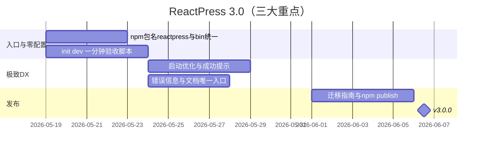

# ReactPress 3.0 发布方案（平台版）

> **版本定位**：零配置、一分钟起站、一个 npm 包走天下  
> **发布代号**：Platform  
> **不包含**：Next 14 / React 18 大升级（归入 3.1「现代栈版」）  
> **文档更新**：2026-05-17

---

## 三大重点（3.0 要解决什么）

| # | 重点 | 用户感知 | 3.0 交付标准 |
|---|------|----------|--------------|
| **1** | **零配置** | 不用手写 `.env`、不用先装六个包、不用懂 monorepo | **最快 1 分钟**内看到前台 + 管理后台 + API |
| **2** | **唯一入口** | 只记一个包名、一个命令 `reactpress` | **`npm i -g @fecommunity/reactpress`** 覆盖 init / dev / build / deploy 全流程 |
| **3** | **极致开发体验** | 少查文档、少踩坑、状态一眼可见 | 交互菜单、`doctor`、热更新全栈、`status` 一站式诊断 |

### 产品一句话

> **装一个包，敲一条命令，一分钟拥有自己的 CMS。**

### 一分钟启动（定义与验收）

「1 分钟」指 **首次在本机完成全局安装之后**，在空项目目录内：

```bash
mkdir my-blog && cd my-blog
reactpress init    # 自动生成 .reactpress + .env + Docker MySQL（或检测已有 DB）
reactpress dev     # 自动：环境检查 → toolkit → API + 前台
```

| 阶段 | 目标耗时 | 说明 |
|------|----------|------|
| `reactpress init` | ≤ 30s | 无交互默认项；Docker 拉镜像可首次略超，文档说明 |
| `reactpress dev` 到可访问 | ≤ 30s | 前台 `http://localhost:3001`、API `http://localhost:3002/api`、健康检查通过 |
| **合计** | **≤ 60s** | CI 用脚本计时；超时则优化 init/dev 并行与缓存 |

**零配置含义**（默认即可跑，无需提前准备）：

- 不要求预先创建 MySQL 账号（`embedded-docker` 默认）
- 不要求手写 `.env`（由 `config.json` 同步）
- 不要求 `pnpm install` 整个 monorepo（**仅全局安装** `@fecommunity/reactpress` 即可在任意目录建站）
- 不要求分别安装 server / client npm 包

---

## 一、唯一入口：`@fecommunity/reactpress`

### 1.1 包模型（3.0 定稿）

| npm 包 | 3.0 角色 |
|--------|----------|
| **`@fecommunity/reactpress`** | **唯一对外主包**：全局命令 `reactpress`，内含 CLI + bundled API + 模板 |
| `@fecommunity/reactpress-client` | 高级场景：仅部署前台、连接远程 API（**非**新用户第一步） |
| `@fecommunity/reactpress-toolkit` | Headless / 自建前台用的 TS SDK |
| `@fecommunity/reactpress-template-*` | `reactpress new --template` 可选 |
| `@fecommunity/reactpress-cli` | **Deprecated 别名**：3.0 起文档与 npm 描述指向 `@fecommunity/reactpress`；可保留一个版本 re-export 后停更 |
| `@fecommunity/reactpress-server` | **Deprecated**：API 由主包内置，不再作为主路径 |

**全局安装（唯一推荐写法）：**

```bash
npm i -g @fecommunity/reactpress@3
reactpress --version   # 3.0.0
```

**不再作为新用户入口的写法**（仅迁移文档保留对照）：

```bash
# ❌ 3.0 文档不推荐
npm i -g @fecommunity/reactpress-cli
npx @fecommunity/reactpress-server
npx @fecommunity/reactpress-client
```

### 1.2 Monorepo 贡献者

克隆仓库开发时仍用 `pnpm install` + `pnpm dev`，底层调用同一套 `cli/bin/reactpress.js`；对外叙事不强调 monorepo，避免与「唯一入口」冲突。

| 场景 | 命令 |
|------|------|
| 本仓开发 | `pnpm dev` → 等同 `reactpress dev` |
| 发版 | `reactpress publish` |

---

## 二、零配置：从安装到可访问

### 2.1 默认路径（新用户）

```bash
npm i -g @fecommunity/reactpress@3
mkdir my-blog && cd my-blog
reactpress init
reactpress dev
# → http://localhost:3001  前台
# → http://localhost:3001/admin  管理端
# → http://localhost:3002/api  API
```

无子命令时进入 **交互式菜单**（与 Claude Code 类似），适合不想记命令的用户：

```bash
reactpress
# 零配置开发 / 初始化 / 状态 / Docker / 发布 …
```

### 2.2 init 自动完成的事

| 产出 | 说明 |
|------|------|
| `.reactpress/config.json` | 端口、数据库模式、URL |
| `.reactpress/docker-compose.yml` | 默认 embedded-docker MySQL |
| `.env` | 由 CLI 从 config 同步，用户无需编辑即可 dev |
| 数据库 | 自动等待就绪 + 迁移/同步 |

### 2.3 可选配置（仍算「零配置」）

仅在需要时介入，**不是**第一步：

- 外部 MySQL：改 `database.mode` + `reactpress config`
- 仅 API（Headless）：`reactpress dev --api-only`
- 生产：`reactpress start` 或 `docker-compose.prod.yml`

---

## 三、极致开发体验（DX）

### 3.1 设计原则

| 原则 | 落地 |
|------|------|
| **能用一个词就不用两个** | 全用 `reactpress <verb>`，无 `reactpress-cli` / `reactpress-server` 混用 |
| **失败可诊断** | `reactpress doctor`：Node、Docker、端口、`.env`、DB、API `/api/health` |
| **状态可感知** | `reactpress status`：API / DB / 前台 / Docker 一页汇总 |
| **常用操作不打断心流** | `dev` 一次起全栈；`build` 按依赖顺序；热更新 API + 前端 |
| **可发现** | 无参数 `reactpress` → 交互菜单；`reactpress --help` 分组清晰 |

### 3.2 命令面（目标态）

| 命令 | 作用 |
|------|------|
| `reactpress` | 交互式菜单 |
| `reactpress init` | 零配置初始化 |
| `reactpress dev` | 全栈开发（默认） |
| `reactpress dev --api-only` | Headless：仅 API |
| `reactpress dev --client-only` | 仅前台（已有 API 时） |
| `reactpress doctor` | 环境诊断 |
| `reactpress status` | 运行状态 |
| `reactpress config` | 查看/修改配置并可选 `--apply` 重启 |
| `reactpress start` / `stop` / `restart` | 生产生命周期 |
| `reactpress docker *` | Docker 开发环境 |
| `reactpress build` / `publish` | 构建与发版（贡献者/维护者） |
| `reactpress db backup` | 数据库备份 |

### 3.3 DX 相关交付（3.0 必做）

- [x] `reactpress doctor`
- [x] 交互式菜单（`reactpress` 无参数）
- [x] `dev` 串联：检查 → toolkit → API + client
- [x] `status` 含 DB / health / 端口
- [ ] **启动耗时优化**：init/dev 并行、Docker 健康等待上限、二次启动复用容器（冲刺 1 分钟指标）
- [x] **首屏提示**：dev 成功后打印前台 / admin / API / Swagger 链接（`cli/lib/dev-banner.js`）
- [x] **错误信息可操作**：`doctor` / `dev` 失败时给出 Docker 安装链接与 `reactpress docker up` 建议

---

## 四、成功标准（发布闸门）

围绕三大重点重新定义：

| # | 标准 | 验证方式 |
|---|------|----------|
| 1 | **1 分钟** | 脚本：`init` + `dev` → curl 前台与 `/api/health`，总耗时 ≤ 60s（二次运行） |
| 2 | **唯一入口** | 文档与 README 仅出现 `npm i -g @fecommunity/reactpress`；无其他包作为主路径 |
| 3 | **零配置** | 空目录仅执行 `init` + `dev`，无需手改 `.env` 即可登录管理端 |
| 4 | **DX** | `doctor` 能识别常见问题；`status` 输出完整；交互菜单覆盖 80% 日常操作 |
| 5 | **迁移** | `docs/migration-2-to-3.md` 将旧命令映射到 `reactpress *` |
| 6 | **质量** | CI：`pnpm build` + API 冒烟 |

Headless（API Key、Webhook、toolkit）作为 **3.0 平台能力延伸**，不抢三大重点的叙事，但保留实现与验收。

---

## 五、范围定义

### 5.1 必做（支撑三大重点）

| 类别 | 项 |
|------|-----|
| **入口** | npm 发布 `@fecommunity/reactpress@3`，bin 仅 `reactpress`；废弃文档中的多包安装流 |
| **零配置** | `init` 默认 embedded-docker；`.env` 自动生成；`dev` 一键全栈 |
| **1 分钟** | 启动链路 profiling + 优化（见 3.3） |
| **DX** | doctor、status、交互菜单、dev 成功后的链接提示 |
| **迁移** | 2.x 命令 → `reactpress` 对照表 |
| **冒烟** | CI 计时脚本 + health 检查 |

### 5.2 平台能力（已完成或延续，非主叙事）

- API Key、Webhook MVP、定时发布、文章修订历史
- `docker-compose.prod.yml`、`reactpress db backup`
- OpenAPI / toolkit 与 3.0 版本对齐
- `@fecommunity/reactpress-server` deprecated

### 5.3 不做（3.0 Out of Scope）

| 项 | 归属 |
|----|------|
| Next 14 / React 18 | 3.1 现代栈版 |
| GraphQL、插件市场、多租户 | 更远版本 |
| 要求用户先 `pnpm install` 才能建站 | 与「唯一全局包」冲突 |

---

## 六、Breaking Changes（草案）

| 变更 | 迁移 |
|------|------|
| 主包改为 **`@fecommunity/reactpress`** | `npm i -g @fecommunity/reactpress@3`；命令统一 `reactpress` |
| `@fecommunity/reactpress-cli` 不再作为主包名 | 旧全局包用户：卸载 cli 包，改装 `reactpress` |
| `@fecommunity/reactpress-server` deprecated | `reactpress start` / `reactpress dev --api-only` |
| 配置以 `.reactpress/config.json` 为准 | `reactpress init` 或 `reactpress config --apply` |
| 根 monorepo 包 `private` | 对外只发 `@fecommunity/reactpress`，不发裸 `reactpress` 名 |

---

## 七、实施阶段



### Phase 1 — 唯一入口 + 零配置（约 1 周）

- [x] npm 发布物：`cli/package.json` 已更名为 `@fecommunity/reactpress@3.0.0`（待 npm publish）
- [x] 文档/README/迁移指南：主推 `npm i -g @fecommunity/reactpress`
- [x] `reactpress init` + `reactpress dev` 零配置链路（monorepo + 独立项目）
- [x] 一分钟计时脚本：`scripts/benchmark-cold-start.mjs`（`pnpm test:benchmark`）

### Phase 2 — 极致 DX（约 1 周）

- [ ] dev 启动耗时优化（并行、Docker 等待策略）
- [x] dev 成功输出：前台 / admin / API / Swagger URL
- [x] `doctor` / `status` / `dev` 失败文案含可操作建议
- [x] `reactpress-cli` bin 打 deprecated 警告并映射到 `reactpress`（3.1 移除）

### Phase 3 — 发布（约 3～5 天）

- [x] Headless 与生产能力（API Key、Webhook、compose、backup 等）
- [ ] GitHub Release + npm 主推 `@fecommunity/reactpress`
- [ ] 公告强调：1 分钟、一个包、极致 DX

---

## 八、验收清单

### 重点 1：零配置 · 1 分钟

- [x] 空目录：`reactpress init` → `reactpress dev`，无需手改 `.env`
- [x] 自动化脚本：`pnpm test:benchmark`（二次冷启动；首次 Docker 拉镜像可例外）
- [x] 可访问：前台、`/admin`、`GET /api/health`

### 重点 2：唯一入口

- [x] 包名 `@fecommunity/reactpress`，bin `reactpress`（`reactpress-cli` 仅 deprecated 别名）
- [x] README / 迁移指南无「先装 server 再装 client」主路径
- [x] `migration-2-to-3.md` 旧命令映射到 `reactpress`

### 重点 3：极致 DX

- [x] `reactpress` 无参数进入交互菜单
- [x] `reactpress doctor` 覆盖 Node / Docker / 端口 / DB / API
- [x] `reactpress status` 一页看清服务状态
- [x] `dev` 失败时错误含下一步建议

### 发布

- [ ] `@fecommunity/reactpress@3.0.0` 已发布
- [ ] CI 绿灯

---

## 九、待决策项

| # | 问题 | 建议 |
|---|------|------|
| 1 | `@fecommunity/reactpress` 与现 `cli` 包关系？ | **已定稿**：`cli/` 目录即 `@fecommunity/reactpress` 发布物 |
| 2 | 是否保留 `reactpress-cli` bin 别名？ | **已定稿**：`reactpress-cli-shim.js` 打 deprecated warning，3.1 移除 |
| 3 | 首次 Docker 拉镜像超过 60s 如何宣传？ | 文案写「二次启动 1 分钟内」；或 init 预拉镜像 |
| 4 | Monorepo 用户是否仍写 `pnpm dev`？ | 可以，对内文档说明；对外只推全局 `reactpress` |

---

## 十、发布物

| 产物 | 说明 |
|------|------|
| **`@fecommunity/reactpress@3.0.0`** | 唯一主包，全局 `reactpress` |
| Git tag `v3.0.0` | monorepo 标签 |
| `docs/migration-2-to-3.md` | 旧多包 → 单包 |
| GitHub Release | 标题突出：1 分钟 · 一个包 · 极致 DX |

---

## 十一、参考命令（3.0 目标态）

```bash
# ── 新用户：唯一入口 ──
npm i -g @fecommunity/reactpress@3
mkdir my-blog && cd my-blog
reactpress init
reactpress dev
# 约 1 分钟内打开 http://localhost:3001

# ── 不想记命令 ──
reactpress

# ── 出问题 ──
reactpress doctor
reactpress status

# ── Headless（进阶）──
reactpress dev --api-only
# 自建前台使用 @fecommunity/reactpress-toolkit@3

# ── 生产 ──
reactpress start
# 或 docker-compose.prod.yml

# ── 本仓库贡献者 ──
pnpm install && pnpm dev
```

---

## 十二、3.0 之后

| 版本 | 主题 |
|------|------|
| **3.0.x** | 继续压 dev 启动时间；完善 Webhook UI；移除 deprecated 包名 |
| **3.1** | 现代栈版：Next 14 + React 18 |
| **3.2+** | 插件扩展、可选 PostgreSQL |

---

*3.0 平台版以 **零配置 1 分钟启动**、**`@fecommunity/reactpress` 唯一入口**、**极致开发体验** 为最高优先级；其余能力为实现与差异化服务，不稀释主叙事。*
