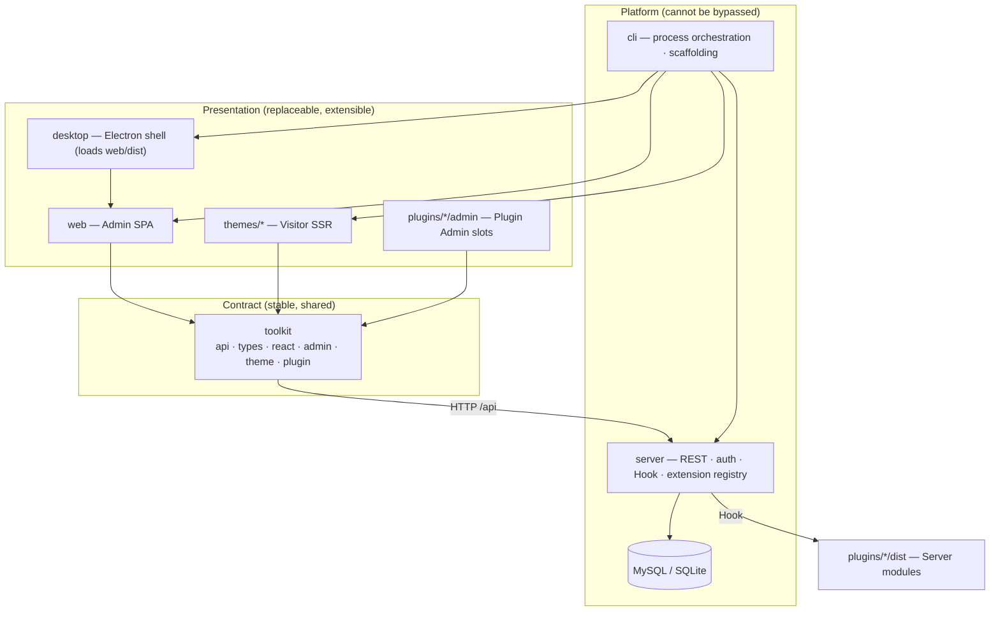
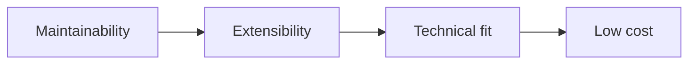
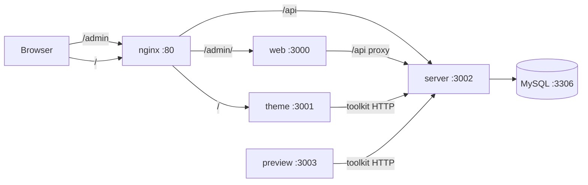
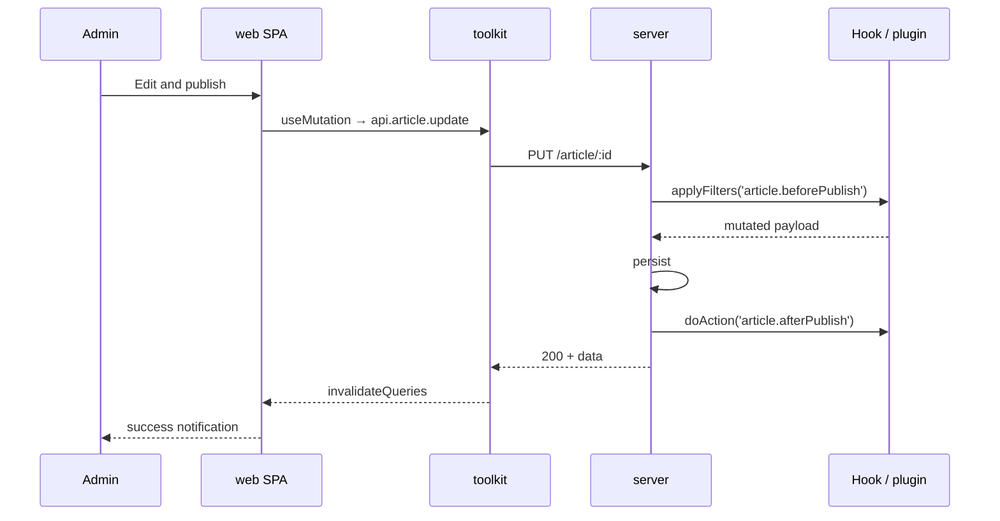
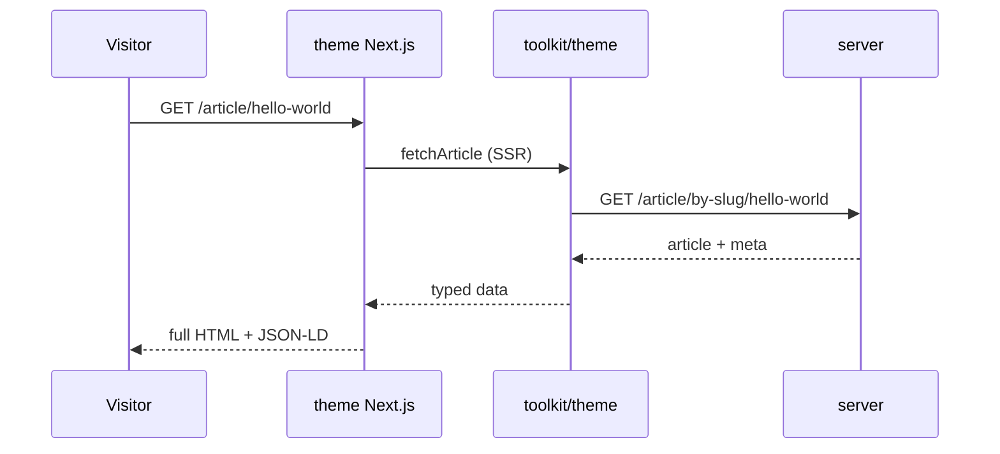
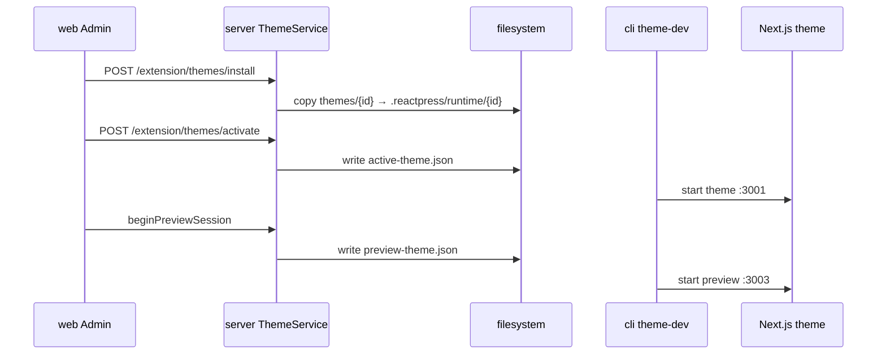
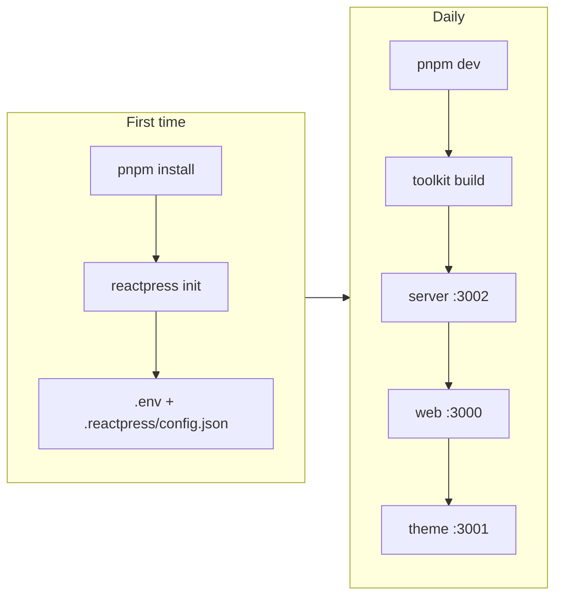
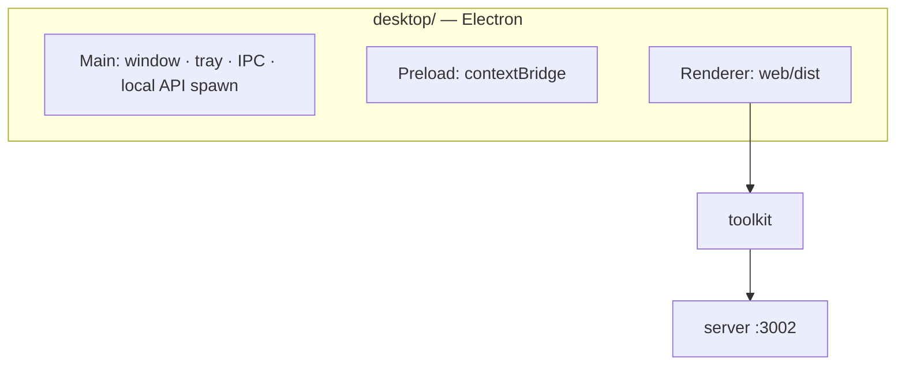

# ReactPress System Architecture

> ReactPress 4.0 — modern full-stack CMS / blog publishing platform on React  
> Core principle: **Admin manages content · Themes manage presentation · Plugins manage logic · API manages data · Toolkit manages contracts**

---

## Table of contents

- [1. Overview](#1-overview)
- [2. Architecture](#2-architecture)
- [3. Design principles & decisions](#3-design-principles--decisions)
- [4. Monorepo package structure](#4-monorepo-package-structure)
- [5. Runtime & ports](#5-runtime--ports)
- [6. Data flow & dependency rules](#6-data-flow--dependency-rules)
- [7. Maintainability](#7-maintainability)
- [8. Extensibility](#8-extensibility)
- [9. Technical choices](#9-technical-choices)
- [10. Cost & multi-platform](#10-cost--multi-platform)
- [11. Server (backend API)](#11-server-backend-api)
- [12. Web (admin SPA)](#12-web-admin-spa)
- [13. Themes (visitor frontend)](#13-themes-visitor-frontend)
- [14. Toolkit (shared contract layer)](#14-toolkit-shared-contract-layer)
- [15. CLI (orchestration)](#15-cli-orchestration)
- [16. Auth & security](#16-auth--security)
- [17. Configuration](#17-configuration)
- [18. Deployment](#18-deployment)
- [19. Local development](#19-local-development)
- [20. Plugins](#20-plugins)
- [21. Desktop client](#21-desktop-client)
- [22. Evolution & roadmap](#22-evolution--roadmap)
- [23. Acceptance criteria](#23-acceptance-criteria)
- [24. References](#24-references)

---

## 1. Overview

ReactPress is a WordPress-like content platform with a clear separation of concerns:

| Domain | Capabilities |
|--------|--------------|
| Content | Articles, categories, tags, comments, static pages |
| Media | Upload, media library, storage (local / OSS) |
| Appearance | Theme install / activate / preview, site customization |
| Extensions | Plugin install / enable / configure |
| System | Users & permissions, site settings, import/export, analytics |

### Non-functional goals

| Goal | Target |
|------|--------|
| Admin responsiveness | Shell stays mounted; route switches feel < 100ms; list views cache on revisit |
| Visitor SEO | Core pages SSR/ISR; Lighthouse SEO ≥ 90 |
| Multi-device | One responsive web app for desktop / tablet / mobile |
| Data consistency | All frontends access API only through toolkit |

---

## 2. Architecture

ReactPress uses a **Monorepo + multi-process** model: content management, visitor presentation, and API services are decoupled; toolkit keeps types and contracts aligned.



### Responsibility matrix

| Package | Single responsibility | Rendering | SEO |
|---------|----------------------|-----------|-----|
| **server** | Business rules, persistence, auth, extension lifecycle | — | — |
| **web** | Admin UI | Vite CSR SPA | No |
| **themes/** | Visitor site | Next.js SSR/SSG/ISR | Yes |
| **toolkit** | API client, types, React integration, extension schemas | — | — |
| **plugins/** | Incremental logic (Hook + optional Admin UI) | Server + Admin slots | Plugin-dependent |
| **desktop/** | Electron shell, local API orchestration, IPC | Loads `web/dist` | No |
| **cli** | Local dev / deploy orchestration | — | — |
| **docs** | Project docs (Docusaurus) | SSG | — |

### Architecture red lines

- **No visitor pages in Admin**; **no admin routes in themes** (new themes must follow this)
- All frontends (web / themes / plugins) **depend on toolkit only** for API access
- **server must not depend on any frontend package**

---

## 3. Design principles & decisions

All trade-offs follow this priority:



| Principle | Meaning | How it lands |
|-------------|---------|--------------|
| **Maintainability** | Change one place, test one place, clear boundaries | Layering + Feature Modules + single API client + OpenAPI codegen |
| **Extensibility** | Core changes rarely; third parties can attach | Registry + Hook + manifest contracts |
| **Technical fit** | Match tech to scenario; avoid stack bloat | Admin = SPA, public pages = SSR, business logic in Server |
| **Low cost** | Few processes, few repos, little duplication | Monorepo + shared toolkit; responsive web instead of native apps |

### Key decision summary

| Decision | Choice | Maintainability | Extensibility | Fit | Cost |
|----------|--------|-----------------|---------------|-----|------|
| API access | toolkit as sole entry | ★★★ | ★★ | ★★★ | Low |
| Admin | Vite SPA | ★★ | ★★ | ★★★ | Low |
| Visitor | Next.js SSR/ISR | ★★ | ★★★ | ★★★ | Medium |
| Module layout | Feature Module + Registry | ★★★ | ★★★ | ★★ | Low |
| Plugins | Hook + manifest | ★★ | ★★★ | ★★★ | Medium |
| Themes | Separate process + `theme.json` | ★★ | ★★★ | ★★★ | Medium |
| List state | URL searchParams | ★★★ | ★★ | ★★★ | Low |
| Multi-device | Responsive web + Electron shell | ★★★ | ★★ | ★★★ | Medium |
| Types | OpenAPI codegen | ★★★ | ★★ | ★★★ | Low |

---

## 4. Monorepo package structure

Managed with **pnpm workspace** (`pnpm-workspace.yaml`):

```yaml
packages:
  - 'cli'        # Global CLI (@fecommunity/reactpress)
  - 'server'     # NestJS API
  - 'web'        # Admin SPA
  - 'desktop'    # Electron shell
  - 'docs'       # Docusaurus docs site
  - 'toolkit'    # Shared API contract layer
  - 'themes'     # Theme registry
  - 'themes/*'   # Official theme templates
  - 'plugins'    # Plugin registry
  - 'plugins/*'  # Official plugins
```

### Repository tree (core)

```
reactpress/
├── cli/                 # CLI with bundled server
├── server/              # NestJS API source
├── web/                 # Vite Admin SPA
├── desktop/             # Electron (local SQLite + Admin SPA)
├── toolkit/             # OpenAPI SDK + React integration
├── themes/
│   ├── hello-world/     # Starter theme (local)
│   └── theme-starter/   # npm official theme catalog anchor
├── plugins/
│   ├── hello-world/     # Auto summary plugin
│   ├── seo/             # SEO enhancement
│   └── image-optimizer/ # Image batch optimization
├── docs/                # Docusaurus
├── public/              # Marketing / brand assets
├── scripts/             # Build, deploy, smoke tests
├── docker-compose.*.yml
├── nginx*.conf
├── .reactpress/         # Runtime: active-theme.json, runtime/, plugins/
└── package.json
```

### npm package mapping

| Directory | npm package | Notes |
|-----------|-------------|-------|
| `cli/` | `@fecommunity/reactpress` | 4.0 main package; global `reactpress` command |
| `web/` | `@fecommunity/reactpress-web` | Admin SPA |
| `server/` | `@fecommunity/reactpress-server` | Monorepo source; standalone npm deprecated — use CLI bundled API |
| `toolkit/` | `@fecommunity/reactpress-toolkit` | Shared SDK |
| `themes/hello-world` | `@fecommunity/reactpress-template-hello-world` | Starter theme |

---

## 5. Runtime & ports

CLI orchestrates independent processes in local development:

| Process | Default port | Stack | Notes |
|---------|--------------|-------|-------|
| **web** | 3000 | Vite + React | Admin entry |
| **active theme** | 3001 | Next.js | Current visitor theme |
| **server** | 3002 | NestJS | REST API (prefix `/api`) |
| **preview theme** | 3003 | Next.js | Admin iframe preview of non-active theme |
| **MySQL** | 3306 | MySQL 5.7 | Full-stack dev / default production persistence |
| **desktop local API** | 3002 | NestJS + SQLite | Embedded API in `pnpm dev:desktop` (same port as standard API) |
| **nginx** (optional) | 80 / 8080 | nginx | Unified reverse proxy |

Three core processes (Admin, theme, API) deploy and scale independently — traffic patterns differ, so separation beats a monolithic Next app.



---

## 6. Data flow & dependency rules

### Typical request paths

**Admin write:**

```
web page → toolkit createClient() → POST /api/article → server ArticleService → DB
```

**Visitor read:**

```
theme getServerSideProps → toolkit fetchSingleArticle() → GET /api/article/:id → server → DB
```

**Theme management:**

```
web Appearance → GET /api/extension/themes → server ThemeService
  → Setting.globalSetting (activeTheme / mods)
  → .reactpress/active-theme.json
  → CLI restarts Next.js theme process
```

### Sequence: publish article



### Sequence: visitor article page



### Dependency rules (hard constraints)

```
web / themes / plugins  →  toolkit only
toolkit                 →  HTTP + stdlib only (no Ant Design / Next deps)
server                  →  no frontend packages
plugins/server          →  server Hook + DI interfaces only
cli                     →  orchestrates server/web/themes; not imported by business code
```

---

## 7. Maintainability

### Single data entry: toolkit

**Problem:** Multiple hand-rolled HTTP layers → type drift, inconsistent errors, N places to change on API updates.

**Solution:** One client factory for the whole platform:

```typescript
export function createClient(options: ClientOptions) {
  const http = createHttpClient(options);
  return {
    article: new Article(http),
    file: new File(http),
    extension: new Extension(http),
    // … mirrors server controllers
  };
}
```

**Benefits:**

- Server API change → run codegen → TypeScript errors pinpoint callers
- Error codes, auth, retry logic written once
- New modules (web / theme / plugin) with zero HTTP boilerplate

### Feature Modules (vertical slices)

Each domain is self-contained:

```
web/src/modules/article/
├── index.ts          # public export: register(admin)
├── routes.tsx        # TanStack Router routes
├── pages/            # thin pages composing hooks + components
├── components/       # module-private UI
├── hooks/            # data + URL state
├── schemas/          # Zod form + API boundary validation
└── permissions.ts    # module permission declarations
```

**Forbidden between modules:** direct import of another module's internal components.  
**Allowed:** Registry for menus/settings/permissions; toolkit hooks for shared server data.

### URL as state

List filters, pagination, and sort live in URL searchParams:

```
/article?page=2&status=published&sort=-createdAt&keyword=react
```

| Benefit | Why |
|---------|-----|
| Shareable | Admins copy links to restore views |
| Testable | E2E does not depend on component state |
| Cacheable | React Query uses URL params as queryKey |
| Device-agnostic | Desktop / mobile share the same data logic |

### Codegen boundaries

| Generated (no hand edits) | Hand-written |
|---------------------------|--------------|
| `toolkit/api/*` | `toolkit/react/hooks/*` |
| `toolkit/types/*` | `toolkit/admin/components/*` |
| OpenAPI spec | Feature Module business UI |

---

## 8. Extensibility

Modeled after WordPress `add_action` / `add_filter`, constrained by TypeScript manifests.

### Extension model

| Type | Extends | Carrier |
|------|---------|---------|
| **Theme** | Visitor UI | Independent Next.js package + `theme.json` |
| **Plugin** | Business logic + optional Admin UI | Server module + optional `admin/index.ts` |

**Hooks** (in-process, can mutate) vs **Webhooks** (outbound HTTP) are separate.

### Manifest contracts

**theme.json** (flat structure — `templates` at root):

```json
{
  "id": "hello-world",
  "name": "Hello World",
  "version": "1.0.0",
  "requires": ">=3.5.0",
  "templates": {
    "home": "pages/index.tsx",
    "single": "pages/article/[id].tsx",
    "archive": "pages/category/[category].tsx"
  },
  "supports": { "menus": ["primary", "footer"], "darkMode": true }
}
```

**plugin.json:**

```json
{
  "id": "seo",
  "name": "SEO Enhancement",
  "version": "1.0.0",
  "server": { "module": "./dist/index.js" },
  "admin": {
    "slots": { "subscribe": ["article.editor.meta.afterSummary"] }
  },
  "settings": { "schema": { "type": "object" } }
}
```

Schemas live in `toolkit/extension`; CLI validates on install — invalid packages fail at startup, not at runtime.

### Server Hook

```typescript
interface HookService {
  applyFilters<T>(name: string, value: T, ctx?: unknown): Promise<T>;
  doAction(name: string, payload?: unknown): Promise<void>;
}
```

| Hook | When |
|------|------|
| `article.beforePublish` | Mutate fields before publish |
| `article.afterPublish` | Notify, index after publish |
| `comment.beforeCreate` | Spam filter |
| `setting.beforeSave` | Validate extension config |

### Admin Registry

```typescript
interface AdminModule {
  id: string;
  register(ctx: AdminContext): void;
}

interface AdminContext {
  menu: MenuRegistry;
  settings: SettingsRegistry;
  permissions: PermissionRegistry;
  routes: RouteRegistry;
}
```

Core modules and plugins use the same API — new official features = new module + `register()`, no Shell edits.

### Theme switching strategy

| Phase | Strategy | Rationale |
|-------|----------|-----------|
| MVP (current) | Update `activeTheme` + restart theme process | Simple, stable SSR, no runtime federation |
| Later | Hot swap / multi-theme preview | Only when product requires it |

### Permission model

```typescript
type Permission =
  | 'article:read' | 'article:write' | 'article:publish'
  | 'media:manage' | 'page:manage'
  | 'user:manage' | 'setting:manage'
  | 'extension:manage';
```

- **Server:** Guard checks JWT + Permission
- **Web:** `usePermission()` + route-level `<AuthGuard permission="…" />`
- **Plugins:** manifest declares `permissions`; merged into roles on activate

String capabilities beat hard-coded `role === 'admin'`.

### Plugin three-layer model

| Layer | Path | Role |
|-------|------|------|
| Registry | `plugins/` + `plugins/package.json` | What can be installed |
| Materialized | `.reactpress/plugins/{id}/` | Installed copy with `dist/` |
| Active | `Setting.globalSetting.plugins` | Enabled list + per-plugin config |

| Action | Effect |
|--------|--------|
| Install | Materialize to `.reactpress/plugins/` |
| Enable | Hot-load `server.module` → `register(hooks, ctx)` |
| Disable | Remove hooks; optional `deactivate()` |
| Config | JSON Schema validation then reload |

Built-in plugins: `hello-world`, `seo`, `image-optimizer`. See [plugins/README.md](./plugins/README.md).

---

## 9. Technical choices

### Rendering by scenario

| Scenario | Tech | Why |
|----------|------|-----|
| Admin | **Vite + React SPA** | No SEO; small CSR bundle, fast HMR, static deploy |
| Visitor theme | **Next.js SSR/SSG/ISR** | Crawlers and social previews need full HTML |
| API | **NestJS REST** | Mature modules; OpenAPI codegen chain |

**Not chosen:**

| Approach | Why not |
|----------|---------|
| Admin on Next.js | No SSR/RSC benefit; extra routing + server complexity |
| Admin + theme in one app | Coupled responsibilities, bundle bloat, cannot deploy separately |
| GraphQL instead of REST | Existing Swagger pipeline; GraphQL adds schema maintenance |
| Micro-frontends (qiankun, etc.) | Team/scale mismatch; Registry + dynamic import is enough |

### Admin frontend stack

| Layer | Choice | Role |
|-------|--------|------|
| Build | Vite+ (`vp dev/build`) | Fast dev, native ESM |
| Routing | TanStack Router | Type-safe, file routes, searchParams first-class |
| Server state | TanStack Query | Cache, retry, optimistic mutations |
| Client state | Zustand (auth/settings only) | Light persistence; avoid global store abuse |
| UI | Ant Design 6 | Complete admin components, responsive grid |
| Validation | Zod | Unified form + API boundary |

State split: **URL for list state · React Query for server data · Zustand for session/UI prefs**.

### Admin performance

| Technique | Mechanism |
|-----------|-----------|
| Persistent shell | Layout route stays mounted; only `<Outlet />` swaps |
| Route-level code split | Each module is its own chunk |
| Lazy heavy deps | Rich text, charts via `React.lazy()` |
| List cache | `staleTime: 30s` for instant back-navigation |
| Prefetch | Sidebar hover preloads next route chunk |

### Visitor SEO

| Page type | Mode |
|-----------|------|
| Home, article, archives | ISR `revalidate: 60` |
| About, privacy | SSG |
| Search | SSR |
| Comment submit | CSR island |

`toolkit/theme` provides `fetchArticle`, `buildPageMeta`, `buildJsonLd` — theme authors call helpers, not SEO boilerplate.

---

## 10. Cost & multi-platform

### Cost model

| Cost type | Control strategy |
|-----------|-------------------|
| Development | Monorepo + toolkit reuse; Feature Module templates for CRUD |
| Operations | Admin static hosting; theme = standard Next deploy; API single process |
| Multi-device | Responsive web — no native iOS/Android Admin |
| Extensions | manifest + Registry — no core PR for third-party features |
| Learning curve | Stack converges on React + Nest; theme authors need Next + toolkit only |

### Responsive web (one codebase, three viewports)

Breakpoints align with Ant Design (single standard across repo):

| Breakpoint | Width | Admin | Theme |
|------------|-------|-------|-------|
| `< md` | < 768px | Drawer nav; table → cards | Single column |
| `md–lg` | 768–992px | Collapsed sidebar | Two columns |
| `≥ lg` | ≥ 992px | Fixed sidebar + wide table | Sidebar + main |

Shared components in `toolkit/admin`: `ResponsiveTable`, `ResponsiveFilterToolbar`, `ResponsiveFormModal`.

**Principle:** API has no device fields; differences are UI-only.

**Progressive path:**

1. Default: responsive web (zero extra engineering)
2. Optional: **Electron desktop** (same `web/dist`)
3. Optional: PWA caches shell static assets only
4. Future: Capacitor wraps `web/dist` without rewriting UI

### What we deliberately skip (cost control)

| Skip | Reason |
|------|--------|
| Native mobile Admin app | Responsive web covers most ops |
| Electron-embedded duplicate Admin UI | Shell only loads `web/dist` |
| Plugin marketplace sandbox (v1) | Local dir + admin trust model is enough |
| Theme runtime federation | Separate process + restart is simpler |
| Multi-DB / multi-tenant (v1) | Single-site CMS first |
| Custom ORM / UI library | TypeORM + Ant Design |

---

## 11. Server (backend API)

### Stack

| Layer | Technology |
|-------|------------|
| Framework | NestJS 6 |
| ORM | TypeORM 0.2 |
| Database | MySQL (default); **SQLite** for desktop local mode (`DB_TYPE=sqlite`) |
| Auth | Passport + JWT, API Key |
| Docs | Swagger at `/api` |
| Other | helmet, compression, rate-limit, log4js, nodemailer, ali-oss |

### Module layout

```
server/src/modules/
├── article/ category/ tag/ comment/ page/ file/   # content
├── user/ auth/                                      # identity
├── setting/ smtp/                                   # config
├── view/ search/ knowledge/                         # data
├── extension/                                       # theme + plugin lifecycle
├── hook/                                            # Action/Filter registry
├── api-key/ webhook/ health/
└── …
```

Each module: thin controller → service (business + Hook calls) → entity. **extension** manages install/activate state, not domain business logic.

### Domain entities (15)

User, Article, ArticleRevision, Category, Tag, Comment, Page, Knowledge, File, Setting, SMTP, Search, View, ApiKey, Webhook.

### API conventions

- Global prefix: `/api` (`SERVER_API_PREFIX` configurable)
- Unified response: `{ statusCode, success, data }` (except `/health`)

### Startup paths

1. **First install:** Express wizard in `main.ts` (`/test-db`, `/install` writes `.env`) → NestJS bootstrap
2. **Normal / production:** Direct `starter.ts` bootstrap

---

## 12. Web (admin SPA)

### Stack

| Category | Technology |
|----------|------------|
| Build | Vite+ |
| UI | React 18 + Ant Design 6 |
| Routing | TanStack Router (file routes) |
| Data | TanStack Query + Zustand (auth persist) |
| Editor | Monaco + Showdown (Markdown) |
| i18n | i18next |
| Testing | MSW + Playwright E2E |

### Directory structure

```
web/src/
├── routes/              # TanStack file routes
│   ├── login/
│   └── _auth/           # authenticated routes
│       ├── dashboard/ article/ media/ page/
│       ├── appearance/ settings/ plugins/ data/
├── modules/             # feature domains (mirror routes)
├── shell/               # bootstrap, permissions, Admin Registry
├── shared/ components/ mocks/ stores/ hooks/ i18n/
```

### Admin route map

| Module | Route | APIs |
|--------|-------|------|
| Dashboard | `/` | view, article stats |
| Articles | `/article`, `/article/editor/:id?` | article, category, tag |
| Comments | `/article/comment` | comment |
| Media | `/media` | file |
| Pages | `/page`, `/page/editor/:id?` | page |
| Appearance | `/appearance/themes`, `/appearance/customize` | extension, setting |
| Plugins | `/plugins`, `/plugins/:id/settings` | extension |
| Users | `/users`, `/profile` | user |
| Settings | `/settings/:tab` | setting, smtp, api-key, webhook |
| Data | `/data/analytics`, `/data/export`, `/data/import` | view, search, export |

Settings use routes (not tab query params). Plugins insert tabs via `settings.registerTab({ id, title, path, permission })`.

### Module registration example

```typescript
export const articleModule: AdminModule = {
  id: 'article',
  register({ menu, permissions }) {
    menu.register({
      id: 'content',
      title: 'Content',
      children: [
        { id: 'article.list', title: 'Articles', path: '/article' },
        { id: 'article.new', title: 'New article', path: '/article/editor' },
        { id: 'article.comment', title: 'Comments', path: '/article/comment' },
      ],
    });
    permissions.register(['article:read', 'article:write', 'article:publish']);
  },
};
```

Shell `bootstrap()` registers core modules, then loads active plugins. Menu order uses `sort`, not import order.

### API connection

- Dev: `VITE_API_BASE_URL=/api`, Vite proxy to `:3002`
- Client: `getToolkitClient()` → `@fecommunity/reactpress-toolkit/react`
- Mock: `VITE_AUTH_MODE=mock` + MSW
- Live: `VITE_AUTH_MODE=server`

---

## 13. Themes (visitor frontend)

Since 3.0, visitor sites are independent Next.js packages under `themes/` (replacing legacy `client/`).

### Package structure (hello-world)

```
themes/hello-world/
├── theme.json           # manifest (id, templates, customizer)
├── pages/_app.tsx       # createThemeApp(manifest)
├── pages/index.tsx, article/[id].tsx, …
├── components/ styles/ next.config.js
```

### WordPress mapping

| WordPress | ReactPress |
|-----------|------------|
| `style.css` header | `theme.json` |
| `functions.php` | `pages/_app.tsx` → `createThemeApp()` |
| Template hierarchy | `theme.json` → `templates` + `pages/*` |
| Customizer | `appearance.sections` + Formily + `useThemeMod` |

### Official themes

| Theme | Source | Role |
|-------|--------|------|
| **hello-world** | local | Minimal Pages Router starter |
| **reactpress-theme-starter** | npm (`theme-starter` anchor) | Full theme: search, knowledge base, comments, dark mode |

### Theme lifecycle



See [themes/README.md](./themes/README.md).

---

## 14. Toolkit (shared contract layer)

Single API contract layer for the platform; generated from server OpenAPI.

### Structure

```
toolkit/src/
├── api/ types/          # generated from Swagger
├── react/               # createClient(), resolveApiBaseUrl(), runtime detection
├── theme/ ui/           # SSR helpers, headless components
├── admin/ plugin/       # Registry, plugin SDK
├── extension/           # theme.json / plugin.json JSON Schema
├── config/ utils/
```

### Export paths

| Path | Use |
|------|-----|
| `@fecommunity/reactpress-toolkit` | Main entry |
| `@fecommunity/reactpress-toolkit/react` | React client factory |
| `@fecommunity/reactpress-toolkit/theme` | Theme SSR |
| `@fecommunity/reactpress-toolkit/plugin/server` | Plugin Hook SDK |
| `@fecommunity/reactpress-toolkit/plugin/admin` | Plugin Admin registration |

### Regenerate

```bash
pnpm run generate:swagger   # server → swagger.json
pnpm run build:toolkit      # regenerate api/types
```

See [toolkit/README.md](./toolkit/README.md).

---

## 15. CLI (orchestration)

Published as `@fecommunity/reactpress` — zero-config project lifecycle.

### Core commands

| Command | Description |
|---------|-------------|
| `reactpress init` | Init project (`.env` + `.reactpress/config.json`; `--local` = SQLite) |
| `reactpress dev` | Full-stack dev (API + web + theme + Docker MySQL) |
| `reactpress dev --api-only` | API only (headless) |
| `reactpress dev --web-only` | Admin + API |
| `reactpress build` / `start` | Production build / start |
| `reactpress doctor` / `status` | Diagnostics / status |
| `reactpress plugin list/install` | Plugin registry |
| `reactpress theme list/add` | Theme catalog |
| `reactpress desktop dev` | Desktop dev (SQLite + Admin + Electron) |

### CLI layout (4.0 TypeScript)

```
cli/
├── bin/           # thin entry → out/bin/
├── src/           # TypeScript source
├── out/           # compiled (gitignored)
│   ├── bin/ core/ ui/
│   └── lib/       # dev/build/docker/theme/plugin orchestration
├── server/        # bundled NestJS runtime for npm
└── templates/     # init scaffolds
```

Server resolution: monorepo `server/` if present, else `cli/server/` bundled copy.

See [cli/README.md](./cli/README.md).

---

## 16. Auth & security

### JWT (admin / user sessions)

- Login: `POST /api/auth/login` → token (4h default)
- Protected routes: `@UseGuards(JwtAuthGuard)` + Bearer
- Roles: `@Roles('admin')` + `RolesGuard` (admin / visitor)

### API Key (headless / integrations)

- Header: `X-API-Key` or `Authorization: Bearer <key>`
- Scopes: `read` / `write`

### Other

- GitHub OAuth: `POST /api/auth/github`
- Passwords: bcrypt via `User.comparePassword()`

---

## 17. Configuration

**`.reactpress/config.json`** is the source of truth; `.env` is synced on `init`. **`--local`** uses SQLite with `config.local.json` / `env.local.default`.

| File | Purpose |
|------|---------|
| `.reactpress/config.json` | Project config |
| `.reactpress/active-theme.json` | Active theme id |
| `.reactpress/preview-theme.json` | Preview theme id |
| `.reactpress/runtime/{id}/` | Materialized theme copy |
| `.reactpress/plugins/{id}/` | Materialized plugin copy |
| `.env` | DB, ports, secrets |

| Variable | Default |
|----------|---------|
| `SERVER_PORT` | `3002` |
| `REACTPRESS_API_URL` | `http://localhost:3002/api` |

---

## 18. Deployment

### Development (recommended)

- App processes on host (`pnpm dev`)
- Docker for **MySQL + nginx** only
- nginx forwards to host via `host.docker.internal`

### Production options

| Mode | Notes |
|------|-------|
| **PM2** | `pnpm build` → `pnpm start` |
| **Docker** | MySQL container + nginx; API can run on host |
| **Vercel** | Theme / Admin static deploy |

### nginx routes (dev)

| Path | Target |
|------|--------|
| `/` | Theme `:3001` |
| `/admin/` | Admin `:3000` |
| `/api` | API `:3002` |

---

## 19. Local development



```bash
pnpm install
pnpm dev              # API + Admin + theme + MySQL
pnpm dev:web:local    # Admin + SQLite API (no Docker)
pnpm dev:desktop      # Electron + SQLite
pnpm build:plugins    # compile official plugins
pnpm build            # toolkit → server → web → themes
```

After API changes:

```bash
pnpm run generate:swagger && pnpm run build:toolkit
```

---

## 20. Plugins

**Themes handle presentation; plugins handle logic.** Server-side Hooks extend business rules; optional Admin UI via slots.

Covered in [§8 Extensibility](#8-extensibility) and [plugins/README.md](./plugins/README.md).

---

## 21. Desktop client

Electron shell loads the same Admin SPA as the browser — **no duplicate business UI**.



| Layer | Responsibility |
|-------|----------------|
| **web** | All Admin UI (same as browser) |
| **toolkit** | API client, auth, `getRuntime()` / `getDesktopApi()` |
| **desktop** | Main/Preload only: window, IPC, SQLite API spawn, config |
| **server** | REST API; local mode spawned by Main, remote mode connects externally |

### Modes

| Mode | Description |
|------|-------------|
| **Local (default)** | Main spawns embedded API (SQLite, default `:3002`); default `admin` / `admin` |
| **Remote** | Connect to existing ReactPress API; sync local content to remote site |

### Load modes

| Mode | Use case |
|------|----------|
| **A. Bundled (production)** | `file://` or custom protocol → `web/dist/index.html` |
| **B. Remote URL** | Load `https://admin.example.com` (enterprise intranet) |
| **C. Dev** | `http://localhost:3000` (Vite dev server) |

### Security (Electron)

| Rule | Required |
|------|----------|
| `contextIsolation: true` | Yes |
| `nodeIntegration: false` in renderer | Yes |
| Preload whitelist IPC channels | Yes |
| `webSecurity: true` | Yes |
| Remote URL allowlist | When using mode B |

### Desktop roadmap

| Phase | Content | Status |
|-------|---------|--------|
| D0 | Scaffold; dev loads Vite; prod loads `web/dist` | ✅ 4.0 |
| D1 | Local SQLite, remote API switch, login, macOS/Windows packages | ✅ 4.0 MVP |
| D1+ | Local → remote content sync | ✅ 4.0 |
| D2 | Tray, shortcuts, native notifications | Planned |
| D3 | `electron-updater` | Planned |

**Why Electron over Tauri:** mature updater/tray/builder ecosystem; Chromium matches Admin stack; shell is swappable — **web + toolkit stay unchanged**.

See [desktop/README.md](./desktop/README.md).

---

## 22. Evolution & roadmap

### 4.0 vs 3.x

| 3.x | 4.0 |
|-----|-----|
| No official plugin runtime | Hook + manifest + Admin slots; built-in hello-world, seo, image-optimizer |
| Web Admin only | Optional **Electron desktop** (SQLite local mode) |
| hello-world–centric themes | npm catalog (`theme-starter` anchor) |
| CLI pure JS `lib/` | TypeScript `src/` → `out/` |

### 3.0 vs 2.x

| 2.x | 3.0 |
|-----|-----|
| Monolithic `client/` Next (incl. /admin) | `web/` Admin SPA + `themes/` visitor |
| Multiple HTTP layers | Unified toolkit client |
| Manual setup | CLI `init` + `dev` |

### Implementation phases (historical)

| Step | Deliverable | Status |
|------|-------------|--------|
| 1–2 | toolkit client + web Shell + auth | ✅ 3.x |
| 3–4 | article module template + core CRUD | ✅ 3.x |
| 5–6 | server extension/hook + appearance/plugins UI | ✅ 3.x–4.0 |
| 7 | theme.json + CLI theme commands | ✅ 3.x |
| 8–9 | responsive components + import/export | ✅ 3.x |
| 10 | Electron desktop shell | ✅ 4.0 MVP |
| 11 | Plugin Hook + Admin slots | ✅ 4.0 |

### Known legacy / future work

- Standalone `server` npm package deprecated — use CLI bundled API
- `dev:client` script name retained; starts active theme
- Plugin npm catalog, marketplace, Desktop auto-update → future 4.x iterations

### Feature coverage

| Domain | Status |
|--------|--------|
| Content, media, appearance, system settings | ✅ |
| Plugins (Hook + Registry + Admin slots) | ✅ 4.0 |
| Desktop (Electron + SQLite) | ✅ 4.0 MVP |
| Knowledge base | ✅ server module |

---

## 23. Acceptance criteria

| Dimension | Standard |
|-----------|----------|
| Maintainability | New CRUD module ≤ one directory + one `register()`; API changes = server + codegen only |
| Extensibility | Official SEO plugin mounts menu + Hook without core edits |
| Performance | Admin route switch < 100ms; theme Lighthouse SEO ≥ 90 |
| Multi-device | No horizontal scroll at 390px; core flows pass E2E on three viewports |
| Consistency | web / themes / plugins have no custom HTTP clients |
| Desktop | Packaged app shows same Admin as browser; no forked Admin source |

---

## 24. References

- [README.md](./README.md) — quick start (English)
- [README-zh_CN.md](./README-zh_CN.md) — quick start (Chinese)
- [docs/migration-3-to-4.md](./docs/migration-3-to-4.md) — 3.x → 4.0 migration
- [docs/](./docs/) — Docusaurus tutorials
- [themes/README.md](./themes/README.md) — theme development
- [plugins/README.md](./plugins/README.md) — plugin development
- [desktop/README.md](./desktop/README.md) — desktop client
- [toolkit/README.md](./toolkit/README.md) — SDK usage
- [cli/README.md](./cli/README.md) — CLI reference
