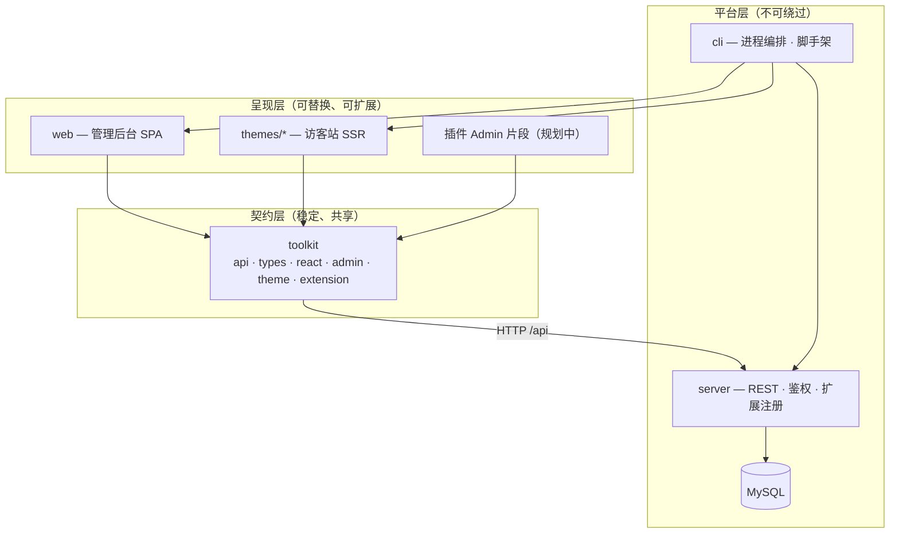
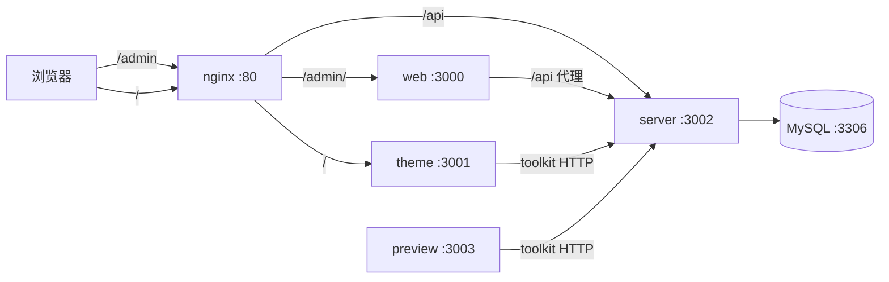
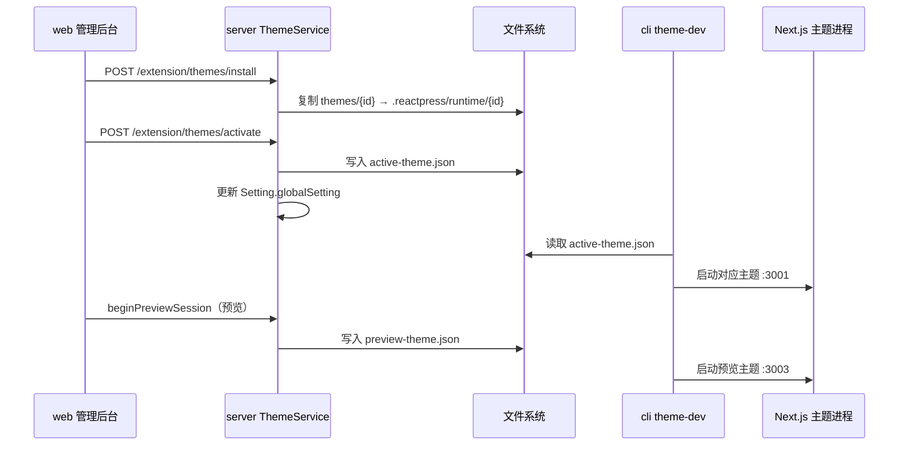
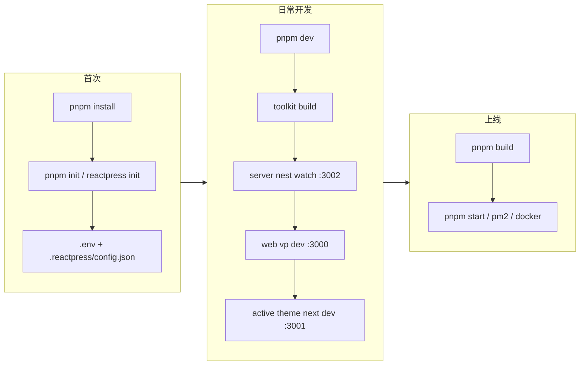

# ReactPress 系统架构

> ReactPress 3.0 — 基于 React 的现代化全栈 CMS / 博客发布平台  
> 核心理念：**后台管内容，主题管呈现，API 管数据，toolkit 管契约**

---

## 目录

- [1. 架构总览](#1-架构总览)
- [2. Monorepo 包结构](#2-monorepo-包结构)
- [3. 运行时与端口](#3-运行时与端口)
- [4. 数据流与依赖规则](#4-数据流与依赖规则)
- [5. Server（后端 API）](#5-server后端-api)
- [6. Web（管理后台）](#6-web管理后台)
- [7. Themes（访客前台）](#7-themes访客前台)
- [8. Toolkit（共享契约层）](#8-toolkit共享契约层)
- [9. CLI（命令行编排）](#9-cli命令行编排)
- [10. 鉴权与安全](#10-鉴权与安全)
- [11. 配置体系](#11-配置体系)
- [12. 部署架构](#12-部署架构)
- [13. 本地开发流程](#13-本地开发流程)
- [14. 演进说明](#14-演进说明)

---

## 1. 架构总览

ReactPress 采用 **Monorepo + 多进程** 架构，将内容管理、访客呈现与 API 服务解耦，通过统一的 toolkit 层保证类型安全与契约一致。



### 职责矩阵

| 包 | 唯一职责 | 渲染方式 | SEO |
|----|----------|----------|-----|
| **server** | 业务规则、持久化、鉴权、扩展生命周期 | — | — |
| **web** | 管理员操作界面 | Vite CSR SPA | 否 |
| **themes/** | 访客看到的站点 | Next.js SSR/SSG/ISR | 是 |
| **toolkit** | API 客户端、类型、React 集成、扩展 schema | — | — |
| **cli** | 本地开发 / 部署编排 | — | — |
| **docs** | 项目文档（Docusaurus） | SSG | — |

### 设计准则

优先级：**维护性 → 扩展性 → 技术合理性 → 低成本**

| 准则 | 落地手段 |
|------|----------|
| 维护性 | 分层 + Feature Module + 单一 API 客户端 + OpenAPI 类型自动生成 |
| 扩展性 | Registry + Hook + manifest 契约（theme.json / plugin.json） |
| 技术合理性 | Admin 用 SPA、公开页用 SSR、业务逻辑集中在 Server |
| 低成本 | Monorepo 共享 toolkit；响应式 Web 代替原生 App |

### 架构红线

- **后台不出现访客页**，**主题不出现 admin 路由**（新主题应遵循此原则）
- 所有前端（web / themes）**只能依赖 toolkit** 访问 API
- server **不依赖任何前端包**

---

## 2. Monorepo 包结构

基于 **pnpm workspace** 管理，根目录 `pnpm-workspace.yaml`：

```yaml
packages:
  - 'cli'        # 全局 CLI（@fecommunity/reactpress）
  - 'server'     # NestJS API
  - 'web'        # 管理后台 SPA
  - 'docs'       # Docusaurus 文档站
  - 'toolkit'    # 共享 API 契约层
  - 'themes/*'   # 官方主题模板
```

### 仓库目录树（核心部分）

```
easy-blog-publish/
├── cli/                 # 命令行工具，内置 bundled server
├── server/              # NestJS 后端 API 源码
├── web/                 # Vite 管理后台
├── toolkit/             # OpenAPI 生成的 SDK + React 集成
├── themes/
│   └── hello-world/     # 最小入门主题
├── docs/                # 项目文档
├── scripts/             # 构建、部署、冒烟测试脚本
├── docker-compose.*.yml # Docker 编排
├── nginx*.conf          # 反向代理配置
├── .reactpress/         # 运行时配置（active-theme.json 等）
└── package.json         # 根脚本入口
```

### npm 包对应关系

| 目录 | npm 包名 | 说明 |
|------|----------|------|
| `cli/` | `@fecommunity/reactpress` | 3.0 主包，全局命令 `reactpress` |
| `web/` | `@fecommunity/reactpress-web` | 管理后台 |
| `server/` | `@fecommunity/reactpress-server` | API（monorepo 源码；npm 已 deprecated，CLI 内置副本） |
| `toolkit/` | `@fecommunity/reactpress-toolkit` | 共享 SDK |
| `themes/hello-world` | `@fecommunity/reactpress-template-hello-world` | 入门主题 |

---

## 3. 运行时与端口

本地开发时，CLI 编排多个独立进程：

| 进程 | 默认端口 | 技术栈 | 说明 |
|------|----------|--------|------|
| **web** | 3000 | Vite + React | 管理后台入口 |
| **active theme** | 3001 | Next.js | 当前激活主题的访客站 |
| **server** | 3002 | NestJS | REST API（前缀 `/api`） |
| **preview theme** | 3003 | Next.js | 后台预览非激活主题（iframe） |
| **MySQL** | 3306 | MySQL 5.7 | 数据持久化 |
| **nginx**（可选） | 80 / 8080 | nginx | 统一入口反向代理 |



---

## 4. 数据流与依赖规则

### 典型请求链路

**管理后台写操作：**

```
web 页面 → toolkit createClient() → POST /api/article → server ArticleService → MySQL
```

**访客站读操作：**

```
theme pages/getServerSideProps → toolkit fetchSingleArticle() → GET /api/article/:id → server → MySQL
```

**主题管理：**

```
web 外观模块 → GET /api/extension/themes → server ThemeService
  → 读写 Setting.globalSetting（activeTheme / mods）
  → 写入 .reactpress/active-theme.json
  → CLI 重启对应 Next.js 进程
```

### 依赖规则（硬约束）

```
web / themes / plugins  →  只能依赖 toolkit
toolkit                 →  只依赖 HTTP + 标准库
server                  →  不依赖任何前端包
cli                     →  编排 server / web / themes，不被业务 import
```

---

## 5. Server（后端 API）

### 技术栈

| 层级 | 技术 |
|------|------|
| 框架 | NestJS 6 |
| ORM | TypeORM 0.2 |
| 数据库 | MySQL（mysql2 驱动，`synchronize: true` 自动建表） |
| 鉴权 | Passport + JWT、API Key |
| 文档 | Swagger（`/api` 路径） |
| 其它 | helmet、compression、rate-limit、log4js、nodemailer、ali-oss |

### 目录结构

```
server/src/
├── main.ts              # 入口：无 .env 时 Express 安装向导
├── starter.ts           # NestJS bootstrap
├── app.module.ts        # 根模块 + TypeORM 实体注册
├── generate-swagger.ts  # 导出 OpenAPI → public/swagger.json
├── common/              # 公共消息、常量
├── filters/             # HttpExceptionFilter
├── interceptors/        # TransformInterceptor（统一响应格式）
├── logger/
├── utils/               # OSS、markdown、上传等工具
└── modules/
    ├── article/         # 文章 + 版本历史 + 定时发布
    ├── auth/            # 登录、GitHub OAuth
    ├── user/            # 用户管理
    ├── category/        # 分类
    ├── tag/             # 标签
    ├── comment/         # 评论
    ├── page/            # 固定页面
    ├── knowledge/       # 知识库
    ├── file/            # 媒体上传
    ├── setting/         # 站点全局配置
    ├── smtp/            # 邮件
    ├── search/          # 搜索索引
    ├── view/            # 访问统计
    ├── api-key/         # Headless API 密钥
    ├── webhook/         # Webhook
    ├── extension/       # 主题安装/激活/预览
    └── health/          # 健康检查
```

### API 路由模式

- 全局前缀：`/api`（可通过 `SERVER_API_PREFIX` 配置）
- 控制器：`@Controller('resource')` → `/api/{resource}`
- 统一响应：`{ statusCode, success, data }`（`/health` 除外）

### 领域实体（15 个）

| 实体 | 职责 |
|------|------|
| User | 用户、角色（admin / visitor）、GitHub 登录 |
| Article | 文章（markdown/html、分类、标签、定时发布、密码保护） |
| ArticleRevision | 文章版本历史 |
| Category / Tag | 分类与标签 |
| Comment | 评论 |
| Page | 自定义页面 |
| Knowledge | 知识库树 |
| File | 上传文件元数据 |
| Setting | 站点全局配置（JSON：i18n、导航、OSS、主题状态等） |
| SMTP | 邮件记录 |
| Search | 搜索索引 |
| View | 访问统计 |
| ApiKey | API 密钥（bcrypt hash、scopes） |
| Webhook | Webhook 配置 |

### 启动双路径

1. **首次安装**：`main.ts` 纯 Express 向导（`/test-db`、`/install` 写 `.env`）→ 再启动 NestJS
2. **日常 / 生产**：直接 `starter.ts` bootstrap

---

## 6. Web（管理后台）

### 技术栈

| 类别 | 技术 |
|------|------|
| 构建 | Vite+（`vp dev/build`） |
| UI | React 18 + Ant Design 6 |
| 路由 | TanStack Router（文件路由） |
| 数据 | TanStack Query + Zustand（auth 持久化） |
| 编辑器 | Monaco Editor + Showdown（Markdown） |
| 国际化 | i18next |
| 测试 | MSW（开发 mock）+ Playwright（E2E） |

### 目录结构

```
web/src/
├── routes/              # TanStack 文件路由
│   ├── __root.tsx
│   ├── login/           # 登录页
│   └── _auth/           # 需鉴权的路由
│       ├── dashboard/
│       ├── article/     # 文章、分类、标签、评论
│       ├── media/
│       ├── page/
│       ├── appearance/  # 主题目录、Customizer
│       ├── settings/
│       ├── plugins/
│       └── data/        # 导入导出、统计
├── modules/             # 功能域（与 routes 对应）
│   ├── article/
│   ├── comment/
│   ├── media/
│   ├── page/
│   ├── user/
│   ├── appearance/
│   ├── dashboard/
│   ├── settings/
│   ├── plugins/
│   └── data/
├── shell/               # bootstrap、权限、Admin Registry
├── shared/              # Editor、通用组件、API 封装
├── components/          # Layout、DataTable 等
├── mocks/               # MSW handlers
├── stores/              # Zustand（auth 等）
├── hooks/
└── i18n/
```

### 与 API 的连接

- 开发环境：`VITE_API_BASE_URL=/api`，Vite 代理到 `localhost:3002`
- 主路径：`getToolkitClient()` → `@fecommunity/reactpress-toolkit/react` 的 `createClient()`
- Mock 模式：`VITE_AUTH_MODE=mock` + MSW
- 联调模式：`VITE_AUTH_MODE=server`

### 核心功能模块

| 模块 | 能力 |
|------|------|
| 仪表盘 | 站点概览、待审评论数等 |
| 文章 | CRUD、Markdown 编辑、分类/标签关联 |
| 媒体 | 媒体库、上传管理 |
| 评论 | 审核、回复 |
| 页面 | 固定页面管理 |
| 外观 | 主题安装/激活/预览、Customizer |
| 用户 | 用户与权限管理 |
| 设置 | 站点配置、SMTP 等 |
| 数据 | 导入导出、访问统计 |

---

## 7. Themes（访客前台）

3.0 中，访客前台由 `themes/` 下的独立 Next.js 包承担（替代旧 `client/` 包）。

### 主题包结构（以 hello-world 为例）

```
themes/hello-world/
├── theme.json           # 主题清单（id、templates、customizer）
├── package.json
├── pages/               # Next.js Pages Router
│   ├── _app.tsx         # createThemeApp(manifest) 入口
│   ├── index.tsx        # 首页
│   ├── article/[id].tsx # 文章详情
│   ├── category/[category].tsx
│   ├── tag/[tag].tsx
│   └── search.tsx
├── components/          # Header、Footer、PostEntry 等
├── styles/
├── next.config.js       # createReactPressNextConfig()
└── bin/
```

### theme.json 契约

| WordPress 概念 | ReactPress 对应 |
|----------------|-----------------|
| `style.css` 头信息 | `theme.json` |
| `functions.php` | `pages/_app.tsx` → `createThemeApp()` |
| 模板层级 | `theme.json` → `reactpress.templates` + `pages/*` |
| Customizer | `customizer.sections` + `useThemeMod` / `ThemeCssVars` |

### 主题生命周期



### 官方主题

| 主题 | 定位 |
|------|------|
| **hello-world** | 最小可运行模板，推荐新主题复制 |

---

## 8. Toolkit（共享契约层）

全平台唯一的 API 契约层，由 server 的 OpenAPI 规范自动生成。

### 目录结构

```
toolkit/src/
├── api/           # 自动生成：Article, Auth, User, Category…
├── types/         # IArticle, IUser… 接口类型
├── react/         # createClient(), resolveApiBaseUrl()
├── theme/         # themeApi, fetch*, createThemeApp, themeStaticProps
├── ui/            # NavMenu, ArticleList, ThemeLayout…
├── admin/         # Registry、permissions
├── extension/     # theme.json / plugin.json JSON Schema
├── config/        # env、i18n、locales
└── utils/
```

### 导出路径

| 路径 | 用途 |
|------|------|
| `@fecommunity/reactpress-toolkit` | 主入口 |
| `@fecommunity/reactpress-toolkit/react` | React Client 工厂 |
| `@fecommunity/reactpress-toolkit/theme` | 主题 SSR 工具 |
| `@fecommunity/reactpress-toolkit/ui` | 共享 UI 组件 |
| `@fecommunity/reactpress-toolkit/admin` | Admin Registry |

### 代码生成流程

```bash
# 1. 从 server 生成 swagger.json
pnpm run generate:swagger

# 2. 重新生成 toolkit 的 api/types
pnpm run build:toolkit
```

---

## 9. CLI（命令行编排）

发布为 `@fecommunity/reactpress`，提供零配置的项目生命周期管理。

### 核心命令

| 命令 | 说明 |
|------|------|
| `reactpress init` | 初始化项目（生成 `.env` + `.reactpress/config.json`） |
| `reactpress dev` | 本地全栈开发（API + web + 激活主题 + Docker MySQL） |
| `reactpress dev --api-only` | 仅 API（Headless 模式） |
| `reactpress dev --web-only` | 仅管理后台 + API |
| `reactpress build` | 生产构建 |
| `reactpress start` | 启动生产构建 |
| `reactpress doctor` | 环境诊断 |
| `reactpress status` | 运行状态 |
| `reactpress docker *` | Docker MySQL 管理 |

### CLI 目录结构

```
cli/
├── bin/reactpress.js       # 主入口
├── lib/
│   ├── dev.js              # 一键 dev 编排
│   ├── bootstrap.js        # init / 环境
│   ├── build.js, lifecycle.js, pm2.js
│   ├── docker.js, nginx.js, doctor.js
│   ├── theme-dev.js, theme-runtime.js
│   └── paths.js            # server/web/themes 路径解析
├── server/                 # 打包进 npm 的 NestJS 运行时
├── templates/              # init 脚手架
└── ui/                     # 交互菜单
```

### Server 路径解析

CLI 启动 API 时的优先级：

1. monorepo 内 `server/src/main.ts` 存在 → 使用 `server/`
2. 否则 → 使用 `cli/server/` 内置 bundled server

---

## 10. 鉴权与安全

### JWT（管理端 / 用户会话）

- 登录：`POST /api/auth/login` → 返回 token（4h 过期）
- 受保护路由：`@UseGuards(JwtAuthGuard)` + Bearer token
- 角色：`@Roles('admin')` + `RolesGuard`（admin / visitor）

### API Key（Headless / 第三方集成）

- Header：`X-API-Key` 或 `Authorization: Bearer <key>`
- Scope：`read` / `write`
- 示例：`GET /api/article/headless/list` 需 `read` scope

### GitHub OAuth

- `POST /api/auth/github`（需配置 `GITHUB_CLIENT_ID/SECRET`）

### 密码

- bcrypt 哈希存储
- `User.comparePassword()` 登录校验

---

## 11. 配置体系

3.0 以 **`.reactpress/config.json`** 为配置真源，`.env` 由 CLI 在 `init` 时同步生成。

### 关键配置文件

| 文件 | 用途 |
|------|------|
| `.reactpress/config.json` | 项目主配置 |
| `.reactpress/active-theme.json` | 当前激活主题 ID |
| `.reactpress/preview-theme.json` | 预览主题 ID |
| `.reactpress/runtime/{id}/` | 主题运行时副本 |
| `.env` | 数据库、端口、密钥等环境变量 |

### 主要环境变量

| 变量 | 说明 | 默认值 |
|------|------|--------|
| `DB_HOST` | MySQL 主机 | `0.0.0.0` |
| `DB_PORT` | MySQL 端口 | `3306` |
| `SERVER_PORT` | API 端口 | `3002` |
| `REACTPRESS_API_URL` | API 地址（SSR 用） | `http://localhost:3002/api` |

---

## 12. 部署架构

### 开发模式（推荐）

- 应用进程跑宿主机（`pnpm dev`）
- Docker 仅容器化 **MySQL + nginx**
- nginx 通过 `host.docker.internal` 转发到宿主机进程

### 生产模式选项

| 方式 | 说明 |
|------|------|
| **PM2** | `pnpm build` → `pnpm start`，API + 前端进程管理 |
| **Docker** | MySQL 容器 + nginx 反代；API 可跑宿主机 |
| **Vercel** | 一键部署（主题 / web 静态资源） |

### nginx 路由规则（开发）

| 路径 | 转发目标 |
|------|----------|
| `/` | 主题进程 `:3001` |
| `/admin/` | web 管理后台 `:3000` |
| `/api` | server API `:3002` |

---

## 13. 本地开发流程



### 常用命令

```bash
pnpm install          # 安装依赖
pnpm dev              # 一键本地：API + Admin + 主题 + MySQL
pnpm dev:api          # 仅 API
pnpm dev:web          # 管理后台 + API
pnpm dev:themes       # 主题开发
pnpm build            # 生产构建：toolkit → server → web → themes
pnpm typecheck        # 类型检查
pnpm test             # CLI 测试
```

### 修改 API 后同步前端类型

```bash
pnpm run generate:swagger   # 从 server 生成 swagger.json
pnpm run build:toolkit      # 重新生成 toolkit 的 api/types
```

---

## 14. 演进说明

### 3.0 主要变化

| 2.x | 3.0 |
|-----|-----|
| `client/` 单体 Next.js（含 /admin） | `web/` 独立 Admin SPA + `themes/` 访客前台 |
| 多处自建 HTTP 层 | 统一 `toolkit` API 客户端 |
| 手动配置 | CLI 引导式 `init` + `dev` |

### 当前遗留项

- `server` npm 包标记 deprecated，推荐使用 CLI 内置 API
- `dev:client` 脚本名保留，实际启动的是激活主题（`--client-only` → API + theme）

### 功能域覆盖

| 域 | 状态 |
|----|------|
| 内容（文章、分类、标签、评论、页面） | ✅ 已实现 |
| 媒体（上传、媒体库、OSS） | ✅ 已实现 |
| 外观（主题安装/激活/Customizer） | ✅ 已实现 |
| 系统（用户、设置、导入导出） | ✅ 已实现 |
| 扩展（插件 Hook + Registry） | 🔲 规划中 |
| 知识库 | ✅ 已实现（server 模块） |

---

## 参考文档

- [README-zh_CN.md](./README-zh_CN.md) — 快速开始与 CLI 命令
- [design.md](./design.md) — 详细技术方案与设计决策
- [docs/](./docs/) — Docusaurus 教程与迁移指南
- [themes/README.md](./themes/README.md) — 主题开发指南
- [toolkit/README.md](./toolkit/README.md) — SDK 使用说明
