# ReactPress 系统架构设计

> 目标态架构说明：原则、系统视图、模块职责与目录结构。  
> 实施步骤见 [TODO.md](./TODO.md)。

---

## 1. 设计原则

| 原则 | 含义 |
|------|------|
| **边界清晰** | 平台运行时（API、DB、生命周期）归 `reactpress-cli`；本仓只做 Web 产品与契约 SDK。 |
| **契约优先** | 后端能力以 OpenAPI 为准；`toolkit` 生成类型与客户端；业务代码不手写 REST 路径。 |
| **目录守恒** | 保持现有顶层与 `client/src` 布局；优化模块内涵，不大规模搬迁文件夹。 |
| **单向依赖** | 依赖只能从上层指向下层（页面 → 门面 → SDK → API），禁止反向与环依赖。 |
| **渐进演进** | 允许删除已无价值的 `server/` 薄封装；其余变更以「改实现、不改路径」为主。 |

---

## 2. 系统架构

### 2.1 上下文（系统与外部角色）

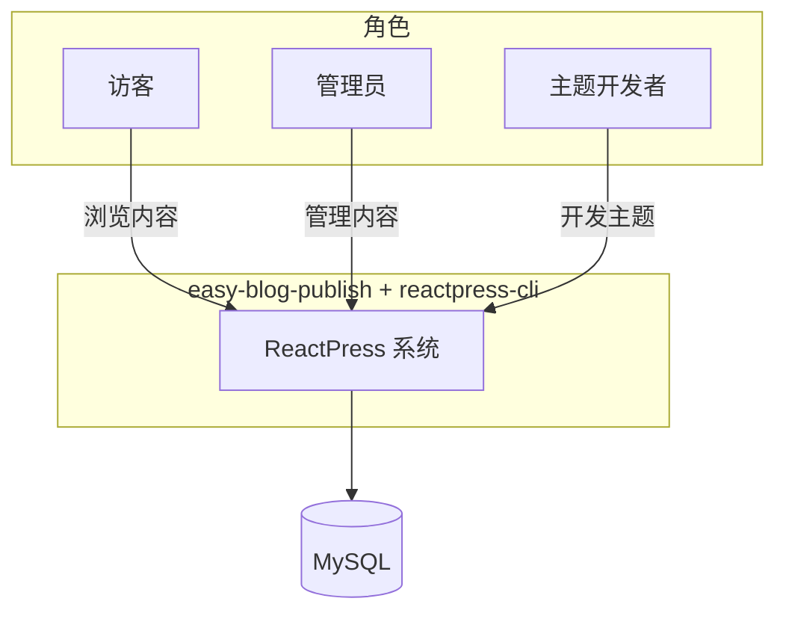

### 2.2 容器（主要运行时组件）

```mermaid
flowchart TB
  subgraph browser [浏览器]
    WEB[client Next.js]
  end

  subgraph node [Node 进程]
    CLI[@fecommunity/reactpress-cli]
    API[Nest API 内置]
  end

  DB[(MySQL)]

  WEB -->|HTTPS /api| API
  CLI -->|start/stop/config| API
  CLI -->|Docker / 连接串| DB
  API --> DB
```

| 容器 | 部署形态 | 默认端口 |
|------|----------|----------|
| **client** | Next.js（`server.js` 启动） | 3001 |
| **API** | CLI 内置 Nest | 3002（前缀 `/api`） |
| **MySQL** | CLI `init` 提供的 compose 或外部实例 | 3306 |

### 2.3 仓库与平台（逻辑模块全景）

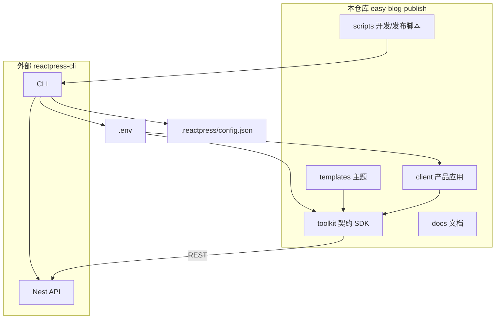

### 2.4 请求与配置（两条主链路）

**业务请求链路：**

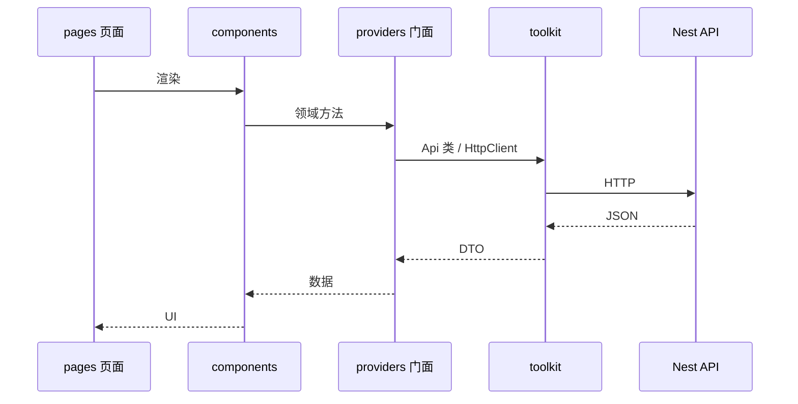

**配置链路：**

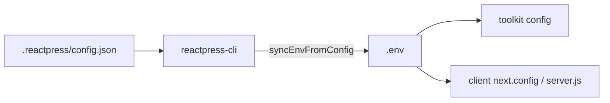

---

## 3. 模块设计

### 3.1 模块一览

| 模块 | 位置 | 职责 | 依赖 |
|------|------|------|------|
| **reactpress-cli** | 外部 npm | 项目 `init`、API 启停、DB、生成 `.reactpress/*` 与 `.env` | — |
| **toolkit** | `toolkit/` | OpenAPI → TS API/类型；`config`；i18n；无 UI | CLI（swagger 源）、`.env` |
| **client** | `client/` | 前台、Admin、路由、组件、领域门面 | toolkit |
| **templates** | `templates/*` | 可安装主题（前台页面与样式） | toolkit（可选 client 对齐） |
| **docs** | `docs/` | 产品/开发文档 | 无运行时依赖 |
| **scripts** | `scripts/` | 本地 `dev`、发布等编排 | CLI |

**终态移除**：`server/`（薄封装，职责并入 CLI，不再作为本仓模块）。

### 3.2 模块关系（依赖规则）

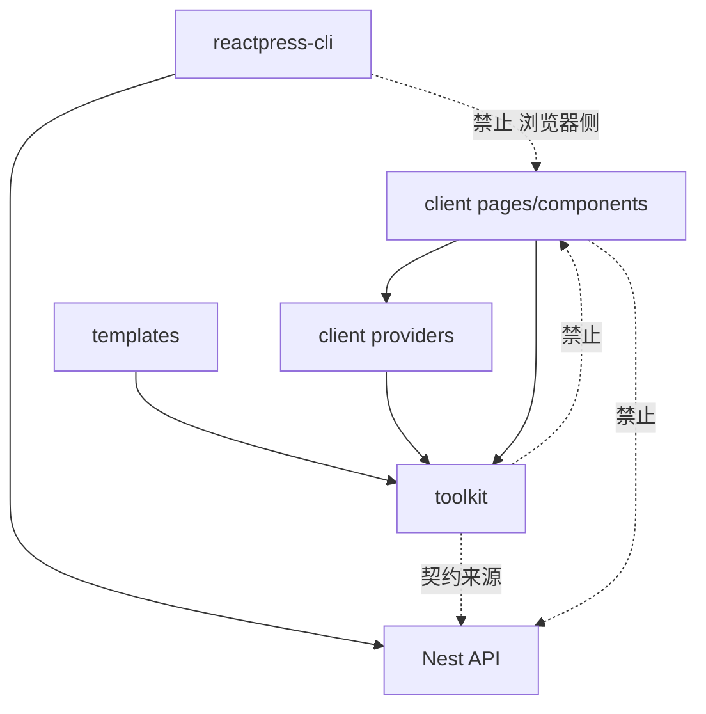

| 关系 | 允许 | 禁止 |
|------|------|------|
| client → toolkit | ✓ 唯一后端访问路径 | — |
| client → API 直连 | — | ✓ 绕过 toolkit/providers |
| toolkit → client | — | ✓ SDK 不依赖 UI |
| templates → client 核心 Admin | — | ✓ 主题不 fork 后台 |
| 本仓 → Nest 源码 | — | ✓ API 只在 CLI 演进 |

### 3.3 toolkit 模块

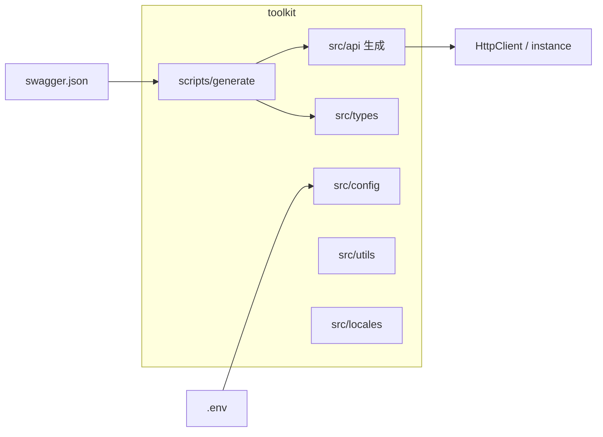

| 子模块 | 说明 |
|--------|------|
| `src/api/*` | 由 Swagger 生成，**不手改**；按资源分文件（Article、User…） |
| `src/config` | 读取 env，导出站点 URL、API 前缀等 |
| `src/types` | 对外 DTO |
| `scripts/` | 从 CLI 内置 server 拉取 swagger 并 regenerate |

### 3.4 client 模块（内部分层）

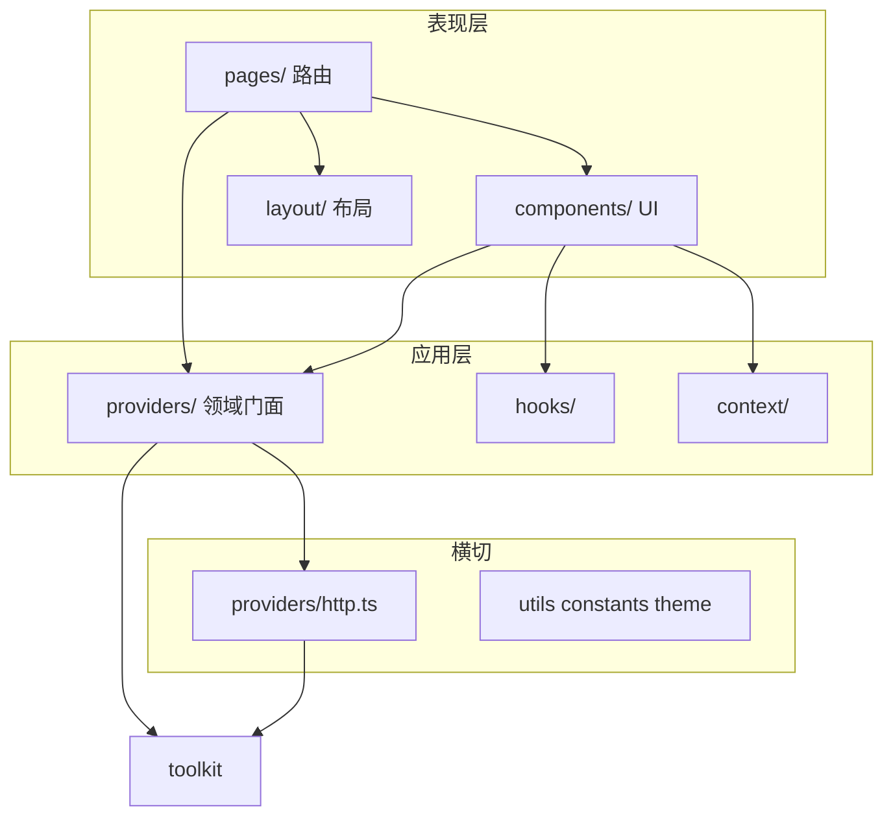

| 子模块 | 职责 | 与其它模块关系 |
|--------|------|----------------|
| **pages/** | URL 与页面组装；保持薄 | 调用 `components`、`providers`、`layout` |
| **components/** | 展示与交互（Editor、Comment、Setting…） | 不直接请求 API；经 `providers` 或 `hooks` |
| **providers/** | 按领域封装 API（Article、User…） | 对外稳定入口；内部委托 `toolkit` |
| **providers/http.ts** | axios 实例、Token 拦截、baseURL | 与 toolkit `HttpClient` 对齐或包装 |
| **layout/** | 前台/后台布局、Admin 菜单 | 与 `pages/admin` 路由对应 |
| **hooks/** | 分页、设置等复用逻辑 | 可调用 `providers` |
| **context/** | 全局 UI 状态 | 不替代 `providers` 做数据请求 |

**providers 与 toolkit 的分工**：`toolkit` 提供通用、生成的 HTTP 与类型；`providers` 提供业务语义方法名与参数组合，供页面/组件 import 路径稳定。

### 3.5 templates 模块

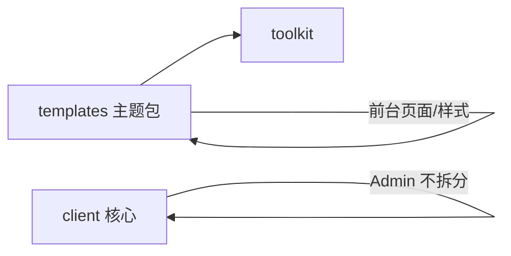

- 主题只覆盖 **前台** 展示；**Admin 始终留在 client**。
- 与 client 共享同一 API 契约（经 toolkit）。

### 3.6 reactpress-cli 模块（外部，本仓不实现）

| 能力 | 说明 |
|------|------|
| `init` | 生成 `.reactpress/config.json`、`.env`、compose 等 |
| `start` / `stop` / `status` | 管理内置 API 进程 |
| 内置 API | Nest 业务实现唯一源码仓 |
| 内置 swagger | toolkit `generate` 的契约源 |

---

## 4. 目录设计

### 4.1 仓库顶层（终态）

在**现有结构**上仅删除 `server/`：

```
easy-blog-publish/
├── .reactpress/          # CLI 写入：config.json、compose、pid 等
├── client/               # 主应用 → 见 4.2
├── toolkit/              # 契约 SDK → 见 4.3
├── templates/            # 主题包（如 hello-world、twentytwentyfive）
├── docs/                 # Docusaurus 文档
├── scripts/              # reactpress-dev、publish 等
├── pnpm-workspace.yaml
└── package.json
```

### 4.2 client 目录

```
client/
├── pages/                 # 路由（Pages Router，保持不变）
│   ├── index.tsx          # 首页
│   ├── article/           # 文章
│   ├── knowledge/         # 知识库
│   ├── admin/             # 管理后台
│   └── …
├── public/
├── server.js              # 开发/生产启动
├── next.config.js
└── src/
    ├── components/        # UI，按业务分子目录
    ├── providers/         # 领域 API 门面（article.ts、user.ts…）
    ├── layout/            # AppLayout、AdminLayout
    ├── hooks/
    ├── context/
    ├── utils/
    ├── constants/
    └── theme/
```

| 路径 | 变更策略 |
|------|----------|
| `pages/`、`src/*` 一级目录 | **不更名、不迁到 `app/` 或 `features/`** |
| `src/providers/*.ts` | 仅改文件**内部**实现（委托 toolkit） |
| `src/components/*` | 新业务组件放入已有业务子目录 |

### 4.3 toolkit 目录

```
toolkit/
├── src/
│   ├── api/               # 生成：Article.ts、User.ts、HttpClient.ts…
│   ├── types/
│   ├── config/            # env、global、i18n
│   ├── utils/
│   └── locales/
├── scripts/               # generate-swagger、resolve-swagger-input
└── dist/                  # 构建产物（npm 入口）
```

### 4.4 配置相关路径（跨模块）

| 路径 | 写入方 | 读取方 |
|------|--------|--------|
| `.reactpress/config.json` | CLI | CLI、人 |
| `.env` | CLI（由 config 同步） | toolkit、client 启动脚本 |
| `.env.example` | 仓库模板 | 开发者 |

---

## 5. 模块协作示例

**管理员发布文章（简化）：**

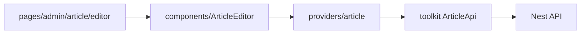

**访客阅读文章：**

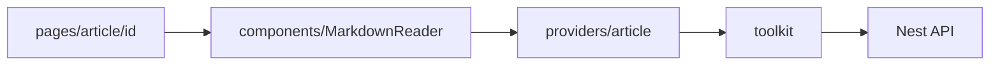

**主题开发者定制首页：**

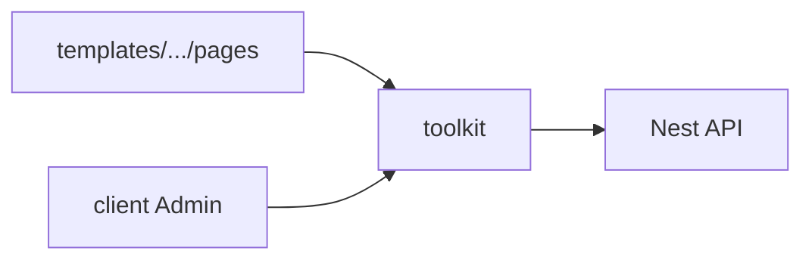

---

## 6. 参考

| 文档 | 内容 |
|------|------|
| [TODO.md](./TODO.md) | 重构任务与阶段 |
| [reactpress-cli](https://github.com/fecommunity/reactpress-cli) | 平台 CLI 与 API 源码 |

默认地址：Web `http://localhost:3001` · API `http://localhost:3002/api`
