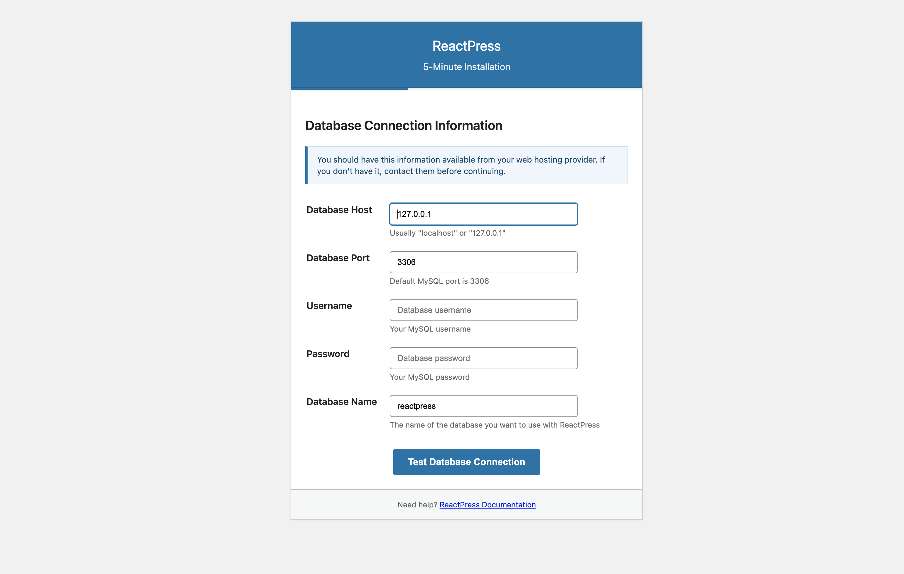

<div align="center">
  <a href="https://gaoredu.com" title="ReactPress">
    
  </a>

  <h1>ReactPress 2.0</h1>

  <p align="center">
    <em>基于 React、Next.js 和 NestJS 构建的现代化全栈发布平台</em>
  </p>

  [](https://github.com/fecommunity/reactpress/blob/master/LICENSE)
  [](https://www.npmjs.com/package/@fecommunity/reactpress)
  [](https://github.com/fecommunity/reactpress/pulls)
  [](http://www.typescriptlang.org/)
  [](https://nextjs.org/)
  [](https://nestjs.com/)
  [](https://vercel.com/new/clone?repository-url=https://github.com/fecommunity/reactpress)
  [](https://github.com/fecommunity/reactpress/actions/workflows/npm-publish.yml)

  <p>
    <a href="https://github.com/fecommunity/reactpress/issues">报告错误</a>
    ·
    <a href="https://github.com/fecommunity/reactpress/issues">请求功能</a>
    ·
    <a href="./README.md">English Documentation</a>
  </p>
</div>

## 🌟 现代化发布平台

**ReactPress 2.0** 是一个现代化的全栈发布平台，使开发者和内容创作者能够轻松构建专业博客、网站和内容管理系统。

[](https://gaoredu.com)

## ✨ 主要特性

### ⚡ 5分钟快速安装
- **零配置设置**，具有智能默认值
- **WordPress 式安装向导**，提供直观的设置体验
- **自动数据库配置**，具有自动模式迁移

### 🎨 高级定制
- **动态主题切换**，支持亮/暗模式
- **组件级定制**，通过模块化架构实现
- **国际化支持**（中文和英文）

### 🔧 统一开发体验
- **Monorepo 架构**，具有模块化包
- **TypeScript**，为前端和后端提供类型安全
- **PM2 进程管理**，用于生产部署

### 🚀 现代技术栈
- **前端**：React 17 + Next.js 12 Pages Router
- **后端**：NestJS 6 模块化架构
- **数据库**：MySQL + TypeORM
- **UI**：Ant Design v5 组件

## 📸 截图

### 安装向导
[](https://gaoredu.com)

### 内容管理仪表板
[](https://gaoredu.com)

### 演示站点
[](https://gaoredu.com)

## 🚀 快速开始

### 📋 前置要求
- Node.js >= 16.5.0
- MySQL 数据库
- pnpm 包管理器

### 🏁 安装选项

#### 选项 1：统一 CLI（推荐）
```bash
# 全局安装 ReactPress
npm install -g @fecommunity/reactpress

# 启动服务
reactpress server start
reactpress client start
```

#### 选项 2：独立服务
```bash
# 安装并启动 ReactPress 服务器
npx @fecommunity/reactpress-server

# 独立安装并运行客户端
npx @fecommunity/reactpress-client
```

## 📟 命令行界面 (CLI)

ReactPress 提供了一个统一的命令行界面来管理服务器和客户端组件。

### 统一 CLI 命令

全局安装 ReactPress 后，您可以使用 `reactpress` 命令：

```bash
# 显示帮助
reactpress --help

# 启动服务器
reactpress server start

# 启动客户端
reactpress client start

# 使用 PM2 启动服务器
reactpress server start --pm2

# 使用 PM2 启动客户端
reactpress client start --pm2
```


### 独立包命令

您也可以直接使用各个包的命令：

```bash
# 启动服务器
npx @fecommunity/reactpress-server

# 启动客户端
npx @fecommunity/reactpress-client

# 使用 PM2 启动服务器
npx @fecommunity/reactpress-server --pm2

# 使用 PM2 启动客户端
npx @fecommunity/reactpress-client --pm2
```

## 📦 包与组件

ReactPress 组织为**具有模块化包的 monorepo**：

### 核心包

| 包 | 描述 | 版本 |
|---------|-------------|---------|
| [`@fecommunity/reactpress`](.) | 主 CLI 和统一入口点 | 2.0.0 |
| [`@fecommunity/reactpress-client`](./client) | Next.js 12 前端应用 | 1.0.0 |
| [`@fecommunity/reactpress-server`](./server) | NestJS 6 后端 API | 1.0.0 |
| [`@fecommunity/reactpress-toolkit`](./toolkit) | 自动生成的 API 客户端 SDK | 1.0.0 |

### 模板

| 模板 | 描述 | 包名 |
|----------|-------------|--------------|
| [`hello-world`](./templates/hello-world) | 用于快速原型设计的最小模板 | `@fecommunity/reactpress-template-hello-world` |
| [`twentytwentyfive`](./templates/twentytwentyfive) | 功能丰富的博客模板 | `@fecommunity/reactpress-template-twentytwentyfive` |

## 🔧 配置

在根目录中创建 `.env` 文件用于本地开发：

```env
# 数据库配置
DB_HOST=127.0.0.1
DB_PORT=3306
DB_USER=reactpress
DB_PASSWD=reactpress
DB_DATABASE=reactpress

# 客户端配置
CLIENT_SITE_URL=http://localhost:3001

# 服务器配置
SERVER_SITE_URL=http://localhost:3002
```

## 🚀 部署选项

### 使用 Vercel 部署（推荐）
[](https://vercel.com/new/clone?repository-url=https://github.com/fecommunity/reactpress)

### PM2 部署（推荐）
```bash
# 全局安装 PM2
npm install -g pm2

# 使用 PM2 启动 ReactPress 服务器
npx @fecommunity/reactpress-server --pm2

# 使用 PM2 启动 ReactPress 客户端
npx @fecommunity/reactpress-client --pm2

# 或者使用统一 CLI
reactpress server start --pm2
reactpress client start --pm2
```

### 传统部署（自托管）
```bash
# 构建生产版本
pnpm run build

# 启动生产服务器
pnpm run start
```

## 🤝 贡献

我们欢迎各种形式的贡献！无论是错误修复、新功能、文档改进还是翻译，您的帮助都受到赞赏。

### 📋 开发设置

1. Fork 仓库
2. 克隆您的 fork：`git clone https://github.com/your-username/reactpress.git`
3. 安装依赖：`pnpm install`
4. 启动开发服务器：`pnpm run dev`

### 📦 发布

要将包发布到 npm：

1. 确保您已登录 npm：`pnpm login`
2. 运行发布脚本：`pnpm run release`
3. 按照交互式提示选择包和版本增量

请阅读我们的[贡献指南](https://github.com/fecommunity/reactpress/blob/master/CONTRIBUTING.md)了解我们的行为准则和开发流程详情。

## ❤️ 致谢

ReactPress 受到许多优秀开源项目的启发和构建：

- [Next.js](https://github.com/vercel/next.js) - React 框架
- [NestJS](https://github.com/nestjs/nest) - 渐进式 Node.js 框架
- [Ant Design](https://github.com/ant-design/ant-design) - UI 设计语言
- [TypeORM](https://github.com/typeorm/typeorm) - TypeScript 和 JavaScript 的 ORM

我们感谢这些项目的作者和贡献者的出色工作。

## 📈 Star 历史

[](https://star-history.com/#fecommunity/reactpress&Date)