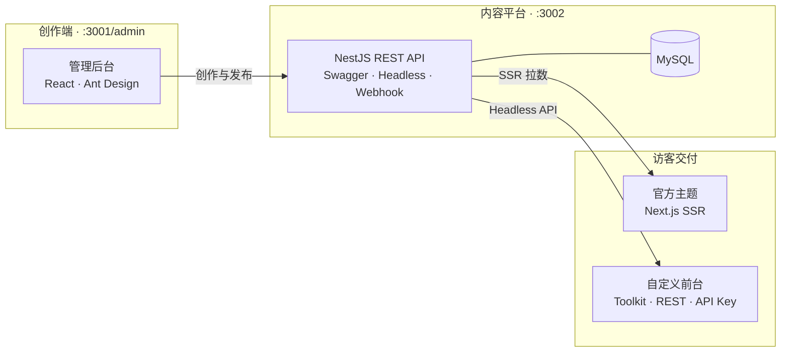
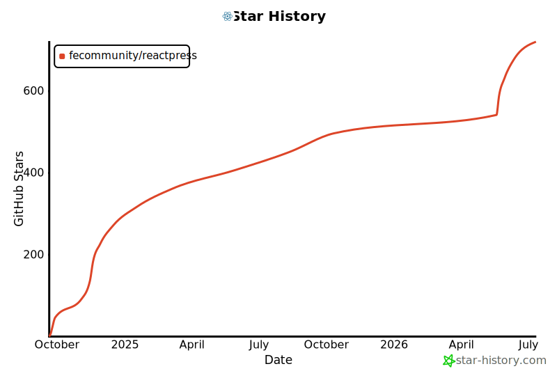

<div align="center">
  <a href="https://blog.gaoredu.com" title="ReactPress">
    
  </a>

  <h1>ReactPress</h1>

  <p>
    <strong>开源发布平台 — WordPress 式编辑体验，Next.js 级前台性能。</strong><br />
    <sub>一个全局包 · 零配置 CMS · Headless API · 可生产部署的主题</sub>
  </p>

  <p>
    <a href="https://github.com/fecommunity/reactpress/stargazers"></a>
    <a href="https://www.npmjs.com/package/@fecommunity/reactpress"></a>
    <a href="https://www.npmjs.com/package/@fecommunity/reactpress"></a>
    <a href="https://github.com/fecommunity/reactpress/actions/workflows/ci.yml"></a>
    <a href="https://github.com/fecommunity/reactpress/blob/master/LICENSE"></a>
  </p>

  <br />

  <a href="https://reactpress-theme-starter.vercel.app">
    
  </a>

  <br /><br />

  <table>
    <tr>
      <td align="center" width="33%">
        <strong>⚡ 约 60 秒</strong><br />
        <sub>零配置冷启动</sub>
      </td>
      <td align="center" width="33%">
        <strong>📊 95 / 100 / 100 / 100</strong><br />
        <sub>官方主题 Lighthouse 实测</sub>
      </td>
      <td align="center" width="33%">
        <strong>🔌 Headless</strong><br />
        <sub>REST · Swagger · TypeScript SDK</sub>
      </td>
    </tr>
  </table>

  <br />

  <p>
    <a href="https://reactpress-theme-starter.vercel.app"><strong>主题演示</strong></a>
    &nbsp;·&nbsp;
    <a href="https://blog.gaoredu.com"><strong>全栈演示</strong></a>
    &nbsp;·&nbsp;
    <a href="https://docs.gaoredu.com/"><strong>官方文档</strong></a>
    &nbsp;·&nbsp;
    <a href="https://github.com/fecommunity/reactpress-theme-starter"><strong>官方主题</strong></a>
    &nbsp;·&nbsp;
    <a href="./README.md"><strong>English</strong></a>
  </p>

  <p><sub>如果 ReactPress 帮到了你，<a href="https://github.com/fecommunity/reactpress"><strong>⭐ 点个 Star</strong></a>，让更多人发现它。</sub></p>
</div>

---

## 快速开始

**环境要求：** Node.js 18+ · 推荐 Docker（内置 MySQL）

```bash
npm i -g @fecommunity/reactpress@3
mkdir my-blog && cd my-blog
reactpress init
reactpress dev
```

就这么简单 — CLI 自动生成配置、启动 MySQL、拉起 CMS API，无需手写 `.env`。

| 服务 | 地址 |
| :--- | :--- |
| CMS API | `http://localhost:3002/api` |
| Swagger 文档 | `http://localhost:3002/api` |
| 健康检查 | `http://localhost:3002/api/health` |

运行 `reactpress` 打开交互菜单 · 启动失败请执行 `reactpress doctor`。

> **下一步：** 接入[官方主题](#接入访客站)，或参考[全栈指南](https://docs.gaoredu.com/)。

<details>
<summary><strong>目录</strong></summary>

- [快速开始](#快速开始)
- [效果演示](#效果演示)
- [为什么选 ReactPress？](#为什么选-reactpress)
- [核心特性](#核心特性)
- [适用场景](#适用场景)
- [架构概览](#架构概览)
- [使用路径](#使用路径)
- [技术栈与生态](#技术栈与生态)
- [常见问题](#常见问题)
- [社区与贡献](#社区与贡献)

</details>

---

## 效果演示

<div align="center">


<table>
  <thead>
    <tr>
      <th align="center" width="50%">CLI</th>
      <th align="center" width="50%">访客站（深色模式）</th>
    </tr>
  </thead>
  <tbody>
    <tr>
      <td align="center" valign="top">
        <a href="https://docs.gaoredu.com/">
          
        </a>
      </td>
      <td align="center" valign="top">
        <a href="https://reactpress-theme-starter.vercel.app">
          
        </a>
      </td>
    </tr>
  </tbody>
</table>

<a href="https://reactpress-theme-starter.vercel.app">
  
</a>

</div>

---

## 为什么选 ReactPress？

大多数发布工具都在逼你二选一：**CMS 好用但前台慢或绑定紧**，或**静态站极快但没有像样的编辑器**。ReactPress 减轻这种取舍 — WordPress 式编辑 + 现代化、可解耦的访客站。

| | **ReactPress** | WordPress | Ghost | 静态站点（Hugo、Hexo） |
| :--- | :--- | :--- | :--- | :--- |
| **首次跑通** | **`init` + `dev`，约 60 秒**¹ | 服务器、PHP、主题与插件 | 托管或自建，步骤较多 | 每站独立仓库与构建 |
| **内容编辑** | **Web 后台** | Web 后台 | Web 后台 | Git 中的 Markdown |
| **前台速度与 SEO** | **Lighthouse 95/100/100/100**² | 因主题与插件差异大 | 通常较好 | 优秀，无内置 CMS |
| **前端灵活性** | **Headless — 可替换主题** | 主题/插件生态强，耦合度高 | 与 Ghost 主题绑定 | 构建时固定 |
| **内置能力** | **搜索、评论、知识库** | 常靠插件 | 会员/通讯为主 | 需自行实现 |
| **更适合** | **博客、内容站、定制发布** | 通用网站 | 通讯与出版业务 | 文档站、开发者博客 |

¹ 需 Node.js 与 Docker 就绪；首次 Docker 拉取可能更久。  
² 基于[官方主题在线演示](https://reactpress-theme-starter.vercel.app)实测。

---

## 核心特性

| | 特性 | 你能得到什么 |
| :---: | :--- | :--- |
| ⚡ | **约 60 秒冷启动** | `init` + `dev`，零配置，内置 Docker MySQL |
| ✍️ | **熟悉的 CMS** | 文章、页面、媒体、分类、标签、定时发布 |
| 🎨 | **现代化前台** | 官方 Next.js 主题 — 搜索、评论、知识库、深色模式 |
| 🔌 | **Headless 就绪** | REST API、Swagger、API Key、Webhook — 可替换或自建前台 |
| 📊 | **生产级指标** | 官方主题演示 Lighthouse **95 / 100 / 100 / 100** |
| 🛠️ | **开发者体验** | 交互式 CLI、`doctor`、`status`、`db backup` |
| 🌐 | **国际化** | 中英文后台与文档 |
| 📦 | **一个包搞定** | `@fecommunity/reactpress@3` — CLI + API + 模板，无需拼装 |

---

## 适用场景

| | 场景 | 为什么选 ReactPress |
| :---: | :--- | :--- |
| 📝 | **个人博客** | 富文本编辑器 — 不必在 Git 里写 Markdown |
| 🏢 | **内容站与文档** | 知识库、搜索、评论开箱即用 |
| 🧑‍💻 | **开发团队** | Headless API + SDK，任意前端栈 |
| 🚀 | **独立开发者** | `npm i -g` → 约 60 秒跑通 CMS |
| 🔌 | **Headless CMS** | REST + Swagger + Webhook 作为内容中心 |

---

## 架构概览

ReactPress 将**内容管理**与**前台展示**解耦 — 在后台创作，任意前端渲染。


```mermaid
flowchart LR
  subgraph Author["创作端 · :3001/admin"]
    A["管理后台<br/>React · Ant Design"]
  end

  subgraph Core["内容平台 · :3002"]
    B["NestJS REST API<br/>Swagger · Headless · Webhook"]
    DB[(MySQL)]
    B --- DB
  end

  subgraph Delivery["访客交付"]
    C["官方主题<br/>Next.js SSR"]
    D["自定义前台<br/>Toolkit · REST · API Key"]
  end

  A -->|创作与发布| B
  B -->|SSR 拉数| C
  B -->|Headless API| D
```

| 组件 | 作用 |
| :--- | :--- |
| **CLI（`reactpress`）** | 初始化、开发、构建、部署、Docker、诊断 |
| **CMS API** | 内容、媒体、设置、Headless 接口、Webhook |
| **管理后台** | 编辑者的 Web 界面（全栈部署中包含） |
| **[官方主题](https://github.com/fecommunity/reactpress-theme-starter)** | 推荐访客站 — 快速、SEO 友好、功能完整 |
| **[@fecommunity/reactpress-toolkit](https://www.npmjs.com/package/@fecommunity/reactpress-toolkit)** | 自建前台的 TypeScript SDK |

---

## 使用路径

### 预览主题（无需后端）

```bash
npx create-next-app@latest my-blog --example "https://github.com/fecommunity/reactpress-theme-starter" --use-pnpm
cd my-blog && pnpm dev:mock
```

打开 **http://localhost:3001** — 与[在线演示](https://reactpress-theme-starter.vercel.app)相同。

[](https://vercel.com/new/clone?repository-url=https://github.com/fecommunity/reactpress-theme-starter)

### 接入访客站

1. 保持 ReactPress API 运行（`reactpress dev`，或 `reactpress dev --api-only`）。
2. 克隆 [reactpress-theme-starter](https://github.com/fecommunity/reactpress-theme-starter) → `pnpm install`。
3. 复制 `.env.example` 为 `.env` → `pnpm dev`。

在 ReactPress 管理后台调整颜色、Logo 与导航。完整说明：[主题 README](https://github.com/fecommunity/reactpress-theme-starter/blob/master/README_zh.md)。

### 部署上线

```bash
reactpress build && reactpress start
```

Docker、PM2、备份等：[完整文档](https://docs.gaoredu.com/)。

### 常用命令

| 命令 | 作用 |
| :--- | :--- |
| `reactpress` | 交互式菜单 |
| `reactpress init` | 初始化新站点 |
| `reactpress dev` | 本地运行（API；访客站需接入主题） |
| `reactpress dev --api-only` | 仅 API（Headless 模式） |
| `reactpress build` / `reactpress start` | 生产构建与启动 |
| `reactpress doctor` / `reactpress status` | 诊断与查看状态 |
| `reactpress db backup` | 备份数据库 |

---

## 技术栈与生态

| | |
| :-- | :-- |
| **技术栈** | Node.js CLI · NestJS API · MySQL · React 后台 · Next.js 主题 · TypeScript SDK |
| **主仓库** | [fecommunity/reactpress](https://github.com/fecommunity/reactpress) |
| **官方主题** | [fecommunity/reactpress-theme-starter](https://github.com/fecommunity/reactpress-theme-starter) |
| **官方文档** | [docs.gaoredu.com](https://docs.gaoredu.com/) |
| **NPM** | [@fecommunity/reactpress](https://www.npmjs.com/package/@fecommunity/reactpress) · [@fecommunity/reactpress-toolkit](https://www.npmjs.com/package/@fecommunity/reactpress-toolkit) |
| **在线演示** | [全栈](https://blog.gaoredu.com) · [仅主题](https://reactpress-theme-starter.vercel.app) |

---

## 常见问题

<details>
<summary><strong>必须用 Docker 吗？</strong></summary>

推荐使用。ReactPress 默认通过嵌入式 Docker MySQL 运行。也可在 `.reactpress/config.json` 中配置外部 MySQL。
</details>

<details>
<summary><strong>可以用自己的前台吗？</strong></summary>

可以。ReactPress 以 Headless 为优先 — REST API、API Key 和 [@fecommunity/reactpress-toolkit](https://www.npmjs.com/package/@fecommunity/reactpress-toolkit) 可接入任意技术栈。
</details>

<details>
<summary><strong>和 WordPress 有什么区别？</strong></summary>

同样是后台驱动的发布工作流，但通往快速现代化前台的路径更短 — 无需 PHP 栈，也无需靠插件堆叠来优化性能。API 与主题在设计上就是解耦的。
</details>

<details>
<summary><strong>「约 60 秒跑通」是什么意思？</strong></summary>

在 Node.js 与 Docker 已安装的前提下，二次冷启动（`reactpress init` + `reactpress dev`）通常在 60 秒内完成。首次拉取 Docker 镜像会更久。
</details>

---

## 社区与贡献

| | |
| :-- | :-- |
| **Bug 与功能建议** | [GitHub Issues](https://github.com/fecommunity/reactpress/issues) |
| **问答与想法** | [GitHub Discussions](https://github.com/fecommunity/reactpress/discussions) |
| **参与贡献** | [贡献指南](./CONTRIBUTING.md) · [行为准则](./CODE_OF_CONDUCT.md) · [安全策略](./SECURITY.md) |

**衷心感谢**每一位帮助 ReactPress 成长的朋友。

<table>
  <tbody>
    <tr>
      <td align="center" width="12.5%"><a href="https://github.com/fecommunity"><br/><sub><b>FECommunity</b></sub></a></td>
      <td align="center" width="12.5%"><a href="https://github.com/want2sleeep"><br/><sub><b>SleepSheep</b></sub></a></td>
      <td align="center" width="12.5%"><a href="https://github.com/fantasticit"><br/><sub><b>fantasticit</b></sub></a></td>
      <td align="center" width="12.5%"><a href="https://github.com/chenbo29"><br/><sub><b>chenbo29</b></sub></a></td>
      <td align="center" width="12.5%"><a href="https://github.com/redteav2"><br/><sub><b>redteav2</b></sub></a></td>
      <td align="center" width="12.5%"><a href="https://github.com/trashken"><br/><sub><b>trashken</b></sub></a></td>
      <td align="center" width="12.5%"><a href="https://github.com/franz007"><br/><sub><b>franz007</b></sub></a></td>
      <td align="center" width="12.5%"><a href="https://github.com/funtime1"><br/><sub><b>funtime1</b></sub></a></td>
    </tr>
    <tr>
      <td align="center" width="12.5%"><a href="https://github.com/scottdeift"><br/><sub><b>scottdeift</b></sub></a></td>
      <td align="center" width="12.5%"><a href="https://github.com/TwoDollars666"><br/><sub><b>TwoDollars666</b></sub></a></td>
      <td align="center" width="12.5%"><a href="https://github.com/Xiaonan2020"><br/><sub><b>Xiaonan2020</b></sub></a></td>
      <td align="center" width="12.5%"><a href="https://github.com/gaoredu"><br/><sub><b>redtea</b></sub></a></td>
      <td align="center" width="12.5%"><a href="https://github.com/fecommunity"><br/><sub><b>m0_37981569</b></sub></a></td>
      <td align="center" width="12.5%"><a href="https://github.com/lsr365400"><br/><sub><b>lsr365400</b></sub></a></td>
    </tr>
  </tbody>
</table>

---

<div align="center">

MIT License · © ReactPress / FECommunity

<!-- star-history:start -->
<picture>
  <source media="(prefers-color-scheme: dark)" srcset="assets/star-history/star-history-dark.svg">
  
</picture>
<!-- star-history:end -->

</div>
