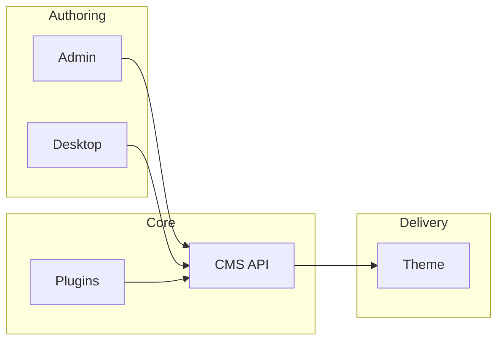

<div align="center">

<a href="https://blog.gaoredu.com" title="ReactPress">
  
</a>

<h1 align="center">ReactPress</h1>

<h3 align="center">不是 CMS，是现代开发者的发布平台。</h3>

<p align="center">
  <strong>WordPress 式编辑 · Next.js 交付 · 一条 CLI 上线。</strong><br/>
  CMS + 后台 + API + 主题 + 插件 + 桌面端 — 无需自行拼装。
</p>

<p align="center">
  <a href="#30-秒快速开始"><strong>快速开始 ↓</strong></a>
  &nbsp;·&nbsp;
  <a href="https://blog.gaoredu.com"><strong>全栈演示</strong></a>
  &nbsp;·&nbsp;
  <a href="https://reactpress-theme-starter.vercel.app"><strong>主题演示</strong></a>
  &nbsp;·&nbsp;
  <a href="https://reactpress-docs.vercel.app/"><strong>文档</strong></a>
  &nbsp;·&nbsp;
  <a href="./README.md"><strong>English</strong></a>
</p>

[](https://github.com/fecommunity/reactpress/stargazers)
[](https://www.npmjs.com/package/@fecommunity/reactpress)
[](https://github.com/fecommunity/reactpress/blob/master/LICENSE)
[](https://www.npmjs.com/package/@fecommunity/reactpress)
[](https://nodejs.org/)
[](https://reactpress-theme-starter.vercel.app)
[](https://github.com/fecommunity/reactpress/pulls)

<p>
  
  
  
  
  
</p>

<br/>

<a href="https://github.com/fecommunity/reactpress/stargazers">
  
</a>

<p><sub>如果 ReactPress 帮你省下了 CMS + API + 前台拼装的功夫 — 点个 ⭐ 能让下一位开发者更容易发现它。</sub></p>

</div>

---

## 效果预览

<div align="center">


<table>
  <tr>
    <td width="50%">
      <a href="./desktop/README.md">
        
      </a>
      <sub><b>桌面端</b> — 离线写作，同步到线上</sub>
    </td>
    <td width="50%">
      <a href="https://reactpress-theme-starter.vercel.app">
        
      </a>
      <sub><b>访客站</b> — 搜索 · 评论 · 知识库 · 深色模式</sub>
    </td>
  </tr>
</table>

<a href="https://reactpress-theme-starter.vercel.app">
  
</a>

<sub>评分来自<a href="https://reactpress-theme-starter.vercel.app">官方主题演示</a>；实际上线结果取决于托管与内容。</sub>

</div>

---

## 30 秒快速开始

```bash
npm i -g @fecommunity/reactpress@4
mkdir my-site && cd my-site
reactpress init && reactpress dev
```

**环境要求：** [Node.js 20+](https://nodejs.org/) · 推荐 [Docker](https://www.docker.com/)（内置 MySQL）

| 入口 | 地址 |
| :------ | :-- |
| **访客站** | http://localhost:3001 |
| **管理后台** | http://localhost:3000 |
| **API** | http://localhost:3002/api/health |

`reactpress doctor` 诊断环境问题 · `reactpress` 打开交互式菜单

<table align="center">
<tr>
<td align="center"><strong>约 60 秒</strong><br/><sub>init → 全栈就绪</sub></td>
<td align="center"><strong>95 / 100</strong><br/><sub>Lighthouse 性能</sub></td>
<td align="center"><strong>MIT</strong><br/><sub>可自托管</sub></td>
<td align="center"><strong>1 条 CLI</strong><br/><sub>完整平台</sub></td>
</tr>
</table>

<div align="center">

**跑通了？** [Star 本仓库](https://github.com/fecommunity/reactpress/stargazers) · [提交 Issue](https://github.com/fecommunity/reactpress/issues) · [阅读文档](https://reactpress-docs.vercel.app/)

</div>

---

## 目录

- [效果预览](#效果预览)
- [30 秒快速开始](#30-秒快速开始)
- [目录](#目录)
- [痛点](#痛点)
- [ReactPress 是什么？](#reactpress-是什么)
- [能做什么](#能做什么)
- [架构](#架构)
- [主题](#主题)
- [插件](#插件)
- [桌面优先写作](#桌面优先写作)
- [为什么选 ReactPress？](#为什么选-reactpress)
- [4.0 新特性](#40-新特性)
- [开发者](#开发者)
- [部署](#部署)
- [路线图（4.x）](#路线图4x)
- [FAQ](#faq)
- [贡献](#贡献)

---

## 痛点

现代内容系统往往逼你在几难全之间做取舍：

| 路径 | 代价 |
| :--- | :--- |
| **WordPress 式 CMS** | 编辑体验好 — 主题慢、PHP 栈耦合 |
| **静态站点生成器** | 极快 — 非开发者没有像样的 CMS |
| **Headless CMS**（Strapi、Payload） | API 灵活 — 后台、前台、部署仍要自行拼装 |

> **前端团队值得拥有一个发布平台 — 而不是五个仓库硬接在一起。**

```
以前                              用 ReactPress
────                              ─────────────
选 CMS 后端                  →    reactpress init
配 API                       →    reactpress dev
做或买管理后台               →    在 Admin 写作 (:3000)
搭前台                       →    访客看 Theme (:3001)
接部署                       →    reactpress build && start
```

---

## ReactPress 是什么？

ReactPress 是 **为 React 时代打造的全栈发布平台** — 不是又一个需要你自己接线的 Headless 后端。

一条 CLI，全部包含：

| 层级 | 你得到什么 |
| :---- | :----------- |
| **CMS** | WordPress 式编辑 — 文章、页面、媒体、分类 |
| **API** | Headless REST — React 优先、Swagger 文档 |
| **Admin** | Web 写作界面 — 无需另建后台 |
| **Themes** | 可 npm 安装的 Next.js 前台 — 可替换 |
| **Plugins** | 基于 Hook 的扩展 — SEO、摘要、图片优化 |
| **Desktop** | 本地优先写作 — SQLite、离线、可同步线上 |

> 内容归系统管，前台归开发者管。**它不是 CMS — 它是发布平台。**

---

## 能做什么

| 场景 | 为什么适合 |
| :------- | :------------------ |
| 个人博客 | 后台写作 + Lighthouse 级 Next.js 主题 |
| 开发者文档与知识库 | 官方主题 + API 内置 |
| SaaS 营销站 | Headless API + 自定义 Next.js 前台 |
| 多编辑团队 | Web 后台给作者，主题仓库给工程师 |
| 离线优先工作流 | 桌面端 SQLite，就绪后同步 |

---

## 架构


```mermaid
flowchart LR
  subgraph Authoring
    Admin["Admin"]
    Desktop["Desktop"]
  end
  subgraph Core
    API["CMS API"]
    Plugins["Plugins"]
  end
  subgraph Delivery
    Theme["Theme"]
  end
  Admin --> API
  Desktop --> API
  Plugins --> API
  API --> Theme
```

```
CMS Core     → 内容、媒体、设置              (NestJS)
Admin UI     → 写作体验                      (React + Vite)
API Layer    → Headless 访问                  (REST + Swagger)
Theme System → 访客前台                       (Next.js, npm)
Plugin System→ 扩展能力                       (hooks + Admin 插槽)
Desktop App  → 离线写作                       (Electron + SQLite)
```

---

## 主题

主题是完全可替换的 Next.js 前台 — 不绑定核心。

```bash
reactpress theme add @fecommunity/reactpress-theme-starter
reactpress dev
```

无需后端即可预览：

```bash
npx create-next-app@latest my-blog --example "https://github.com/fecommunity/reactpress-theme-starter" --use-pnpm
cd my-blog && pnpm dev:mock
```

**在线演示：** [reactpress-theme-starter.vercel.app](https://reactpress-theme-starter.vercel.app) · [](https://vercel.com/new/clone?repository-url=https://github.com/fecommunity/reactpress-theme-starter)

---

## 插件

扩展核心，无需改源码。

```bash
reactpress plugin install seo
reactpress plugin install hello-world   # 发布时自动生成摘要
reactpress plugin install image-optimizer
```

| 插件 | 能力 |
| :----- | :--------- |
| `seo` | Slug、关键词、meta 描述 + Admin 编辑器插槽 |
| `hello-world` | 自动生成文章摘要 |
| `image-optimizer` | 媒体库批量 WebP 优化 |

开发指南：[plugins/README.md](./plugins/README.md)

---

## 桌面优先写作

离线写作，就绪后同步。无需 Docker。

```bash
pnpm dev:desktop       # monorepo 根目录
pnpm build:desktop     # 打包安装程序
```

SQLite 本地存储 · 离线编辑 · 可选同步远程 CMS · [desktop/README.md](./desktop/README.md)

---

## 为什么选 ReactPress？

| | ReactPress | WordPress | 静态站 | Headless CMS |
| :-: | :--- | :--- | :--- | :--- |
| **编辑体验** | 有 | 有 | 无 | 部分 |
| **前台自由度** | 有 | 无 | 仅构建时 | 有 |
| **开箱完整系统** | 有 | 靠插件 | 无 | 无 |
| **上手时间** | 约 1 分钟 | 数小时 | 单站快 | 搭建 + 拼装 |
| **本地 / 离线写作** | 桌面端 | 无 | 无 | 无 |
| **Lighthouse 性能** | 95² | 看主题 | 优秀 | 看前台 |

**对比 WordPress** — 同样的后台工作流，现代化 Next.js 交付，无 PHP 主题臃肿。

**对比静态生成器** — 保留速度，补上真正的 CMS。

**对比 Strapi / Payload** — 它们只 ship 后端；ReactPress ship **完整发布平台**。

² [官方主题演示](https://reactpress-theme-starter.vercel.app)

---

## 4.0 新特性

代号 **Extend** — 插件、桌面端、npm 主题。仍是 **一条 CLI、一套 Admin**。

```bash
npm i -g @fecommunity/reactpress@4
```

[4.0 指南](./docs/tutorial/tutorial-extras/reactpress-4-0.md) · [从 3.x 迁移](./docs/tutorial/tutorial-extras/migration-3-to-4.md)

---

## 开发者

默认 Headless，任意前台通过 REST 接入。

```bash
curl -H "X-API-Key: YOUR_KEY" \
  "http://localhost:3002/api/article/headless/list?status=publish&page=1&pageSize=10"
```

| 资源 | 链接 |
| :------- | :--- |
| Swagger | http://localhost:3002/api |
| 主题开发 | [themes/README.md](./themes/README.md) |
| 插件开发 | [plugins/README.md](./plugins/README.md) |
| 官方 Starter | [reactpress-theme-starter](https://github.com/fecommunity/reactpress-theme-starter) |

<details>
<summary><strong>命令与端口</strong></summary>

| 命令 | 作用 |
| :------ | :----- |
| `reactpress init` | 新建站点 |
| `reactpress dev` | 启动 API、后台与主题 |
| `reactpress build` / `start` | 生产环境 |
| `reactpress theme add <pkg>` | 安装主题 |
| `reactpress plugin install <id>` | 安装插件 |

| 服务 | 端口 |
| :------ | :---: |
| Admin | 3000 |
| 访客站 | 3001 |
| API | 3002 |
| 主题预览 | 3003 |

</details>

---

## 部署

```bash
reactpress build && reactpress start
```

Docker、PM2、备份：[完整文档](https://reactpress-docs.vercel.app/)。仅部署访客站：部署 [reactpress-theme-starter](https://github.com/fecommunity/reactpress-theme-starter) 并指向你的 API。

---

## 路线图（4.x）

- 插件 npm 目录 · `reactpress plugin create`
- 桌面端自动更新、托盘、快捷键
- `reactpress theme create` 脚手架
- 主题与插件市场

---

## FAQ

<details>
<summary><strong>需要 Docker 吗？</strong></summary>

内置 MySQL 推荐使用。桌面端用 SQLite，无需 Docker。

</details>

<details>
<summary><strong>能用自己的前台吗？</strong></summary>

可以 — Headless REST API + API Key。Fork [官方 starter](https://github.com/fecommunity/reactpress-theme-starter) 或对接 `/api/article`、`/api/page` 等接口。

</details>

<details>
<summary><strong>和 WordPress 有什么不同？</strong></summary>

同样是后台驱动的工作流，但默认主题更快、Headless 路径更干净，现代 React/Next.js 前台无需插件堆叠。

</details>

<details>
<summary><strong>4.0 能用于生产吗？</strong></summary>

4.0 为 beta（`4.0.0-beta.3`）。3.x 核心已久经考验 — 生产升级前请阅读[迁移指南](./docs/tutorial/tutorial-extras/migration-3-to-4.md)。

</details>

<details>
<summary><strong>WordPress 替代？Headless CMS？Next.js 博客？</strong></summary>

都可以 — ReactPress 同时覆盖：自托管 WordPress 式编辑、供自定义前台的 Headless REST，以及 Lighthouse 95 的官方 Next.js 主题。

</details>

---

## 贡献

[贡献指南](./CONTRIBUTING.md) · [行为准则](./CODE_OF_CONDUCT.md) · [安全策略](./SECURITY.md)

[Issues](https://github.com/fecommunity/reactpress/issues) · [Pull requests](https://github.com/fecommunity/reactpress/pulls)

<table>
  <tbody>
    <tr>
      <td align="center" width="12.5%"><a href="https://github.com/fecommunity"><br/><sub><b>FECommunity</b></sub></a></td>
      <td align="center" width="12.5%"><a href="https://github.com/want2sleeep"><br/><sub><b>SleepSheep</b></sub></a></td>
      <td align="center" width="12.5%"><a href="https://github.com/fantasticit"><br/><sub><b>fantasticit</b></sub></a></td>
      <td align="center" width="12.5%"><a href="https://github.com/chenbo29"><br/><sub><b>chenbo29</b></sub></a></td>
      <td align="center" width="12.5%"><a href="https://github.com/redteav2"><br/><sub><b>redteav2</b></sub></a></td>
      <td align="center" width="12.5%"><a href="https://github.com/trashken"><br/><sub><b>trashken</b></sub></a></td>
      <td align="center" width="12.5%"><a href="https://github.com/franz007"><br/><sub><b>franz007</b></sub></a></td>
      <td align="center" width="12.5%"><a href="https://github.com/funtime1"><br/><sub><b>funtime1</b></sub></a></td>
    </tr>
    <tr>
      <td align="center" width="12.5%"><a href="https://github.com/scottdeift"><br/><sub><b>scottdeift</b></sub></a></td>
      <td align="center" width="12.5%"><a href="https://github.com/TwoDollars666"><br/><sub><b>TwoDollars666</b></sub></a></td>
      <td align="center" width="12.5%"><a href="https://github.com/Xiaonan2020"><br/><sub><b>Xiaonan2020</b></sub></a></td>
      <td align="center" width="12.5%"><a href="https://github.com/gaoredu"><br/><sub><b>redtea</b></sub></a></td>
      <td align="center" width="12.5%"><a href="https://github.com/fecommunity"><br/><sub><b>m0_37981569</b></sub></a></td>
      <td align="center" width="12.5%"><a href="https://github.com/lsr365400"><br/><sub><b>lsr365400</b></sub></a></td>
    </tr>
  </tbody>
</table>

---

<div align="center">

**MIT License** · © ReactPress / FECommunity

<br/>

<a href="https://github.com/fecommunity/reactpress/stargazers">
  
</a>

<p><sub>不是 CMS，是现代开发者的发布平台。<br/>帮助更多开发者发现它 — 欢迎在 GitHub 上 ⭐。</sub></p>

<br/>

[](https://star-history.com/#fecommunity/reactpress&Date)

</div>
