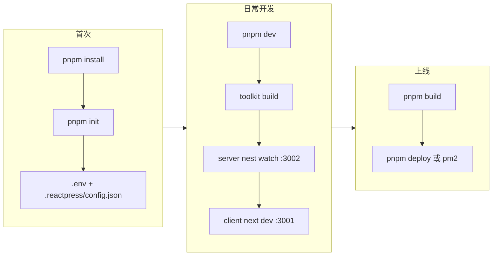

<div align="center">
  <a href="https://blog.gaoredu.com" title="ReactPress">
    
  </a>

  <p align="center">
    <strong>现代化发布平台 — 约一分钟即可上线</strong><br />
    全局安装一个包，两条命令，站点、管理端与 API 即可就绪。
  </p>

[](https://github.com/fecommunity/reactpress/blob/master/LICENSE)
[](https://www.npmjs.com/package/@fecommunity/reactpress)
[](https://github.com/fecommunity/reactpress/pulls)
[](http://www.typescriptlang.org/)
[](https://github.com/fecommunity/reactpress/actions/workflows/npm-publish.yml)

  <p>
    <a href="https://github.com/fecommunity/reactpress/issues">报告错误</a>
    ·
    <a href="https://github.com/fecommunity/reactpress/issues">请求功能</a>
    ·
    <a href="./README.md">English Documentation</a>
    ·
    <a href="https://blog.gaoredu.com">在线演示</a>
    ·
    <a href="https://github.com/fecommunity/reactpress-theme-starter">官方主题</a>
  </p>
</div>

---

## 目录

- [什么是 ReactPress？](#什么是-reactpress)
- [快速开始](#快速开始)
- [演示](#演示)
- [核心亮点](#核心亮点)
- [CLI 命令](#cli-命令)
- [官方主题](#官方主题)
- [仓库结构](#仓库结构)
- [本地研发](#本地研发)
- [配置](#配置)
- [部署](#部署)
- [贡献](#贡献)

---

## 什么是 ReactPress？

**ReactPress 3.0** 是基于 React、Next.js 与 NestJS 的现代化全栈发布平台。安装 CLI 后执行 `init` 与 `dev`，即可获得前台站点、管理后台与 API，无需手写复杂配置或手动接数据库。

> **一个内容中心，多种呈现方式。** 在同一后台发布内容，通过 Web、管理端或自建应用（API）展示。

<div align="center">


</div>

[3.0 文档](./docs/tutorial/tutorial-extras/reactpress-3-0.md) · [从 2.x 升级](./docs/migration-2-to-3.md)

---

## 快速开始

### 环境要求

| 项目 | 说明 |
| :--- | :--- |
| **Node.js ≥ 18** | 运行 CLI 必需 |
| **Docker** | 推荐 — 默认通过容器启动 MySQL |
| **MySQL** | 可选 — 可改用自有数据库实例 |
| **pnpm** | 仅在本仓库内开发时需要 |

### 终端用户（推荐）

```bash
npm i -g @fecommunity/reactpress@3
mkdir my-blog && cd my-blog
reactpress init
reactpress dev
```

`dev` 启动成功后，按终端提示打开：

| 服务 | 典型地址 |
| :--- | :--- |
| 前台站点 | `http://localhost:3001` |
| 管理后台 | `http://localhost:3001/admin` |
| API 健康检查 | `http://localhost:3002/api/health` |

**常用技巧：** 无参数运行 `reactpress` 进入交互菜单；异常时用 `reactpress doctor`、`reactpress status` 排查。

### 本仓库开发（Monorepo）

```bash
pnpm install
pnpm run dev    # 自动 init + Docker MySQL + toolkit + API (3002) + 前端 (3001)
```

| 命令 | 说明 |
| :--- | :--- |
| `pnpm dev` | 一键本地全栈（推荐） |
| `pnpm dev:api` | 仅 API |
| `pnpm dev:client` | 仅 Next.js 前端 |
| `pnpm build` | 生产构建：toolkit → server → client |
| `pnpm start` | 生产模式同时起 API + 前端 |
| `pnpm run status` | 查看 API 进程与 HTTP 健康 |

---

## 演示


| 安装向导 | 管理后台 | 演示站点 |
| :---: | :---: | :---: |
| [](https://blog.gaoredu.com) | [](https://blog.gaoredu.com) | [](https://reactpress-theme-starter.vercel.app) |

---

## 核心亮点

| 方向 | 说明 |
| :--- | :--- |
| **快速起站** | `init` + `dev`，引导式安装，自动数据库与模式迁移 |
| **内容管理** | 文章、页面、媒体库、站点设置；类 WordPress 安装向导 |
| **个性化** | [官方主题 Starter](https://github.com/fecommunity/reactpress-theme-starter)，亮/暗模式 |
| **灵活架构** | 一体化本地开发、Headless（`--api-only`）、生产部署 |
| **开发体验** | 交互菜单、`doctor`、`status`、dev 成功后的链接提示 |

**技术栈概览：** 前端 React 17 + Next.js 12；后端 NestJS 6 + TypeORM + MySQL；UI 为 Ant Design v5；Monorepo + TypeScript 全栈类型安全。

| | 传统 CMS | 静态站点生成器 | **ReactPress** |
| :--- | :--- | :--- | :--- |
| **上手成本** | 服务器、插件、手工配置 | 每个站点独立仓库与构建 | **一条 CLI，约 1 分钟可用 CMS** |
| **内容工作流** | 后台 + 耦合主题 | Git 中的 Markdown | **后台 + 可选代码优先流程** |
| **前端自由度** | 主题/插件生态 | 构建时固定 | **内容中心解耦，前端自选** |
| **适用场景** | 通用博客与企业站 | 文档与营销页 | **博客、多站点内容、定制发布流程** |

---

## CLI 命令

```bash
npm i -g @fecommunity/reactpress@3
```

| 命令 | 说明 |
| :--- | :--- |
| `reactpress` | 交互式菜单 |
| `reactpress init` | 初始化项目（生成配置与 `.env`） |
| `reactpress dev` | 本地全栈开发 |
| `reactpress dev --api-only` | 仅 API（Headless） |
| `reactpress doctor` | 环境诊断 |
| `reactpress status` | 运行状态 |
| `reactpress build` | 生产构建 |
| `reactpress start` | 启动生产构建 |

本仓贡献者：`pnpm dev` 行为与 `reactpress dev` 等价。更多见 [配置说明](./docs/tutorial/tutorial-extras/config-intro.md)。

---

## 官方主题

推荐的访客站前端是 **[reactpress-theme-starter](https://github.com/fecommunity/reactpress-theme-starter)** — Next.js 15 · React 19 · Tailwind CSS 4 · App Router。内置文章、归档、搜索、知识库、评论、RSS/站点地图，以及 Mock API 离线开发模式。

[](https://reactpress-theme-starter.vercel.app)

[在线演示](https://reactpress-theme-starter.vercel.app) · [源码与文档](https://github.com/fecommunity/reactpress-theme-starter)

```text
ReactPress API  ──REST──▶  Theme Starter (Next.js)  ──▶  访客站
```

### 60 秒预览（无需后台）

**方式 A — `create-next-app`（推荐）**

```bash
npx create-next-app@latest my-blog --example "https://github.com/fecommunity/reactpress-theme-starter" --use-pnpm
cd my-blog
pnpm dev:mock
```

**方式 B — 手动克隆**

```bash
git clone https://github.com/fecommunity/reactpress-theme-starter.git
cd reactpress-theme-starter
pnpm install
pnpm dev:mock
```

浏览器打开 **http://localhost:3001** — 与 [在线演示](https://reactpress-theme-starter.vercel.app) 相同模式。

[](https://vercel.com/new/clone?repository-url=https://github.com/fecommunity/reactpress-theme-starter)

### 对接 ReactPress API

1. 启动 API：`reactpress dev --api-only`（或完整全栈）。
2. 在主题目录复制 `.env.example` 为 `.env`，运行 `pnpm dev`。

命令、环境变量与生产部署详见 [主题 Starter README](https://github.com/fecommunity/reactpress-theme-starter/blob/master/README_zh.md)。

### 经典主题（Monorepo 内）

旧版 Pages Router 主题保留在 [`themes/`](./themes/)（`hello-world`、`twentytwentyfive`、`twentytwentysix`），供参考与兼容。主题清单 Schema：[`theme.manifest.schema.json`](./themes/theme.manifest.schema.json)。

---

## 仓库结构

| 包 / 目录 | 说明 |
| :--- | :--- |
| [`@fecommunity/reactpress`](./cli) | **3.0 主包** — 全局命令 `reactpress`，内置 API |
| [`@fecommunity/reactpress-client`](./client) | 进阶：仅部署前台 |
| [`@fecommunity/reactpress-toolkit`](./toolkit) | OpenAPI 生成的 API SDK |
| [`themes/`](./themes/) | 经典 Pages Router 主题（参考） |
| [reactpress-theme-starter](https://github.com/fecommunity/reactpress-theme-starter) | **推荐** — 官方 Next.js 15 App Router 主题 |

`@fecommunity/reactpress-server` 与 `@fecommunity/reactpress-cli` 已弃用，请使用主包内置 API。

---

## 本地研发


```mermaid
flowchart LR
  subgraph init [首次]
    A[pnpm install] --> B[pnpm init]
    B --> C[.env + .reactpress/config.json]
  end
  subgraph dev [日常开发]
    D[pnpm dev] --> E[toolkit build]
    E --> F[server nest watch :3002]
    F --> G[client next dev :3001]
  end
  subgraph ship [上线]
    H[pnpm build] --> I[pnpm deploy 或 pm2]
  end
  init --> dev
  dev --> ship
```

**修改 API 后同步前端类型：**

```bash
pnpm run generate:swagger
pnpm run build:toolkit
```

**Docker 本地（MySQL + 反向代理）：**

```bash
pnpm docker:dev:start    # MySQL :3306，入口 http://localhost:8080
pnpm docker:dev:stop
```

---

## 配置

3.0 以 **`.reactpress/config.json`** 为准，`.env` 由 CLI 在 `init` 时同步生成，一般无需手改。详见 [配置说明](./docs/tutorial/tutorial-extras/config-intro.md)。

---

## 部署

### Vercel（一键）

[](https://vercel.com/new/clone?repository-url=https://github.com/fecommunity/reactpress)

### PM2（自托管推荐）

```bash
pnpm install
pnpm run build
pnpm run pm2
pm2 save
```

或使用：`sh scripts/deploy.sh`

### 传统进程方式

```bash
pnpm run build
pnpm run start
```

### Docker 生产

```bash
pnpm run build
pnpm run start:api
docker compose -f docker-compose.prod.yml up -d
```

终端用户也可：`reactpress build` → `reactpress start`。

---

## 贡献

**衷心感谢**每一位帮助 ReactPress 成长的朋友。

<table>
  <tbody>
    <tr>
      <td align="center" width="12.5%"><a href="https://github.com/fecommunity"><br/><sub><b>FECommunity</b></sub></a></td>
      <td align="center" width="12.5%"><a href="https://github.com/want2sleeep"><br/><sub><b>SleepSheep</b></sub></a></td>
      <td align="center" width="12.5%"><a href="https://github.com/fantasticit"><br/><sub><b>fantasticit</b></sub></a></td>
      <td align="center" width="12.5%"><a href="https://github.com/chenbo29"><br/><sub><b>chenbo29</b></sub></a></td>
      <td align="center" width="12.5%"><a href="https://github.com/redteav2"><br/><sub><b>redteav2</b></sub></a></td>
      <td align="center" width="12.5%"><a href="https://github.com/trashken"><br/><sub><b>trashken</b></sub></a></td>
      <td align="center" width="12.5%"><a href="https://github.com/franz007"><br/><sub><b>franz007</b></sub></a></td>
      <td align="center" width="12.5%"><a href="https://github.com/funtime1"><br/><sub><b>funtime1</b></sub></a></td>
    </tr>
    <tr>
      <td align="center" width="12.5%"><a href="https://github.com/scottdeift"><br/><sub><b>scottdeift</b></sub></a></td>
      <td align="center" width="12.5%"><a href="https://github.com/TwoDollars666"><br/><sub><b>TwoDollars666</b></sub></a></td>
      <td align="center" width="12.5%"><a href="https://github.com/Xiaonan2020"><br/><sub><b>Xiaonan2020</b></sub></a></td>
      <td align="center" width="12.5%"><a href="https://github.com/gaoredu"><br/><sub><b>redtea</b></sub></a></td>
      <td align="center" width="12.5%"><a href="https://github.com/fecommunity"><br/><sub><b>m0_37981569</b></sub></a></td>
      <td align="center" width="12.5%"></td>
      <td align="center" width="12.5%"></td>
      <td align="center" width="12.5%"></td>
    </tr>
  </tbody>
</table>

1. Fork 仓库并克隆到本地
2. `pnpm install`
3. `pnpm run dev`

详见[贡献指南](https://github.com/fecommunity/reactpress/blob/master/CONTRIBUTING.md)。维护者发布 npm 包：`pnpm login` → `pnpm run release`。

---

## 致谢

ReactPress 受益于 [Next.js](https://github.com/vercel/next.js)、[NestJS](https://github.com/nestjs/nest)、[Ant Design](https://github.com/ant-design/ant-design) 与 [TypeORM](https://github.com/typeorm/typeorm) 等优秀开源项目。

---

## Star 历史

[](https://star-history.com/#fecommunity/reactpress&Date)
