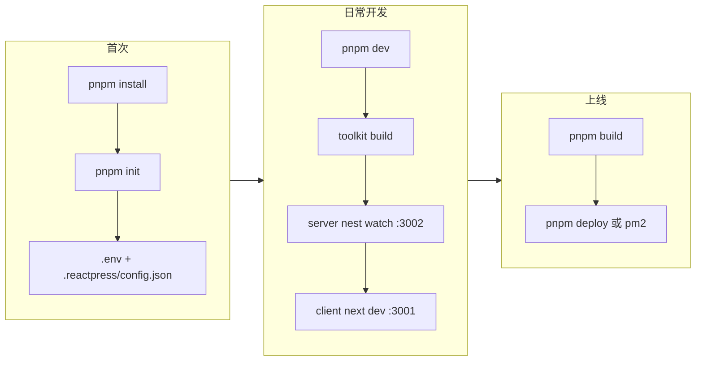

<div align="center">
  <a href="https://blog.gaoredu.com" title="ReactPress">
    
  </a>

  <p align="center">
    <strong>现代化发布平台 — 约一分钟即可上线</strong><br />
    一条 CLI · 全栈 CMS · Headless 主题 · 开箱即用的生产级性能
  </p>

[](https://github.com/fecommunity/reactpress/blob/master/LICENSE)
[](https://www.npmjs.com/package/@fecommunity/reactpress)
[](https://github.com/fecommunity/reactpress/pulls)
[](https://reactpress-theme-starter.vercel.app)
[](https://reactpress-theme-starter.vercel.app)
[](http://www.typescriptlang.org/)
[](https://github.com/fecommunity/reactpress/actions/workflows/npm-publish.yml)

  <p>
    <a href="https://github.com/fecommunity/reactpress/issues">报告错误</a>
    ·
    <a href="https://github.com/fecommunity/reactpress/issues">请求功能</a>
    ·
    <a href="./README.md">English Documentation</a>
    ·
    <a href="https://blog.gaoredu.com">在线演示</a>
    ·
    <a href="https://github.com/fecommunity/reactpress-theme-starter">官方主题</a>
  </p>
</div>

---

## 目录

- [什么是 ReactPress？](#什么是-reactpress)
- [为什么选择 ReactPress？](#为什么选择-reactpress)
- [快速开始](#快速开始)
- [演示](#演示)
- [CLI 命令](#cli-命令)
- [官方主题](#官方主题)
- [仓库结构](#仓库结构)
- [本地研发](#本地研发)
- [配置](#配置)
- [部署](#部署)
- [贡献](#贡献)

---

## 什么是 ReactPress？

**ReactPress 3.0** 是现代化全栈发布平台 — CMS、管理后台、REST API 与主题生态一体。执行 `init` + `dev`，约一分钟即可获得可用站点，无需手写复杂配置或手动接数据库。

> **一个内容中心，多种呈现方式。** 在后台统一发布，通过 Web、管理端或任意 Headless 前端（API）展示。

<div align="center">


</div>

[3.0 文档](./docs/tutorial/tutorial-extras/reactpress-3-0.md) · [从 2.x 升级](./docs/migration-2-to-3.md)

---

## 为什么选择 ReactPress？

ReactPress 将 **WordPress 式内容工作流** 与 **React / Next.js 前端栈** 结合 — 熟悉的发布体验，现代化的 Web 性能。

### Lighthouse — 为速度与搜索优化

官方 [主题 Starter](https://github.com/fecommunity/reactpress-theme-starter) 在 Google Lighthouse 中接近满分（基于 [在线演示](https://reactpress-theme-starter.vercel.app) 实测）：

<div align="center">

<a href="https://reactpress-theme-starter.vercel.app">
  
</a>

</div>

| 维度 | 得分 | 关键指标 |
| :--- | ---: | :--- |
| **性能 Performance** | 95 | FCP **0.4 s** · LCP **1.0 s** · Speed Index **1.1 s** · CLS **0** |
| **无障碍 Accessibility** | 100 | 语义化 markup、键盘友好 |
| **最佳实践 Best Practices** | 100 | HTTPS、现代 API、安全默认值 |
| **SEO** | 100 | SSR、站点地图、RSS、Open Graph — 开箱即用 |

无需插件堆砌，无需手工调优 — 上线即快、即可被搜索。

### 与其他方案对比

| | 传统 CMS | 静态站点生成器 | **ReactPress** |
| :--- | :--- | :--- | :--- |
| **首站上线** | 服务器 + 插件 + 手工配置 | 每个站点独立仓库与构建 | **`init` + `dev`，约 1 分钟** |
| **内容工作流** | 后台 + 耦合主题 | Git 中的 Markdown | **后台 + 可选代码优先** |
| **前端自由度** | 主题/插件锁定 | 构建时固定 | **Headless API + 自选主题** |
| **性能与 SEO** | 依赖插件与托管 | 优秀，但无 CMS | **官方主题 Lighthouse 95/100/100/100** |
| **适用场景** | 通用博客与企业站 | 文档与营销页 | **博客、多站点内容、定制发布** |

| 能力 | 说明 |
| :--- | :--- |
| **快速起站** | 引导式 `init`、自动数据库、Docker MySQL、启动后打印访问链接 |
| **内容管理** | 文章、页面、媒体、分类、标签、站点设置 |
| **Headless 就绪** | REST API + [`@fecommunity/reactpress-toolkit`](./toolkit) 对接任意前端 |
| **官方主题** | [reactpress-theme-starter](https://github.com/fecommunity/reactpress-theme-starter) — Next.js 15、Mock 模式、知识库、评论 |
| **开发体验** | 交互式 CLI、`doctor`、`status`、TypeScript Monorepo |

**技术栈：** 前端 React + Next.js；后端 NestJS + TypeORM + MySQL；UI 为 Ant Design v5。

---

## 快速开始

### 环境要求

| 项目 | 说明 |
| :--- | :--- |
| **Node.js ≥ 18** | 运行 CLI 必需 |
| **Docker** | 推荐 — 默认通过容器启动 MySQL |
| **MySQL** | 可选 — 可改用自有数据库实例 |
| **pnpm** | 仅在本仓库内开发时需要 |

### 终端用户（推荐）

```bash
npm i -g @fecommunity/reactpress@3
mkdir my-blog && cd my-blog
reactpress init
reactpress dev
```

| 服务 | 典型地址 |
| :--- | :--- |
| 前台站点 | `http://localhost:3001` |
| 管理后台 | `http://localhost:3001/admin` |
| API 健康检查 | `http://localhost:3002/api/health` |

**常用技巧：** 无参数运行 `reactpress` 进入交互菜单；异常时用 `reactpress doctor`、`reactpress status` 排查。

### 本仓库开发（Monorepo）

```bash
pnpm install
pnpm run dev
```

| 命令 | 说明 |
| :--- | :--- |
| `pnpm dev` | 一键本地全栈（推荐） |
| `pnpm dev:api` | 仅 API |
| `pnpm dev:client` | 仅 Next.js 前端 |
| `pnpm build` | 生产构建：toolkit → server → client |
| `pnpm start` | 生产模式同时起 API + 前端 |

---

## 演示

<div align="center">


</div>

| 管理后台 | 演示站点 |
| :------: | :------: |
| [](https://blog.gaoredu.com) | [](https://blog.gaoredu.com) |

---

## CLI 命令

```bash
npm i -g @fecommunity/reactpress@3
```

| 命令 | 说明 |
| :--- | :--- |
| `reactpress` | 交互式菜单 |
| `reactpress init` | 初始化项目 |
| `reactpress dev` | 本地全栈开发 |
| `reactpress dev --api-only` | 仅 API，配合自定义主题 |
| `reactpress doctor` | 环境诊断 |
| `reactpress status` | 运行状态 |
| `reactpress build` / `start` | 生产构建与启动 |

更多见 [配置说明](./docs/tutorial/tutorial-extras/config-intro.md)。

---

## 官方主题

推荐访客站前端：**[reactpress-theme-starter](https://github.com/fecommunity/reactpress-theme-starter)** — Next.js 15 · React 19 · Tailwind CSS 4 · App Router。

<div align="center">

<a href="https://reactpress-theme-starter.vercel.app">
  
</a>

<p>
  <a href="https://reactpress-theme-starter.vercel.app"><strong>在线演示</strong></a>
  ·
  <a href="https://github.com/fecommunity/reactpress-theme-starter"><strong>源码与文档</strong></a>
</p>

</div>

```text
ReactPress API  ──REST──▶  Theme Starter (Next.js)  ──▶  访客站
```

### 60 秒预览（无需后台）

```bash
npx create-next-app@latest my-blog --example "https://github.com/fecommunity/reactpress-theme-starter" --use-pnpm
cd my-blog
pnpm dev:mock
```

[](https://vercel.com/new/clone?repository-url=https://github.com/fecommunity/reactpress-theme-starter)

### 对接 ReactPress API

1. 启动 API：`reactpress dev --api-only`（或完整全栈）。
2. 主题目录：`cp .env.example .env` → `pnpm dev`。

详见 [主题 Starter README](https://github.com/fecommunity/reactpress-theme-starter/blob/master/README_zh.md)。

---

## 仓库结构

| 包 / 目录 | 说明 |
| :--- | :--- |
| [`@fecommunity/reactpress`](./cli) | **3.0 主包** — 全局命令 `reactpress`，内置 API |
| [`@fecommunity/reactpress-client`](./client) | 进阶：仅部署前台 |
| [`@fecommunity/reactpress-toolkit`](./toolkit) | OpenAPI 生成的 API SDK |
| [`themes/`](./themes/) | 经典 Pages Router 主题（参考） |
| [reactpress-theme-starter](https://github.com/fecommunity/reactpress-theme-starter) | **推荐** — 官方 Next.js 15 App Router 主题 |

---

## 本地研发


```mermaid
flowchart LR
  subgraph init [首次]
    A[pnpm install] --> B[pnpm init]
    B --> C[.env + .reactpress/config.json]
  end
  subgraph dev [日常开发]
    D[pnpm dev] --> E[toolkit build]
    E --> F[server nest watch :3002]
    F --> G[client next dev :3001]
  end
  subgraph ship [上线]
    H[pnpm build] --> I[pnpm deploy 或 pm2]
  end
  init --> dev
  dev --> ship
```

**修改 API 后同步前端类型：** `pnpm run generate:swagger` → `pnpm run build:toolkit`

**Docker 本地：** `pnpm docker:dev:start` / `pnpm docker:dev:stop`

---

## 配置

3.0 以 **`.reactpress/config.json`** 为准，`.env` 由 CLI 在 `init` 时同步生成。详见 [配置说明](./docs/tutorial/tutorial-extras/config-intro.md)。

---

## 部署

[](https://vercel.com/new/clone?repository-url=https://github.com/fecommunity/reactpress)

```bash
pnpm install && pnpm run build && pnpm run pm2   # 自托管
# 或
reactpress build && reactpress start             # 全局 CLI
```

---

## 贡献

**衷心感谢**每一位帮助 ReactPress 成长的朋友。

<table>
  <tbody>
    <tr>
      <td align="center" width="12.5%"><a href="https://github.com/fecommunity"><br/><sub><b>FECommunity</b></sub></a></td>
      <td align="center" width="12.5%"><a href="https://github.com/want2sleeep"><br/><sub><b>SleepSheep</b></sub></a></td>
      <td align="center" width="12.5%"><a href="https://github.com/fantasticit"><br/><sub><b>fantasticit</b></sub></a></td>
      <td align="center" width="12.5%"><a href="https://github.com/chenbo29"><br/><sub><b>chenbo29</b></sub></a></td>
      <td align="center" width="12.5%"><a href="https://github.com/redteav2"><br/><sub><b>redteav2</b></sub></a></td>
      <td align="center" width="12.5%"><a href="https://github.com/trashken"><br/><sub><b>trashken</b></sub></a></td>
      <td align="center" width="12.5%"><a href="https://github.com/franz007"><br/><sub><b>franz007</b></sub></a></td>
      <td align="center" width="12.5%"><a href="https://github.com/funtime1"><br/><sub><b>funtime1</b></sub></a></td>
    </tr>
    <tr>
      <td align="center" width="12.5%"><a href="https://github.com/scottdeift"><br/><sub><b>scottdeift</b></sub></a></td>
      <td align="center" width="12.5%"><a href="https://github.com/TwoDollars666"><br/><sub><b>TwoDollars666</b></sub></a></td>
      <td align="center" width="12.5%"><a href="https://github.com/Xiaonan2020"><br/><sub><b>Xiaonan2020</b></sub></a></td>
      <td align="center" width="12.5%"><a href="https://github.com/gaoredu"><br/><sub><b>redtea</b></sub></a></td>
      <td align="center" width="12.5%"><a href="https://github.com/fecommunity"><br/><sub><b>m0_37981569</b></sub></a></td>
    </tr>
  </tbody>
</table>

1. Fork 仓库并克隆到本地
2. `pnpm install`
3. `pnpm run dev`

详见[贡献指南](https://github.com/fecommunity/reactpress/blob/master/CONTRIBUTING.md)。

---

## 致谢

ReactPress 受益于 [Next.js](https://github.com/vercel/next.js)、[NestJS](https://github.com/nestjs/nest)、[Ant Design](https://github.com/ant-design/ant-design) 与 [TypeORM](https://github.com/typeorm/typeorm) 等优秀开源项目。

---

## Star 历史

[](https://star-history.com/#fecommunity/reactpress&Date)
