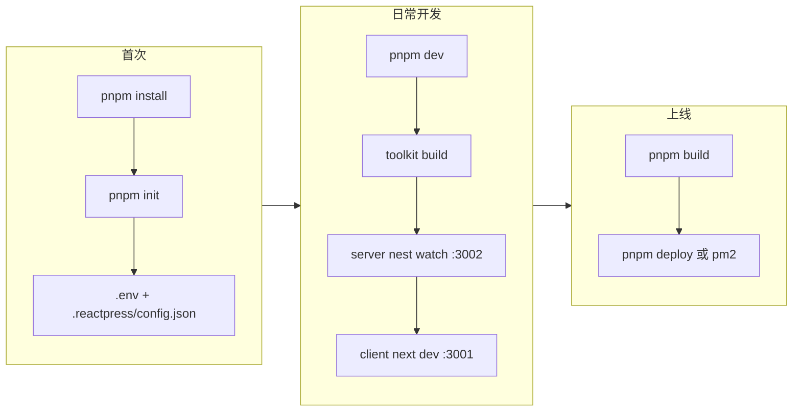

<div align="center">
  <a href="https://gaoredu.com" title="ReactPress">
    
  </a>

  <h1>ReactPress 3.0</h1>

  <p align="center">
    <em>基于 React、Next.js 和 NestJS 构建的现代化全栈发布平台</em>
  </p>

  [](https://github.com/fecommunity/reactpress/blob/master/LICENSE)
  [](https://www.npmjs.com/package/@fecommunity/reactpress)
  [](https://github.com/fecommunity/reactpress/pulls)
  [](http://www.typescriptlang.org/)
  [](https://nextjs.org/)
  [](https://nestjs.com/)
  [](https://vercel.com/new/clone?repository-url=https://github.com/fecommunity/reactpress)
  [](https://github.com/fecommunity/reactpress/actions/workflows/npm-publish.yml)

  <p>
    <a href="https://github.com/fecommunity/reactpress/issues">报告错误</a>
    ·
    <a href="https://github.com/fecommunity/reactpress/issues">请求功能</a>
    ·
    <a href="./README.md">English Documentation</a>
  </p>
</div>

## 🌟 现代化发布平台

**ReactPress 3.0** 是一个现代化的全栈发布平台：装一个包、敲一条命令，一分钟拥有自己的 CMS。

[](https://gaoredu.com)

## ✨ 3.0 新特性

| 重点 | 说明 |
|------|------|
| **零配置** | `init` + `dev`，默认 Docker MySQL，无需手写 `.env` |
| **唯一入口** | `npm i -g @fecommunity/reactpress@3`，命令统一 `reactpress` |
| **极致 DX** | 交互菜单、`doctor`、`status`、dev 成功链接提示 |

[3.0 文档](./docs/tutorial/tutorial-extras/reactpress-3-0.md) · [2.x 迁移](./docs/migration-2-to-3.md)

## ✨ 主要特性

### ⚡ 一分钟零配置起站
- **`reactpress init` + `reactpress dev`**，自动生成 `.reactpress/config.json` 与 `.env`
- **WordPress 式安装向导**，提供直观的设置体验
- **自动数据库配置**，具有自动模式迁移

### 🎨 高级定制
- **动态主题切换**，支持亮/暗模式
- **组件级定制**，通过模块化架构实现
- **国际化支持**（中文和英文）

### 🔧 统一开发体验
- **Monorepo 架构**，具有模块化包
- **TypeScript**，为前端和后端提供类型安全
- **PM2 进程管理**，用于生产部署

### 🚀 现代技术栈
- **前端**：React 17 + Next.js 12 Pages Router
- **后端**：NestJS 6 模块化架构
- **数据库**：MySQL + TypeORM
- **UI**：Ant Design v5 组件

## 📸 截图

### 安装向导
[](https://gaoredu.com)

### 内容管理仪表板
[](https://gaoredu.com)

### 演示站点
[](https://gaoredu.com)

## 🚀 快速开始

### 📋 前置要求
- Node.js >= 18.0.0
- Docker（默认嵌入式 MySQL）或外部 MySQL
- pnpm（仅本仓库贡献者需要）

### 🏁 终端用户（唯一入口）

```bash
npm i -g @fecommunity/reactpress@3
mkdir my-blog && cd my-blog
reactpress init
reactpress dev
# 前台 http://localhost:3001  ·  管理端 /admin  ·  API /api/health
```

无参数运行 `reactpress` 进入交互菜单。排错：`reactpress doctor`、`reactpress status`。

从 2.x 升级见 [迁移指南](./docs/migration-2-to-3.md)。

### 🏁 本仓库开发（Monorepo，含 server/）

```bash
pnpm install
pnpm run dev           # 零配置：自动 init + Docker MySQL + toolkit + API (3002) + 前端 (3001)
```

可选：`pnpm run init` 仅准备环境不启动服务；`pnpm run docker:dev` 使用独立 compose 起 MySQL + nginx。

| 命令 | 说明 |
|------|------|
| `pnpm dev` | 一键本地全栈（推荐） |
| `pnpm dev:api` | 仅 API（`server/` nest watch） |
| `pnpm dev:client` | 仅 Next.js 前端 |
| `pnpm build` | 生产构建：toolkit → server → client |
| `pnpm start` | 生产模式同时起 API + 前端 |
| `pnpm run status` | 查看 API 进程与 HTTP 健康 |

## 📟 命令行界面 (CLI)

```bash
npm i -g @fecommunity/reactpress@3
```

| 命令 | 说明 |
|------|------|
| `reactpress` | 交互式菜单 |
| `reactpress init` | 零配置初始化 |
| `reactpress dev` | 全栈开发 |
| `reactpress dev --api-only` | 仅 API（Headless） |
| `reactpress doctor` | 环境诊断 |
| `reactpress status` | 运行状态 |
| `reactpress start` | 生产启动 |

本仓贡献者：`pnpm dev` 等同 `reactpress dev`。

## 📦 包与组件

ReactPress 组织为**具有模块化包的 monorepo**：

### 核心包

| 包 | 描述 | 版本 |
|---------|-------------|---------|
| [`@fecommunity/reactpress`](./cli) | **3.0 主包** — 全局 `reactpress`，内置 API | 3.0.0 |
| [`@fecommunity/reactpress-client`](./client) | 进阶：仅部署前台 | 3.0.0 |
| [`@fecommunity/reactpress-server`](./server) | **Deprecated** — 请用主包内置 API | 3.0.0 |
| [`@fecommunity/reactpress-toolkit`](./toolkit) | OpenAPI 生成的 API SDK | 3.0.0 |
| [`@fecommunity/reactpress-cli`](./cli) | **Deprecated 别名** | 3.0.0 |

### 模板

| 模板 | 描述 | 包名 |
|----------|-------------|--------------|
| [`hello-world`](./templates/hello-world) | 用于快速原型设计的最小模板 | `@fecommunity/reactpress-template-hello-world` |
| [`twentytwentyfive`](./templates/twentytwentyfive) | 功能丰富的博客模板 | `@fecommunity/reactpress-template-twentytwentyfive` |

## 🛠 研发流程


```mermaid
flowchart LR
  subgraph init [首次]
    A[pnpm install] --> B[pnpm init]
    B --> C[.env + .reactpress/config.json]
  end
  subgraph dev [日常开发]
    D[pnpm dev] --> E[toolkit build]
    E --> F[server nest watch :3002]
    F --> G[client next dev :3001]
  end
  subgraph ship [上线]
    H[pnpm build] --> I[pnpm deploy 或 pm2]
  end
  init --> dev
  dev --> ship
```

**改 API 契约后同步前端类型：**

```bash
pnpm run generate:swagger   # 从 server 生成 swagger.json
pnpm run build:toolkit      # 重新生成 toolkit 的 api/types
```

**Docker 本地（MySQL + 反向代理）：**

```bash
pnpm docker:dev:start    # MySQL :3306，入口 http://localhost:8080
pnpm docker:dev:stop
```

## 🔧 配置

3.0 以 **`.reactpress/config.json`** 为准，`.env` 由 CLI 同步。执行 `reactpress init` 后一般无需手改。详见 [配置说明](./docs/tutorial/tutorial-extras/config-intro.md)。

## 🚀 部署选项

### 使用 Vercel 部署（推荐）
[](https://vercel.com/new/clone?repository-url=https://github.com/fecommunity/reactpress)

### PM2 部署（推荐，自托管）

```bash
pnpm install
pnpm run build
pnpm run pm2          # API + 前端
pm2 save
```

或使用一键脚本（在服务器仓库根目录）：

```bash
sh scripts/deploy.sh
```

### 传统部署（前台进程）

```bash
pnpm run build
pnpm run start        # concurrently: API + client
```

### Docker 生产（DB + 前端容器，API 在宿主机）

```bash
pnpm run build
pnpm run start:api    # 或 pm2:api，监听 3002
docker compose -f docker-compose.prod.yml up -d
```

## 🤝 贡献

我们欢迎各种形式的贡献！无论是错误修复、新功能、文档改进还是翻译，您的帮助都受到赞赏。

### 📋 开发设置

1. Fork 仓库
2. 克隆您的 fork：`git clone https://github.com/your-username/reactpress.git`
3. 安装依赖：`pnpm install`
4. 启动开发服务器：`pnpm run dev`

### 📦 发布

要将包发布到 npm：

1. 确保您已登录 npm：`pnpm login`
2. 运行发布脚本：`pnpm run release`
3. 按照交互式提示选择包和版本增量

请阅读我们的[贡献指南](https://github.com/fecommunity/reactpress/blob/master/CONTRIBUTING.md)了解我们的行为准则和开发流程详情。

## ❤️ 致谢

ReactPress 受到许多优秀开源项目的启发和构建：

- [Next.js](https://github.com/vercel/next.js) - React 框架
- [NestJS](https://github.com/nestjs/nest) - 渐进式 Node.js 框架
- [Ant Design](https://github.com/ant-design/ant-design) - UI 设计语言
- [TypeORM](https://github.com/typeorm/typeorm) - TypeScript 和 JavaScript 的 ORM

我们感谢这些项目的作者和贡献者的出色工作。

## 📈 Star 历史

[](https://star-history.com/#fecommunity/reactpress&Date)