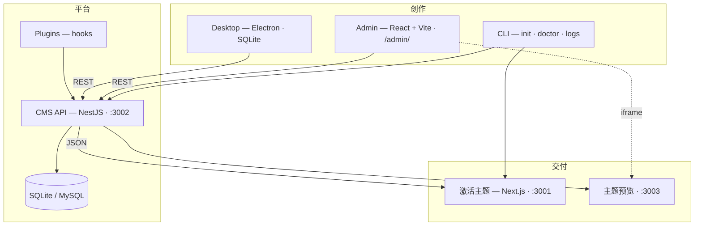

<div align="center">

<a href="https://blog.gaoredu.com" title="ReactPress">
  
</a>


# ReactPress

### 面向 React 开发者的发布系统

一条 CLI，自托管 CMS、Admin、Headless API、Next.js 主题、插件与桌面写作 — MIT 开源。

[快速开始](#快速开始) · [全栈演示](https://blog.gaoredu.com) · [主题演示](https://reactpress-theme-starter.vercel.app) · [文档](https://docs.gaoredu.com/) · [English](./README.md)

[](https://www.npmjs.com/package/@fecommunity/reactpress)
[](https://www.npmjs.com/package/@fecommunity/reactpress)
[](./LICENSE)
[](https://nodejs.org/)
[](https://github.com/fecommunity/reactpress/stargazers)
[](https://reactpress-theme-starter.vercel.app)


</div>

---

## 快速开始

```bash
npm i -g @fecommunity/reactpress
mkdir my-site && cd my-site
reactpress init
```

| 入口         | 地址                                              |
| :----------- | :------------------------------------------------ |
| 访客站       | http://localhost:3001                             |
| 管理后台     | http://localhost:3001/admin/（`admin` / `admin`） |
| API 健康检查 | http://localhost:3002/api/health                  |

**环境要求：** [Node.js 20+](https://nodejs.org/)。默认使用内置 SQLite — 无需 Docker 或外部数据库。

启动异常时运行 `reactpress doctor`。

> 当前稳定版：**4.0.0**（npm `@latest`）。仅预发布使用 `@beta`。

---

## 效果预览

<div align="center">


<table>
  <tr>
    <td width="50%" align="center" valign="top">
      <a href="./desktop/README.md">
        
      </a>
      <br/>
      <sub><b>桌面端</b> — 离线写作，就绪后同步</sub>
    </td>
    <td width="50%" align="center" valign="top">
      <a href="https://reactpress-theme-starter.vercel.app">
        
      </a>
      <br/>
      <sub><b>访客站</b> — 搜索 · 评论 · 知识库 · 深色模式</sub>
    </td>
  </tr>
</table>

<a href="https://reactpress-theme-starter.vercel.app">
  
</a>

<br/>

<sub>
  官方主题演示审计（见上图）：Performance <strong>95</strong>、Accessibility <strong>100</strong>、Best Practices <strong>100</strong>、SEO <strong>100</strong>。
  请按你的托管与内容复测以获取当前分数。
</sub>

</div>

---

## 为什么选 ReactPress？

WordPress 式编辑体验很难替代；Headless CMS 给了 API，后台、前台和运维仍要自建。ReactPress 给 React 团队一条中间路径：

| 路线           | 你得到                                   | 你仍要负责             |
| :------------- | :--------------------------------------- | :--------------------- |
| WordPress      | 成熟编辑体验                             | PHP 主题 / 耦合栈      |
| 静态生成器     | 快速 HTML                                | 面向非开发者的真正 CMS |
| Headless CMS   | 灵活 API                                 | 后台 + 前台 + 部署拼装 |
| **ReactPress** | CMS + Admin + API + 主题 + 插件 + 桌面端 | 你的内容与主题代码     |

**适合谁**

- 想自托管博客 / 内容站，又不想硬接五个仓库的 React / Next.js 开发者
- 需要编辑在 Admin 写作、工程师维护 Next.js 主题的小团队
- 在比较 WordPress 替代、Headless CMS 或 Next.js 博客方案的人

---

## 功能

| 层级        | 当前已交付                                                               |
| :---------- | :----------------------------------------------------------------------- |
| **CMS**     | 文章、页面、媒体、分类、标签                                             |
| **Admin**   | `/admin/` 写作界面（浏览器与桌面端同一套 SPA）                           |
| **API**     | Headless REST + Swagger                                                  |
| **Themes**  | 可替换的 Next.js 访客前台（可 npm 安装）                                 |
| **Plugins** | 服务端 Hook + 可选 Admin 插槽（`seo`、`hello-world`、`image-optimizer`） |
| **Desktop** | Electron + 本地 SQLite；可选远程 API 与同步                              |
| **CLI**     | `init`、`doctor`、`logs`、`stop`                                         |

内容归平台；呈现归主题（或任意 Headless 客户端）。

---

## 对比

|                      | ReactPress                  | WordPress  | 静态站点 | Headless CMS |
| :------------------- | :-------------------------- | :--------- | :------- | :----------- |
| 编辑体验             | 有                          | 有         | 无       | 部分         |
| 前台自由度           | 高                          | 受限       | 构建时   | 高           |
| 开箱即用全栈         | 是                          | 靠插件     | 否       | 否           |
| 本地首次可用         | 分钟级（`reactpress init`） | 通常更久   | 单站快   | 搭建 + 拼装  |
| 离线写作             | 桌面端                      | 无         | 无       | 无           |
| 默认主题 Performance | 95¹                         | 视主题而定 | 通常较高 | 取决于前台   |

¹ [官方主题演示](https://reactpress-theme-starter.vercel.app) 的 Lighthouse **Performance**（见上图）。该次审计中 Accessibility / Best Practices / SEO 为 100。

- **对比 WordPress** — 相近的后台编辑流；访客站用 Next.js，无 PHP 主题锁定。
- **对比静态生成器** — 保留速度，补上真正的 CMS。
- **对比 Strapi / Payload** — 它们交付后端；ReactPress 交付 CMS + Admin + 主题 + 桌面端这一整套产品。

---

## 主题

可替换的 Next.js 前台。在 **管理后台 → 外观 → 主题** 中安装并启用。

```bash
npx create-next-app@latest my-blog \
  --example "https://github.com/fecommunity/reactpress-theme-starter" \
  --use-pnpm
cd my-blog && pnpm dev:mock
```

- 在线演示：[reactpress-theme-starter.vercel.app](https://reactpress-theme-starter.vercel.app)
- 一键部署：[](https://vercel.com/new/clone?repository-url=https://github.com/fecommunity/reactpress-theme-starter)
- 指南：[themes/README.md](./themes/README.md)

---

## 插件

扩展服务端，无需 fork 核心。在 **管理后台 → 插件** 中管理。

| 插件              | 能力                                       |
| :---------------- | :----------------------------------------- |
| `seo`             | Slug、关键词、meta 描述 + Admin 编辑器插槽 |
| `hello-world`     | 发布时自动生成摘要                         |
| `image-optimizer` | 媒体库批量 WebP 优化                       |

脚手架：[reactpress-plugin-starter](https://github.com/fecommunity/reactpress-plugin-starter) · 指南：[plugins/README.md](./plugins/README.md)

---

## 桌面端

同一套 Admin，本地优先。本地 SQLite 模式无需 Docker。

|         |                                                                                                       |
| :------ | :---------------------------------------------------------------------------------------------------- |
| 文档    | [桌面客户端](https://docs.gaoredu.com/docs/tutorial-extras/desktop-client)                            |
| Release | [GitHub Releases](https://github.com/fecommunity/reactpress/releases)（桌面端工作流附带安装包时提供） |
| 源码    | `pnpm dev:desktop` · `pnpm build:desktop`                                                             |

详情：[desktop/README.md](./desktop/README.md)

---

## 架构


```mermaid
flowchart TB
  subgraph Authoring["创作"]
    CLI["CLI — init · doctor · logs"]
    Admin["Admin — React + Vite · /admin/"]
    Desktop["Desktop — Electron · SQLite"]
  end

  subgraph Core["平台"]
    API["CMS API — NestJS · :3002"]
    Plugins["Plugins — hooks"]
    DB[("SQLite / MySQL")]
  end

  subgraph Delivery["交付"]
    Theme["激活主题 — Next.js · :3001"]
    Preview["主题预览 · :3003"]
  end

  CLI --> API
  CLI --> Theme
  Admin -->|REST| API
  Desktop -->|REST| API
  Plugins --> API
  API --> DB
  API -->|JSON| Theme
  API --> Preview
  Admin -.->|iframe| Preview
```

| 包          | 角色                         |
| :---------- | :--------------------------- |
| `cli`       | 编排                         |
| `server`    | 业务规则、鉴权、Hook、持久化 |
| `web`       | Admin SPA                    |
| `themes/*`  | 访客站 SSR/ISR               |
| `plugins/*` | 增量逻辑                     |
| `desktop`   | 复用 Admin 的 Electron 壳    |
| `toolkit`   | 共享 API 客户端与契约        |

设计说明：[ARCHITECTURE.md](./ARCHITECTURE.md)

---

## 开发者

默认 Headless：

```bash
curl -H "X-API-Key: YOUR_KEY" \
  "http://localhost:3002/api/article/headless/list?status=publish&page=1&pageSize=10"
```

| 资源            | 链接                                                                                  |
| :-------------- | :------------------------------------------------------------------------------------ |
| Swagger（本地） | http://localhost:3002/api                                                             |
| 主题 Starter    | [reactpress-theme-starter](https://github.com/fecommunity/reactpress-theme-starter)   |
| 插件 Starter    | [reactpress-plugin-starter](https://github.com/fecommunity/reactpress-plugin-starter) |
| 文档            | [docs.gaoredu.com](https://docs.gaoredu.com/)                                         |

<details>
<summary><strong>CLI 命令与本地端口</strong></summary>

| 命令                             | 作用                                |
| :------------------------------- | :---------------------------------- |
| `reactpress` / `reactpress init` | 初始化并启动（SQLite + API + 主题） |
| `reactpress init --force`        | 重新初始化已有项目                  |
| `reactpress doctor`              | 诊断环境与访问地址                  |
| `reactpress logs`                | 查看 API 日志                       |
| `reactpress stop`                | 停止 API 与访客站                   |

| 服务     | 地址 / 端口                  |
| :------- | :--------------------------- |
| 访客站   | http://localhost:3001        |
| 管理后台 | http://localhost:3001/admin/ |
| API      | http://localhost:3002/api    |

</details>

---

## 部署

`reactpress init` 启动本地生产形态全栈（SQLite API + 内嵌 Admin 的主题）。

- 全栈托管（VPS、Docker、PM2、备份）：[部署文档](https://docs.gaoredu.com/)
- 仅部署访客站：部署 [reactpress-theme-starter](https://github.com/fecommunity/reactpress-theme-starter) 并指向你的 API

---

## 4.0 新特性

已在 npm `@latest` 稳定发布（代号 **Extend**）：

- 插件系统 — Hook + `plugin.json` + Admin 插槽
- 桌面客户端 — Electron + SQLite 本地模式，可远程同步
- npm 主题 catalog — 可安装的 Next.js 主题

[4.0 指南](./docs/tutorial/tutorial-extras/reactpress-4-0.md) · [从 3.x 迁移](./docs/tutorial/tutorial-extras/migration-3-to-4.md) · [更新日志](./CHANGELOG.md)

---

## 路线图

| 项                                          | 跟踪                                                       |
| :------------------------------------------ | :--------------------------------------------------------- |
| 插件 npm catalog（`reactpress plugin add`） | [#89](https://github.com/fecommunity/reactpress/issues/89) |
| 桌面端托盘 / 快捷键 / 自动更新              | [#91](https://github.com/fecommunity/reactpress/issues/91) |
| 主题与插件市场 UI                           | [#92](https://github.com/fecommunity/reactpress/issues/92) |

---

## FAQ

<details>
<summary><strong>需要 Docker 吗？</strong></summary>

默认 CLI 流程不需要 — `reactpress init` 使用内置 SQLite。仅在 `.reactpress/config.json` 配置 `embedded-docker`（MySQL）时才需要 Docker。桌面端本地模式同样使用 SQLite。

</details>

<details>
<summary><strong>能用自己的前台吗？</strong></summary>

可以。使用 Headless REST API + API Key。Fork [官方主题 starter](https://github.com/fecommunity/reactpress-theme-starter)，或对接 `/api/article`、`/api/page` 等接口。

</details>

<details>
<summary><strong>和 WordPress 有什么不同？</strong></summary>

相近的后台编辑流；访客站用 Next.js，Headless 路径更干净，无需 PHP 主题栈。

</details>

<details>
<summary><strong>4.0 能用于生产吗？</strong></summary>

可以。**4.0.0** 为当前稳定版（npm `@latest`）。从 3.x 升级请先在预发验证，并阅读[迁移指南](./docs/tutorial/tutorial-extras/migration-3-to-4.md)。

</details>

---

## 贡献

[CONTRIBUTING.md](./CONTRIBUTING.md) · [行为准则](./CODE_OF_CONDUCT.md) · [SECURITY.md](./SECURITY.md)

[Issues](https://github.com/fecommunity/reactpress/issues) · [Pull requests](https://github.com/fecommunity/reactpress/pulls)

---

## 许可证

[MIT](./LICENSE) · © ReactPress / [FECommunity](https://github.com/fecommunity)

---

<div align="center">

<p>
  如果 ReactPress 帮你省下了 CMS + API + 前台拼装，
  <a href="https://github.com/fecommunity/reactpress/stargazers"><strong>给仓库点个 Star</strong></a>
  ，让更多 React 开发者更容易发现它。
</p>

<br/>

<!-- star-history:start -->
<picture>
  <source media="(prefers-color-scheme: dark)" srcset="public/star-history/star-history-dark.svg">
  
</picture>
<!-- star-history:end -->

</div>
