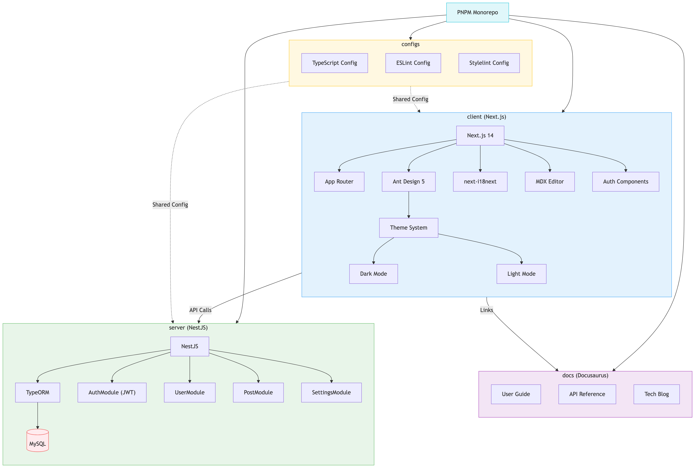

<div align="center">
  <a href="https://gaoredu.com" title="ReactPress">
    
  </a>

  <h1>ReactPress 2.0</h1>

  <p align="center">
    <em>Modern Full-Stack Publishing Platform Built with React, Next.js, and NestJS</em>
  </p>

  [](https://github.com/fecommunity/reactpress/blob/master/LICENSE)
  [](https://www.npmjs.com/package/@fecommunity/reactpress)
  [](https://github.com/fecommunity/reactpress/pulls)
  [](http://www.typescriptlang.org/)
  [](https://nextjs.org/)
  [](https://nestjs.com/)
  [](https://vercel.com/new/clone?repository-url=https://github.com/fecommunity/reactpress)

  <p>
    <a href="https://github.com/fecommunity/reactpress/issues">Report Bug</a>
    ·
    <a href="https://github.com/fecommunity/reactpress/issues">Request Feature</a>
    ·
    <a href="./README-zh_CN.md">中文文档</a>
  </p>
</div>

## 🌟 Modern Publishing Platform

**ReactPress 2.0** is a modern, full-stack publishing platform that empowers developers and content creators to build professional blogs, websites, and content management systems with ease and flexibility. Built with modern web technologies including React 18, Next.js 14, NestJS 10, and TypeScript 5, it offers an excellent development experience and user experience.

[](https://gaoredu.com)

## ✨ Key Features

### ⚡ High Performance
- **App Router Architecture** with Server Components for optimal SSR
- **Automatic Code Splitting** and lazy loading for efficient resource management
- **Image Optimization** with Next.js 14 Image component and automatic format selection

### 🎨 Advanced Theme Customization
- **Dynamic Theme Switching** with seamless light/dark mode transitions
- **Component-Level Customization** through modular architecture
- **CSS-in-JS** with styled-components for maintainable styling

### 🚀 5-Minute Quick Installation
- **Zero-Configuration Setup** with intelligent defaults
- **WordPress-Style Installation Wizard** for intuitive setup experience
- **Auto-Database Provisioning** with automatic schema migration
- **One-Command Startup** for development environments

### 🔧 Independent Service Architecture
- **Modular Design** with decoupled client and server packages
- **Standalone Client Deployment** for headless CMS integration
- **Independent Server Operation** with RESTful API exposure

### 🔐 Security Features
- **JWT Authentication** with refresh token support
- **Rate Limiting** with adaptive throttling
- **Input Validation** with Zod schema validation
- **Helmet.js** for comprehensive HTTP security headers
- **CSRF Protection** for form security

### 🌍 Globalization & Accessibility
- **Multi-Language Support** with RTL language support
- **WCAG 2.1 AA Compliance** for accessibility standards
- **SEO Optimization** with automatic sitemap generation

## 📸 Screenshots

### Installation
[](https://blog.gaoredu.com)

### Content Management Dashboard
[](https://blog.gaoredu.com)

### Elegant Home Page
[](https://blog.gaoredu.com)


## 🆚 Modern Technology Comparison

| Feature | ReactPress 2.0 | WordPress | VuePress |
|--------|------------|-----------|----------|
| **Technology Stack** | React 18 + Next.js 14 + NestJS 10 + MySQL 8 | PHP 8 + MySQL 8 | Vue 3 + Vite |
| **Performance** | ⚡ App Router, Server Components | ⚠️ Plugin Dependent | ✅ Static Generation |
| **Developer Experience** | ✅ TypeScript 5, Modern Tooling | ⚠️ PHP Legacy | ✅ Vue Ecosystem |
| **Customization** | 🎨 Component-Based Architecture | 🧩 Plugin-Based | 📄 Theme-Based |
| **Security** | 🔐 JWT, Rate Limiting, Helmet.js | ⚠️ Plugin Vulnerabilities | 🔒 Static Site |
| **Deployment** | 🚀 Vercel, PM2, Process Managers | 🐳 Traditional Hosting | 📦 Static Deployment |
| **Scalability** | 📈 Horizontal Scaling Ready | ⚠️ Vertical Scaling | ✅ CDN Optimized |

## 🚀 Quick Start

### 🏁 5-Minute Server Installation
```bash
# Install and start ReactPress server
npx @fecommunity/reactpress-server

# Install and run client independently
npx @fecommunity/reactpress-client
```

## 💻 System Architecture

[](https://blog.gaoredu.com)

ReactPress 2.0 implements a **modular architecture** with clearly separated concerns:

- **Frontend**: Next.js 14 App Router with Server Components for optimal performance
- **Backend**: NestJS 10 with modular architecture for maintainable logic
- **Database**: MySQL 8 with TypeORM 0.3 for data persistence
- **API Layer**: Auto-generated TypeScript SDK with OpenAPI 3.0 specification


## 📦 Packages & Components

ReactPress is organized as a **monorepo with modular packages** and templates:

### Core Packages

| Package | Description | Version |
|---------|-------------|---------|
| [`@fecommunity/reactpress-client`](./client) | Next.js 14 frontend application | 1.0.0 |
| [`@fecommunity/reactpress-server`](./server) | NestJS 10 backend API | 1.0.0 |
| [`@fecommunity/reactpress-toolkit`](./toolkit) | Auto-generated API client SDK | 1.0.0 |
| [`@fecommunity/reactpress-config`](./config) | Shared configuration files | 1.0.0 |

### Templates

| Template | Description | Package Name |
|----------|-------------|--------------|
| [`hello-world`](./templates/hello-world) | Minimal template for rapid prototyping | `@fecommunity/reactpress-template-hello-world` |
| [`twentytwentyfive`](./templates/twentytwentyfive) | Feature-rich blog template | `@fecommunity/reactpress-template-twentytwentyfive` |

## 📦 Package Details

### 🖥️ Client (`@fecommunity/reactpress-client`)

The ReactPress Client is a modern, responsive frontend application built with Next.js 14 that serves as the user interface for the ReactPress CMS platform.

**Key Features:**
- Modern UI/UX with Ant Design v5
- Responsive design for all devices
- Internationalization support (Chinese & English)
- Dark/light theme switching with system preference detection
- Built-in markdown editor with live preview
- Analytics dashboard with metrics
- Media management system with drag-and-drop upload
- PWA support for native app experience

**Quick Start:**
```bash
npx @fecommunity/reactpress-client
```

### 🛠️ Server (`@fecommunity/reactpress-server`)

The ReactPress Server is a backend API built with NestJS 10 that powers the ReactPress CMS platform with a simple installation process.

**Key Features:**
- Zero-command installation with auto-configuration
- Auto-database setup with migration support
- JWT authentication with refresh token support
- Comprehensive RESTful APIs with OpenAPI 3.0 documentation
- Swagger API documentation with interactive testing
- PM2 process management support for production
- Rate limiting with adaptive throttling
- Input validation with Zod schema validation

**Quick Start:**
```bash
npx @fecommunity/reactpress-server
```

### 🧰 Toolkit (`@fecommunity/reactpress-toolkit`)

Auto-generated TypeScript API client toolkit for seamless integration with ReactPress backend services.

**Key Features:**
- Strongly-typed API clients for all modules
- TypeScript definitions for all data models
- Utility functions for common operations
- Built-in authentication and error handling
- Automatic retry mechanisms for failed requests
- Request/response interceptors for logging and metrics

**Usage:**
```typescript
import { api, types, utils } from '@fecommunity/reactpress-toolkit';

// Fetch articles with automatic error handling
const articles = await api.article.findAll();

// Type-safe data handling
const article: types.IArticle = {
  id: '1',
  title: 'Sample Article',
  // ... other properties
};

// Utility functions with proper error handling
const formattedDate = utils.formatDate(new Date());
```

### 📐 Templates

ReactPress provides ready-to-use templates for rapid development:

#### Hello World Template (`@fecommunity/reactpress-template-hello-world`)

A minimal template to get you started quickly with ReactPress.

**Features:**
- Clean, minimal design
- TypeScript support with strict type checking
- Integrated with ReactPress Toolkit for API communication
- Responsive layout with mobile-first approach
- Easy customization with component-based architecture

**Quick Start:**
```bash
npx @fecommunity/reactpress-template-hello-world my-blog
```

#### Twenty Twenty Five Template (`@fecommunity/reactpress-template-twentytwentyfive`)

A feature-rich blog template with a modern design inspired by WordPress themes.

**Features:**
- Clean, responsive design
- Server-side rendering for better SEO and performance
- Pre-built pages for articles, categories, and tags
- Integrated search functionality with fuzzy matching
- TypeScript support with strict type checking
- Integrated with ReactPress Toolkit for API communication
- Responsive layout with mobile-first approach

**Quick Start:**
```bash
npx @fecommunity/reactpress-template-twentytwentyfive my-blog
```

## 🔧 Configuration

Create a `.env` file in the root directory for local development:

```env
# Database Config
DB_HOST=127.0.0.1
DB_PORT=3306
DB_USER=reactpress
DB_PASSWD=reactpress
DB_DATABASE=reactpress

# Client Config
CLIENT_SITE_URL=http://localhost:3001

# Server Config
SERVER_SITE_URL=http://localhost:3002

```

## 🚀 Deployment Options

### Deploy with Vercel (Recommended for Startups)
[](https://vercel.com/new/clone?repository-url=https://github.com/fecommunity/reactpress)

### PM2 Deployment (Recommended for Production)
```bash
# Install PM2 globally
npm install -g pm2

# Start ReactPress server with PM2
npx @fecommunity/reactpress-server --pm2

# Start ReactPress client with PM2
npx @fecommunity/reactpress-client --pm2
```

### Traditional Deployment (Self-Managed)
```bash
# Build for production
pnpm run build

# Start production servers
pnpm run start
```

## 📚 Documentation

- [Getting Started Guide](https://github.com/fecommunity/reactpress/wiki)
- [API Documentation](https://github.com/fecommunity/reactpress/wiki/API-Documentation)
- [Deployment Guide](https://github.com/fecommunity/reactpress/wiki/Deployment)
- [Customization Guide](https://github.com/fecommunity/reactpress/wiki/Customization)
- [Security Best Practices](https://github.com/fecommunity/reactpress/wiki/Security)
- [Performance Optimization](https://github.com/fecommunity/reactpress/wiki/Performance)

## 👥 Community & Support

- [GitHub Issues](https://github.com/fecommunity/reactpress/issues) - Bug reports and feature requests
- [GitHub Discussions](https://github.com/fecommunity/reactpress/discussions) - Community discussions and Q&A
- [Stack Overflow](https://stackoverflow.com/questions/tagged/reactpress) - Technical questions

## 🤝 Contributing

We welcome contributions of all kinds! Whether it's bug fixes, new features, documentation improvements, or translations, your help is appreciated.

1. Fork the repository
2. Create your feature branch (`git checkout -b feature/AmazingFeature`)
3. Commit your changes (`git commit -m 'Add some AmazingFeature'`)
4. Push to the branch (`git push origin feature/AmazingFeature`)
5. Open a Pull Request

Please read our [Contributing Guide](https://github.com/fecommunity/reactpress/blob/master/CONTRIBUTING.md) for details on our code of conduct and development process.

## ❤️ Acknowledgments

ReactPress is inspired by and built upon the work of many amazing open-source projects:

- [Next.js](https://github.com/vercel/next.js) - React framework
- [NestJS](https://github.com/nestjs/nest) - Progressive Node.js framework
- [Ant Design](https://github.com/ant-design/ant-design) - UI design language
- [TypeORM](https://github.com/typeorm/typeorm) - ORM for TypeScript and JavaScript

We're grateful to the authors and contributors of these projects for their excellent work.

## 📈 Star History

[](https://star-history.com/#fecommunity/reactpress&Date)