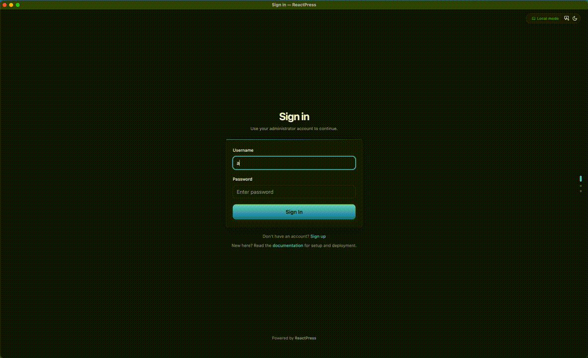
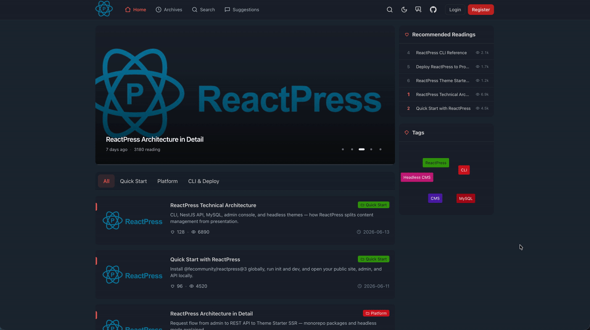
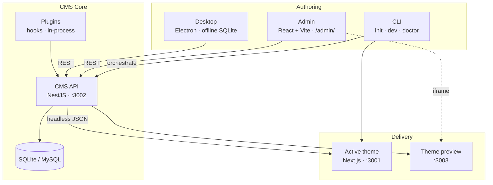
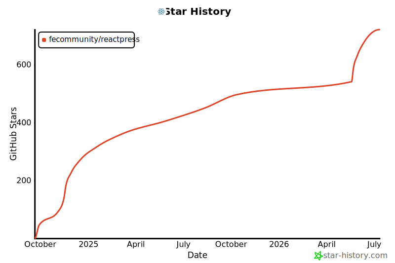

<div align="center">

<a href="https://blog.gaoredu.com" title="ReactPress">
  
</a>


<h1 align="center">ReactPress</h1>

<h3 align="center">The publishing system for React developers.</h3>

<p align="center">
  <strong>Build blogs, documentation, company websites, and content-driven applications with React.</strong>
</p>

<br/>

<p align="center">
  <a href="#30-second-start"><strong>Quick start ↓</strong></a>
  &nbsp;·&nbsp;
  <a href="https://blog.gaoredu.com"><strong>Live demo</strong></a>
  &nbsp;·&nbsp;
  <a href="https://reactpress-theme-starter.vercel.app"><strong>Theme demo</strong></a>
  &nbsp;·&nbsp;
  <a href="https://docs.gaoredu.com/"><strong>Docs</strong></a>
  &nbsp;·&nbsp;
  <a href="./README-zh_CN.md"><strong>中文</strong></a>
</p>

[](https://github.com/fecommunity/reactpress/stargazers)
[](https://www.npmjs.com/package/@fecommunity/reactpress)
[](https://github.com/fecommunity/reactpress/blob/master/LICENSE)
[](https://www.npmjs.com/package/@fecommunity/reactpress)
[](https://nodejs.org/)
[](https://reactpress-theme-starter.vercel.app)
[](https://github.com/fecommunity/reactpress/pulls)

<p>
  
  
  
  
  
</p>

<br/>

<a href="https://github.com/fecommunity/reactpress/stargazers">
  
</a>

<p><sub>If ReactPress saves you from stitching CMS + API + frontend — a ⭐ helps the next developer find it.</sub></p>

</div>

---

## See it in action

<div align="center">


<table>
  <tr>
    <td width="50%">
      <a href="./desktop/README.md">
        
      </a>
      <sub><b>Desktop</b> — offline writing, sync to production</sub>
    </td>
    <td width="50%">
      <a href="https://reactpress-theme-starter.vercel.app">
        
      </a>
      <sub><b>Visitor site</b> — search · comments · knowledge base · dark mode</sub>
    </td>
  </tr>
</table>

<a href="https://reactpress-theme-starter.vercel.app">
  
</a>

<sub>Scores on the <a href="https://reactpress-theme-starter.vercel.app">official theme demo</a>. Production results depend on hosting and content.</sub>

</div>

---

## 30-second start

```bash
npm i -g @fecommunity/reactpress@beta
mkdir my-site && cd my-site
reactpress init
```

**Requirements:** [Node.js 20+](https://nodejs.org/) · No Docker or external database

> 4.x 发布在 npm **`@beta`** 标签（`@latest` 仍为 3.x）。

| Surface         | URL                                              |
| :-------------- | :----------------------------------------------- |
| **Public site** | http://localhost:3001                            |
| **Admin**       | http://localhost:3001/admin/ (`admin` / `admin`) |
| **API**         | http://localhost:3002/api/health                 |

`reactpress doctor` diagnoses setup issues when something does not start correctly.

<table align="center">
<tr>
<td align="center"><strong>~60 sec</strong><br/><sub>init → live stack</sub></td>
<td align="center"><strong>95 / 100</strong><br/><sub>Lighthouse performance</sub></td>
<td align="center"><strong>MIT</strong><br/><sub>self-hosted</sub></td>
<td align="center"><strong>1 CLI</strong><br/><sub>full platform</sub></td>
</tr>
</table>

<div align="center">

**Working?** [Star the repo](https://github.com/fecommunity/reactpress/stargazers) · [Open an issue](https://github.com/fecommunity/reactpress/issues) · [Read the docs](https://docs.gaoredu.com/)

</div>

---

## Contents

- [See it in action](#see-it-in-action)
- [30-second start](#30-second-start)
- [Contents](#contents)
- [The problem](#the-problem)
- [What is ReactPress?](#what-is-reactpress)
- [What you can build](#what-you-can-build)
- [Architecture](#architecture)
- [Themes](#themes)
- [Plugins](#plugins)
- [Desktop-first writing](#desktop-first-writing)
- [Why ReactPress?](#why-reactpress)
- [What's new in 4.0](#whats-new-in-40)
- [For developers](#for-developers)
- [Deploy](#deploy)
- [Roadmap (4.x)](#roadmap-4x)
- [FAQ](#faq)
- [Contributing](#contributing)

---

## The problem

Modern content systems force a bad trade-off:

| Path                               | Trade-off                                                 |
| :--------------------------------- | :-------------------------------------------------------- |
| **WordPress-style CMS**            | Great editing — slow themes, coupled PHP stack            |
| **Static site generators**         | Blazing fast — no real CMS for non-developers             |
| **Headless CMS** (Strapi, Payload) | Flexible API — you still assemble admin, frontend, deploy |

> **Frontend teams deserve one publishing platform — not five repos to wire together.**

```
Before                          With ReactPress
──────                          ───────────────
Pick a CMS backend         →    reactpress init
Write & manage content     →    Admin at /admin/
Visitors see your theme    →    http://localhost:3001
Something wrong?           →    reactpress doctor
```

---

## What is ReactPress?

ReactPress is **the publishing system for React developers** — build blogs, documentation, company websites, and content-driven applications with React. One CLI, not another headless backend to wire up.

One CLI install. Everything included:

| Layer       | What you get                                                  |
| :---------- | :------------------------------------------------------------ |
| **CMS**     | WordPress-style editing — posts, pages, media, categories     |
| **API**     | Headless REST — React-first, Swagger-documented               |
| **Admin**   | Web writing UI — no separate admin to build                   |
| **Themes**  | npm-installable Next.js frontends — swappable                 |
| **Plugins** | Hook-based extensibility — SEO, summaries, image optimization |
| **Desktop** | Local-first writing — SQLite, offline, sync upstream          |

> Content owned by the system. Frontend owned by developers. **It is not a CMS — it is a publishing platform.**

---

## What you can build

| Use case                         | Why ReactPress fits                             |
| :------------------------------- | :---------------------------------------------- |
| Personal blogs                   | Admin writing + Lighthouse-fast Next.js theme   |
| Developer docs & knowledge bases | Built into official theme + API                 |
| SaaS marketing sites             | Headless API + custom Next.js frontend          |
| Multi-editor teams               | Web admin for writers, theme repo for engineers |
| Offline-first workflows          | Desktop app with SQLite, sync when ready        |

---

## Architecture


```mermaid
flowchart TB
  subgraph Authoring["Authoring"]
    CLI["CLI<br/>init · dev · doctor"]
    Admin["Admin<br/>React + Vite · /admin/"]
    Desktop["Desktop<br/>Electron · offline SQLite"]
  end

  subgraph Core["CMS Core"]
    API["CMS API<br/>NestJS · :3002"]
    Plugins["Plugins<br/>hooks · in-process"]
    DB[("SQLite / MySQL")]
  end

  subgraph Delivery["Delivery"]
    Theme["Active theme<br/>Next.js · :3001"]
    Preview["Theme preview<br/>:3003"]
  end

  CLI -->|"orchestrate"| API
  CLI --> Theme
  Admin -->|"REST"| API
  Desktop -->|"REST"| API
  Plugins --> API
  API --> DB
  API -->|"headless JSON"| Theme
  API --> Preview
  Admin -.->|"iframe"| Preview
```

```
CMS Core     → content, media, settings        (NestJS)
Admin UI     → writing experience              (React + Vite)
API Layer    → headless access                 (REST + Swagger)
Theme System → visitor-facing frontend         (Next.js, npm)
Plugin System→ extensibility                   (hooks + Admin slots)
Desktop App  → offline writing                 (Electron + SQLite)
```

---

## Themes

Themes are fully replaceable Next.js frontends — not locked to core. Install and activate them in **Admin → Appearance → Themes**.

Preview without a backend:

```bash
npx create-next-app@latest my-blog --example "https://github.com/fecommunity/reactpress-theme-starter" --use-pnpm
cd my-blog && pnpm dev:mock
```

**Live:** [reactpress-theme-starter.vercel.app](https://reactpress-theme-starter.vercel.app) · [](https://vercel.com/new/clone?repository-url=https://github.com/fecommunity/reactpress-theme-starter)

---

## Plugins

Extend without touching core. Install and enable plugins in **Admin → Plugins**.

| Plugin            | Capability                                           |
| :---------------- | :--------------------------------------------------- |
| `seo`             | Slug, keywords, meta description + Admin editor slot |
| `hello-world`     | Auto-generate article summaries                      |
| `image-optimizer` | Batch WebP optimization for media                    |

Dev guide: [plugins/README.md](./plugins/README.md) · Starter template: [reactpress-plugin-starter](https://github.com/fecommunity/reactpress-plugin-starter)

---

## Desktop-first writing

Write offline. Sync when ready. No Docker required.

**[Download desktop client](https://docs.gaoredu.com/docs/tutorial-extras/desktop-client)** (macOS / Windows / Linux) · or build from source:

```bash
pnpm dev:desktop       # monorepo root
pnpm build:desktop     # build installer
```

SQLite local storage · offline editing · remote API mode · sync to production · [desktop/README.md](./desktop/README.md)

---

## Why ReactPress?

|                             | ReactPress  | WordPress       | Static sites    | Headless CMS        |
| :-------------------------: | :---------- | :-------------- | :-------------- | :------------------ |
|   **Editing experience**    | Yes         | Yes             | No              | Partial             |
|    **Frontend freedom**     | Yes         | No              | Build-time only | Yes                 |
| **Full system out of box**  | Yes         | Via plugins     | No              | No                  |
|      **Time to start**      | ~1 min      | Hours           | Fast per site   | Setup + assembly    |
| **Local / offline writing** | Desktop app | No              | No              | No                  |
| **Lighthouse performance**  | 95²         | Theme-dependent | Excellent       | Depends on frontend |

**vs WordPress** — same editing workflow, modern Next.js delivery, no PHP theme bloat.

**vs Static generators** — keep the speed, add a real CMS.

**vs Strapi / Payload** — they ship a backend; ReactPress ships the **full publishing platform**.

² [Official theme demo](https://reactpress-theme-starter.vercel.app)

---

## What's new in 4.0

Codename **Extend** — plugins, desktop, npm themes. Still **one CLI, one Admin.**

```bash
npm i -g @fecommunity/reactpress@beta
```

[4.0 guide](./docs/tutorial/tutorial-extras/reactpress-4-0.md) · [Migrate from 3.x](./docs/tutorial/tutorial-extras/migration-3-to-4.md)

---

## For developers

Headless by default. Connect any frontend via REST.

```bash
curl -H "X-API-Key: YOUR_KEY" \
  "http://localhost:3002/api/article/headless/list?status=publish&page=1&pageSize=10"
```

| Resource       | Link                                                                                  |
| :------------- | :------------------------------------------------------------------------------------ |
| Swagger        | http://localhost:3002/api                                                             |
| Theme dev      | [themes/README.md](./themes/README.md)                                                |
| Plugin dev     | [plugins/README.md](./plugins/README.md)                                              |
| Theme starter  | [reactpress-theme-starter](https://github.com/fecommunity/reactpress-theme-starter)   |
| Plugin starter | [reactpress-plugin-starter](https://github.com/fecommunity/reactpress-plugin-starter) |

<details>
<summary><strong>CLI commands & ports (local init)</strong></summary>

| Command                          | Action                                      |
| :------------------------------- | :------------------------------------------ |
| `reactpress` / `reactpress init` | Initialize and start (SQLite + API + theme) |
| `reactpress init --force`        | Re-initialize existing project              |
| `reactpress doctor`              | Diagnose environment and URLs               |
| `reactpress logs`                | Tail API logs                               |
| `reactpress stop`                | Stop API and site services                  |

| Service     | URL / port                   |
| :---------- | :--------------------------- |
| Public site | http://localhost:3001        |
| Admin       | http://localhost:3001/admin/ |
| API         | http://localhost:3002/api    |

Monorepo contributors: see [CONTRIBUTING.md](./CONTRIBUTING.md) and package READMEs under `server/`, `web/`, `themes/`.

</details>

---

## Deploy

`reactpress init` runs a local production-style stack (SQLite API + theme with embedded admin). For VPS, Docker, PM2, and backups, see the [deployment docs](https://docs.gaoredu.com/).

Theme-only hosting: deploy [reactpress-theme-starter](https://github.com/fecommunity/reactpress-theme-starter) and point it at your API.

---

## Roadmap (4.x)

- Plugin npm catalog
- Desktop auto-update, tray, shortcuts
- Theme & plugin marketplace

---

## FAQ

<details>
<summary><strong>Do I need Docker?</strong></summary>

No for the default CLI flow — `reactpress init` uses embedded SQLite. Docker is only needed if you configure MySQL via `embedded-docker` in `.reactpress/config.json`. The desktop app also runs on SQLite without Docker.

</details>

<details>
<summary><strong>Can I use my own frontend?</strong></summary>

Yes — headless REST API with API keys. Fork the [official starter](https://github.com/fecommunity/reactpress-theme-starter) or build against `/api/article`, `/api/page`, etc.

</details>

<details>
<summary><strong>How is this different from WordPress?</strong></summary>

Same admin-driven workflow, but a faster default theme, a cleaner headless path, and no plugin bloat for a modern React/Next.js frontend.

</details>

<details>
<summary><strong>Is 4.0 production-ready?</strong></summary>

4.0 is in active beta (`4.0.0-beta.18` at time of writing). The published CLI supports `init`, `doctor`, `logs`, and `stop`. See the [migration guide](./docs/tutorial/tutorial-extras/migration-3-to-4.md) before upgrading production.

</details>

<details>
<summary><strong>WordPress alternative? Headless CMS? Next.js blog?</strong></summary>

Yes — ReactPress targets all three: self-hosted WordPress-style editing, headless REST for custom frontends, and an official Next.js theme with Lighthouse 95 performance out of the box.

</details>

---

## Contributing

[Contributing](./CONTRIBUTING.md) · [Code of Conduct](./CODE_OF_CONDUCT.md) · [Security](./SECURITY.md)

[Issues](https://github.com/fecommunity/reactpress/issues) · [Pull requests](https://github.com/fecommunity/reactpress/pulls)

<table>
  <tbody>
    <tr>
      <td align="center" width="12.5%"><a href="https://github.com/fecommunity"><br/><sub><b>FECommunity</b></sub></a></td>
      <td align="center" width="12.5%"><a href="https://github.com/want2sleeep"><br/><sub><b>SleepSheep</b></sub></a></td>
      <td align="center" width="12.5%"><a href="https://github.com/fantasticit"><br/><sub><b>fantasticit</b></sub></a></td>
      <td align="center" width="12.5%"><a href="https://github.com/chenbo29"><br/><sub><b>chenbo29</b></sub></a></td>
      <td align="center" width="12.5%"><a href="https://github.com/redteav2"><br/><sub><b>redteav2</b></sub></a></td>
      <td align="center" width="12.5%"><a href="https://github.com/trashken"><br/><sub><b>trashken</b></sub></a></td>
      <td align="center" width="12.5%"><a href="https://github.com/franz007"><br/><sub><b>franz007</b></sub></a></td>
      <td align="center" width="12.5%"><a href="https://github.com/funtime1"><br/><sub><b>funtime1</b></sub></a></td>
    </tr>
    <tr>
      <td align="center" width="12.5%"><a href="https://github.com/scottdeift"><br/><sub><b>scottdeift</b></sub></a></td>
      <td align="center" width="12.5%"><a href="https://github.com/TwoDollars666"><br/><sub><b>TwoDollars666</b></sub></a></td>
      <td align="center" width="12.5%"><a href="https://github.com/Xiaonan2020"><br/><sub><b>Xiaonan2020</b></sub></a></td>
      <td align="center" width="12.5%"><a href="https://github.com/gaoredu"><br/><sub><b>redtea</b></sub></a></td>
      <td align="center" width="12.5%"><a href="https://github.com/lsr365400"><br/><sub><b>lsr365400</b></sub></a></td>
    </tr>
  </tbody>
</table>

---

<div align="center">

**MIT License** · © ReactPress / FECommunity

<br/>

<a href="https://github.com/fecommunity/reactpress/stargazers">
  
</a>

<p><sub>The publishing system for React developers.<br/>Help us reach more builders — ⭐ on GitHub.</sub></p>

<br/>

<!-- star-history:start -->
<picture>
  <source media="(prefers-color-scheme: dark)" srcset="public/star-history/star-history-dark.svg">
  
</picture>
<!-- star-history:end -->

</div>
