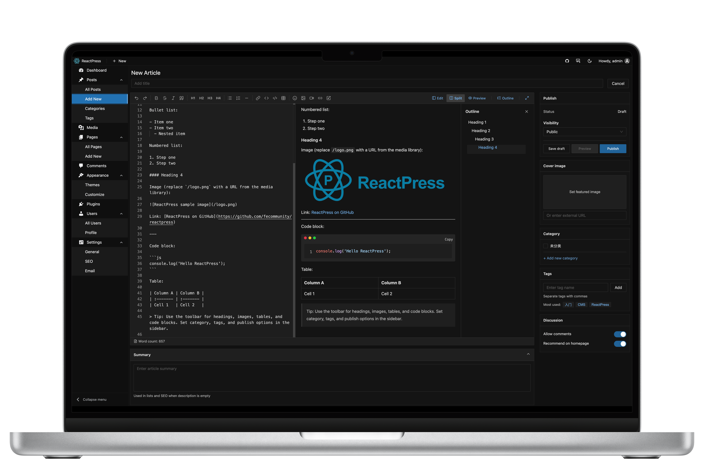
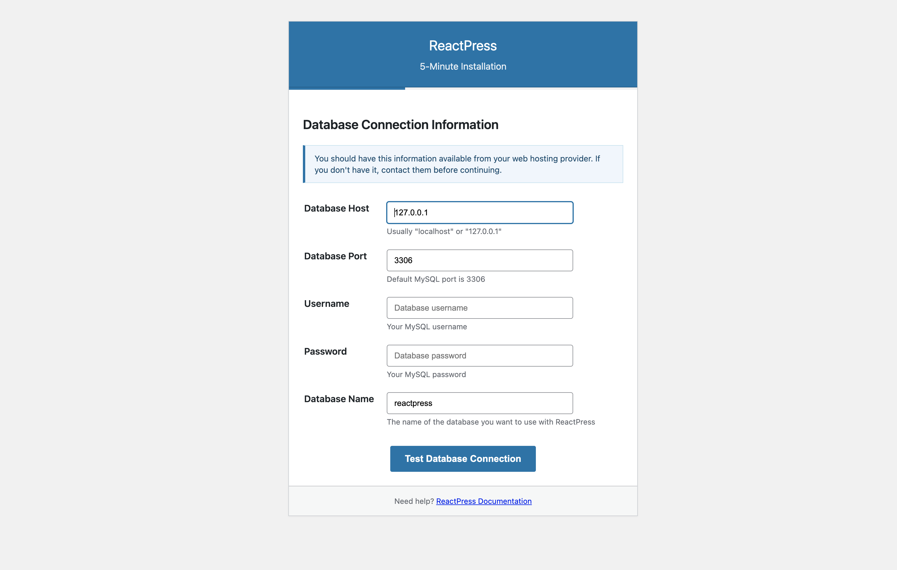
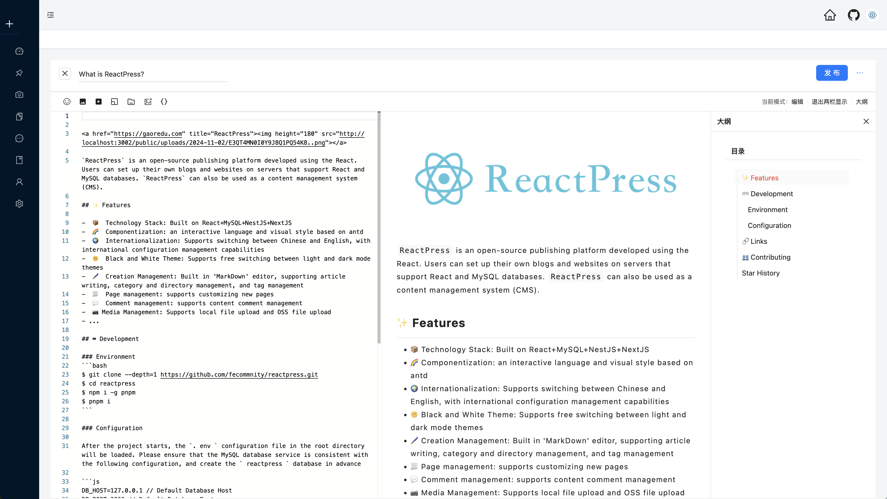
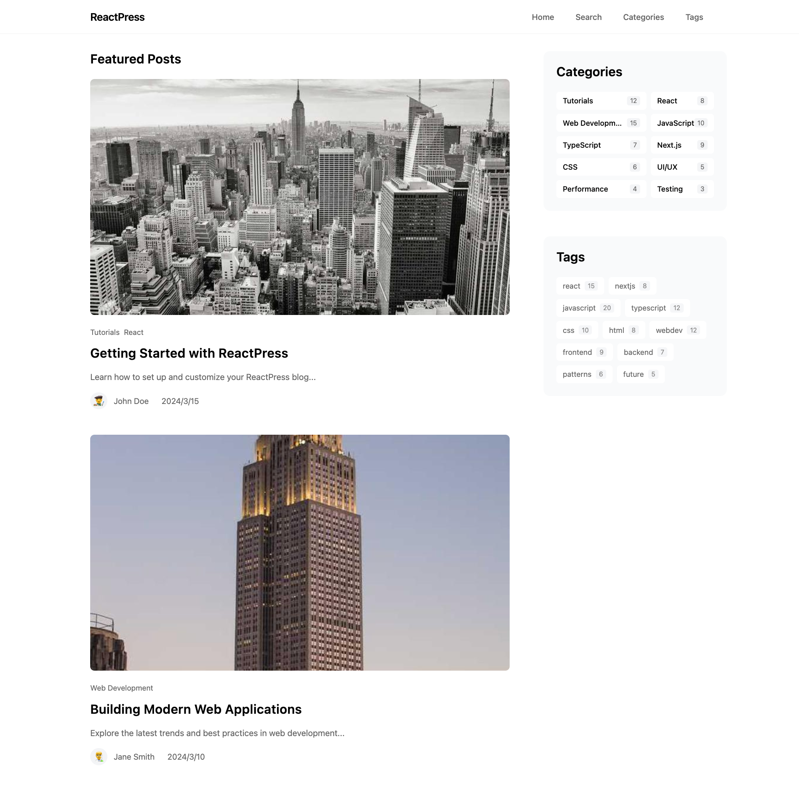

<div align="center">
  <a href="https://blog.gaoredu.com" title="ReactPress">
    
  </a>

  <p align="center">
    <strong>Modern Full-Stack Publishing Platform</strong><br />
    Built with React, Next.js, and NestJS
  </p>

  [](https://github.com/fecommunity/reactpress/blob/master/LICENSE)
  [](https://www.npmjs.com/package/@fecommunity/reactpress)
  [](https://github.com/fecommunity/reactpress/pulls)
  [](http://www.typescriptlang.org/)
  [](https://nextjs.org/)
  [](https://nestjs.com/)
  [](https://vercel.com/new/clone?repository-url=https://github.com/fecommunity/reactpress)

  <p>
    <a href="https://github.com/fecommunity/reactpress/issues">Report Bug</a>
    ·
    <a href="https://github.com/fecommunity/reactpress/issues">Request Feature</a>
    ·
    <a href="./README-zh_CN.md">中文文档</a>
  </p>
</div>

---

## ✨ Philosophy: One Backend, All Your Fronts.

**ReactPress** is a modern full‑stack publishing platform built on the principle of **“One Backend, All Your Fronts.”** It enables developers to focus on frontend development while rapidly building professional‑grade blogs, websites, and content management systems.

> A solution that empowers developers to easily build full‑stack applications.

[](https://blog.gaoredu.com)

---

## 🎯 Why Choose ReactPress?

ReactPress is engineered for developers who need the publishing power of a traditional CMS combined with the component‑driven workflow of a modern full‑stack JavaScript framework.

| Dimension | VuePress | WordPress | **ReactPress** |
| :--- | :--- | :--- | :--- |
| **Core Paradigm** | Static Site Generator (SSG) for content‑centric sites | Monolithic, server‑rendered CMS with a coupled frontend | **Decoupled, API‑first publishing platform** |
| **Primary Tech Stack** | Vue, Vite, Markdown | PHP, jQuery, Classic Themes | **React, Next.js (SSG/SSR), NestJS, TypeORM** |
| **Architectural Model** | Build‑time static generation; each site is a separate build | Tightly integrated theme/plugin system on a shared runtime | **Headless backend with fully independent, deployable frontends** |
| **State & Data Flow** | Pre‑rendered static data, content committed as code | Dynamic runtime state, database‑driven with admin UI | **Centralized API (REST/GraphQL) consumed by one or many clients** |
| **Deployment Target** | Static file hosts (CDN, Vercel, Netlify) | PHP‑compatible web servers (Apache/Nginx) | **Anywhere: backend on Node/PM2/Docker, frontends on any static or Node host** |
| **Styling & UI** | Scoped CSS, theme‑level overrides | PHP templates, theme stylesheets, inline styles | **Component‑scoped CSS‑in‑JS, design token system, fully themeable** |
| **Extensibility Model** | Custom themes and plugins (Vue components) | PHP hooks, actions, filters, and plugins | **Modular NestJS services, React component libraries, and build plugins** |
| **Development Experience** | Vue‑focused, markdown‑driven, simple CLI | File editors, browser‑based customizer, legacy codebase | **Type‑safe full‑stack IDE support, CLI toolchain, and hot‑reload** |
| **Ideal Use Case** | Documentation, technical blogs, marketing sites | Blogs, business websites, e‑commerce (with WooCommerce) | **Scalable content platforms, multi‑brand sites, custom publisher workflows** |

---

## ✨ Core Features

### ⚡ Rapid Deployment
- **Zero‑Configuration Setup** – based on intelligent defaults
- **WordPress‑Style Installation Wizard** – intuitive initialization process
- **Auto‑Database Configuration** – automatic database migrations

### 🎨 Deep Customization
- **Dynamic Theme Switching** – support for light/dark modes
- **Component‑Level Customization** – modular architecture enables fine‑grained control
- **Internationalization Support** – Chinese and English interfaces

### 🔧 Unified Development Experience
- **Monorepo Architecture** – modular package management
- **Full‑Stack TypeScript** – type safety across frontend and backend
- **PM2 Process Management** – production‑ready deployment solution

### 🚀 Modern Technology Stack
- **Frontend** – React 17 + Next.js 12 (Pages Router)
- **Backend** – NestJS 6 + modular architecture
- **Database** – MySQL + TypeORM
- **UI Components** – Ant Design v5

---

## 📸 Feature Preview

### Installation Wizard
[](https://blog.gaoredu.com)

### Admin Dashboard
[](https://blog.gaoredu.com)

### Demo Site
[](https://blog.gaoredu.com)

---

## 🚀 Quick Start

### 📋 Prerequisites
- Node.js >= 16.5.0
- MySQL database
- `pnpm` package manager

### 🏁 Installation Options

#### Option 1: Unified CLI (Recommended)
```bash
# Install ReactPress globally
npm install -g @fecommunity/reactpress

# Start services
reactpress server start
reactpress client start
```

#### Option 2: Independent Services
```bash
# Install and start ReactPress server
npx @fecommunity/reactpress-server

# Install and run client independently
npx @fecommunity/reactpress-client
```

---

## 📟 Command Line Interface (CLI)

ReactPress provides a unified CLI for managing both server and client components.

### Unified CLI Commands

```bash
# Show help
reactpress --help

# Start the server
reactpress server start

# Start the client
reactpress client start

# Start server with PM2
reactpress server start --pm2

# Start client with PM2
reactpress client start --pm2
```

### Individual Package Commands

```bash
# Start server
npx @fecommunity/reactpress-server

# Start client
npx @fecommunity/reactpress-client

# Start server with PM2
npx @fecommunity/reactpress-server --pm2

# Start client with PM2
npx @fecommunity/reactpress-client --pm2
```

---

## 📦 Package Structure & Components

ReactPress uses a **Modular Monorepo Architecture**:

### Core Packages

| Package | Description | Version |
|---------|-------------|---------|
| [`@fecommunity/reactpress`](.) | Main CLI and unified entry point | 2.0.0 |
| [`@fecommunity/reactpress-client`](./client) | Next.js 12 frontend application | 1.0.0 |
| [`@fecommunity/reactpress-server`](./server) | NestJS 6 backend API | 1.0.0 |
| [`@fecommunity/reactpress-toolkit`](./toolkit) | Auto‑generated API client SDK | 1.0.0 |

### Templates

| Template | Description | Package Name |
|----------|-------------|---------------|
| [`hello-world`](./templates/hello-world) | Minimal template for rapid prototyping | `@fecommunity/reactpress-template-hello-world` |
| [`twentytwentyfive`](./templates/twentytwentyfive) | Feature‑rich blog template | `@fecommunity/reactpress-template-twentytwentyfive` |

---

## 🔧 Configuration

Create a `.env` file in the root directory for local development:

```env
# Database Configuration
DB_HOST=127.0.0.1
DB_PORT=3306
DB_USER=reactpress
DB_PASSWD=reactpress
DB_DATABASE=reactpress

# Client Configuration
CLIENT_SITE_URL=http://localhost:3001

# Server Configuration
SERVER_SITE_URL=http://localhost:3002
```

---

## 🚀 Development Workflow

### Docker Development Environment

```bash
# Start the development environment
pnpm docker:dev

# Or use enhanced commands
pnpm docker:dev:start   # Start services
pnpm docker:dev:stop    # Stop services
pnpm docker:dev:restart # Restart services
pnpm docker:dev:status  # Check service status
pnpm docker:dev:logs    # View service logs
```

The development environment includes:
- MySQL Database (port 3306)
- Nginx Reverse Proxy (port 8080)
- Client Development Server (port 3001)
- Server Development Server (port 3002)

Access your application at: `http://localhost:8080`

---

## 🚀 Deployment Options

### Deploy with Vercel (Recommended for Startups)
[](https://vercel.com/new/clone?repository-url=https://github.com/fecommunity/reactpress)

### PM2 Deployment (Recommended for Production)
```bash
# Install PM2 globally
npm install -g pm2

# Start ReactPress server with PM2
npx @fecommunity/reactpress-server --pm2

# Start ReactPress client with PM2
npx @fecommunity/reactpress-client --pm2

# Or use the unified CLI
reactpress server start --pm2
reactpress client start --pm2
```

### Traditional Deployment (Self‑Managed)
```bash
# Build for production
pnpm run build

# Start production servers
pnpm run start
```

---

## 🤝 Contributing

We welcome contributions of all kinds! Bug fixes, new features, documentation improvements, and translations are all appreciated.

### 📋 Development Setup

1. Fork the repository
2. Clone your fork: `git clone https://github.com/your-username/reactpress.git`
3. Install dependencies: `pnpm install`
4. Start development servers: `pnpm run dev`

### 📦 Publishing Packages

To publish packages to npm:

1. Ensure you're logged in: `pnpm login`
2. Run the publish script: `pnpm run release`
3. Follow the interactive prompts to select packages and version increments

Please read our [Contributing Guide](https://github.com/fecommunity/reactpress/blob/master/CONTRIBUTING.md) for details on our code of conduct and development process.

---

## ❤️ Acknowledgments

ReactPress is inspired by and built upon the work of many amazing open‑source projects:

- [Next.js](https://github.com/vercel/next.js) – React Framework
- [NestJS](https://github.com/nestjs/nest) – Progressive Node.js Framework
- [Ant Design](https://github.com/ant-design/ant-design) – UI Design Language
- [TypeORM](https://github.com/typeorm/typeorm) – ORM for TypeScript and JavaScript

We're grateful to the authors and contributors of these projects for their excellent work.

---

## 📈 Star History

[](https://star-history.com/#fecommunity/reactpress&Date)