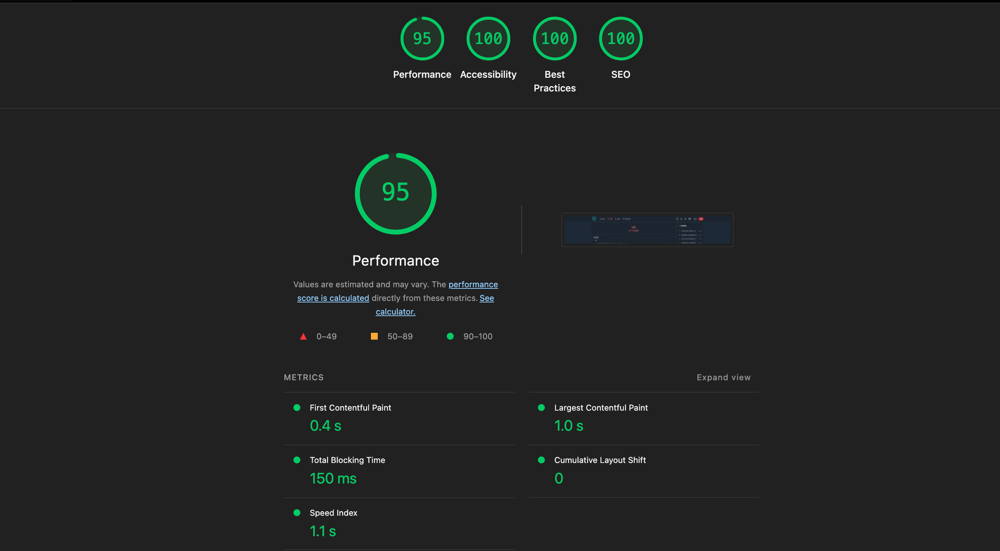

<div align="center">
  <a href="https://blog.gaoredu.com" title="ReactPress">
    
  </a>

  <p align="center">
    <strong>Your publishing platform — live in about a minute</strong><br />
    One CLI. Full-stack CMS. Headless-ready themes. Production-grade performance out of the box.
  </p>

[](https://github.com/fecommunity/reactpress/blob/master/LICENSE)
[](https://www.npmjs.com/package/@fecommunity/reactpress)
[](https://github.com/fecommunity/reactpress/pulls)
[](https://reactpress-theme-starter.vercel.app)
[](https://reactpress-theme-starter.vercel.app)

  <p>
    <a href="https://github.com/fecommunity/reactpress/issues">Report Bug</a>
    ·
    <a href="https://github.com/fecommunity/reactpress/issues">Request Feature</a>
    ·
    <a href="./README-zh_CN.md">中文文档</a>
    ·
    <a href="https://blog.gaoredu.com">Live Demo</a>
    ·
    <a href="https://github.com/fecommunity/reactpress-theme-starter">Theme Starter</a>
  </p>
</div>

---

## Table of contents

- [What is ReactPress?](#what-is-reactpress)
- [Why ReactPress?](#why-reactpress)
- [Quick start](#quick-start)
- [See it in action](#see-it-in-action)
- [CLI reference](#cli-reference)
- [Official theme](#official-theme)
- [Deploy](#deploy)
- [Develop this repository](#develop-this-repository)
- [Contributing](#contributing)

---

## What is ReactPress?

**ReactPress** is a modern full-stack publishing platform — CMS, admin console, REST API, and theme ecosystem in one package. Run `init` + `dev` and get a working site in about a minute, without hand-writing config or wiring a database yourself.

> **One backend, many fronts.** Publish once in the admin; render on the web, in your apps, or through any headless frontend via the API.

<div align="center">


</div>

[3.0 overview](./docs/tutorial/tutorial-extras/reactpress-3-0.md) · [Upgrade from 2.x](./docs/migration-2-to-3.md)

---

## Why ReactPress?

ReactPress combines **WordPress-style content workflows** with a **React / Next.js frontend stack** — so you get familiar publishing tools *and* modern web performance.

### Lighthouse — built for speed & discoverability

The official [theme starter](https://github.com/fecommunity/reactpress-theme-starter) scores near-perfect on Google Lighthouse (tested on the [live demo](https://reactpress-theme-starter.vercel.app)):

<div align="center">

<a href="https://reactpress-theme-starter.vercel.app">
  
</a>

</div>

| Category | Score | Key metrics |
| :------- | ----: | :---------- |
| **Performance** | 95 | FCP **0.4 s** · LCP **1.0 s** · Speed Index **1.1 s** · CLS **0** |
| **Accessibility** | 100 | Semantic markup, keyboard-friendly UI |
| **Best Practices** | 100 | HTTPS, modern APIs, secure defaults |
| **SEO** | 100 | SSR, sitemap, RSS, Open Graph — ready out of the box |

No plugin maze. No manual tuning. Ship a fast, searchable site from day one.

### What you get vs. alternatives

| | Traditional CMS | Static generators | **ReactPress** |
| :-- | :-- | :-- | :-- |
| **Time to first site** | Server + plugins + manual setup | New repo & build per site | **`init` + `dev` — ~1 minute** |
| **Content workflow** | Admin UI, coupled themes | Markdown in git | **Admin UI + optional code-first** |
| **Frontend freedom** | Theme/plugin lock-in | Fixed at build time | **Headless API + your choice of theme** |
| **Performance & SEO** | Depends on plugins & hosting | Great, but no CMS | **Lighthouse 95/100/100/100 with official theme** |
| **Best for** | General blogs & business sites | Docs & marketing pages | **Blogs, multi-site content, custom publishing** |

| Capability | Details |
| :----------- | :------ |
| **Go live fast** | Guided `init`, auto database, Docker MySQL, URLs printed when ready |
| **Publish & manage** | Posts, pages, media, categories, tags, site settings |
| **Headless-ready** | REST API + [`@fecommunity/reactpress-toolkit`](./toolkit) for any frontend |
| **Official theme** | [reactpress-theme-starter](https://github.com/fecommunity/reactpress-theme-starter) — Next.js 15, mock mode, knowledge base, comments |
| **Developer experience** | Interactive CLI menu, `doctor`, `status`, TypeScript monorepo |

---

## Quick start

### Prerequisites

| Requirement | Notes |
| :---------- | :---- |
| **Node.js 18+** | Required for the CLI |
| **Docker** | Recommended — bundled MySQL runs in a container |
| **MySQL** | Optional — use your own instance instead |

### Install and run

```bash
npm i -g @fecommunity/reactpress@3
mkdir my-blog && cd my-blog
reactpress init
reactpress dev
```

| Service | Typical URL |
| :------ | :---------- |
| Public site | `http://localhost:3001` |
| Admin | `http://localhost:3001/admin` |
| API health | `http://localhost:3002/api/health` |

**Tips:** Run `reactpress` with no arguments for the interactive menu. Use `reactpress doctor` or `reactpress status` when something looks off.

---

## See it in action

<div align="center">


</div>

| Admin dashboard | Demo site |
| :-------------: | :-------: |
| [](https://blog.gaoredu.com) | [](https://blog.gaoredu.com) |

---

## CLI reference

```bash
npm i -g @fecommunity/reactpress@3
```

| Command | Description |
| :------ | :---------- |
| `reactpress` | Interactive menu |
| `reactpress init` | Set up a new project (config + `.env`) |
| `reactpress dev` | Run site + admin + API locally |
| `reactpress dev --api-only` | API only — pair with a custom theme |
| `reactpress doctor` | Check your environment |
| `reactpress status` | See what is running |
| `reactpress build` / `start` | Production build & run |

More: [documentation](https://blog.gaoredu.com) · [Configuration](./docs/tutorial/tutorial-extras/config-intro.md)

---

## Official theme

The recommended visitor frontend is **[reactpress-theme-starter](https://github.com/fecommunity/reactpress-theme-starter)** — Next.js 15 · React 19 · Tailwind CSS 4 · App Router. Articles, archives, search, knowledge base, comments, RSS/sitemap, and a built-in mock API for offline development.

<div align="center">

<a href="https://reactpress-theme-starter.vercel.app">
  
</a>

<p>
  <a href="https://reactpress-theme-starter.vercel.app"><strong>Live demo</strong></a>
  ·
  <a href="https://github.com/fecommunity/reactpress-theme-starter"><strong>Source & docs</strong></a>
</p>

</div>

```text
ReactPress API  ──REST──▶  Theme Starter (Next.js)  ──▶  Public Site
```

### Try in 60 seconds (no backend)

```bash
npx create-next-app@latest my-blog --example "https://github.com/fecommunity/reactpress-theme-starter" --use-pnpm
cd my-blog
pnpm dev:mock
```

Open **http://localhost:3001** — same mode as the [live demo](https://reactpress-theme-starter.vercel.app).

[](https://vercel.com/new/clone?repository-url=https://github.com/fecommunity/reactpress-theme-starter)

### Connect theme to ReactPress API

1. Start the API: `reactpress dev --api-only` (or the full stack).
2. In the theme directory: `cp .env.example .env` → `pnpm dev`.

Full theme docs: [theme starter README](https://github.com/fecommunity/reactpress-theme-starter#readme).

Classic Pages Router themes for reference: [`themes/`](./themes/) · schema: [`theme.manifest.schema.json`](./themes/theme.manifest.schema.json).

---

## Deploy

[](https://vercel.com/new/clone?repository-url=https://github.com/fecommunity/reactpress)

```bash
npm i -g @fecommunity/reactpress@3
reactpress build
reactpress start
```

For PM2, Docker, and monorepo details, see [README-zh_CN.md](./README-zh_CN.md) and the [docs](./docs/tutorial/intro.md).

---

## Develop this repository

Monorepo: CLI, client, server, toolkit, classic themes. Contributors use **pnpm**:

```bash
pnpm install
pnpm run dev    # init + Docker MySQL + toolkit + API (:3002) + client (:3001)
```

| Command | Description |
| :------ | :---------- |
| `pnpm dev:api` | API only |
| `pnpm dev:client` | Next.js client only |
| `pnpm build` | Production build (toolkit → server → client) |
| `pnpm start` | Run production API + client |

After API changes: `pnpm run generate:swagger` → `pnpm run build:toolkit`. Full workflow: [README-zh_CN.md](./README-zh_CN.md).

---

## Contributing

**Thank you** to everyone who has helped shape ReactPress.

<table>
  <tbody>
    <tr>
      <td align="center" width="12.5%"><a href="https://github.com/fecommunity"><br/><sub><b>FECommunity</b></sub></a></td>
      <td align="center" width="12.5%"><a href="https://github.com/want2sleeep"><br/><sub><b>SleepSheep</b></sub></a></td>
      <td align="center" width="12.5%"><a href="https://github.com/fantasticit"><br/><sub><b>fantasticit</b></sub></a></td>
      <td align="center" width="12.5%"><a href="https://github.com/chenbo29"><br/><sub><b>chenbo29</b></sub></a></td>
      <td align="center" width="12.5%"><a href="https://github.com/redteav2"><br/><sub><b>redteav2</b></sub></a></td>
      <td align="center" width="12.5%"><a href="https://github.com/trashken"><br/><sub><b>trashken</b></sub></a></td>
      <td align="center" width="12.5%"><a href="https://github.com/franz007"><br/><sub><b>franz007</b></sub></a></td>
      <td align="center" width="12.5%"><a href="https://github.com/funtime1"><br/><sub><b>funtime1</b></sub></a></td>
    </tr>
    <tr>
      <td align="center" width="12.5%"><a href="https://github.com/scottdeift"><br/><sub><b>scottdeift</b></sub></a></td>
      <td align="center" width="12.5%"><a href="https://github.com/TwoDollars666"><br/><sub><b>TwoDollars666</b></sub></a></td>
      <td align="center" width="12.5%"><a href="https://github.com/Xiaonan2020"><br/><sub><b>Xiaonan2020</b></sub></a></td>
      <td align="center" width="12.5%"><a href="https://github.com/gaoredu"><br/><sub><b>redtea</b></sub></a></td>
      <td align="center" width="12.5%"><a href="https://github.com/fecommunity"><br/><sub><b>m0_37981569</b></sub></a></td>
    </tr>
  </tbody>
</table>

1. Fork and clone the repo
2. `pnpm install`
3. `pnpm run dev`

See the [Contributing Guide](https://github.com/fecommunity/reactpress/blob/master/CONTRIBUTING.md).

---

## Acknowledgments

ReactPress builds on [Next.js](https://github.com/vercel/next.js), [NestJS](https://github.com/nestjs/nest), [Ant Design](https://github.com/ant-design/ant-design), and [TypeORM](https://github.com/typeorm/typeorm).

---

## Star history

[](https://star-history.com/#fecommunity/reactpress&Date)
