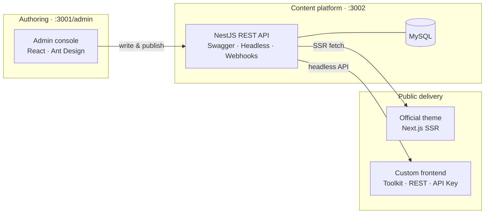

<div align="center">
  <a href="https://blog.gaoredu.com" title="ReactPress">
    
  </a>

  <h1>ReactPress</h1>

  <p>
    <strong>The open-source publishing platform — WordPress familiarity, Next.js performance.</strong><br />
    <sub>One global package · Zero-config CMS · Headless API · Production-ready themes</sub>
  </p>

  <p>
    <a href="https://github.com/fecommunity/reactpress/stargazers"></a>
    <a href="https://www.npmjs.com/package/@fecommunity/reactpress"></a>
    <a href="https://www.npmjs.com/package/@fecommunity/reactpress"></a>
    <a href="https://github.com/fecommunity/reactpress/actions/workflows/ci.yml"></a>
    <a href="https://github.com/fecommunity/reactpress/blob/master/LICENSE"></a>
  </p>

  <br />

  <a href="https://reactpress-theme-starter.vercel.app">
    
  </a>

  <br /><br />

  <table>
    <tr>
      <td align="center" width="33%">
        <strong>⚡ ~60s</strong><br />
        <sub>Zero-config cold start</sub>
      </td>
      <td align="center" width="33%">
        <strong>📊 95 / 100 / 100 / 100</strong><br />
        <sub>Lighthouse on official theme</sub>
      </td>
      <td align="center" width="33%">
        <strong>🔌 Headless</strong><br />
        <sub>REST · Swagger · TypeScript SDK</sub>
      </td>
    </tr>
  </table>

  <br />

  <p>
    <a href="https://reactpress-theme-starter.vercel.app"><strong>Theme demo</strong></a>
    &nbsp;·&nbsp;
    <a href="https://blog.gaoredu.com"><strong>Full-stack demo</strong></a>
    &nbsp;·&nbsp;
    <a href="https://docs.gaoredu.com/"><strong>Documentation</strong></a>
    &nbsp;·&nbsp;
    <a href="https://github.com/fecommunity/reactpress-theme-starter"><strong>Official theme</strong></a>
    &nbsp;·&nbsp;
    <a href="./README-zh_CN.md"><strong>中文文档</strong></a>
  </p>

  <p><sub>If ReactPress saves you time, <a href="https://github.com/fecommunity/reactpress"><strong>⭐ Star on GitHub</strong></a> — it helps others find it.</sub></p>
</div>

---

## Quick start

**Requirements:** Node.js 18+ · Docker recommended (bundled MySQL)

```bash
npm i -g @fecommunity/reactpress@3
mkdir my-blog && cd my-blog
reactpress init
reactpress dev
```

That's it — the CLI scaffolds config, starts MySQL, and launches the CMS API. No manual `.env` editing.

| Service | URL |
| :------ | :-- |
| CMS API | `http://localhost:3002/api` |
| Swagger docs | `http://localhost:3002/api` |
| Health check | `http://localhost:3002/api/health` |

Run `reactpress` for the interactive menu · `reactpress doctor` if something fails.

> **Next:** connect the [official theme](#connect-the-public-site), or follow the [full-stack guide](https://docs.gaoredu.com/).

<details>
<summary><strong>Table of contents</strong></summary>

- [Quick start](#quick-start)
- [See it in action](#see-it-in-action)
- [Why ReactPress?](#why-reactpress)
- [Features](#features)
- [Perfect for](#perfect-for)
- [Architecture](#architecture)
- [Usage paths](#usage-paths)
- [Tech stack & ecosystem](#tech-stack--ecosystem)
- [FAQ](#faq)
- [Community & contributing](#community--contributing)

</details>

---

## See it in action

<div align="center">


<table>
  <thead>
    <tr>
      <th align="center" width="50%">CLI</th>
      <th align="center" width="50%">Public site (dark)</th>
    </tr>
  </thead>
  <tbody>
    <tr>
      <td align="center" valign="top">
        <a href="https://docs.gaoredu.com/">
          
        </a>
      </td>
      <td align="center" valign="top">
        <a href="https://reactpress-theme-starter.vercel.app">
          
        </a>
      </td>
    </tr>
  </tbody>
</table>

<a href="https://reactpress-theme-starter.vercel.app">
  
</a>

</div>

---

## Why ReactPress?

Most publishing tools force a trade-off: **easy CMS with a slow or tightly coupled frontend**, or **blazing static sites without a proper editor**. ReactPress reduces that trade-off — WordPress-style editing with a modern, decoupled public site.

| | **ReactPress** | WordPress | Ghost | Static (Hugo, Hexo) |
| :-- | :-- | :-- | :-- | :-- |
| **Time to first stack** | **`init` + `dev` — ~60s**¹ | Server, PHP, themes, plugins | Managed or self-hosted install | New repo + pipeline per site |
| **Content editing** | **Web admin** | Web admin | Web admin | Markdown in Git |
| **Public site speed & SEO** | **Lighthouse 95/100/100/100**² | Varies by theme/plugins | Generally strong | Excellent, no built-in CMS |
| **Frontend flexibility** | **Headless — swap the theme** | Theme/plugin ecosystem, often coupled | Tied to Ghost themes | Fixed at build time |
| **Built-in extras** | **Search, comments, knowledge base** | Often via plugins | Membership focus | Build yourself |
| **Best for** | **Blogs, content sites, custom publishing** | General websites | Newsletters & publishing | Docs & dev blogs |

¹ After Node.js and Docker are ready; first Docker image pull may take longer.  
² Measured on the [official theme live demo](https://reactpress-theme-starter.vercel.app).

---

## Features

| | Feature | What you get |
| :---: | :------ | :----------- |
| ⚡ | **~60s cold start** | `init` + `dev` — zero config, embedded Docker MySQL |
| ✍️ | **Familiar CMS** | Posts, pages, media, categories, tags, scheduled publishing |
| 🎨 | **Modern frontend** | Official Next.js theme — search, comments, knowledge base, dark mode |
| 🔌 | **Headless-ready** | REST API, Swagger, API keys, webhooks — swap or build your own frontend |
| 📊 | **Production scores** | Official theme demo: Lighthouse **95 / 100 / 100 / 100** |
| 🛠️ | **Developer UX** | Interactive CLI menu, `doctor`, `status`, `db backup` |
| 🌐 | **i18n** | Chinese & English admin and docs |
| 📦 | **One package** | `@fecommunity/reactpress@3` — CLI + API + templates, no assembly required |

---

## Perfect for

| | Use case | Why ReactPress |
| :---: | :------- | :------------- |
| 📝 | **Personal blogs** | Rich editor — no Markdown-in-Git workflow |
| 🏢 | **Content sites & docs** | Knowledge base, search, comments out of the box |
| 🧑‍💻 | **Developer teams** | Headless API + SDK, any frontend stack |
| 🚀 | **Indie makers** | `npm i -g` → running CMS in ~60 seconds |
| 🔌 | **Headless CMS** | REST + Swagger + webhooks as your content hub |

---

## Architecture

ReactPress separates **content management** from **presentation** — write in the admin, render anywhere.


```mermaid
flowchart LR
  subgraph Author["Authoring · :3001/admin"]
    A["Admin console<br/>React · Ant Design"]
  end

  subgraph Core["Content platform · :3002"]
    B["NestJS REST API<br/>Swagger · Headless · Webhooks"]
    DB[(MySQL)]
    B --- DB
  end

  subgraph Delivery["Public delivery"]
    C["Official theme<br/>Next.js SSR"]
    D["Custom frontend<br/>Toolkit · REST · API Key"]
  end

  A -->|write & publish| B
  B -->|SSR fetch| C
  B -->|headless API| D
```

| Component | Role |
| :-------- | :--- |
| **CLI (`reactpress`)** | Init, dev, build, deploy, Docker, diagnostics |
| **CMS API** | Content, media, settings, headless endpoints, webhooks |
| **Admin console** | Web UI for editors (included in full-stack setups) |
| **[Official theme](https://github.com/fecommunity/reactpress-theme-starter)** | Recommended public site — fast, SEO-friendly, feature-rich |
| **[@fecommunity/reactpress-toolkit](https://www.npmjs.com/package/@fecommunity/reactpress-toolkit)** | TypeScript SDK for custom frontends |

---

## Usage paths

### Preview the theme (no backend)

```bash
npx create-next-app@latest my-blog --example "https://github.com/fecommunity/reactpress-theme-starter" --use-pnpm
cd my-blog && pnpm dev:mock
```

Open **http://localhost:3001** — same as the [live demo](https://reactpress-theme-starter.vercel.app).

[](https://vercel.com/new/clone?repository-url=https://github.com/fecommunity/reactpress-theme-starter)

### Connect the public site

1. Keep the ReactPress API running (`reactpress dev`, or `reactpress dev --api-only`).
2. Clone [reactpress-theme-starter](https://github.com/fecommunity/reactpress-theme-starter) → `pnpm install`.
3. Copy `.env.example` to `.env` → `pnpm dev`.

Customize colors, logo, and navigation in the ReactPress admin. Full guide: [theme starter README](https://github.com/fecommunity/reactpress-theme-starter#readme).

### Deploy to production

```bash
reactpress build && reactpress start
```

Docker, PM2, backups: [full documentation](https://docs.gaoredu.com/).

### Everyday commands

| Command | What it does |
| :------ | :----------- |
| `reactpress` | Interactive menu |
| `reactpress init` | Set up a new site |
| `reactpress dev` | Run locally (API; add theme for public site) |
| `reactpress dev --api-only` | API only (headless) |
| `reactpress build` / `reactpress start` | Production build & run |
| `reactpress doctor` / `reactpress status` | Diagnose & check status |
| `reactpress db backup` | Back up the database |

---

## Tech stack & ecosystem

| | |
| :-- | :-- |
| **Stack** | Node.js CLI · NestJS API · MySQL · React admin · Next.js theme · TypeScript SDK |
| **Main repo** | [fecommunity/reactpress](https://github.com/fecommunity/reactpress) |
| **Official theme** | [fecommunity/reactpress-theme-starter](https://github.com/fecommunity/reactpress-theme-starter) |
| **Documentation** | [docs.gaoredu.com](https://docs.gaoredu.com/) |
| **NPM** | [@fecommunity/reactpress](https://www.npmjs.com/package/@fecommunity/reactpress) · [@fecommunity/reactpress-toolkit](https://www.npmjs.com/package/@fecommunity/reactpress-toolkit) |
| **Live demos** | [Full stack](https://blog.gaoredu.com) · [Theme only](https://reactpress-theme-starter.vercel.app) |

---

## FAQ

<details>
<summary><strong>Do I need Docker?</strong></summary>

Recommended. ReactPress uses embedded Docker MySQL by default. You can also point to an external MySQL instance via `.reactpress/config.json`.
</details>

<details>
<summary><strong>Can I use my own frontend?</strong></summary>

Yes. ReactPress is headless-first — REST API, API keys, and [@fecommunity/reactpress-toolkit](https://www.npmjs.com/package/@fecommunity/reactpress-toolkit) for any stack.
</details>

<details>
<summary><strong>How is this different from WordPress?</strong></summary>

Similar admin-driven workflow, but a shorter path to a fast modern frontend — no PHP stack, no plugin maze for performance. API and theme are decoupled by design.
</details>

<details>
<summary><strong>What does "~60 seconds" mean?</strong></summary>

After Node.js and Docker are installed, a second cold start (`reactpress init` + `reactpress dev`) typically completes within 60 seconds. First Docker image pull takes longer.
</details>

---

## Community & contributing

| | |
| :-- | :-- |
| **Issues & features** | [GitHub Issues](https://github.com/fecommunity/reactpress/issues) |
| **Questions & ideas** | [GitHub Discussions](https://github.com/fecommunity/reactpress/discussions) |
| **Contributing** | [Guide](./CONTRIBUTING.md) · [Code of Conduct](./CODE_OF_CONDUCT.md) · [Security](./SECURITY.md) |

**Thank you** to everyone who has helped shape ReactPress.

<table>
  <tbody>
    <tr>
      <td align="center" width="12.5%"><a href="https://github.com/fecommunity"><br/><sub><b>FECommunity</b></sub></a></td>
      <td align="center" width="12.5%"><a href="https://github.com/want2sleeep"><br/><sub><b>SleepSheep</b></sub></a></td>
      <td align="center" width="12.5%"><a href="https://github.com/fantasticit"><br/><sub><b>fantasticit</b></sub></a></td>
      <td align="center" width="12.5%"><a href="https://github.com/chenbo29"><br/><sub><b>chenbo29</b></sub></a></td>
      <td align="center" width="12.5%"><a href="https://github.com/redteav2"><br/><sub><b>redteav2</b></sub></a></td>
      <td align="center" width="12.5%"><a href="https://github.com/trashken"><br/><sub><b>trashken</b></sub></a></td>
      <td align="center" width="12.5%"><a href="https://github.com/franz007"><br/><sub><b>franz007</b></sub></a></td>
      <td align="center" width="12.5%"><a href="https://github.com/funtime1"><br/><sub><b>funtime1</b></sub></a></td>
    </tr>
    <tr>
      <td align="center" width="12.5%"><a href="https://github.com/scottdeift"><br/><sub><b>scottdeift</b></sub></a></td>
      <td align="center" width="12.5%"><a href="https://github.com/TwoDollars666"><br/><sub><b>TwoDollars666</b></sub></a></td>
      <td align="center" width="12.5%"><a href="https://github.com/Xiaonan2020"><br/><sub><b>Xiaonan2020</b></sub></a></td>
      <td align="center" width="12.5%"><a href="https://github.com/gaoredu"><br/><sub><b>redtea</b></sub></a></td>
      <td align="center" width="12.5%"><a href="https://github.com/fecommunity"><br/><sub><b>m0_37981569</b></sub></a></td>
      <td align="center" width="12.5%"><a href="https://github.com/lsr365400"><br/><sub><b>lsr365400</b></sub></a></td>
    </tr>
  </tbody>
</table>

---

<div align="center">

MIT License · © ReactPress / FECommunity

<!-- star-history:start -->
<picture>
  <source media="(prefers-color-scheme: dark)" srcset="assets/star-history/star-history-dark-20260711075805.svg">
  
</picture>
<!-- star-history:end -->

</div>
