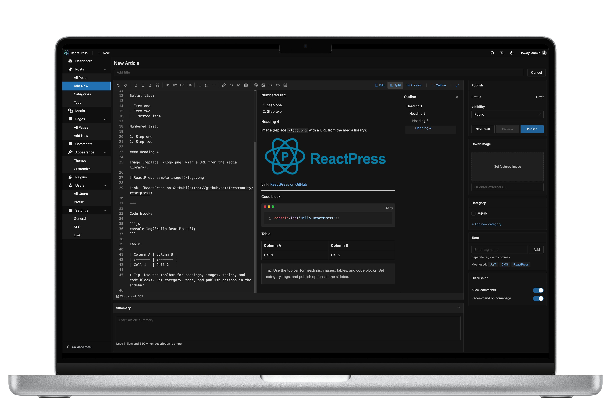
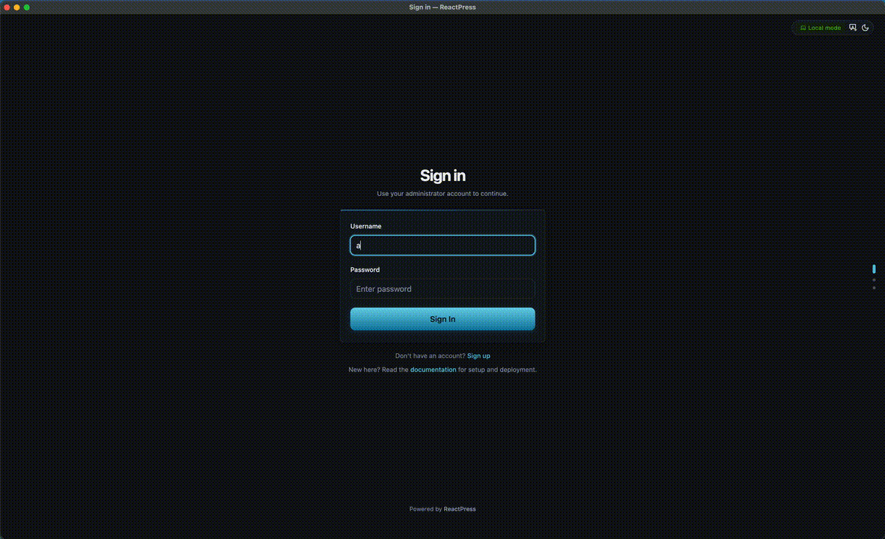
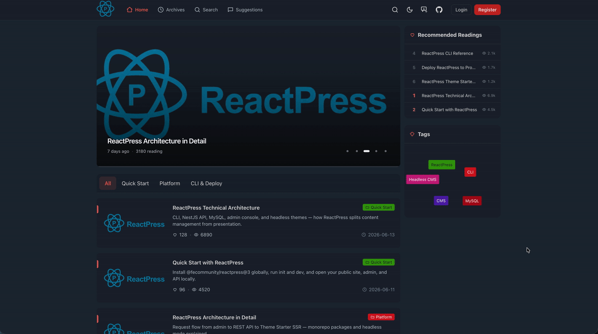
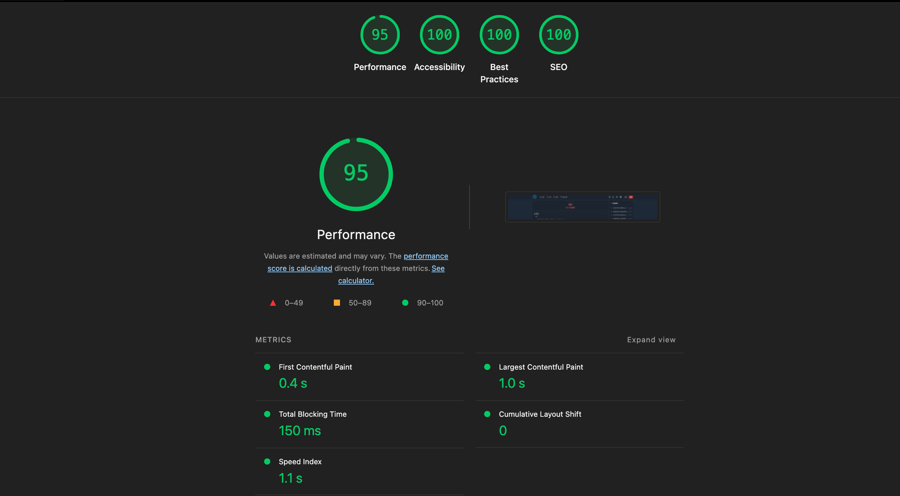
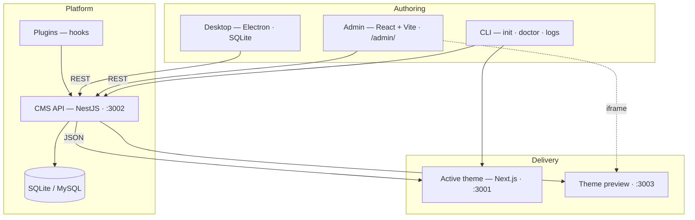
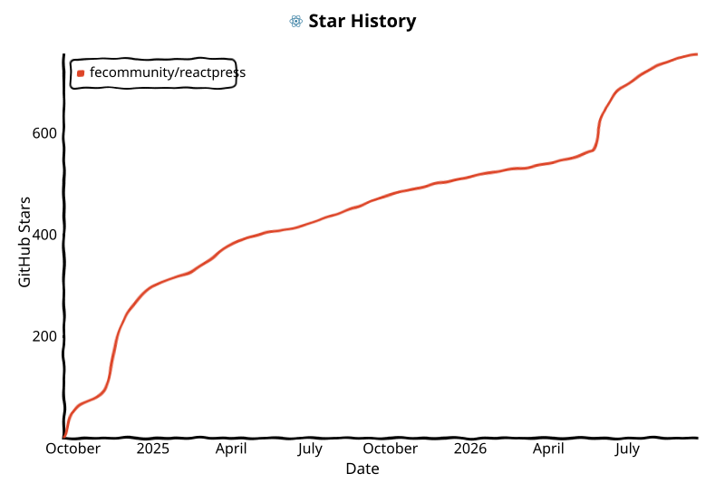

<div align="center">

<a href="https://blog.gaoredu.com" title="ReactPress">
  
</a>



# ReactPress

### The publishing system for React developers

One CLI for a self-hosted CMS, Admin, headless API, Next.js themes, plugins, and desktop writing — MIT licensed.

[Quick start](#quick-start) · [Live demo](https://blog.gaoredu.com) · [Theme demo](https://reactpress-theme-starter.vercel.app) · [Docs](https://docs.gaoredu.com/) · [中文](./README-zh_CN.md)

[](https://www.npmjs.com/package/@fecommunity/reactpress)
[](https://www.npmjs.com/package/@fecommunity/reactpress)
[](./LICENSE)
[](https://nodejs.org/)
[](https://github.com/fecommunity/reactpress/stargazers)
[](https://reactpress-theme-starter.vercel.app)


</div>

---

## Quick start

```bash
npm i -g @fecommunity/reactpress
mkdir my-site && cd my-site
reactpress init
```

| Surface     | URL                                              |
| :---------- | :----------------------------------------------- |
| Public site | http://localhost:3001                            |
| Admin       | http://localhost:3001/admin/ (`admin` / `admin`) |
| API health  | http://localhost:3002/api/health                 |

**Requirements:** [Node.js 20+](https://nodejs.org/). Default flow uses embedded SQLite — no Docker or external database.

If startup fails, run `reactpress doctor`.

> Current stable: **4.0.0** on npm `@latest`. Use `@beta` only for prereleases.

---

## See it in action

<div align="center">


<table>
  <tr>
    <td width="50%" align="center" valign="top">
      <a href="./desktop/README.md">
        
      </a>
      <br/>
      <sub><b>Desktop</b> — offline writing, sync when ready</sub>
    </td>
    <td width="50%" align="center" valign="top">
      <a href="https://reactpress-theme-starter.vercel.app">
        
      </a>
      <br/>
      <sub><b>Visitor site</b> — search · comments · knowledge base · dark mode</sub>
    </td>
  </tr>
</table>

<a href="https://reactpress-theme-starter.vercel.app">
  
</a>

<br/>

<sub>
  Official theme demo audit (screenshot): Performance <strong>95</strong>, Accessibility <strong>100</strong>, Best Practices <strong>100</strong>, SEO <strong>100</strong>.
  Re-run on your host and content for current numbers.
</sub>

</div>

---

## Why ReactPress?

WordPress-style editing is hard to replace. Headless CMS tools give you an API — then you still build admin, frontend, and ops. ReactPress is the middle path for React teams:

| Approach          | What you get                                   | What you still own             |
| :---------------- | :--------------------------------------------- | :----------------------------- |
| WordPress         | Mature editing                                 | PHP themes / coupled stack     |
| Static generators | Fast HTML                                      | Real CMS for non-developers    |
| Headless CMS      | Flexible API                                   | Admin + frontend + deploy glue |
| **ReactPress**    | CMS + Admin + API + themes + plugins + desktop | Your content and theme code    |

**Who it is for**

- React / Next.js developers who want a self-hosted blog or content site without assembling five repos
- Teams that need writers in an Admin UI and engineers owning a Next.js theme
- Anyone comparing WordPress alternatives, headless CMS options, or a Next.js blog stack

---

## Features

| Layer       | What ships today                                                              |
| :---------- | :---------------------------------------------------------------------------- |
| **CMS**     | Posts, pages, media, categories, tags                                         |
| **Admin**   | Writing UI at `/admin/` (same SPA in the browser and desktop)                 |
| **API**     | Headless REST + Swagger                                                       |
| **Themes**  | Swappable Next.js visitor frontends (npm-installable)                         |
| **Plugins** | Server hooks + optional Admin slots (`seo`, `hello-world`, `image-optimizer`) |
| **Desktop** | Electron + local SQLite mode; optional remote API + sync                      |
| **CLI**     | `init`, `doctor`, `logs`, `stop`                                              |

Content stays in the platform. Presentation stays in your theme (or any headless client).

---

## Comparison

|                           | ReactPress                  | WordPress       | Static sites  | Headless CMS        |
| :------------------------ | :-------------------------- | :-------------- | :------------ | :------------------ |
| Editing experience        | Yes                         | Yes             | No            | Partial             |
| Frontend freedom          | Yes                         | Limited         | Build-time    | Yes                 |
| Full stack out of the box | Yes                         | Via plugins     | No            | No                  |
| Time to first local site  | Minutes (`reactpress init`) | Often longer    | Fast per site | Setup + assembly    |
| Offline writing           | Desktop app                 | No              | No            | No                  |
| Default theme Performance | 95¹                         | Theme-dependent | Usually high  | Depends on frontend |

¹ Lighthouse **Performance** on the [official theme demo](https://reactpress-theme-starter.vercel.app) (screenshot above). Accessibility / Best Practices / SEO were 100 in that audit.

- **vs WordPress** — similar editorial workflow; Next.js delivery, no PHP theme lock-in for the public site.
- **vs static generators** — keep the speed; add a real CMS.
- **vs Strapi / Payload** — they ship a backend; ReactPress ships CMS + Admin + theme + desktop as one product.

---

## Themes

Replaceable Next.js frontends. Install and activate in **Admin → Appearance → Themes**.

```bash
npx create-next-app@latest my-blog \
  --example "https://github.com/fecommunity/reactpress-theme-starter" \
  --use-pnpm
cd my-blog && pnpm dev:mock
```

- Live: [reactpress-theme-starter.vercel.app](https://reactpress-theme-starter.vercel.app)
- Deploy: [](https://vercel.com/new/clone?repository-url=https://github.com/fecommunity/reactpress-theme-starter)
- Guide: [themes/README.md](./themes/README.md)

---

## Plugins

Extend the server without forking core. Manage in **Admin → Plugins**.

| Plugin            | Capability                                           |
| :---------------- | :--------------------------------------------------- |
| `seo`             | Slug, keywords, meta description + Admin editor slot |
| `hello-world`     | Auto-generate article summaries on publish           |
| `image-optimizer` | Batch WebP optimization for media                    |

Starter: [reactpress-plugin-starter](https://github.com/fecommunity/reactpress-plugin-starter) · Guide: [plugins/README.md](./plugins/README.md)

---

## Desktop

Same Admin UI, local-first. Local SQLite mode needs no Docker.

|             |                                                                                                                              |
| :---------- | :--------------------------------------------------------------------------------------------------------------------------- |
| Docs        | [Desktop client](https://docs.gaoredu.com/docs/tutorial-extras/desktop-client)                                               |
| Releases    | [GitHub Releases](https://github.com/fecommunity/reactpress/releases) (installers when the desktop workflow attaches assets) |
| From source | `pnpm dev:desktop` · `pnpm build:desktop`                                                                                    |

Details: [desktop/README.md](./desktop/README.md)

---

## Architecture


```mermaid
flowchart TB
  subgraph Authoring["Authoring"]
    CLI["CLI — init · doctor · logs"]
    Admin["Admin — React + Vite · /admin/"]
    Desktop["Desktop — Electron · SQLite"]
  end

  subgraph Core["Platform"]
    API["CMS API — NestJS · :3002"]
    Plugins["Plugins — hooks"]
    DB[("SQLite / MySQL")]
  end

  subgraph Delivery["Delivery"]
    Theme["Active theme — Next.js · :3001"]
    Preview["Theme preview · :3003"]
  end

  CLI --> API
  CLI --> Theme
  Admin -->|REST| API
  Desktop -->|REST| API
  Plugins --> API
  API --> DB
  API -->|JSON| Theme
  API --> Preview
  Admin -.->|iframe| Preview
```

| Package     | Role                                     |
| :---------- | :--------------------------------------- |
| `cli`       | Orchestration                            |
| `server`    | Business rules, auth, hooks, persistence |
| `web`       | Admin SPA                                |
| `themes/*`  | Visitor SSR/ISR                          |
| `plugins/*` | Incremental logic                        |
| `desktop`   | Electron shell over Admin                |
| `toolkit`   | Shared API client and contracts          |

Design notes: [ARCHITECTURE.md](./ARCHITECTURE.md)

---

## For developers

Headless by default:

```bash
curl -H "X-API-Key: YOUR_KEY" \
  "http://localhost:3002/api/article/headless/list?status=publish&page=1&pageSize=10"
```

| Resource        | Link                                                                                  |
| :-------------- | :------------------------------------------------------------------------------------ |
| Swagger (local) | http://localhost:3002/api                                                             |
| Theme starter   | [reactpress-theme-starter](https://github.com/fecommunity/reactpress-theme-starter)   |
| Plugin starter  | [reactpress-plugin-starter](https://github.com/fecommunity/reactpress-plugin-starter) |
| Docs            | [docs.gaoredu.com](https://docs.gaoredu.com/)                                         |

<details>
<summary><strong>CLI commands & local ports</strong></summary>

| Command                          | Action                                      |
| :------------------------------- | :------------------------------------------ |
| `reactpress` / `reactpress init` | Initialize and start (SQLite + API + theme) |
| `reactpress init --force`        | Re-initialize an existing project           |
| `reactpress doctor`              | Diagnose environment and URLs               |
| `reactpress logs`                | Tail API logs                               |
| `reactpress stop`                | Stop API and site services                  |

| Service     | URL / port                   |
| :---------- | :--------------------------- |
| Public site | http://localhost:3001        |
| Admin       | http://localhost:3001/admin/ |
| API         | http://localhost:3002/api    |

</details>

---

## Deploy

`reactpress init` runs a local production-style stack (SQLite API + theme with embedded Admin).

- Full-stack hosting (VPS, Docker, PM2, backups): [deployment docs](https://docs.gaoredu.com/)
- Theme-only: deploy [reactpress-theme-starter](https://github.com/fecommunity/reactpress-theme-starter) and point it at your API

---

## What's new in 4.0

Stable on npm `@latest` (codename **Extend**):

- Plugin system — Hook + `plugin.json` + Admin slots
- Desktop client — Electron + SQLite local mode, remote sync
- npm theme catalog — installable Next.js themes

[4.0 guide](./docs/tutorial/tutorial-extras/reactpress-4-0.md) · [Migrate from 3.x](./docs/tutorial/tutorial-extras/migration-3-to-4.md) · [Changelog](./CHANGELOG.md)

---

## Roadmap

| Item                                         | Tracking                                                   |
| :------------------------------------------- | :--------------------------------------------------------- |
| Plugin npm catalog (`reactpress plugin add`) | [#89](https://github.com/fecommunity/reactpress/issues/89) |
| Desktop tray / shortcuts / auto-update       | [#91](https://github.com/fecommunity/reactpress/issues/91) |
| Theme & plugin marketplace UI                | [#92](https://github.com/fecommunity/reactpress/issues/92) |

---

## FAQ

<details>
<summary><strong>Do I need Docker?</strong></summary>

Not for the default CLI flow — `reactpress init` uses embedded SQLite. Docker is only required when you configure MySQL via `embedded-docker` in `.reactpress/config.json`. Desktop local mode also uses SQLite without Docker.

</details>

<details>
<summary><strong>Can I use my own frontend?</strong></summary>

Yes. Use the headless REST API with API keys. Fork the [official theme starter](https://github.com/fecommunity/reactpress-theme-starter) or call `/api/article`, `/api/page`, and related endpoints.

</details>

<details>
<summary><strong>How is this different from WordPress?</strong></summary>

Similar admin-driven workflow, with a Next.js public site, a clean headless path, and no PHP theme stack for visitors.

</details>

<details>
<summary><strong>Is 4.0 production-ready?</strong></summary>

Yes. **4.0.0** is the current stable release on npm `@latest`. When upgrading from 3.x, validate on staging and read the [migration guide](./docs/tutorial/tutorial-extras/migration-3-to-4.md).

</details>

---

## Contributing

[CONTRIBUTING.md](./CONTRIBUTING.md) · [Code of Conduct](./CODE_OF_CONDUCT.md) · [SECURITY.md](./SECURITY.md)

[Issues](https://github.com/fecommunity/reactpress/issues) · [Pull requests](https://github.com/fecommunity/reactpress/pulls)

---

## License

[MIT](./LICENSE) · © ReactPress / [FECommunity](https://github.com/fecommunity)

---

<div align="center">

<p>
  If ReactPress saves you from wiring CMS + API + frontend yourself,
  <a href="https://github.com/fecommunity/reactpress/stargazers"><strong>star the repo</strong></a>
  so other React developers can find it.
</p>

<br/>

<!-- star-history:start -->
<picture>
  <source media="(prefers-color-scheme: dark)" srcset="public/star-history/star-history-dark.svg">
  
</picture>
<!-- star-history:end -->

</div>
