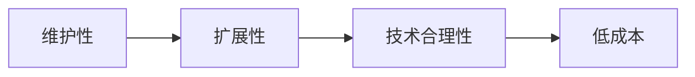
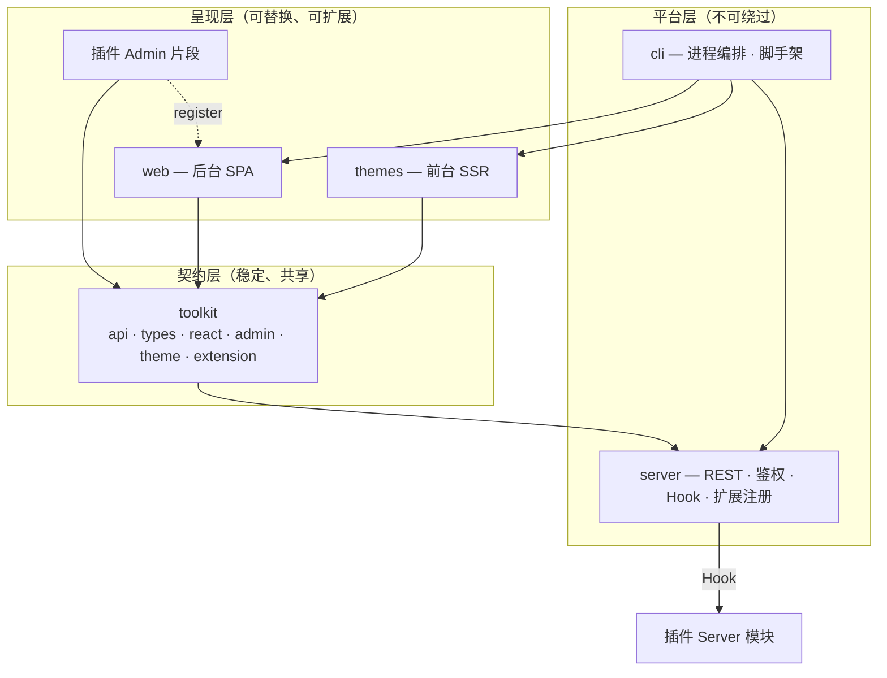
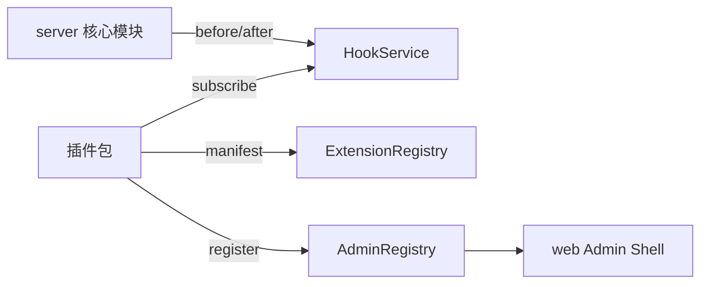
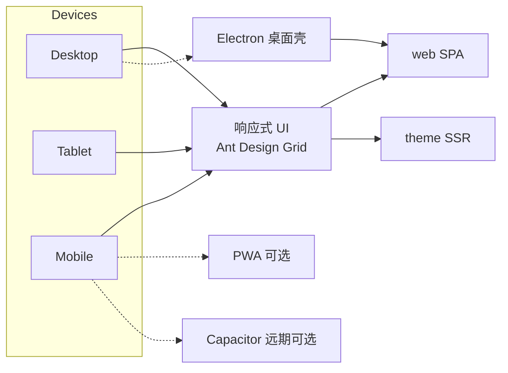
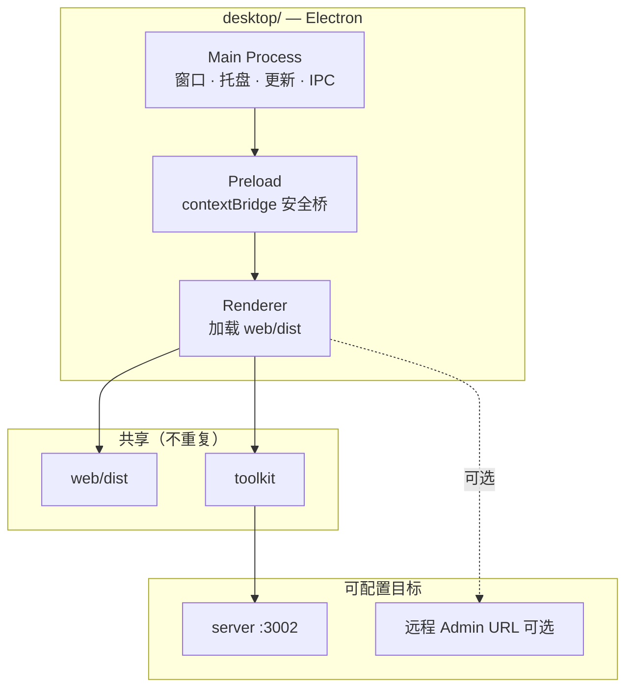
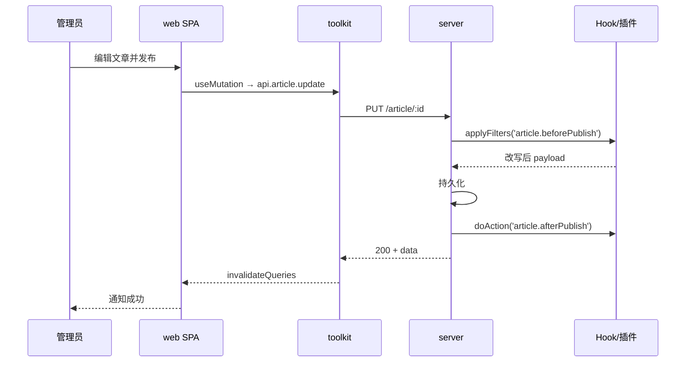
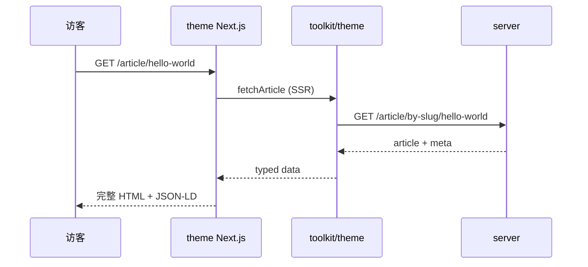

# ReactPress CMS 技术方案

类 WordPress 的内容管理平台：**后台管内容，主题管呈现，API 管数据，toolkit 管契约**。

---

## 1. 设计目标

### 1.1 功能范围

| 域 | 能力 |
|----|------|
| 内容 | 文章、分类、标签、评论、固定页面 |
| 媒体 | 上传、媒体库、存储（本地/OSS） |
| 外观 | 主题安装/激活/发布、站点定制 |
| 扩展 | 插件安装/启停/配置 |
| 系统 | 用户与权限、站点设置、数据导入导出与统计 |

### 1.2 非功能目标

| 目标 | 指标 |
|------|------|
| 后台速度 | Shell 常驻，路由切换感知 < 100ms；列表二次访问缓存命中 |
| 前台 SEO | 核心页 SSR/ISR；Lighthouse SEO ≥ 90 |
| 多端 | Desktop / Tablet / Mobile 一套 Web，响应式覆盖 |
| 数据一致 | 所有前端只通过 toolkit 访问 API |

### 1.3 四条设计准则

本方案所有取舍，均服从以下优先级：



| 准则 | 含义 | 落地手段 |
|------|------|----------|
| **维护性** | 改一处、测一处、边界清晰 | 分层 + Feature Module + 单一 API 客户端 + 类型自动生成 |
| **扩展性** | 核心少改、第三方可挂载 | Registry + Hook + manifest 契约 |
| **技术合理性** | 场景匹配技术，不堆栈 | Admin 用 SPA、公开页用 SSR、业务在 Server |
| **低成本** | 少进程、少代码库、少重复 | Monorepo 共享 toolkit；响应式代替原生 App |

---

## 2. 架构总览

### 2.1 三层 + 一核



**依赖规则（维护性硬约束）：**

```
web / themes / plugins  →  只能依赖 toolkit
toolkit                 →  只依赖 HTTP + 标准库（不依赖 Ant Design / Next）
server                  →  不依赖任何前端包
plugins/server          →  只能依赖 server 公开的 Hook 与 DI 接口
```

### 2.2 职责矩阵

| 包 | 唯一职责 | 渲染 | 是否 SEO |
|----|----------|------|----------|
| **server** | 业务规则、持久化、鉴权、扩展生命周期 | — | — |
| **web** | 管理员操作界面 | Vite CSR SPA | 否 |
| **themes/** | 访客看到的站点 | Next.js SSR/SSG/ISR | 是 |
| **toolkit** | API 客户端、类型、React 集成、扩展 schema | — | — |
| **plugins/** | 增量业务能力 | Server Hook + Web UI | 视插件而定 |
| **cli** | 本地开发/部署编排 | — | — |

**一条红线：** 后台不出现访客页，主题不出现 admin 路由。职责分离是长期维护成本最低的结构。

### 2.3 运行时

| 进程 | 默认端口 | 说明 |
|------|----------|------|
| server | 3002 | NestJS API |
| web | 3003 | 静态资源 + SPA fallback |
| active theme | 3001 | 当前激活主题的 Next.js 实例 |

三个进程独立部署、独立扩缩容。Admin 与 Theme 流量特征不同，分离比单体 Next 更合理。

---

## 3. 维护性设计

### 3.1 单一数据入口：toolkit

**问题：** 多处自建 HTTP 层 → 类型漂移、错误处理不一致、改 API 要改 N 处。

**方案：** 全平台只认 toolkit。

```
toolkit/
├── api/           # OpenAPI 自动生成，禁止手改
├── types/         # 与 api 同步
├── react/         # Client 工厂 + React Query hooks
├── admin/         # 后台共享 UI 与 Registry 类型
├── theme/         # 主题 SSR fetch + SEO helpers
└── extension/     # theme.json / plugin.json JSON Schema
```

```typescript
// 唯一客户端工厂
export function createClient(options: ClientOptions) {
  const http = createHttpClient(options);
  return {
    article: new Article(http),
    file: new File(http),
    extension: new Extension(http),
    // … 与 server controller 一一对应
  };
}
```

**维护收益：**

- Server 改接口 → 跑 codegen → 全仓 TypeScript 报错定位调用方
- 错误码、鉴权、重试逻辑只写一次
- 新模块（web / theme / 插件）零 HTTP 样板代码

### 3.2 Feature Module（垂直切片）

每个业务域自包含，避免「页面在一个目录、逻辑在另一个目录」的横向耦合。

```
web/src/modules/article/
├── index.ts          # 对外唯一出口：register(admin)
├── routes.tsx        # 本模块路由（TanStack Router）
├── pages/            # 页面（薄层，只组合 hooks + 组件）
├── components/       # 仅本模块使用的 UI
├── hooks/            # 数据与 URL 状态
├── schemas/          # Zod：表单 + API 边界校验
└── permissions.ts    # 本模块权限声明
```

**模块间禁止：**

- 直接 import 另一个 module 的内部组件
- 共享逻辑应上沉到 `toolkit/admin` 或 `web/src/shared`

**模块间允许：**

- 通过 Registry 注册菜单、设置 Tab、权限
- 通过 toolkit hooks 读同一份服务端数据

### 3.3 URL 即状态

列表页的筛选、分页、排序全部写入 URL searchParams：

```
/article?page=2&status=published&sort=-createdAt&keyword=react
```

| 收益 | 说明 |
|------|------|
| 可分享 | 管理员复制链接即可还原视图 |
| 可测试 | E2E 不依赖组件内部 state |
| 可缓存 | React Query 以 URL 参数为 queryKey |
| 与设备无关 | Desktop / Mobile 共用同一数据逻辑 |

### 3.4 代码生成边界

| 生成 | 手写 |
|------|------|
| `toolkit/api/*` | `toolkit/react/hooks/*` |
| `toolkit/types/*` | `toolkit/admin/components/*` |
| OpenAPI spec | Feature Module 业务 UI |

生成物不进 code review 讨论，减少无意义 diff。

---

## 4. 扩展性设计

对标 WordPress 的 `add_menu_page` / `add_action` / `add_filter`，但用 TypeScript 契约约束。

### 4.1 扩展模型



两类扩展，职责分离：

| 类型 | 扩展什么 | 载体 |
|------|----------|------|
| **主题** | 访客站点 UI | 独立 Next.js 包 + `theme.json` |
| **插件** | 业务逻辑 + 可选 Admin UI | Server 模块 + 可选 `admin/entry` |

### 4.2 Manifest 契约

**theme.json**

```json
{
  "id": "twentytwentyfive",
  "name": "Twenty Twenty-Five",
  "version": "1.0.0",
  "reactpress": {
    "requires": ">=3.5.0",
    "templates": {
      "home": "app/page.tsx",
      "single": "app/article/[slug]/page.tsx",
      "archive": "app/category/[slug]/page.tsx"
    },
    "supports": { "menus": ["primary", "footer"], "darkMode": true }
  }
}
```

**plugin.json**

```json
{
  "reactpress": {
    "type": "plugin",
    "id": "seo",
    "title": "SEO 增强",
    "server": { "module": "./dist/server.js" },
    "admin": { "entry": "./dist/admin.js" },
    "hooks": ["article.beforePublish", "article.afterPublish"],
    "permissions": ["setting:manage"]
  }
}
```

Schema 放在 `toolkit/extension`，CLI 安装时校验。非法包在启动前失败，而不是运行时报错。

### 4.3 Server Hook

```typescript
interface HookService {
  applyFilters<T>(name: string, value: T, ctx?: unknown): Promise<T>;
  doAction(name: string, payload?: unknown): Promise<void>;
}
```

**核心模块埋点（最小集）：**

| Hook | 时机 |
|------|------|
| `article.beforePublish` | 发布前改写字段 |
| `article.afterPublish` | 发布后通知、索引 |
| `comment.beforeCreate` |  spam 过滤 |
| `setting.beforeSave` | 校验扩展配置 |

Hook 是进程内调用，低延迟；跨系统通知走已有 Webhook，二者不混用。

### 4.4 Admin Registry

```typescript
interface AdminModule {
  id: string;
  register(ctx: AdminContext): void;
}

interface AdminContext {
  menu: MenuRegistry;       // 侧栏
  settings: SettingsRegistry; // 设置 Tab
  permissions: PermissionRegistry;
  routes: RouteRegistry;    // 可选：插件贡献路由
}
```

**核心模块与插件同一套 API：**

```typescript
// 核心
articleModule.register(admin);

// 插件（启动时 dynamic import）
for (const plugin of activePlugins) {
  const mod = await import(plugin.adminEntry);
  mod.register?.(admin);
}
```

新增官方功能 = 新增 module + `register()`，不改 Shell 源码。第三方插件同等对待。

### 4.5 主题切换策略

| 阶段 | 策略 | 理由 |
|------|------|------|
| MVP | 改 `activeTheme` 配置 + 重启主题进程 | 实现简单、SSR 稳定、无 runtime federation 复杂度 |
| 后期 | 热切换 / 多主题预览 | 有明确需求再做 |

扩展性不等于一步到位；MVP 选可演进的最简方案。

### 4.6 权限模型

```typescript
type Permission =
  | 'article:read' | 'article:write' | 'article:publish'
  | 'media:manage' | 'page:manage'
  | 'user:manage' | 'setting:manage'
  | 'extension:manage';
```

- Server：Guard 校验 JWT + Permission
- Web：`usePermission()` + 路由级 `<AuthGuard permission="…" />`
- 插件：manifest 声明 `permissions`，激活时合并进角色

字符串能力优于硬编码 `role === 'admin'`，新增角色不需改 Guard 逻辑。

---

## 5. 技术合理性

### 5.1 渲染策略：按场景选型

| 场景 | 技术 | 原因 |
|------|------|------|
| 后台 | **Vite + React SPA** | 无 SEO；CSR 首包小、HMR 快、部署为静态文件 |
| 前台主题 | **Next.js SSR/SSG/ISR** | 爬虫与社交分享需要完整 HTML |
| API | **NestJS REST** | 已有模块齐全；OpenAPI 生态成熟 |

**不采用的做法及原因：**

| 方案 | 为何不选 |
|------|----------|
| Admin 也用 Next.js | Admin 不需要 SSR/RSC，引入 routing + server 复杂度却无收益 |
| Admin 与 Theme 同应用 | 职责耦合、包体积互相拖累、无法独立部署 |
| GraphQL 替代 REST | 已有 Swagger 生成链；GraphQL 增加 schema 维护面 |
| 微前端（qiankun 等） | 团队与规模不匹配，Registry + dynamic import 足够 |

### 5.2 前端技术栈

| 层 | 选型 | 作用 |
|----|------|------|
| 构建 | Vite | 极速 dev、原生 ESM |
| 路由 | TanStack Router | 类型安全、文件路由、searchParams 一等公民 |
| 服务端状态 | TanStack Query | 缓存、重试、mutation 乐观更新 |
| 客户端状态 | Zustand（仅 auth/settings） | 轻量持久化，不滥用全局 store |
| UI | Ant Design 6 | 后台组件齐全、内置响应式 Grid |
| 校验 | Zod | 表单与 API 边界统一 |

状态分工：**URL 管列表态，React Query 管服务端数据，Zustand 管会话与 UI 偏好**。避免所有 state 进 Redux。

### 5.3 后台性能手段

| 手段 | 机制 |
|------|------|
| Shell 常驻 | 布局路由不 unmount，只换 `<Outlet />` |
| 路由级分割 | 每模块独立 chunk，首屏不加载编辑器 |
| 重型依赖懒加载 | 富文本、图表 `React.lazy()` |
| 列表缓存 | `staleTime: 30s`，切页 instant |
| Prefetch | 侧栏 hover 预载下一路由 chunk |

### 5.4 前台 SEO 手段

| 页面 | 模式 |
|------|------|
| 首页、文章、归档 | ISR `revalidate: 60` |
| 关于、隐私 | SSG |
| 搜索 | SSR |
| 评论提交 | CSR 岛屿组件 |

`toolkit/theme` 提供：

```typescript
fetchArticle(slug, { revalidate: 60 })
buildPageMeta(article)
buildJsonLd(article)
```

主题作者只调 helper，不重复写 SEO 样板。

### 5.5 Server 模块边界

```
server/src/modules/
├── article/ category/ tag/ comment/ page/ file/   # 内容域
├── user/ auth/                                      # 身份域
├── setting/ smtp/                                   # 配置域
├── view/ search/                                      # 数据域
├── extension/                                       # 主题/插件生命周期
├── hook/                                            # Action/Filter
└── menu/                                            # 导航（Admin 写、Theme 读）
```

每个 module：`controller → service → entity`，Controller 薄、Service 含业务与 Hook 调用。Extension 模块不实现业务，只管理安装态与激活态。

---

## 6. 低成本设计

### 6.1 成本模型

| 成本类型 | 控制策略 |
|----------|----------|
| **开发** | Monorepo + toolkit 复用；Feature Module 模板化新 CRUD |
| **运维** | Admin 静态托管；Theme 标准 Next 部署；API 单进程 |
| **多端** | 响应式 Web，不做 iOS/Android 原生 |
| **扩展** | manifest + Registry，不要求改核心 PR |
| **学习** | 栈收敛：React + Nest；主题作者只需会 Next + toolkit |

### 6.2 多端：一套 Web 覆盖三端



**断点统一**（与 Ant Design 对齐，全仓唯一标准）：

| 断点 | 宽度 | Admin 行为 | 主题行为 |
|------|------|------------|----------|
| `< md` | < 768px | Drawer 导航；表格→卡片 | 单列移动优先 |
| `md–lg` | 768–992px | 折叠侧栏 | 双列 |
| `≥ lg` | ≥ 992px | 固定侧栏 + 宽表 | 侧栏 + 主内容 |

**共享响应式组件**（`toolkit/admin`，避免每模块写三套）：

| 组件 | Desktop | Mobile |
|------|---------|--------|
| `ResponsiveTable` | Table | Card List |
| `ResponsiveFilterToolbar` | 横排 | 折叠 Drawer |
| `ResponsiveFormModal` | Modal | Bottom Drawer |

**原则：** API 无设备字段；差异只在 UI 层。列表 URL 在任意设备可分享。

**渐进路径（均低成本）：**

1. 默认：响应式 Web（零额外工程）
2. 可选：**Electron 桌面客户端**（加载同一 `web/dist`，见 §6.4）
3. 可选：PWA 只缓存 Shell 静态资源，API 不离线
4. 远期：Capacitor 包装 `web/dist`，不重写 UI

### 6.4 Electron 桌面客户端

Admin 桌面端采用 **Electron 壳 + 现有 web SPA**，不重写业务 UI，不 fork 一套 Admin 代码。

#### 6.4.1 架构定位



| 层 | 职责 |
|----|------|
| **web** | 全部 Admin UI 与业务逻辑（与浏览器版相同） |
| **toolkit** | API 客户端、鉴权、React Query（与浏览器版相同） |
| **desktop** | 仅 Main/Preload：窗口、托盘、快捷键、自动更新、原生对话框 |
| **server** | 仍独立进程或远程部署；**不嵌入 Electron**（首期） |

**原则：** Electron 是「容器 + 原生增强」，不是第二个 Admin 应用。

#### 6.4.2 加载模式

| 模式 | 场景 | 实现 |
|------|------|------|
| **A. 本地包（推荐）** | 离线安装、固定版本 | `BrowserWindow` 加载 `file://` 或 `app://` 协议下的 `web/dist/index.html` |
| **B. 远程 URL** | 内网统一发版、免重装 | 加载 `https://admin.example.com`，适合企业内网 |
| **C. 开发** | 本地联调 | 加载 `http://localhost:3000`（Vite dev） |

生产默认 **模式 A**：构建时把 `web/dist` 复制进 Electron 包，版本与 Web 对齐。

```typescript
// desktop/src/main/window.ts（示意）
const win = new BrowserWindow({
  width: 1280,
  height: 800,
  webPreferences: {
    preload: path.join(__dirname, 'preload.js'),
    contextIsolation: true,
    nodeIntegration: false, // 渲染进程禁止直接 require
  },
});

if (isDev) {
  win.loadURL('http://localhost:3000');
} else {
  win.loadFile(path.join(__dirname, '../renderer/index.html'));
}
```

#### 6.4.3 目录结构

```
reactpress/
├── web/                    # Admin SPA（已有）
├── desktop/                # 【新增】Electron 壳
│   ├── package.json
│   ├── electron.vite.config.ts   # 或 electron-builder 配置
│   ├── src/
│   │   ├── main/           # Main Process
│   │   │   ├── index.ts
│   │   │   ├── window.ts
│   │   │   ├── tray.ts
│   │   │   ├── shortcuts.ts
│   │   │   └── updater.ts
│   │   ├── preload/
│   │   │   └── index.ts    # contextBridge 暴露 desktop API
│   │   └── shared/
│   │       └── constants.ts
│   └── resources/          # 图标、entitlements（macOS）
└── toolkit/
    └── react/
        └── runtime.ts      # isElectron / getDesktopApi()
```

**构建流水线：**

```bash
pnpm --dir web build          # 产出 web/dist
pnpm --dir desktop build      # 打包 dist + electron → .dmg / .exe / .AppImage
```

CLI 可选命令：`reactpress desktop dev` / `reactpress desktop build`。

#### 6.4.4 原生能力与 toolkit 桥接

渲染进程（React）**不直接**调 Electron API，通过 Preload + toolkit 统一抽象：

```typescript
// desktop/src/preload/index.ts
contextBridge.exposeInMainWorld('reactpressDesktop', {
  getApiBaseUrl: () => ipcRenderer.invoke('config:getApiBaseUrl'),
  setApiBaseUrl: (url: string) => ipcRenderer.invoke('config:setApiBaseUrl', url),
  showSaveDialog: (opts) => ipcRenderer.invoke('dialog:save', opts),
  onDeepLink: (cb) => ipcRenderer.on('deep-link', cb),
  platform: process.platform,
});

// toolkit/src/react/runtime.ts
export function getRuntime() {
  if (typeof window !== 'undefined' && 'reactpressDesktop' in window) {
    return 'electron' as const;
  }
  return 'web' as const;
}

export function getDesktopApi() {
  return (window as any).reactpressDesktop as DesktopApi | undefined;
}
```

**首期原生能力（低成本、高价值）：**

| 能力 | Main Process | Web 侧调用 |
|------|--------------|------------|
| 配置 API 地址 | 读写本地 config.json | 首次启动向导 |
| 全局快捷键 | `globalShortcut` | 保存 `Ctrl+S`、搜索 `Ctrl+K` |
| 系统托盘 | `Tray` | 最小化到托盘、快速打开 |
| 原生通知 | `Notification` | 发布成功、评论待审 |
| 导出文件 | `dialog.showSaveDialog` | 数据导出 JSON/CSV |
| 自动更新 | `electron-updater` | 检查新版本 |

**二期可选：** 深度链接（`reactpress://article/123`）、开机自启、本地 server 一键启动（spawn `server` 子进程）。

#### 6.4.5 鉴权与存储

| 项 | 浏览器 Web | Electron |
|----|------------|----------|
| Token 存储 | `localStorage` / Zustand persist | 同左，或 IPC 存 `safeStorage`（加密） |
| Refresh | toolkit `onUnauthorized` | 同左 |
| Cookie | 可选 | 一般不用；Bearer JWT 即可 |
| 多账号 | 单 profile | 可选：每窗口独立 session partition |

**不在 Electron 内嵌数据库或 server 逻辑**——保持 headless API 单一事实来源，避免桌面版与 Web 版数据不一致。

#### 6.4.6 安全

| 规则 | 说明 |
|------|------|
| `contextIsolation: true` | 必须 |
| `nodeIntegration: false` | 渲染进程禁用 Node |
| Preload 白名单 IPC | Main 只暴露命名 channel，校验 payload |
| `webSecurity: true` | 禁止随意加载远程脚本 |
| 远程 URL 模式 | 仅允许配置的 admin 域名（CSP / allowlist） |
| 自动更新 | 签名校验 + HTTPS 更新源 |

#### 6.4.7 与 Tauri 对比（为何选 Electron）

| 维度 | Electron | Tauri |
|------|----------|-------|
| 包体积 | 较大（~80MB+） | 小 |
| 生态 | 成熟（updater、tray、builder） | 成长中 |
| 团队成本 | 文档多、案例多 | Rust 主进程学习曲线 |
| Web 兼容 | Chromium，与 Admin 栈一致 | WebView 差异需额外测 |
| **本方案** | **推荐** | 体积敏感时可替换壳，web/toolkit 不变 |

桌面壳可替换，**web + toolkit 不变**——这是架构可扩展的关键。

#### 6.4.8 现在就要预留（实现 Web 时）

| 预留 | 做法 |
|------|------|
| API 地址可配置 | `VITE_API_BASE_URL` + runtime 覆盖（Electron 读本地配置） |
| 不依赖 `window.open` 关键流程 | 外链用 `shell.openExternal`（Preload 封装） |
| 快捷键不硬绑浏览器默认 | 编辑器保存等走应用级 shortcut |
| 运行时检测 | `toolkit/react/runtime.ts` 的 `getRuntime()` |
| 原生能力可选降级 | `getDesktopApi()?.showSaveDialog ?? 浏览器 download` |

**不必预留：** Electron 专用 API 字段、第二套 Admin 路由、嵌入式 server。

#### 6.4.9 实施阶段

| 阶段 | 内容 | 周期（估） |
|------|------|------------|
| D0 | `desktop/` 脚手架；dev 加载 Vite；生产加载 `web/dist` | 2～3 天 |
| D1 | API 地址配置、登录全流程、打包 macOS/Windows | 3～5 天 |
| D2 | 托盘、快捷键、原生通知 | 2～3 天 |
| D3 | `electron-updater` 自动更新 | 2～3 天 |
| D4 | 导出/打开对话框、深度链接（可选） | 按需 |

**前置条件：** web 已接 toolkit 真实 API（步骤 1～2 完成）后再做 D0，否则壳子无内容可载。

#### 6.4.10 验收标准

- 安装包打开即为 Admin 登录页，登录后功能与浏览器版一致
- 未改 server、未复制业务组件，仅新增 `desktop/` 包
- macOS / Windows 各一安装包；自动更新可用
- 包体积与内存可接受（Admin 场景通常可接受 Electron 体积）

### 6.5 不做的清单（控成本）

| 不做 | 原因 |
|------|------|
| 独立 Mobile Admin App | 响应式 Web 覆盖 90% 运维场景 |
| Electron 内嵌 server/DB | 保持 headless API；桌面版连本地或远程 server |
| Electron 重写 Admin UI | 只壳化 `web/dist` |
| 插件市场 runtime 沙箱（首期） | 本地目录 + 签名校验足够 |
| 主题 runtime federation | 独立进程 + 重启更简单可靠 |
| 多数据库 / 多租户（首期） | 单站点 CMS 场景优先 |
| 自研 ORM / 自研 UI 库 | 用 TypeORM + Ant Design |

---

## 7. 功能模块设计

### 7.1 路由规划

| 模块 | 路由 | 依赖 API |
|------|------|----------|
| 仪表盘 | `/` | view, article 统计 |
| 文章 | `/article`, `/article/editor/:id?` | article, category, tag |
| 评论 | `/article/comment` | comment |
| 媒体 | `/media` | file |
| 页面 | `/page`, `/page/editor/:id?` | page |
| 外观 | `/appearance/themes`, `/appearance/customize` | extension, setting |
| 插件 | `/plugins`, `/plugins/:id/settings` | extension |
| 用户 | `/users`, `/profile` | user |
| 设置 | `/settings/:tab` | setting, smtp, api-key, webhook |
| 数据 | `/data/analytics`, `/data/export`, `/data/import` | view, search, 新增 export |

### 7.2 模块注册示例

```typescript
export const articleModule: AdminModule = {
  id: 'article',
  register({ menu, permissions }) {
    menu.register({
      id: 'content',
      title: '内容',
      children: [
        { id: 'article.list', title: '文章', path: '/article' },
        { id: 'article.new', title: '写文章', path: '/article/editor' },
        { id: 'article.comment', title: '评论', path: '/article/comment' },
      ],
    });
    permissions.register(['article:read', 'article:write', 'article:publish']);
  },
};
```

Shell 启动时 `bootstrap()` 依次 `register` 核心模块，再加载已激活插件。菜单顺序由 `sort` 字段控制，不靠文件 import 顺序。

### 7.3 设置页结构

用路由替代 Tab 查询参数：

```
/settings/general
/settings/reading
/settings/discussion
/settings/email
/settings/storage
/settings/seo
/settings/api-keys
/settings/webhooks
```

插件通过 `settings.registerTab({ id, title, path, permission })` 插入 Tab，无需改 settings 页面源码。

---

## 8. 数据流





---

## 9. 目录结构

```
reactpress/
├── server/                 # NestJS API
├── web/                    # Admin SPA（Vite）
│   └── src/
│       ├── shell/          # Layout、Registry、bootstrap
│       ├── modules/        # Feature Modules
│       └── shared/         # 仅 web 内共享
├── themes/
│   ├── hello-world/        # 官方入门主题（只读模板）
│   ├── twentytwentyfive/
│   ├── twentytwentysix/
│   └── …
├── .reactpress/
│   ├── active-theme.json
│   └── runtime/            # 安装后的临时运行时副本
│   │   └── twentytwentyfive/
│   └── {theme-id}/         # 用户安装后的可编辑副本（gitignore）
├── plugins/                # 官方插件示例
│   └── seo/
├── desktop/                # Electron 壳（可选，加载 web/dist）
├── toolkit/                # 共享 SDK
│   ├── api/ types/
│   ├── react/ admin/ theme/ extension/
│   │   └── runtime.ts      # web | electron 运行时检测
└── cli/                    # dev / build / theme / plugin / desktop 命令
```

---

## 10. 关键决策汇总

| 决策 | 选择 | 维护性 | 扩展性 | 合理性 | 成本 |
|------|------|--------|--------|--------|------|
| API 访问 | toolkit 唯一入口 | ★★★ | ★★ | ★★★ | 低 |
| 后台框架 | Vite SPA | ★★ | ★★ | ★★★ | 低 |
| 前台框架 | Next.js SSR/ISR | ★★ | ★★★ | ★★★ | 中 |
| 模块组织 | Feature Module + Registry | ★★★ | ★★★ | ★★ | 低 |
| 插件 | Hook + manifest | ★★ | ★★★ | ★★★ | 中 |
| 主题 | 独立进程 + theme.json | ★★ | ★★★ | ★★★ | 中 |
| 列表状态 | URL searchParams | ★★★ | ★★ | ★★★ | 低 |
| 多端 | 响应式 Web + Electron 壳 | ★★★ | ★★ | ★★★ | 中 |
| 类型 | OpenAPI codegen | ★★★ | ★★ | ★★★ | 低 |

---

## 11. 验收标准

| 维度 | 标准 |
|------|------|
| 维护性 | 新 CRUD 模块 ≤ 1 个目录 + 1 次 `register()`；改 API 只改 server + 跑 codegen |
| 扩展性 | 官方 SEO 插件不改 core 代码即可挂载菜单与 Hook |
| 性能 | Admin 路由切换 < 100ms；主题 SEO ≥ 90 |
| 多端 | 390px 无意外横滚；核心流程三视口 E2E 通过 |
| 一致性 | web / themes / plugins 无自建 HTTP 客户端 |

---

## 12. 实施顺序建议

按依赖关系排列，而非按「迁移旧代码」排列：

| 步 | 内容 | 产出 |
|----|------|------|
| 1 | toolkit `createClient` + React Query hooks | 数据层就绪 |
| 2 | web Shell + Registry + 鉴权 | 空壳可登录 |
| 3 | article 模块（列表 + 编辑） | Feature Module 样板 |
| 4 | media / page / user / settings | 核心 CRUD 闭环 |
| 5 | server extension + hook | 扩展后端 |
| 6 | appearance / plugins 管理页 | 扩展前端 |
| 7 | 主题 theme.json + CLI 命令 | 主题生态 |
| 8 | Responsive 组件 + E2E 三视口 | 多端验收 |
| 9 | 数据导入导出 + PWA（可选） | 运维增强 |
| 10 | **desktop/ Electron 壳**（可选） | macOS/Windows 安装包 |

每一步可独立交付、独立验证，不要求 Big Bang 切换。**Electron（步骤 10）依赖 web 接 toolkit 完成（步骤 1～2）后启动。**
