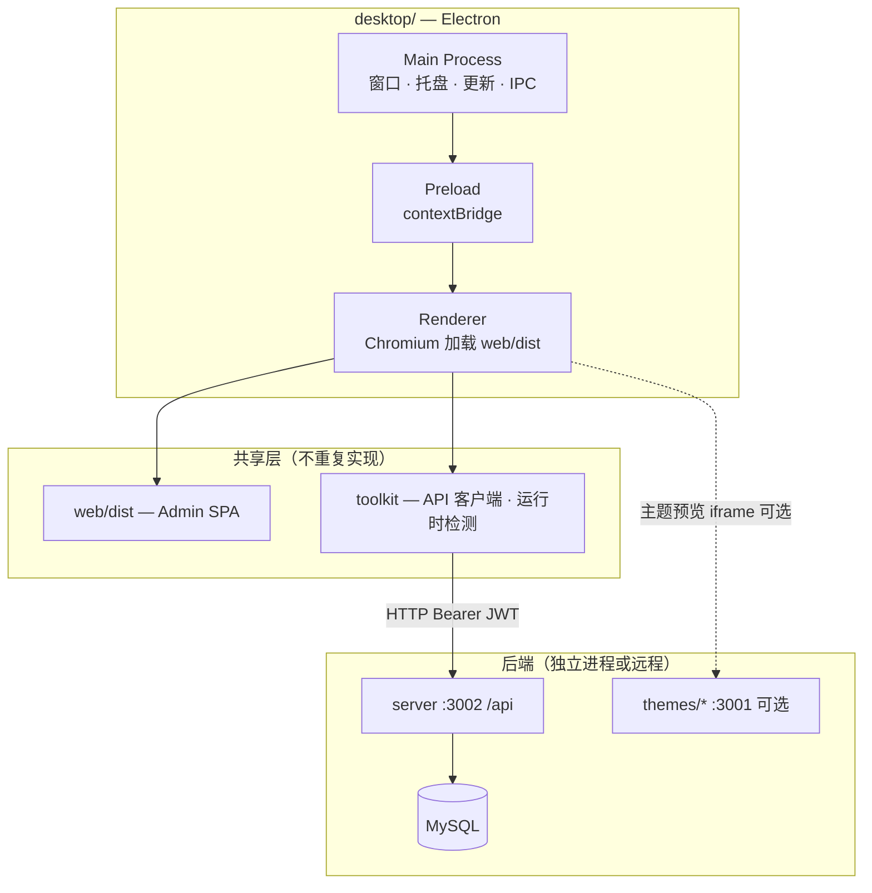

# ReactPress Desktop 技术方案

> ReactPress 3.0 — Admin 桌面客户端（Electron）  
> 版本：v0.1（草案）  
> 关联文档：[ARCHITECTURE.md](../ARCHITECTURE.md)、[design.md §6.4](../design.md#64-electron-桌面客户端)

---

## 目录

- [1. 背景与目标](#1-背景与目标)
- [2. 设计原则](#2-设计原则)
- [3. 总体架构](#3-总体架构)
- [4. Web 与 Desktop 双模式](#4-web-与-desktop-双模式)
- [5. 目录结构](#5-目录结构)
- [6. 渲染加载模式](#6-渲染加载模式)
- [7. Web 侧适配（前置条件）](#7-web-侧适配前置条件)
- [8. Preload / IPC / DesktopApi 契约](#8-preload--ipc--desktopapi-契约)
- [9. 配置管理](#9-配置管理)
- [10. 鉴权与本地存储](#10-鉴权与本地存储)
- [11. 原生能力](#11-原生能力)
- [12. 构建与打包](#12-构建与打包)
- [13. 开发与调试](#13-开发与调试)
- [14. 安全设计](#14-安全设计)
- [15. 插件与主题边界](#15-插件与主题边界)
- [16. API 连接模式](#16-api-连接模式)
- [17. 实施阶段](#17-实施阶段)
- [18. 测试与验收](#18-测试与验收)
- [19. 风险与约束](#19-风险与约束)
- [20. 不做清单](#20-不做清单)
- [21. 远期演进](#21-远期演进)
- [附录 A：环境变量](#附录-a环境变量)
- [附录 B：IPC Channel 清单](#附录-bipc-channel-清单)
- [附录 C：端口参考](#附录-c端口参考)

---

## 1. 背景与目标

### 1.1 背景

ReactPress 当前以 **Web Admin SPA + 独立 NestJS API + Next.js 主题** 的多进程架构运行。管理员通过浏览器访问 `/admin/` 进行内容管理，部署依赖 nginx + PM2 + MySQL。

为降低非技术用户的使用成本，需要增加 **桌面安装版**：用户安装后即可打开图形界面管理博客，无需手动配置浏览器地址或记忆命令行。

### 1.2 目标

| 目标 | 说明 |
|------|------|
| **双模式并存** | 同一套 Admin UI 同时支持浏览器 Web 与 Electron 桌面，不 fork 业务代码 |
| **降低使用门槛** | 安装包双击打开 → 配置 API → 登录 → 完整 Admin 功能 |
| **架构零侵入** | `server`、`themes`、插件 Server 端逻辑不变；仅新增 `desktop/` 壳层 + 少量 Web 适配 |
| **可演进** | 桌面壳可替换（Electron ↔ Tauri）；`web` + `toolkit` 保持稳定 |

### 1.3 非目标（首期）

- 不在 Electron 内嵌 MySQL / NestJS（保持 headless API 单一事实来源）
- 不重写 Admin UI 或新增桌面专用路由
- 不实现访客站（`themes/*`）离线渲染
- 不做独立 Mobile Admin App

---

## 2. 设计原则

1. **Electron 是容器，不是第二个 Admin** — 只负责窗口、原生能力、配置持久化；业务逻辑全在 `web/`。
2. **共享 `web/dist`** — 生产构建产物与 Web 版一致，通过不同 Vite mode 区分资源 base 与默认 API 地址。
3. **渲染进程零 Node** — `contextIsolation: true`、`nodeIntegration: false`；Electron API 仅通过 Preload 白名单暴露。
4. **API 地址运行时可配** — 桌面版不依赖 nginx 同源 `/api`；通过 Preload + `toolkit.resolveApiBaseUrl()` 动态解析。
5. **原生能力可选降级** — Web 侧统一通过 `getDesktopApi()?.xxx ?? 浏览器 fallback` 调用，保证双模式代码路径一致。

---

## 3. 总体架构



### 3.1 职责矩阵

| 包 | 职责 | Desktop 是否改动 |
|----|------|------------------|
| **web** | Admin UI、路由、状态、表单 | 少量适配（API 解析、设置页、构建 profile） |
| **toolkit** | API 客户端、`getRuntime()`、`resolveApiBaseUrl()` | 已实现，无需改或仅扩展 `DesktopApi` |
| **desktop** | Main / Preload / 打包 / 原生能力 | **新增** |
| **server** | REST API、鉴权、插件 Hook | 不改；远程模式需开 CORS |
| **themes** | 访客站 SSR | 不改；预览仍依赖运行中主题服务 |
| **cli** | 进程编排 | 可选新增 `desktop dev` / `desktop build` |

---

## 4. Web 与 Desktop 双模式

```
┌─────────────────────────────────────────────────────────────┐
│                     同一套 Admin 源码（web/）                 │
│         Vite build — mode: production | electron            │
└──────────────────────┬──────────────────┬───────────────────┘
                       │                  │
              浏览器 + nginx           Electron 安装包
           BASE=/admin/ 相对 /api      BASE=./ 绝对 API URL
                       │                  │
                       └────────┬─────────┘
                                ▼
                     server :3002（本地或远程）
                                ▼
                              MySQL
```

| 维度 | Web（浏览器） | Desktop（Electron） |
|------|---------------|---------------------|
| 分发 | nginx 静态资源 + ECS 部署 | `.dmg` / `.exe` / `.AppImage` |
| 资源 base | `VITE_ADMIN_BASE=/admin/` | `base: './'` |
| API 地址 | 同源 `/api`（nginx 反代） | 绝对 URL，Preload 持久化配置 |
| 鉴权 | JWT → `localStorage` | 同左 |
| MSW Mock | 开发可选 | **生产必须关闭** |
| 外链 | `window.open` / `<a>` | 推荐 `openExternal` |
| 文件导出 | Blob + `<a download>` | 可选原生保存对话框 |
| 自动更新 | 无 | `electron-updater` |

两套模式 **并行发布、互不影响**：Web 继续走现有 CI/CD；Desktop 独立 workflow 打包。

---

## 5. 目录结构

```
reactpress/
├── web/                          # Admin SPA（已有）
│   ├── .env.production           # Web 生产：/admin/ + /api
│   ├── .env.electron             # 【新增】Desktop 生产：./ + 默认本地 API
│   └── src/
│       ├── shared/client.ts      # getToolkitClient（已接 resolveApiBaseUrl）
│       └── utils/http.ts         # 【待改】统一 API 地址解析
│
├── desktop/                      # 【新增】Electron 壳
│   ├── design.md                 # 本文档
│   ├── package.json
│   ├── electron-builder.yml      # 或 electron-builder 配置段
│   ├── tsconfig.json
│   ├── src/
│   │   ├── main/
│   │   │   ├── index.ts          # app 生命周期、单实例锁
│   │   │   ├── window.ts         # BrowserWindow 创建与加载策略
│   │   │   ├── config.ts         # 读写 userData/config.json
│   │   │   ├── ipc.ts            # IPC handler 注册
│   │   │   ├── tray.ts           # 系统托盘（D2）
│   │   │   ├── shortcuts.ts      # 全局快捷键（D2）
│   │   │   └── updater.ts        # 自动更新（D3）
│   │   ├── preload/
│   │   │   └── index.ts          # contextBridge → reactpressDesktop
│   │   └── shared/
│   │       ├── constants.ts      # 默认 API URL、窗口尺寸
│   │       └── types.ts          # IPC payload 类型
│   └── resources/
│       ├── icon.icns             # macOS
│       ├── icon.ico              # Windows
│       └── entitlements.mac.plist
│
└── toolkit/
    └── src/plugin/client/
        └── runtime.ts            # getRuntime / getDesktopApi / resolveApiBaseUrl（已有）
```

**Monorepo 注册：** 在 `pnpm-workspace.yaml` 增加 `'desktop'`。

---

## 6. 渲染加载模式

| 模式 | 场景 | 实现 | 优先级 |
|------|------|------|--------|
| **A. 本地包** | 正式发布、固定版本 | `win.loadFile(.../web/dist/index.html)` 或自定义 `app://` 协议 | 生产默认 |
| **B. 远程 URL** | 企业内网统一发版 | `win.loadURL('https://admin.example.com')` + 域名白名单 | 可选 |
| **C. 开发** | 本地联调 | `win.loadURL('http://localhost:3000')` + Vite HMR | 开发默认 |

### 6.1 模式 A：本地包（推荐）

构建时将 `web/dist` 复制到 Electron 包的 `resources/renderer/`（或等价路径），Main Process 通过 `loadFile` 加载。

```typescript
// desktop/src/main/window.ts（示意）
const win = new BrowserWindow({
  width: 1280,
  height: 800,
  minWidth: 960,
  minHeight: 640,
  show: false,
  webPreferences: {
    preload: path.join(__dirname, '../preload/index.js'),
    contextIsolation: true,
    nodeIntegration: false,
    sandbox: true,
    webSecurity: true,
  },
});

win.once('ready-to-show', () => win.show());

if (app.isPackaged) {
  win.loadFile(path.join(process.resourcesPath, 'renderer/index.html'));
} else {
  win.loadURL(process.env.VITE_DEV_SERVER_URL ?? 'http://localhost:3000');
}
```

### 6.2 自定义协议（可选优化）

若 `file://` 下遇到资源路径或 CORS 边缘问题，可注册 `app://` 协议：

```typescript
protocol.registerFileProtocol('app', (request, callback) => {
  const url = request.url.replace('app://', '');
  callback({ path: path.normalize(path.join(rendererRoot, url)) });
});
```

首期优先 `loadFile`；遇阻再切 `app://`。

### 6.3 模式 B：远程 URL

适用于「桌面壳只做窗口容器，Admin 始终从服务器加载」的企业场景。

- Main 只允许加载配置中的 admin 域名（allowlist）
- 此模式下 **不需要** 打包 `web/dist`，包体更小
- 功能与浏览器版完全一致，原生增强（托盘、快捷键）仍可用

---

## 7. Web 侧适配（前置条件）

Desktop 壳可载内容之前，Web 需完成以下适配。**这是 D0 的前置阻塞项。**

### 7.1 统一 API 地址解析

当前存在两条 HTTP 路径：

| 路径 | 实现 | Desktop 兼容 |
|------|------|--------------|
| **Toolkit 客户端** | `getToolkitClient()` → `resolveApiBaseUrl()` | ✅ 已兼容 |
| **Legacy httpClient** | `web/src/utils/http.ts`，构建时静态 `API_BASE_URL` | ❌ 需改造 |
| **文件上传** | `web/src/shared/api/uploadFile.ts`，静态 `API_BASE_URL` | ❌ 需改造 |

**待改造文件（约 5～8 个）：**

- `web/src/utils/http.ts` — `buildUrl` 改为 async，启动时或每次请求前调用 `resolveApiBaseUrl()`
- `web/src/shared/api/uploadFile.ts` — 同上
- `web/src/routes/login/index.tsx` — 登录走统一客户端
- `web/src/shared/auth/session.ts` — `fetchSessionFromMockApi` / 部分 session 逻辑
- `web/src/modules/article/pages/ArticleEditorPage.tsx` — 保存接口
- `web/src/modules/page/pages/PageEditorPage.tsx` — 保存接口
- `web/src/modules/user/userListApi.ts` — 用户 CRUD
- `web/src/modules/comment/pages/CommentListPage.tsx` — 评论审核

**推荐方案：** 在 `http.ts` 中增加 `getApiBaseUrl(): Promise<string>`，内部调用 toolkit 的 `resolveApiBaseUrl(API_BASE_URL)`，所有 `httpClient` 请求经此解析。长期可逐步迁移到 `getToolkitClient()`。

### 7.2 Electron 专用构建 Profile

新增 `web/.env.electron`：

```env
# Electron 生产构建 — 相对资源路径 + 默认本地 API
VITE_ADMIN_BASE=./
VITE_API_BASE_URL=http://127.0.0.1:3002/api
VITE_AUTH_MODE=server
VITE_ENABLE_MOCK=false
```

`web/vite.config.ts` 在 `mode === 'electron'` 时使用 `base: './'`。

根目录脚本：

```json
"build:web:electron": "pnpm run --dir ./toolkit build && pnpm run --dir ./web build -- --mode electron"
```

### 7.3 首次启动 / 设置页

Desktop 首次打开时，若 Preload 返回的 API 地址不可达，展示 **连接向导**：

1. 输入 API 地址（如 `http://127.0.0.1:3002/api` 或 `https://api.example.com/api`）
2. 测试连通性（`GET /api/health` 或等价端点）
3. 保存至 Main Process 本地配置
4. 调用 `resetToolkitClient()` 刷新客户端

设置页（Settings）增加「API 服务器」区块，复用同一 UI，仅 Electron 运行时显示。

### 7.4 MSW 禁用

Desktop 生产包 **必须** `VITE_ENABLE_MOCK=false`。`main.tsx` 已有逻辑：非 DEV 且未显式开启时不启动 MSW。Electron 构建 profile 中写死即可。

### 7.5 路由 basepath

TanStack Router 在 `main.tsx` 中根据 `import.meta.env.BASE_URL` 设置 `basepath`。Electron 模式下 `BASE_URL=./`，路由 basepath 为空或 `/`，与 Web 的 `/admin` 子路径不同 — 由构建 profile 自动处理，无需硬编码。

---

## 8. Preload / IPC / DesktopApi 契约

### 8.1 设计约束

- 渲染进程 **禁止** 直接 `require('electron')`
- 所有跨进程通信走 **命名 IPC channel**，Main 侧校验 payload
- Web 侧 **禁止** 直接访问 `window.reactpressDesktop`，统一通过 `toolkit.getDesktopApi()`

### 8.2 DesktopApi 接口（toolkit 已有）

```typescript
// toolkit/src/plugin/client/runtime.ts
export interface DesktopApi {
  getApiBaseUrl: () => Promise<string>;
  setApiBaseUrl: (url: string) => Promise<void>;
  showSaveDialog: (opts: { defaultPath?: string }) => Promise<string | undefined>;
  openExternal: (url: string) => Promise<void>;
  platform: NodeJS.Platform;
}
```

### 8.3 Preload 暴露

```typescript
// desktop/src/preload/index.ts
import { contextBridge, ipcRenderer } from 'electron';

contextBridge.exposeInMainWorld('reactpressDesktop', {
  getApiBaseUrl: () => ipcRenderer.invoke('config:getApiBaseUrl'),
  setApiBaseUrl: (url: string) => ipcRenderer.invoke('config:setApiBaseUrl', url),
  showSaveDialog: (opts: { defaultPath?: string }) =>
    ipcRenderer.invoke('dialog:save', opts),
  openExternal: (url: string) => ipcRenderer.invoke('shell:openExternal', url),
  platform: process.platform,
});
```

### 8.4 Web 侧调用示例

```typescript
import { getDesktopApi, getRuntime, resolveApiBaseUrl } from '@fecommunity/reactpress-toolkit/plugin/react';

// 运行时检测
if (getRuntime() === 'electron') { /* 显示桌面专属 UI */ }

// API 地址（getToolkitClient 内部已调用）
const base = await resolveApiBaseUrl(import.meta.env.VITE_API_BASE_URL || '/api');

// 外链
await getDesktopApi()?.openExternal('https://github.com/...');

// 导出文件
const savePath = await getDesktopApi()?.showSaveDialog({ defaultPath: 'export.json' });
if (savePath) { /* 写入文件 via IPC 或浏览器 fallback */ }
```

### 8.5 API 地址变更时刷新客户端

```typescript
// web/src/shared/client.ts（已有 resetToolkitClient）
await getDesktopApi()?.setApiBaseUrl(newUrl);
resetToolkitClient();
```

---

## 9. 配置管理

### 9.1 存储位置

| 平台 | 路径 |
|------|------|
| macOS | `~/Library/Application Support/ReactPress/config.json` |
| Windows | `%APPDATA%/ReactPress/config.json` |
| Linux | `~/.config/ReactPress/config.json` |

使用 Electron `app.getPath('userData')`，不写入安装目录。

### 9.2 配置 Schema

```typescript
interface DesktopConfig {
  /** API 根地址，含 /api 前缀，如 http://127.0.0.1:3002/api */
  apiBaseUrl: string;
  /** 窗口几何（可选，记住上次大小位置） */
  windowBounds?: { x: number; y: number; width: number; height: number };
  /** 是否最小化到托盘而非退出（D2） */
  minimizeToTray?: boolean;
  /** 远程 URL 模式下的 Admin 地址（模式 B） */
  remoteAdminUrl?: string;
}
```

### 9.3 默认值

| 字段 | 默认值 |
|------|--------|
| `apiBaseUrl` | `http://127.0.0.1:3002/api` |
| `minimizeToTray` | `true`（D2 起） |

首次启动：若 `config.json` 不存在，写入默认值并尝试连通；失败则进入连接向导。

---

## 10. 鉴权与本地存储

| 项 | Web | Desktop |
|----|-----|---------|
| Token 存储 | Zustand persist → `localStorage`（key: `auth-storage`） | 同左 |
| 鉴权模式 | `VITE_AUTH_MODE=server`，JWT Bearer | 同左 |
| Session 校验 | `validateServerAuthSession()` | 同左 |
| 401 处理 | `onUnauthorized` → logout → 跳转登录 | 同左 |
| Cookie | 可选 | 不使用；Bearer 足够 |
| 加密存储（可选） | — | 二期可用 `safeStorage` 存 refresh token |

**原则：** 不在 Electron 内嵌数据库或复制 server 鉴权逻辑；Token 生命周期与 Web 版一致。

---

## 11. 原生能力

### 11.1 首期（D0～D1）

| 能力 | Main | Preload / Web | 说明 |
|------|------|---------------|------|
| API 地址配置 | 读写 config.json | 连接向导 + 设置页 | 阻塞项 |
| 窗口管理 | BrowserWindow | — | 尺寸、最小化、关闭 |
| 外链 | `shell.openExternal` | `openExternal()` | GitHub、文档链接 |
| 单实例 | `app.requestSingleInstanceLock` | — | 避免多开 |

### 11.2 体验增强（D2）

| 能力 | 说明 |
|------|------|
| 系统托盘 | 最小化到托盘；右键菜单：打开 / 退出 |
| 全局快捷键 | `Ctrl/Cmd+S` 保存、`Ctrl/Cmd+K` 搜索（需与 Web 编辑器协调） |
| 原生通知 | 发布成功、评论待审（需 Main 注册 + Web 触发） |

### 11.3 发布（D3）

| 能力 | 说明 |
|------|------|
| 自动更新 | `electron-updater` + GitHub Releases 或自建更新源 |
| 代码签名 | macOS Notarization、Windows Authenticode |

### 11.4 可选（D4）

| 能力 | 说明 |
|------|------|
| 原生保存对话框 | 数据导出 JSON/CSV |
| 深度链接 | `reactpress://article/123` 打开对应编辑页 |
| 开机自启 | `app.setLoginItemSettings` |

### 11.5 Web 侧降级模式

所有原生能力调用遵循：

```typescript
const api = getDesktopApi();
if (api) {
  await api.openExternal(url);
} else {
  window.open(url, '_blank', 'noopener,noreferrer');
}
```

---

## 12. 构建与打包

### 12.1 构建流水线

```bash
# 1. 构建 Electron 专用 Admin SPA
pnpm build:web:electron          # → web/dist

# 2. 编译 Main + Preload
pnpm --dir desktop build:main     # TypeScript → desktop/out/

# 3. 复制 renderer 并打包
pnpm --dir desktop dist           # electron-builder → release/
```

### 12.2 electron-builder 配置要点

```yaml
# desktop/electron-builder.yml（示意）
appId: com.reactpress.desktop
productName: ReactPress
directories:
  output: release
files:
  - out/**/*
  - resources/**/*
extraResources:
  - from: ../web/dist
    to: renderer
    filter: ['**/*']
mac:
  target: [dmg, zip]
  icon: resources/icon.icns
  hardenedRuntime: true
  entitlements: resources/entitlements.mac.plist
win:
  target: [nsis]
  icon: resources/icon.ico
linux:
  target: [AppImage]
publish:
  provider: github
  owner: fecommunity
  repo: reactpress
```

### 12.3 版本对齐

Desktop 安装包版本号与 monorepo 根 `package.json` 的 `version` 对齐（当前 `3.0.0`）。`web/dist` 构建时可通过 `import.meta.env` 注入版本信息供「关于」页展示。

### 12.4 CI（建议）

新增 `.github/workflows/build-desktop.yml`：

- **触发：** tag `desktop-v*` 或 manual dispatch
- **Runner：** macOS（dmg）+ Windows（exe）矩阵
- **步骤：** `pnpm install` → `build:web:electron` → `desktop dist` → 上传 artifact / GitHub Release

与现有 ECS Web 部署 workflow **独立**，互不影响。

---

## 13. 开发与调试

### 13.1 本地开发流程

**方式一：Desktop 壳 + Vite dev server（推荐）**

```bash
# 终端 1：全栈或仅 API
pnpm dev:api          # 或 pnpm dev

# 终端 2：Admin Vite
pnpm dev:web

# 终端 3：Electron
pnpm --dir desktop dev   # 加载 http://localhost:3000
```

**方式二：仅 Electron 壳调试 Main/Preload**

```bash
pnpm build:web:electron
pnpm --dir desktop dev:main   # 加载本地 web/dist
```

### 13.2 CLI 集成（可选）

在 `cli/bin/reactpress.js` 增加：

```bash
reactpress desktop dev    # 启动 Vite + Electron
reactpress desktop build  # build:web:electron + electron-builder
```

### 13.3 调试工具

- Main Process：`electron --inspect` 或 VS Code launch config
- Renderer：Chrome DevTools（`win.webContents.openDevTools()`，仅 dev）
- Preload：独立 tsconfig，`out/preload/index.js` 路径与 Main 引用一致

---

## 14. 安全设计

| 规则 | 实现 |
|------|------|
| `contextIsolation: true` | BrowserWindow webPreferences |
| `nodeIntegration: false` | 渲染进程禁用 Node |
| `sandbox: true` | 渲染进程沙箱 |
| Preload 白名单 IPC | Main 只注册命名 handler；校验 URL 格式、路径 |
| `webSecurity: true` | 禁止随意加载远程脚本 |
| 远程 URL 模式 | admin 域名 allowlist；拒绝任意 URL |
| API URL 校验 | 仅允许 `http://` / `https://`；禁止 `file://` |
| 自动更新 | HTTPS 更新源 + 签名校验 |
| CSP（可选） | 限制 renderer 只能加载 pack 内资源 + 配置的 API 域 |

**CORS 注意：** Desktop 以 `file://` 或 `app://` 加载 Admin 时，请求远程 API 属于跨域。Server 需在非 nginx 同源场景下配置 CORS（或通过本地 API 代理）。连本地 `127.0.0.1:3002` 时一般无 CORS 问题。

---

## 15. 插件与主题边界

### 15.1 插件

| 层 | 行为 | Desktop 影响 |
|----|------|--------------|
| **Server 插件** | Node `require`，Hook 注册 | 无影响；随 API 运行 |
| **Admin 插件 UI** | Vite 构建时 `import.meta.glob('plugins/*/admin/index.ts')` 静态打包 | 仓库内官方插件自动包含 |
| **运行时安装插件** | API 安装至 `.reactpress/plugins/` | Admin UI **不会**出现在预打包 Electron 中 |

**首期策略：** 仅支持构建时已 glob 的官方插件 Admin UI。运行时插件的 Server Hook 仍可用，但无 Admin 配置界面。

**远期（若需要）：** 动态 import 或 separate chunk 从 userData 加载插件 admin bundle（复杂度高，非首期）。

### 15.2 主题

- 访客站（`themes/*`）不在 Desktop 包内
- 主题预览 iframe 依赖 `:3001` / `:3003` 运行中服务
- Desktop Admin 的「主题管理」功能正常（调 API），预览需本地或远程主题 dev server

---

## 16. API 连接模式

用户安装 Desktop 后，需连接可用的 ReactPress API。三种典型场景：

### 16.1 模式 1：连接远程已部署 API（推荐首期）

```
Desktop App  →  https://api.example.com/api  →  云端 MySQL
```

- **优点：** 零本地依赖；与 Web Admin 共用同一后端
- **要求：** Server 配置 CORS；用户有网络
- **适用：** 团队已有 ECS 部署，个人安装 Desktop 客户端管理

### 16.2 模式 2：连接本地 API

```
Desktop App  →  http://127.0.0.1:3002/api  →  本地 MySQL
                ↑
         用户需先 reactpress start / pnpm dev
```

- **优点：** 本地开发、离线内网
- **缺点：** 两步操作（启服务 + 开 Desktop）
- **适用：** 开发者、自托管用户

### 16.3 模式 3：一键内置后端（远期，非首期）

Desktop 启动时 Main Process spawn `server` 子进程 + 可选 Docker MySQL。

- **优点：** 真正「双击即用」
- **成本：** +15～30 人天（进程管理、数据目录、升级、MySQL 打包）
- **详见：** [§21 远期演进](#21-远期演进)

**首期默认：** 模式 1 或 2，通过连接向导配置。

---

## 17. 实施阶段

| 阶段 | 内容 | 产出 | 预估 |
|------|------|------|------|
| **W0** | Web API 统一（httpClient、uploadFile） | 双模式 HTTP 层就绪 | 2～4 天 |
| **W1** | Electron 构建 profile（`.env.electron`） | `build:web:electron` | 0.5～1 天 |
| **D0** | `desktop/` 脚手架；dev 加载 Vite；prod 加载 dist | 能打开 Admin 登录页 | 2～3 天 |
| **D1** | Preload + config；连接向导；登录全流程；macOS/Windows 打包 | 可安装 MVP | 3～5 天 |
| **D2** | 托盘、快捷键、原生通知 | 体验增强 | 2～3 天 |
| **D3** | electron-updater + CI + 签名 | 可公开发布 | 2～3 天 |
| **D4** | 保存对话框、深度链接等 | 按需 | 按需 |

**MVP 里程碑（W0 + W1 + D0 + D1）：约 10～15 人天 / 2～3 周**

### 17.1 依赖关系

```
W0 (API 统一) ──┬──> D0 (脚手架)
W1 (构建 profile) ──┘
        │
        v
       D1 (MVP 打包)
        │
        ├──> D2 (体验)
        └──> D3 (发布)
```

---

## 18. 测试与验收

### 18.1 功能验收（MVP）

- [ ] 安装包打开显示 Admin 登录页（非白屏、资源加载正常）
- [ ] 连接向导可配置 API 地址并持久化
- [ ] 登录 / 登出 / Session 恢复与 Web 版一致
- [ ] 核心 CRUD：文章、页面、媒体、用户、评论、设置
- [ ] 文件上传（头像、媒体库、编辑器插图）
- [ ] 插件列表与启用/禁用（Server 端）
- [ ] 官方插件 Admin UI（seo 等）正常渲染
- [ ] 数据导出（浏览器 download 或原生对话框）
- [ ] 外链（GitHub、文档）通过 `openExternal` 打开系统浏览器

### 18.2 平台验收

- [ ] macOS：`.dmg` 安装、启动、Notarization（发布前）
- [ ] Windows：`.exe` / NSIS 安装、启动
- [ ] Linux：`AppImage` 可选

### 18.3 非功能验收

- [ ] 包体积可接受（Admin 场景 ~80MB+ 为 Electron 常态）
- [ ] 冷启动 < 5s（SSD）
- [ ] 单实例：重复打开聚焦已有窗口
- [ ] 生产包无 MSW、无 DevTools 默认开启
- [ ] `contextIsolation` + `nodeIntegration: false` 安全配置

### 18.4 自动化测试建议

- Main/Preload 单元测试：config 读写、URL 校验
- E2E：Playwright 无法直接测 Electron；可用 `@playwright/test` + `_electron` 或 Spectron  successor
- 首期可 Manual QA + 冒烟脚本（health check API 连通）

---

## 19. 风险与约束

| 风险 | 影响 | 缓解 |
|------|------|------|
| `httpClient` 未统一 | Desktop 登录/上传失败 | W0 优先完成 |
| `file://` 资源路径 | 白屏、404 | Electron 专用 `base: './'` |
| 远程 API CORS | 请求被浏览器拦截 | Server 加 CORS 或默认连本地 API |
| 插件 Admin 静态打包 | 运行时插件无 UI | 文档说明；远期动态加载 |
| 主题预览依赖 dev server | 预览不可用 | 文档说明；连远程预览 URL |
| Electron 包体积 | 用户顾虑 | Admin 工具场景可接受；远期可换 Tauri |
| 签名与公证成本 | macOS/Windows 发布门槛 | D3 阶段处理；开发版可先 unsigned |

---

## 20. 不做清单

| 不做 | 原因 |
|------|------|
| Electron 内嵌 MySQL / NestJS（首期） | 保持 headless API；避免双份数据逻辑 |
| 重写 Admin UI | 只壳化 `web/dist` |
| 独立 Mobile Admin | 响应式 Web 已覆盖 |
| 访客站离线渲染 | 主题 SSR 仍在 server/themes |
| 插件市场 runtime 沙箱 | 首期本地目录 + 签名校验足够 |
| 第二套 Admin 路由 | 双模式共用 TanStack Router |
| Fork toolkit / 复制业务组件 | 违反 DRY，增加维护成本 |

---

## 21. 远期演进

以下不在首期范围，架构上预留扩展点：

| 方向 | 说明 | 预估增量 |
|------|------|----------|
| **本地 Server 一键启动** | Main spawn `server` + 健康检查；可选 Docker MySQL | +15～30 人天 |
| **Tauri 替换壳** | `web` + `toolkit` 不变，仅换 `desktop/` 实现 | 视团队 Rust 能力 |
| **safeStorage 加密 Token** | 提升本地凭证安全 | 2～3 天 |
| **插件 Admin 动态加载** | 从 userData 加载第三方插件 admin bundle | 1～2 周 |
| **PWA 离线 Shell** | 仅缓存静态资源，API 仍在线 | 与 Desktop 并行 |
| **Capacitor 移动端** | 包装 `web/dist` | 独立项目 |

---

## 附录 A：环境变量

### Web — `.env.production`（浏览器 + nginx）

```env
VITE_ADMIN_BASE=/admin/
VITE_API_BASE_URL=/api
VITE_AUTH_MODE=server
VITE_ENABLE_MOCK=false
```

### Web — `.env.electron`（Desktop 打包）

```env
VITE_ADMIN_BASE=./
VITE_API_BASE_URL=http://127.0.0.1:3002/api
VITE_AUTH_MODE=server
VITE_ENABLE_MOCK=false
```

### Desktop — 开发

```env
VITE_DEV_SERVER_URL=http://localhost:3000
ELECTRON_IS_DEV=1
```

---

## 附录 B：IPC Channel 清单

| Channel | 方向 | Payload | 说明 |
|---------|------|---------|------|
| `config:getApiBaseUrl` | invoke | — | 返回 `string` |
| `config:setApiBaseUrl` | invoke | `url: string` | 校验并持久化 |
| `config:getWindowBounds` | invoke | — | 返回 bounds |
| `config:setWindowBounds` | invoke | `bounds` | 持久化窗口几何 |
| `dialog:save` | invoke | `{ defaultPath? }` | 返回路径或 `undefined` |
| `shell:openExternal` | invoke | `url: string` | 系统浏览器打开 |
| `app:getVersion` | invoke | — | 返回 app 版本 |
| `updater:check` | invoke | — | 检查更新（D3） |
| `updater:install` | invoke | — | 下载并安装（D3） |

Main 侧应对 `setApiBaseUrl` 做 URL 格式校验（scheme、无路径遍历等）。

---

## 附录 C：端口参考

与 `cli/lib/ports.js` 保持一致：

| 端口 | 服务 |
|------|------|
| 3000 | Admin SPA（Vite dev） |
| 3001 | 访客站（活跃主题 Next.js） |
| 3002 | API Server（`/api` 前缀） |
| 3003 | 主题预览 |
| 3306 | MySQL |

Desktop 默认 API：`http://127.0.0.1:3002/api`

---

## 修订记录

| 版本 | 日期 | 说明 |
|------|------|------|
| v0.1 | 2026-06-13 | 初稿：完整技术方案 |
