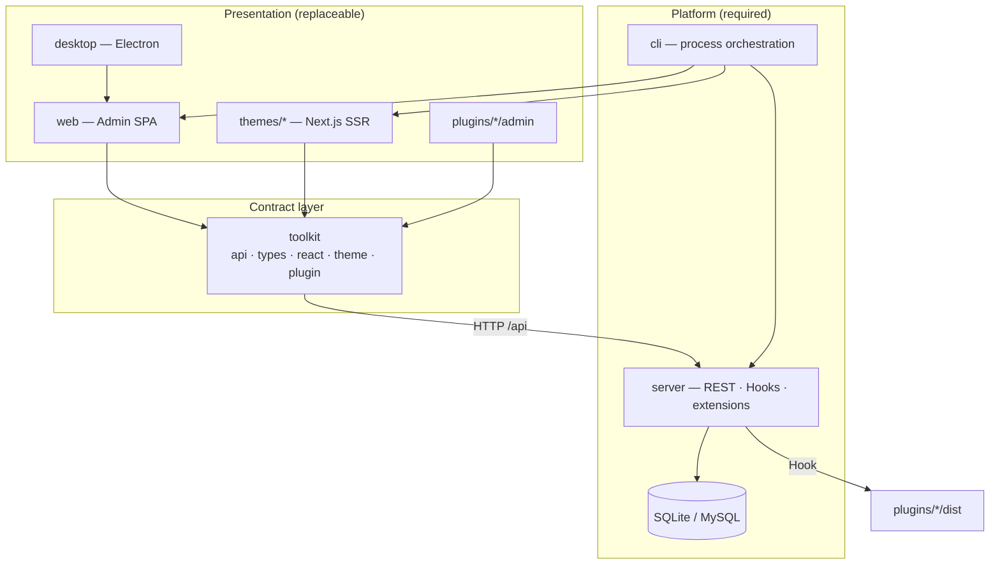
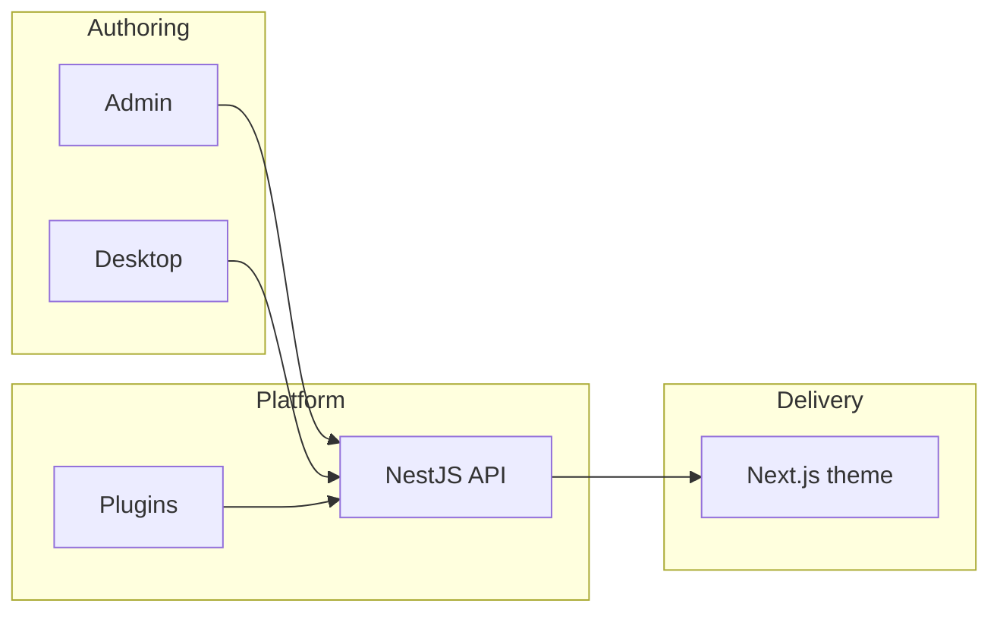

<!--truncate-->


If you are a front-end engineer, you have probably lived this loop:

1. The team decides the marketing site or blog should run on **React / Next.js**.
2. You evaluate Strapi, Payload, Contentful, Sanity, Ghost, Tina — each is good at something, yet **none ships a complete publishing platform you can install, write in, and publish from on day one**.
3. You fork a Next.js blog starter, wire up a Headless backend, then build media handling, comment moderation, SEO metadata, preview mode, and deployment scripts yourself.
4. Three months later the blog is still not live — but you are maintaining five repositories.

Meanwhile, **WordPress** still powers more than 40% of the web. PHP is mocked as legacy. Gutenberg is criticized. And yet WordPress remains the default choice for solo bloggers, content teams, agencies, and SMBs worldwide.

**React has ruled the front end for ten years. Why does it still not have its own WordPress?**

That is not a skills problem. It is a **product category** problem. For three years our community kept asking the same question: _"Can we manage content like WordPress, but deliver it with Next.js?"_ Existing answers either ship only an API, weld Admin and theme into one unmaintainable app, or require Docker + MySQL + six npm packages before you can write a single paragraph.

We built **ReactPress 4.0** to close that gap — an **open-source React publishing platform**, not another Headless backend you must assemble yourself.

This article is a long-form field guide. It explains:

- What the industry is missing, and why the "impossible triangle" of editing, frontend freedom, and out-of-the-box completeness keeps breaking teams.
- Why WordPress won for twenty years — and which lessons transfer to React, and which do not.
- Why the React ecosystem has excellent parts but no default **whole machine**.
- How ReactPress 4.0 works: one CLI, one Admin, swappable Next.js themes, Hook-based plugins, an Electron desktop client, and a Headless REST API that is on by default.

**SEO focus:** React CMS · Next.js CMS · WordPress alternative · React publishing platform · Open source CMS

---

## Table of contents

1. [Executive summary](#executive-summary)
2. [The industry problem](#1-the-industry-problem)
3. [Why WordPress succeeded](#2-why-wordpress-succeeded)
4. [The React ecosystem gap](#3-the-react-ecosystem-gap)
5. [ReactPress philosophy](#4-reactpress-philosophy)
6. [System architecture](#5-system-architecture)
7. [See it in action](#6-see-it-in-action)
8. [Admin: the writing surface](#7-admin-the-writing-surface)
9. [Theme system](#8-theme-system)
10. [Plugin system](#9-plugin-system)
11. [Desktop client](#10-desktop-client)
12. [Headless API](#11-headless-api)
13. [SEO and performance](#12-seo-and-performance)
14. [Security model](#13-security-model)
15. [Deployment patterns](#14-deployment-patterns)
16. [Migration paths](#15-migration-paths)
17. [Who should use ReactPress](#16-who-should-use-reactpress)
18. [Roadmap](#17-roadmap)
19. [FAQ](#18-faq)
20. [Getting started](#19-getting-started)
21. [Conclusion](#20-conclusion)
22. [Appendices A–AF](#appendix-a-extended-comparison-matrices) — comparisons, module deep dives, runbooks, extended FAQ

> **About this guide:** ~100,000 characters · ~12,500 English words · default language **English** · last updated 2026-07-12 · [中文版](pathname:///zh/blog/why-react-still-doesnt-have-wordpress-reactpress-4)

---

## Executive summary

| Question                   | Short answer                                                                                                                  |
| :------------------------- | :---------------------------------------------------------------------------------------------------------------------------- |
| **What is ReactPress?**    | A self-hosted **React publishing platform**: NestJS API + Vite Admin + Next.js theme + Hook plugins + CLI + Electron desktop. |
| **Is it a Headless CMS?**  | It includes Headless REST, but delivers far more — visitor site, Admin, and extensions out of the box.                        |
| **WordPress alternative?** | Yes, for teams that want WordPress-style workflows with a modern React / Next.js stack.                                       |
| **How fast to start?**     | `npm i -g @fecommunity/reactpress` → `reactpress init` → live stack in ~60 seconds.                                           |
| **License**                | MIT — fork, self-host, commercial use allowed.                                                                                |
| **Current release**        | 4.0 (codename **Extend**) — plugins, desktop, npm theme catalog.                                                              |

```bash
npm i -g @fecommunity/reactpress@beta
mkdir my-site && cd my-site
reactpress init
```

| Surface     | URL                              |
| :---------- | :------------------------------- |
| Public site | http://localhost:3001            |
| Admin       | http://localhost:3001/admin/     |
| API         | http://localhost:3002/api/health |

---

## 1. The industry problem

Modern content infrastructure forces a bad trade-off. Teams must pick two of three: **great editing**, **frontend freedom**, and **a complete system you can run tomorrow**.

### 1.1 The impossible triangle

Over the last decade, content tooling split into three paths. Each solves real problems — and each leaves a hole.

#### Path A: WordPress-style monolithic CMS

WordPress binds **content management, theme rendering, and plugin extension** inside one PHP runtime. For non-technical users it is extraordinary: install a theme, add plugins, launch ecommerce, memberships, forms, and SEO without writing code.

The costs are equally well known:

- **Theme and plugin quality varies wildly** — one bad plugin can tank performance or security.
- **The front end is locked to the PHP theme system** — React teams cannot reuse component libraries or design systems without a Headless detour.
- **Headless mode is bolted on**, not the default mental model; REST works, but often needs extra plugins and glue.
- **Core Web Vitals** frequently depend on caching layers (Redis, CDN, page-cache plugins) instead of SSR/ISR as a first-class design choice.

WordPress optimizes for **"let people who cannot code publish"** — not **"let people who code in React publish with the same ease."**

#### Path B: Static site generators

Hugo, Jekyll, early Gatsby, Astro — they maximize **build-time HTML** and deliver excellent Lighthouse scores at low hosting cost.

SSG hides a strict assumption: **content change = developer edits Markdown + CI rebuild**. Non-technical editors cannot ship articles independently. Drafts, scheduled posts, media libraries, comment moderation, and multi-author permissions — routine in WordPress — are absent or Git-shaped in pure SSG flows.

Next.js App Router and ISR help, but three questions remain unanswered in most setups:

- Where do posts **live**?
- Who can **write in a browser** without touching the repo?
- Where do **uploaded images** go?

#### Path C: Headless CMS

Strapi, Payload, Directus, Sanity, Contentful — they excel at **content APIs**: customizable schemas, multi-channel delivery, permissions.

What they typically do **not** ship is the **visitor-facing website** and the **daily writing UI** your authors expect as a finished product.

A typical Headless rollout:

```
Pick Headless CMS → define schema → tolerate or customize Admin
→ build Next.js front end → wire API → implement SEO / sitemap / OG
→ configure media storage → build or buy comments → write deploy scripts
→ train editors on a new back office
```

That is viable for mature platform teams. It is **heavy** for "we need a React-stack blog this week."

### 1.2 The contradiction, summarized

| Path                                  | Editing | Frontend freedom | Out of the box |  Modern performance  |
| :------------------------------------ | :-----: | :--------------: | :------------: | :------------------: |
| WordPress                             |   ✅    |        ❌        |       ✅       |          △           |
| SSG / bare Next.js                    |   ❌    |        ✅        |       △        |          ✅          |
| Headless CMS                          |    △    |        ✅        |       ❌       | Depends on front end |
| **Target: React publishing platform** |   ✅    |        ✅        |       ✅       |          ✅          |

React won on **frontend freedom** and **performance**. It never shipped the **complete publishing platform** category WordPress owns.

**That is why ReactPress exists.**

### 1.3 A front-end lead's real week

Consider a story we hear almost weekly:

**Monday:** Product wants a blog with SEO; marketing must publish without developers. You open the tech spec and list Strapi, Payload, Ghost, and Headless WordPress.

**Tuesday:** You pick Strapi. Docker, PostgreSQL, Content Types. The Admin works, but marketing complains that uploading an image requires four fields when they only want Markdown articles.

**Wednesday:** You start the Next.js front end — routing, layout, dark mode, syntax highlighting. Work that belongs in a **theme** is being rebuilt inside a product app.

**Thursday:** SEO — sitemap, Open Graph, JSON-LD, canonical URLs — three more PRs. Comments? Disqus or build your own; Strapi does not care.

**Friday:** Deploy API on a VPS, front end on Vercel, media on OSS, four CI pipelines. Marketing asks: "Where do I preview drafts?" You pause: "We still need preview mode…"

**Next Monday:** Product asks for status. You say "the backend is done." They ask: "When can we publish?"

The failure is not any single tool. **Nobody delivered the full loop of publishing** — install, write, preview, ship, extend.

ReactPress ends that loop. Not with a better API alone, but with a **machine that is already assembled**.

### 1.4 Why "one more Headless CMS" is not enough

Every new TypeScript Headless CMS launch gets praise for schema design. We celebrate those projects — they push **content modeling** forward.

For "ship our team blog this week," however, **a prettier Content Type editor does not reduce the number of Next.js pages you must write**.

The industry does not lack Headless CMS options. It lacks:

1. A **production-grade visitor site by default** — not a demo repo.
2. A **writing Admin authors open daily** — not Swagger's neighbor.
3. **Extension points** — install plugins, not fork core.
4. **Operations entry points** — `doctor`, not a forty-page deploy guide.

When all four are true, the category name should be **Publishing Platform**, not Headless CMS. ReactPress chooses the former.

### 1.5 Total cost of ownership: assembly vs platform

Hidden costs dominate Headless assembly projects:

| Cost center         | Headless assembly (typical)           | ReactPress (default)                   |
| :------------------ | :------------------------------------ | :------------------------------------- |
| Initial engineering | 2–8 weeks                             | ~60 seconds to running stack           |
| Ongoing repos       | 3–5 (API, web, infra, theme, scripts) | 1 site directory + optional theme fork |
| Editor onboarding   | Custom docs for bespoke Admin         | WordPress-familiar `/admin/`           |
| SEO baseline        | Build sitemap, OG, JSON-LD yourself   | Theme starter + SEO plugin             |
| Offline writing     | Not standard                          | Electron desktop + SQLite              |
| Diagnostics         | Log diving across services            | `reactpress doctor`                    |

Platforms win when **time-to-first-article** matters more than infinite schema flexibility on day one.

---

## 2. Why WordPress succeeded

Before asking for "React's WordPress," understand what WordPress actually won — beyond PHP and early hosting deals.

### 2.1 One front door, zero decision fatigue

WordPress users rarely choose among backend frameworks, front-end stacks, and deployment patterns. Download, database credentials, `/wp-admin/` — **one path**.

That "zero decisions" feels limiting to engineers. For most site owners, **fewer choices is the product**.

ReactPress 4.0 adopts the lesson: `npm i -g @fecommunity/reactpress` → `reactpress init` → API + Admin + theme in ~60 seconds. No Docker by default. No hand-written `.env`. No three terminal tabs.

### 2.2 Core / Theme / Plugin boundaries

Early WordPress established a durable split:

| Layer      | Responsibility                                        |
| :--------- | :---------------------------------------------------- |
| **Core**   | Data model, admin framework, user roles               |
| **Theme**  | What visitors see                                     |
| **Plugin** | Cross-cutting logic — SEO, forms, security, ecommerce |

That separation enabled **"change skin without changing bones"** and **"add capability without forking theme."** A theme market and a plugin market followed.

React projects often lack an **official, community-recognized boundary**. Next.js apps merge CMS concerns, marketing UI, and product code. Changing "theme" means rewriting the repo.

ReactPress maps the model explicitly:

| WordPress | ReactPress           | Role                           |
| :-------- | :------------------- | :----------------------------- |
| wp-admin  | Admin (`/admin/`)    | Content, media, settings       |
| Theme     | `themes/*` (Next.js) | Visitor SSR/ISR site           |
| Plugin    | `plugins/*` (Hooks)  | Server-side extension          |
| REST API  | `/api/*`             | Headless access, on by default |
| —         | Desktop (Electron)   | Local-first writing            |

### 2.3 Plugins as longevity

WordPress hosts **60,000+ plugins**. Search, install, activate — that loop built a civilization of extensions without waiting for core releases.

React "plugins" are usually private npm packages or forks — **high skill floor, not hot-swappable, no marketplace gravity**.

ReactPress 4.0 ships **Hook + `plugin.json`**, Admin slots, and built-in SEO / summary / image-optimizer plugins so **"extend without touching core"** is platform-native.

### 2.4 Hosting democratization

WordPress succeeded with one-click installers on shared hosts. Users should not need to understand Nginx or PM2 on day one.

ReactPress defaults to **embedded SQLite**, documents VPS/Docker paths for growth, and ships **`reactpress doctor`** — lowering "will it run on my machine?"

### 2.5 What we learn — and what we refuse to copy

**We learn:** single entry point, theme/plugin boundaries, author-first workflows, data portability.

**We refuse:** welding visitor rendering and Admin into one PHP theme; plugin quantity over architectural debt; requiring Docker/MySQL for a first article.

**Same editing workflow. Modern Next.js delivery.** That is the accurate relationship to WordPress — and what **WordPress alternative** should mean in 2026: not PHP cosplay, but **rebuilding the publishing platform category on React**.

### 2.6 Gutenberg: writing UI as product, not afterthought

WordPress 5.0's block editor was controversial, but one decision was right: **treat the writing surface as core product**, not a database form with labels.

ReactPress Admin uses Markdown — our primary audience is technical teams and developer blogs — yet the principle holds: drag-and-drop media, categories, tags, schedules, comment moderation, and plugin settings live in Admin.

We deliberately avoid stuffing React presentation components into Admin as "blocks." That would leak theme logic into core. **Presentation components belong in themes.**

### 2.7 Data ownership and open source

WordPress's GPL heritage and MySQL-on-disk model made **migration and self-hosting** credible.

ReactPress is **MIT**. SQLite lives at `.reactpress/reactpress.db`. Backup can be `tar czf backup.tar.gz .reactpress uploads`. For teams searching **open source CMS**, that means auditable source, no mandatory cloud, and fork-friendly customization.

When content is an asset, **the platform must be portable too**.

### 2.8 The WordPress economy — lessons for ReactPress

WordPress created parallel economies:

- **Hosting** (managed WordPress)
- **Themes** (marketplace + custom agencies)
- **Plugins** (free + premium)
- **Agencies** (implementation + care plans)

ReactPress 4.0's roadmap — npm theme catalog, plugin catalog, marketplace — targets the same **extension economies**, but with **npm + TypeScript + Next.js** as the distribution layer instead of zip uploads to `wp-content/`.

The goal is not to clone ThemeForest on day one. The goal is to make **theme and plugin authors have a standard addressable runtime** so ecosystem gravity can accumulate.

---

## 3. The React ecosystem gap

"React CMS" is not an empty keyword. Many projects exist. Few occupy the **Publishing Platform** quadrant — editor-friendly **and** developer-friendly **and** complete out of the box.

### 3.1 Positioning map

```
                    Editor-friendly
                          ↑
            WordPress     |     ReactPress (target)
                          |
      Headless ───────────┼─────────── Full-stack frameworks
      (Strapi, etc.)      |
                          |
            Markdown+Git  |     Next.js blog templates
                          ↓
                    Developer-friendly
```

- **Next.js blog templates:** beautiful front ends, no CMS.
- **Headless CMS:** strong APIs; you build Admin UX and visitor site.
- **Notion / docs → static:** great drafting, weak custom domain + SEO control.
- **Git-based CMS (Tina, Decap):** developer-native; higher friction for non-technical editors.
- **SaaS publishing (Ghost, Medium):** complete loops, varying self-host and theme freedom.

**The gap is upper-right:** both editors and engineers happy, unified on React / Next.js.

### 3.2 Why Next.js did not ship a CMS

Next.js is a **rendering and routing framework**, not a content platform. Contentlayer, MDX, Draft Mode — excellent for **developer-driven** sites, not **daily editorial operations**.

Expecting Next.js to bundle WordPress-style Admin is like expecting React to bundle a database. Framework teams correctly stay in lane.

So **Next.js CMS** became an **integration problem**: every team wires Headless + custom Admin + SEO + deploy. The community has brilliant **parts**, not a standard **whole**.

### 3.3 Search intent behind the keywords

| Keyword                   | Surface need     | Deep need                        |
| :------------------------ | :--------------- | :------------------------------- |
| React CMS                 | React admin      | No PHP; unified stack            |
| Next.js CMS               | Next integration | SSR SEO + customizable front end |
| WordPress alternative     | Leave WordPress  | Keep workflow, lose PHP baggage  |
| Open source CMS           | Self-host        | Data sovereignty, auditability   |
| React publishing platform | End-to-end       | **One command, not five repos**  |

ReactPress answers the last row: **Publish with React. Ship like WordPress.**

### 3.4 Our own iteration history

ReactPress evolved inside the FECommunity ecosystem:

| Era  | Codename     | Lesson                                                            |
| :--- | :----------- | :---------------------------------------------------------------- |
| 2.x  | —            | Proved demand; packages too fragmented                            |
| 3.0  | **Platform** | One CLI, ~60s stack; Docker MySQL default felt heavy              |
| 3.1+ | Toolkit      | Unified API contract; Next 14 / React 18                          |
| 4.0  | **Extend**   | Plugins, desktop, npm themes; SQLite default; bundled CLI runtime |

Each release responded to Issues — not roadmap bingo. 4.0's bundled runtime, SQLite, npm themes, Hook plugins, and Electron desktop each map to repeated user stories.

### 3.5 Landscape comparison (default deliverables)

| Solution                 | Ships by default                              | Visitor site     | Typical friction           |
| :----------------------- | :-------------------------------------------- | :--------------- | :------------------------- |
| **Strapi**               | API + Admin                                   | No               | Build Next.js front end    |
| **Payload**              | API + Admin (React)                           | No               | Same                       |
| **Sanity**               | API + Studio                                  | No               | SaaS pricing, vendor path  |
| **Contentful**           | API + web app                                 | No               | Enterprise Headless        |
| **Ghost**                | API + Admin + theme                           | Handlebars theme | Not React stack            |
| **TinaCMS**              | Git / API hybrid                              | Varies           | Git conflicts, dev-centric |
| **Next.js blog example** | Sample code                                   | Yes              | No CMS; Markdown in repo   |
| **Headless WordPress**   | REST API                                      | You build        | Plugin/config sprawl       |
| **ReactPress**           | API + Admin + theme + plugins + CLI + desktop | Next.js SSR      | Young plugin market        |

Google **"Next.js CMS"** and you mostly find tutorials on **connecting** Next.js to Headless — not **installing a full CMS in one command**. That tutorial-shaped gap is the product gap.

### 3.6 Signals from the community

Recurring sentences in discussions and Issues:

- _"We already use Next.js — we don't want PHP WordPress for the blog."_
- _"Strapi works but I lost two weekends on the front end."_
- _"Is there a self-hosted open source option that isn't another assembly kit?"_

These are engineering pain, not marketing copy. ReactPress 4.0 is built as a response.

### 3.7 The missing "default stack" moment

React has a default bundler story (Vite / webpack era), a default framework story (Next.js for full stack), a default UI story (component libraries) — but **no default publish story**.

When a junior developer asks "how do I launch my blog?" the answers fork:

- WordPress (PHP)
- Medium / Substack (platform lock-in)
- "Fork this Next.js template and use Notion as CMS"
- "Spin up Strapi"

There is no answer equivalent to `create-react-app` or `next new` for **publishing**. ReactPress aims to be that answer: `reactpress init`.

### 3.8 Framework churn vs platform stability

React teams rewrite front ends every few years — Pages Router to App Router, CSS-in-JS to Tailwind, REST to tRPC. **Content outlives framework fashion.**

A publishing platform must separate **durable content** (articles, media, URLs) from **replaceable presentation** (themes). WordPress survived because themes churn while posts remain. ReactPress copies that separation with Next.js themes + stable REST — not by freezing your entire app in one Next repo.

---

## 4. ReactPress philosophy

> **ReactPress is not only a Headless CMS. It is an open-source publishing platform for the React era.**

### 4.1 One-sentence definition

```
Admin owns content · Theme owns presentation · Plugin owns logic
· API owns data · Toolkit owns the contract
```

- **Content belongs to the system** — posts, pages, media, taxonomy, comments, settings.
- **Presentation belongs to themes** — swappable Next.js apps.
- **Logic belongs to plugins** — SEO, summaries, image pipelines via Hooks.
- **Data exposes through API** — REST, Swagger, API keys.
- **Toolkit unifies clients** — one typed HTTP layer for Admin, theme, plugin UI.

### 4.2 vs Headless CMS

| Dimension    | Headless CMS                     | ReactPress                                    |
| :----------- | :------------------------------- | :-------------------------------------------- |
| Deliverable  | API (+ Admin)                    | API + Admin + theme + plugins + CLI + desktop |
| Visitor site | Your problem                     | Official Next.js theme; swappable             |
| Onboarding   | Deploy backend → build front end | `reactpress init` ~60s                        |
| Extension    | Webhooks, custom fields          | Hooks + `plugin.json` + Admin slots           |
| Stack        | Mixed                            | React + Next.js + NestJS                      |

Need only an API and custom everything? Headless may be lighter.

Need **WordPress workflow + React front end + one CLI**? ReactPress fits — the practical **WordPress alternative** for JS teams.

### 4.3 Design principles

From [ARCHITECTURE.md](https://github.com/fecommunity/reactpress/blob/master/ARCHITECTURE.md):

**Maintainability → Extensibility → Tech fit → Low cost**

Hard rules:

1. **Admin does not serve visitor pages.** Themes do not serve `/admin/`.
2. All front ends talk to the API **only through Toolkit**.
3. **Server depends on no front-end package.**
4. **Themes never touch the database.**

### 4.4 Two audiences, two paths

| Audience         | Goal                         | Entry                                       |
| :--------------- | :--------------------------- | :------------------------------------------ |
| **Site owners**  | Launch blog, team publishing | `npm i -g @fecommunity/reactpress` → `init` |
| **Contributors** | Core, themes, plugins        | Clone monorepo → `pnpm dev`                 |

### 4.5 Thirty-second start

```bash
npm i -g @fecommunity/reactpress@beta
mkdir my-site && cd my-site
reactpress init
```

| Service     | URL                                              |
| :---------- | :----------------------------------------------- |
| Public site | http://localhost:3001                            |
| Admin       | http://localhost:3001/admin/ (`admin` / `admin`) |
| API         | http://localhost:3002/api/health                 |

SQLite by default. No Docker. `reactpress doctor` when something fails.

### 4.6 "Content in the system, front end for developers" in practice

**Anti-pattern A:** Embed full theme preview in Admin with global theme CSS — couples Admin to theme; theme swap breaks back office.

**Anti-pattern B:** Theme reads DB connection strings — kills Headless path and security boundaries.

**ReactPress approach:** Preview on `:3003`; themes use `NEXT_PUBLIC_API_URL`; mutations go through authenticated REST.

Editors and theme developers work in **parallel pipelines** — essential for multi-disciplinary teams.

### 4.7 vs visual site builders

Webflow, Framer, Wix solve publishing through **visual editors + hosted lock-in**. Great for landing pages; narrow for teams that need **Git-reviewed theme code, CI deploy, API integrations**.

ReactPress is not a drag-and-drop page builder. It serves teams who treat **code as asset** — themes in Git, plugins in monorepo, content in CMS.

### 4.8 What "platform" means operationally

A platform provides:

- **Stable contracts** (REST + Toolkit types)
- **Lifecycle tools** (`init`, `doctor`, `logs`, `stop`)
- **Extension registries** (themes, plugins)
- **Opinionated defaults** (SQLite, official theme, SEO plugin)
- **Escape hatches** (Headless-only, custom theme, MySQL)

A CMS backend alone provides APIs. ReactPress provides **the full operational loop**.

---

## 5. System architecture

ReactPress 4.0 uses a **monorepo + multi-process** model: content management, visitor delivery, and API services are decoupled; **Toolkit** unifies contracts.

### 5.1 Architecture diagram



### 5.2 Authoring-to-delivery flow



**Step-by-step:**

1. Author creates content in **Admin** or **Desktop**.
2. Request flows through **Toolkit** to **NestJS API**.
3. **Plugins** run on Hooks — summaries, SEO validation, image jobs.
4. Data persists to **SQLite** (default) or **MySQL**.
5. **Theme** fetches published content and SSR/ISR renders for visitors and crawlers.

### 5.3 Package responsibility matrix

| Package      | npm                               | Role                                     | Rendering        | SEO           |
| :----------- | :-------------------------------- | :--------------------------------------- | :--------------- | :------------ |
| **server**   | Bundled in CLI                    | Business logic, persistence, auth, Hooks | —                | —             |
| **web**      | Bundled in CLI                    | Admin UI                                 | Vite CSR         | No            |
| **themes/**  | Per theme                         | Visitor site                             | Next SSR/ISR     | Yes           |
| **toolkit**  | `@fecommunity/reactpress-toolkit` | API client, types                        | —                | —             |
| **plugins/** | Per plugin                        | Hook logic + Admin slots                 | Mixed            | Plugin-driven |
| **desktop**  | GitHub Releases                   | Electron + local API                     | Loads `web/dist` | No            |
| **cli**      | `@fecommunity/reactpress`         | init, doctor, orchestration              | —                | —             |

### 5.4 Technology choices

| Decision     | Choice             | Rationale                  |
| :----------- | :----------------- | :------------------------- |
| API          | NestJS             | Modular TS, Hook-friendly  |
| Admin        | Vite + React SPA   | Interactive; no SSR needed |
| Visitor site | Next.js App Router | SSR/ISR, SEO primitives    |
| Extension    | Hooks + manifest   | WordPress mental model     |
| Default DB   | SQLite             | Zero config                |
| Desktop      | Electron           | Reuse Admin SPA            |

### 5.5 Runtime ports

| Process              | Default port | Notes                      |
| :------------------- | :----------- | :------------------------- |
| Theme (public)       | 3001         | Includes `/admin/` proxy   |
| API                  | 3002         | REST + Swagger             |
| Theme preview        | 3003         | Admin iframe preview       |
| Admin (monorepo dev) | 3000         | Standalone Vite dev server |

### 5.6 Directory layout after `init`

```
my-site/
├── .reactpress/
│   ├── config.json          # ports, database, URLs
│   ├── runtime/{theme-id}/  # installed theme copy
│   ├── plugins/{plugin-id}/ # installed plugins
│   └── reactpress.db        # SQLite (default)
├── .env                       # CLI-generated
└── uploads/                   # media
```

Think of `.reactpress/` as WordPress `wp-content/` + database — backup with:

```bash
tar czf backup.tar.gz .reactpress uploads
```

### 5.7 Toolkit: single API client discipline

Early 3.x allowed ad-hoc `fetch` per package → field drift between Admin and theme. 4.0 enforces **Toolkit only**:

- OpenAPI-aligned types and paths
- Unified errors and auth headers
- `createThemeApi`, `PluginContext`, Admin React hooks

You lose "raw axios everywhere" freedom; you gain **fewer production surprises on upgrade**.

### 5.8 Headless without leaving the platform

```bash
curl -H "X-API-Key: YOUR_KEY" \
  "http://localhost:3002/api/article/headless/list?status=publish&page=1&pageSize=10"
```

Use API-only for mobile apps, secondary sites, or microservices — **same content, many surfaces**. That is how a **React CMS** should flex.

### 5.9 Monorepo map for contributors

| Directory  | Purpose                                            |
| :--------- | :------------------------------------------------- |
| `cli/`     | Global CLI, process orchestration, bundled runtime |
| `server/`  | NestJS modules, entities, Hook service             |
| `web/`     | Admin SPA                                          |
| `themes/`  | Theme registry + hello-world + catalog anchors     |
| `plugins/` | Plugin registry + built-ins                        |
| `toolkit/` | Shared types and HTTP clients                      |
| `desktop/` | Electron main/preload, local API bootstrap         |

End users never clone this. They install `@fecommunity/reactpress` and run `init`.

### 5.10 Failure modes and boundaries

| Failure                     | Guardrail                                   |
| :-------------------------- | :------------------------------------------ |
| Theme bypasses API          | Architecture review; no DB drivers in theme |
| Plugin injects Next routes  | Forbidden — plugins are server-side         |
| Admin embeds business rules | Belongs in plugins via Hooks                |
| Multiple API clients        | Toolkit enforcement                         |

These boundaries feel strict until you maintain the project for three years — then they feel like oxygen.

---

## 6. See it in action

Platforms are judged by whether they **run**, not only whether they diagram well.

### 6.1 CLI: install to live site in ~60 seconds


One global install. One `init`. Browser opens to visitor site and Admin. No Docker pull. No six terminals. No handwritten env files.

This is the WordPress "single front door" lesson — delivered as **React + Next.js + NestJS**.

### 6.2 Visitor site: search, comments, knowledge base, dark mode


The official [reactpress-theme-starter](https://reactpress-theme-starter.vercel.app) demo includes:

- Full-text search
- Comment system
- Knowledge base / docs navigation
- Dark mode
- Responsive layout
- `sitemap.xml`, `robots.txt`, JSON-LD

### 6.3 Lighthouse: performance and SEO as defaults


On the official theme demo, scores reach **Performance 95 / SEO 100** (your production numbers depend on hosting and content).

For **Next.js CMS** evaluations, this matters: you should not trade WordPress-style workflow for a slow visitor experience. The default theme exists to prove **workflow + speed** coexist.

### 6.4 Live demos

| Demo            | URL                                                                                |
| :-------------- | :--------------------------------------------------------------------------------- |
| Production blog | [blog.gaoredu.com](https://blog.gaoredu.com)                                       |
| Theme starter   | [reactpress-theme-starter.vercel.app](https://reactpress-theme-starter.vercel.app) |
| Documentation   | [docs.gaoredu.com](https://docs.gaoredu.com)                                       |

### 6.5 Before / after assembly

```
Before (typical Headless assembly)          With ReactPress
─────────────────────────────────          ─────────────────
Pick CMS backend                      →    reactpress init
Build or customize Admin              →    Admin at /admin/
Develop Next.js visitor site          →    http://localhost:3001
Debug env / ports / DB                →    reactpress doctor
```

---

## 7. Admin: the writing surface

Visitors see the theme. Authors live in **Admin**. If Admin fails, the platform fails — regardless of API elegance.

### 7.1 Post editor


Admin provides:

- **Markdown editor** with code blocks, tables, paste-to-upload images
- **Draft / publish** workflow
- **Categories and tags**
- **Pages** and **knowledge base** content types
- **Revision history** (server-side)

### 7.2 Media library


Centralized media under `uploads/` with optional OSS configuration (Aliyun OSS supported in server modules). Authors should not FTP files or open S3 consoles for a blog image.

### 7.3 Plugins panel


Install, enable, and configure plugins without SSH. Built-in plugins:

| Plugin            | Capability                                     |
| :---------------- | :--------------------------------------------- |
| `seo`             | Slug, keywords, meta description + editor slot |
| `hello-world`     | Auto-generate summaries on publish             |
| `image-optimizer` | Batch WebP optimization for legacy media       |

### 7.4 Appearance and themes


**Appearance → Themes** — install from registry, preview on `:3003`, activate for `:3001`. Swapping themes does not migrate content; it changes presentation only.

### 7.5 Site settings


Site title, URLs, API keys, comment policies, and integration settings — the operational layer authors and admins share.

### 7.6 Comments moderation

Comments flow through API with JWT for creation, server-side HTML sanitization after Markdown parsing (security hardening in 3.7+), and moderation UI in Admin. Stored XSS and spam are platform concerns, not theme afterthoughts.

### 7.7 Default credentials warning

Local `admin` / `admin` is for trial only. Change passwords before production; `reactpress doctor` surfaces common security omissions.

---

## 8. Theme system

> **Theme = presentation.** What visitors see is a replaceable Next.js app.

### 8.1 Two sources, three layers

```
┌─────────────────────────────────────────────────────────────┐
│  Sources                                                     │
│    local  themes/{id}/  →  .reactpress/runtime/{id}/          │
│    npm    npm package   →  .reactpress/runtime/{id}/        │
└─────────────────────────────────────────────────────────────┘

┌─────────────────────────────────────────────────────────────┐
│  Layers                                                      │
│    themes/              Registry                             │
│    .reactpress/runtime/ Materialized (CLI runs this)         │
│    DB + active config   Which theme is live on :3001         │
└─────────────────────────────────────────────────────────────┘
```

### 8.2 Official themes

| Theme                    | Source         | Use case                          |
| :----------------------- | :------------- | :-------------------------------- |
| hello-world              | Monorepo local | Learning, fork base               |
| reactpress-theme-starter | npm catalog    | Production — search, KB, comments |

```bash
reactpress theme add @fecommunity/reactpress-theme-starter@1.0.0-beta.0
```

### 8.3 Mock development without API

```bash
npx create-next-app@latest my-blog \
  --example "https://github.com/fecommunity/reactpress-theme-starter" \
  --use-pnpm
cd my-blog && pnpm dev:mock
```

Theme authors iterate UI without booting full platform — faster design cycles.

### 8.4 Data fetching in themes

```typescript
import { createThemeApi } from '@fecommunity/reactpress-toolkit/theme';

const api = createThemeApi({ baseURL: process.env.NEXT_PUBLIC_API_URL });
const { data } = await api.article.list({ status: 'publish', page: 1 });
```

Environment variables align with `reactpress init` output (`CLIENT_SITE_URL`, API URL).

### 8.5 App Router conventions

Official starter routes (illustrative):

| Route             | Purpose        |
| :---------------- | :------------- |
| `/`               | Home           |
| `/blog/[slug]`    | Article detail |
| `/blog`           | Article list   |
| `/docs/[...slug]` | Knowledge base |
| `/search`         | Search results |

Customize freely — contract is **fetch via Toolkit**, not specific folder names.

### 8.6 SEO responsibilities in themes

As the **Next.js CMS** visitor layer, themes own:

- SSR/ISR HTML completeness for crawlers
- Per-route `<title>`, meta description, OG tags from API fields
- `/sitemap.xml` and `robots.txt`
- JSON-LD structured data

Admin + SEO plugin **write** metadata; theme **renders** it. Change SEO strategy by swapping plugins, not forking themes.

### 8.7 Deployment patterns for themes

| Pattern     | When                                                 |
| :---------- | :--------------------------------------------------- |
| **Unified** | API + theme same VPS — `reactpress init` style       |
| **Split**   | Theme on Vercel Edge, API on VPS — classic Jamstack  |
| **Custom**  | Mobile app or second Next site via Headless API only |

**One content graph, many surfaces** — the publishing platform difference.

### 8.8 Migrating from WordPress themes

There is no magic PHP→JSX converter. You **rewrite presentation in React** — cost upfront, benefits long-term:

- Reuse design system components
- Storybook and unit tests on UI
- Predictable performance without unknown PHP plugins

Migrate **content** via WordPress REST export scripts into ReactPress API. ReactPress offers **new front end, familiar workflow**.

### 8.9 Theme catalog and version compatibility

`theme.json` + `theme.manifest.schema.json` declare `requires: ">=4.0.0"`. CLI blocks silently incompatible installs. Roadmap **theme marketplace** adds discovery and ratings — WordPress theme shop proved skin-swapping demand; we distribute via **npm + Next.js**.

---

## 9. Plugin system

ReactPress 4.0 (codename **Extend**) makes **Hook + `plugin.json`** a first-class extension model.

> **Theme = presentation · Plugin = logic**

### 9.1 Lifecycle

```
Discover → Install → Enable → Configure → (optional) Uninstall
```

- **Admin → Plugins** for GUI
- **CLI:** `reactpress plugin list`, `reactpress plugin install <id>`
- **Manifest:** `plugin.json` declares hooks, Admin slots, settings schema

### 9.2 Registry model

```
plugins/               Registry (what can be installed)
.reactpress/plugins/   Materialized installed copy + dist
DB globalSetting       Enabled list + per-plugin config
        ↓ activate
HookService            require(module) → register(hooks, ctx)
```

Aligns with theme three-layer model — authors learn once.

### 9.3 Server plugin example

```typescript
import type { PluginContext } from '@fecommunity/reactpress-toolkit/plugin';

export function register(hooks: PluginContext['hooks'], ctx: PluginContext) {
  hooks.addFilter('article.beforePublish', async (article) => {
    if (!article.summary) {
      article.summary = article.content.slice(0, 160);
    }
    return article;
  });
}
```

Build: `pnpm run build:plugins` in monorepo; `reactpress plugin install` for end users.

### 9.4 Hooks vs webhooks

| Mechanism   | Direction          | Can mutate data | Example                      |
| :---------- | :----------------- | :-------------- | :--------------------------- |
| **Hook**    | In-process inbound | Yes (filters)   | SEO validation, auto summary |
| **Webhook** | Outbound HTTP      | No              | Slack notify, CI trigger     |

Publish pipeline:

```
article.service
  ├─ applyFilters('article.beforePublish')   ← plugins
  ├─ persist
  ├─ doAction('article.afterPublish')        ← plugins
  └─ webhookService.dispatch('article.published')
```

### 9.5 Admin slots

Plugins register UI slots — `seo` adds fields beside the article editor. Authors experience **meta boxes**, not scattered settings pages.

### 9.6 Security

- Manifest JSON Schema validation
- Module path constraints
- Ajv config validation

Stricter than "install zip and hope" — appropriate for self-hosted **open source CMS**.

### 9.7 Building your first plugin

Fork `plugins/hello-world` → rename id → implement `register()` → `pnpm build:plugins` → enable in Admin. **An afternoon** for NestJS-comfortable teams.

WordPress has more hooks today; ReactPress hooks are fewer but **fully typed and testable** — optimized for **engineering teams customizing for themselves**.

### 9.8 SEO plugin collaboration example

`seo` validates slug uniqueness on `article.beforePublish`, injects Admin fields, theme SSR reads `metaTitle`, `metaDescription`, `keywords`. **Plugin writes, theme reads, core stays dumb** — ideal **React CMS + Next.js CMS** split.

### 9.9 Honest comparison to WordPress plugins

WordPress: 60,000+ plugins, search-and-install economy.

ReactPress: young catalog, strong **mechanism**, built-in essentials, best for **teams who can code extensions**.

If you need off-the-shelf ecommerce, membership, or form builders today, WordPress may win — see [ReactPress vs WordPress](/docs/getting-started/reactpress-vs-wordpress).

---

## 10. Desktop client

WordPress has no true peer for **offline-first, local-database writing** in the core product. ReactPress Desktop fills that gap.


### 10.1 Architecture

**Electron shell + same Admin SPA** as web — one UI codebase, consistent behavior, lower maintenance than a separate native editor.

### 10.2 Modes

| Mode                | Scenario                    | Behavior                                |
| :------------------ | :-------------------------- | :-------------------------------------- |
| **Local** (default) | Offline, try without Docker | Embedded SQLite API at `127.0.0.1:3002` |
| **Remote**          | Production/staging API      | Admin points at remote REST             |

Switch under **Settings → Desktop client** or workspace panel on login.

### 10.3 Sync

Local → remote **push** for articles, pages, and selected settings (requires remote admin JWT). Recommended flow: validate on staging before production push.

### 10.4 Installers

GitHub Releases ship **macOS DMG**, **Windows NSIS**, **Linux AppImage** via CI matrix builds.

```bash
pnpm dev:desktop      # monorepo development
pnpm build:desktop    # installers → desktop/release/
```

Docs: [Desktop client guide](/docs/tutorial-extras/desktop-client).

### 10.5 vs Notion-class editors

Notion, Google Docs, and wikis draft well but **publish poorly** to custom-domain Next.js — export steps, style loss, proprietary sync.

Desktop local mode means **the writing UI is the production Admin**, synced via standard REST — closer to **Obsidian drafting + WordPress publishing**, integrated and open source.

### 10.6 Security notes

Sync is one-way push with credentials. Test conflict behavior on staging. Treat like any CMS bulk import — **rehearse before production**.

---

## 11. Headless API

ReactPress is a **publishing platform first** — and a **Headless React CMS** by default. Any client that speaks HTTP can participate.

### 11.1 Explore with Swagger

```
http://localhost:3002/api
```

Swagger UI documents routes, parameters, and response shapes — generated from NestJS decorators. Production: `https://your-api-domain.com/api`.

### 11.2 Authentication

| Method                    | Use case                          |
| :------------------------ | :-------------------------------- |
| **Session / JWT**         | Admin SPA same-origin requests    |
| **API Key** (`X-API-Key`) | Headless servers, scripts, mobile |

Create keys in **Admin → Settings → API**. Keys carry admin-level power — HTTPS only, rotate regularly, never commit to git.

### 11.3 Core endpoints

| Method | Path                         | Description                    |
| :----- | :--------------------------- | :----------------------------- |
| GET    | `/api/health`                | Health check                   |
| GET    | `/api/article/headless/list` | Paginated published articles   |
| GET    | `/api/article/:id`           | Single article                 |
| GET    | `/api/page/list`             | Pages                          |
| GET    | `/api/category/list`         | Categories                     |
| GET    | `/api/tag/list`              | Tags                           |
| GET    | `/api/comment/list`          | Comments                       |
| GET    | `/api/setting/public`        | Public site settings           |
| POST   | `/api/article`               | Create article (auth required) |

Exact contracts live in Swagger — treat this table as a map, not the spec.

### 11.4 curl examples

**Health:**

```bash
curl http://localhost:3002/api/health
```

**Published articles:**

```bash
curl -H "X-API-Key: YOUR_KEY" \
  "http://localhost:3002/api/article/headless/list?status=publish&page=1&pageSize=10"
```

### 11.5 Toolkit TypeScript SDK

```typescript
import { createApiClient } from '@fecommunity/reactpress-toolkit';

const client = createApiClient({
  baseURL: process.env.REACTPRESS_API_URL,
  apiKey: process.env.REACTPRESS_API_KEY,
});

const articles = await client.article.headlessList({
  status: 'publish',
  page: 1,
  pageSize: 10,
});
```

One SDK for Admin, themes, plugins, and external apps — **types track API evolution**.

### 11.6 Headless-only deployments

Run API without caring about the bundled theme:

- Marketing site on a custom Next repo
- Mobile app consuming articles
- Multi-brand networks sharing one content backend

You still benefit from ReactPress Admin for editors. You only opt out of the **default visitor theme**.

### 11.7 WordPress REST vs ReactPress Headless

WordPress REST exists but Headless is not the default product story. Field shapes vary with plugins; performance tuning often still assumes PHP rendering.

ReactPress **assumes** Headless consumers from day one — list endpoints, API keys, Toolkit, and OpenAPI as first-class docs.

### 11.8 Webhooks for external systems

Beyond in-process Hooks, server dispatches outbound webhooks (e.g. `article.published`) for Slack, CI, search indexers, or data warehouses — **async integration without blocking publish latency**.

---

## 12. SEO and performance

Teams choose **Next.js CMS** stacks largely for **search visibility** and **Core Web Vitals**. ReactPress splits SEO across plugins (data) and themes (rendering).

### 12.1 Rendering strategy

| Layer | Strategy   | SEO impact               |
| :---- | :--------- | :----------------------- |
| Admin | CSR (Vite) | Not indexed — correct    |
| Theme | SSR / ISR  | Full HTML for crawlers   |
| API   | JSON       | Feeds theme and Headless |

### 12.2 Built-in SEO plugin

Authors set slug, focus keywords, and meta description in Admin. Theme emits:

- `<title>` and meta description
- Open Graph and Twitter cards
- Canonical URLs
- JSON-LD (`Article`, `WebSite`, etc. in starter)

### 12.3 Sitemap and robots

Official theme generates `/sitemap.xml` and `robots.txt` from API content — no manual XML editing.

### 12.4 Performance practices in starter theme

- Next.js code splitting and image optimization
- ISR for high-traffic lists where configured
- Minimal client JS on article pages
- Dark mode without hydration flash (theme-dependent)

Lighthouse **95 Performance / 100 SEO** on demo is achievable baseline — not a guarantee for every host.

### 12.5 ReactPress vs WordPress SEO plugins

WordPress often stacks Yoast or Rank Math **on top of** theme-dependent markup. ReactPress **defaults** to structured SEO fields + SSR theme — fewer moving parts for standard blogs and docs.

### 12.6 Internationalization note

Docs site supports `en` and `zh` locales. Themes can implement i18n routes; content model supports multiple sites via settings and custom theme logic — i18n at theme layer keeps core simpler.

### 12.7 Measuring before launch

1. Run Lighthouse on staging theme URL
2. Validate rich results with Google Search Console
3. Fetch as Google / inspect rendered HTML (not only JSON API)
4. Confirm `sitemap.xml` lists published URLs only

---

## 13. Security model

Self-hosted **open source CMS** must be safe by default and auditable by admins.

### 13.1 Highlights (3.7+)

- **SQL injection:** whitelist filter columns in public list APIs ([GHSA-wmw4-mw6x-6vfm](https://github.com/fecommunity/reactpress/security/advisories/GHSA-wmw4-mw6x-6vfm))
- **Stored XSS:** sanitize comment HTML post-Markdown; JWT required for `POST /comment`; Helmet CSP headers
- **Reporting:** [SECURITY.md](https://github.com/fecommunity/reactpress/blob/master/SECURITY.md)

### 13.2 Plugin sandboxing

Manifest validation, constrained `require` paths, schema-validated plugin config — reduce "malicious plugin" surface compared to unrestricted PHP includes.

### 13.3 API keys

Equivalent to admin power. Store in secrets manager; scope CI keys read-only where possible; rotate on team churn.

### 13.4 Production checklist

- [ ] Change default `admin` password
- [ ] HTTPS everywhere
- [ ] MySQL credentials not in git
- [ ] Rate limiting at reverse proxy
- [ ] Backup `.reactpress/` and `uploads/` on schedule
- [ ] Keep `@fecommunity/reactpress` updated for security patches

### 13.5 Comments attack surface

Public write endpoints are classic XSS/spam targets. Server-side sanitization + auth + CSP is platform duty — themes should not "fix" unsafe HTML alone.

---

## 14. Deployment patterns

`reactpress init` targets **local and small self-hosted** production. Scale up when traffic demands.

### 14.1 SQLite → MySQL

Edit `.reactpress/config.json` `database.mode`, apply config, migrate data per [deployment docs](/docs/tutorial-basics/deploy-your-site). MySQL suits concurrent writers and larger catalogs.

### 14.2 Docker Compose

Orchestrate API + theme + reverse proxy + MySQL — good for VPS teams wanting reproducible infra. See [Docker deployment](/docs/tutorial-extras/docker-deployment).

### 14.3 PM2 process management

Node processes for API and theme under PM2 on a single VPS — simple middle ground without Kubernetes.

### 14.4 Split hosting

| Component | Host              | Notes                               |
| :-------- | :---------------- | :---------------------------------- |
| API       | VPS / container   | SQLite or MySQL                     |
| Theme     | Vercel / Netlify  | `NEXT_PUBLIC_API_URL` points remote |
| Media     | Local disk or OSS | Configure in server settings        |

Classic **Jamstack + Headless** — still using ReactPress Admin for editors.

### 14.5 Backups

```bash
# SQLite + uploads snapshot
tar czf backup-$(date +%F).tar.gz .reactpress uploads
```

For MySQL, add `mysqldump` to cron. Test restores quarterly — backups are wishes until restored.

### 14.6 CI/CD

- **Theme repo:** deploy on push to `main`
- **API:** deploy on tag or manual workflow
- **Content:** lives in DB — not redeployed with theme unless static export pattern

Separate **content lifecycle** from **code lifecycle** — another WordPress lesson.

### 14.7 Environment variables

CLI generates `.env` from `.reactpress/config.json`. Avoid hand-editing unless you understand sync direction — `reactpress config --apply` is safer.

---

## 15. Migration paths

### 15.1 New sites

```bash
npm i -g @fecommunity/reactpress@beta
mkdir my-site && cd my-site
reactpress init
```

Fastest path to a **React publishing platform** proof of concept.

### 15.2 ReactPress 3.x → 4.0

4.0 adds plugins, desktop, npm theme catalog — **no forced breaking config migration**.

```bash
npm i -g @fecommunity/reactpress@beta
cd your-site
reactpress doctor
```

Optional: enable `hello-world` / `seo` plugins; try `reactpress-theme-starter`; install desktop client.

Guide: [3.x → 4.0 migration](/docs/tutorial-extras/migration-3-to-4).

### 15.3 WordPress → ReactPress

| Asset           | Migration approach                               |
| :-------------- | :----------------------------------------------- |
| Posts / pages   | WordPress REST export → script → ReactPress API  |
| Media           | Download uploads; re-upload or mirror URLs       |
| Categories/tags | Map taxonomy via API                             |
| Theme           | Rewrite in Next.js — plan engineering time       |
| Plugins         | Reimplement critical logic as ReactPress plugins |

Expect **theme rewrite** as main cost — not data model translation.

### 15.4 Strapi / other Headless → ReactPress

If you already shaped content in another Headless CMS, write import scripts against ReactPress POST endpoints or DB seed tools. You may adopt ReactPress Admin gradually while keeping an existing front end temporarily via parallel APIs.

### 15.5 Static Markdown repos → ReactPress

Many teams store posts in `content/*.md`. Import scripts can create articles via API, preserving slugs and dates. Editors then use Admin for new content — **Git-as-CMS graduations** without losing history.

---

## 16. Who should use ReactPress

### 16.1 Fit matrix

| Scenario                         | Why ReactPress fits                         |
| :------------------------------- | :------------------------------------------ |
| Personal dev blog                | Admin + fast Next theme                     |
| Open source docs + changelog     | Knowledge base + articles in one theme      |
| SaaS marketing site              | Headless API + custom Next front            |
| Multi-editor teams               | Admin for writers, theme repo for engineers |
| Offline-first authors            | Desktop + SQLite + sync                     |
| WordPress alternative evaluation | Familiar workflow, modern stack             |

### 16.2 User stories

**Alice — indie developer**  
Uses Next.js for side projects; hates `git commit` per typo fix. `reactpress init`, publishes Sunday afternoon, Lighthouse green, VPS serves `:3001`. No Strapi, no PHP.

**Open source maintainers**  
Docs versioned in knowledge base API; release notes as articles; same theme, different routes. Contributors use Admin; engineers keep custom React components in theme Git.

**Marketing + front-end parallel**  
Marketing schedules drafts in Admin; front-end fork `theme-starter` for brand motion; plugin Hook posts to Slack on `article.afterPublish`. Nobody pastes Markdown into production code.

### 16.3 Self-assessment checklist

ReactPress is likely worth a trial if **≥3** are true:

- [ ] Primary stack is React / Next.js
- [ ] Non-developers must publish
- [ ] Self-hosted open source required
- [ ] Tired of maintaining CMS + front end + deploy separately
- [ ] Evaluated WordPress, want to avoid PHP
- [ ] Care about SSR SEO and Core Web Vitals
- [ ] Want offline or local-first writing

### 16.4 When to choose WordPress instead

- Need mature plugin marketplace (ecommerce, memberships, complex forms)
- Large existing WordPress theme/plugin investment
- Fully non-technical team depends on off-the-shelf plugins without engineering

Honest comparison: [ReactPress vs WordPress](/docs/getting-started/reactpress-vs-wordpress).

### 16.5 When to choose pure Headless

- Mobile-only product consuming content
- Content model changes weekly in early product discovery
- You already invested in Strapi/Payload and **only** need a new Next front end

ReactPress shines when **Admin + default theme + CLI** matter — not API-only experiments.

---

## 17. Roadmap

4.0 is the **extensible base**, not the finish line.

### 17.1 Near term (4.x)

- Plugin **npm catalog** and `reactpress plugin create` scaffold
- Desktop **auto-update**, tray icon, global shortcuts
- `reactpress theme create` scaffold
- **Theme and plugin marketplace** — discovery, versions, compatibility hints

### 17.2 Medium term

- More official plugins (spam filtering, analytics, i18n helpers)
- Managed hosting partnerships — WordPress-style one-click for ReactPress
- Multi-site / multi-tenant for agencies
- Deeper AI writing integrations via plugin Hooks

### 17.3 Long-term vision

**"React stack default for publishing"** should be as easy to say as WordPress.

When someone asks "what do we use for the company blog?", answers should include:

```bash
npm i -g @fecommunity/reactpress
reactpress init
```

### 17.4 How to contribute

- Publish themes to npm catalog
- Share migration scripts from WordPress or Strapi
- Contribute plugins as examples
- File Issues with reproduction steps

**React's WordPress will not appear by accident** — it will be built by developers tired of assembly.

---

## 18. FAQ

### Is ReactPress free?

Yes. MIT license. Commercial use allowed. Self-host without vendor fees.

### Is 4.0 production-ready?

4.0 is moving from beta to stable on npm (`@fecommunity/reactpress`). Core paths (`init`, Admin, API, theme, plugins) are battle-tested in community and dogfood sites like [blog.gaoredu.com](https://blog.gaoredu.com). Validate on staging; read [migration guide](/docs/tutorial-extras/migration-3-to-4).

### Do I need Docker?

No for default CLI flow — SQLite embedded. Docker/MySQL when you configure `embedded-docker` or external database in `.reactpress/config.json`.

### Can I use my own front end?

Yes. Headless REST + API Key + Toolkit SDK. Fork [theme-starter](https://github.com/fecommunity/reactpress-theme-starter) or build from scratch against `/api/article`, etc.

### How is this different from WordPress?

Same **admin-driven publishing workflow**, but default **Next.js performance**, cleaner **Headless path**, and **no PHP theme/plugin entropy** for JS teams.

### WordPress alternative? Headless CMS? Next.js blog?

All three: self-hosted WordPress-style editing, Headless REST for custom apps, official Next theme with strong Lighthouse defaults.

### How does ReactPress compare to Strapi or Payload?

They primarily ship **content APIs**. ReactPress ships **API + Admin + theme + plugins + CLI + desktop** — a **React publishing platform**, not only a backend.

### Can I migrate from WordPress?

Content yes (scripts/REST). Theme requires Next.js rewrite. Plan engineering for presentation layer.

### Where is documentation?

[docs.gaoredu.com](https://docs.gaoredu.com) — installation, architecture, plugin/theme development, deployment, desktop client.

### How do I report security issues?

Follow [SECURITY.md](https://github.com/fecommunity/reactpress/blob/master/SECURITY.md). Do not post exploitable details in public Issues first.

### What Node version is required?

Node.js **20+** for current CLI releases.

### Does ReactPress support MySQL?

Yes — configure in `.reactpress/config.json` for production workloads beyond SQLite.

### Can I run API-only?

Yes — Headless consumers use API + Admin; visitor theme optional if you bring your own Next app.

### How do plugins differ from themes?

Themes change **visitor UI**. Plugins change **server logic** via Hooks — SEO rules, summaries, integrations.

### Is the desktop app required?

No. It is optional for offline/local-first authors. Web Admin is complete.

### How do updates work?

`npm i -g @fecommunity/reactpress@latest` for CLI; `reactpress doctor` after upgrade; review changelog at [/blog](/blog).

---

## 19. Getting started

### 19.1 Install CLI

```bash
npm i -g @fecommunity/reactpress@beta
```

4.x may publish under `@beta` before `@latest` promotion — check [npm](https://www.npmjs.com/package/@fecommunity/reactpress).

### 19.2 Initialize site

```bash
mkdir my-blog && cd my-blog
reactpress init
```

### 19.3 Verify services

| Check  | Command / URL                           |
| :----- | :-------------------------------------- |
| Health | `curl http://localhost:3002/api/health` |
| Admin  | http://localhost:3001/admin/            |
| Public | http://localhost:3001                   |

### 19.4 First article

1. Log in to Admin
2. Create article with title, Markdown body, category
3. Enable **SEO plugin** — fill meta description
4. Publish
5. View on public site — confirm SSR source in browser devtools

### 19.5 Install official theme (optional)

```bash
reactpress theme add @fecommunity/reactpress-theme-starter@1.0.0-beta.0
```

Enable in **Appearance → Themes**.

### 19.6 Enable plugins

**Plugins → Install → Enable** `seo` and `hello-world`. Edit an article — observe SEO slot and auto-summary on publish.

### 19.7 Try desktop (optional)

Download from [GitHub Releases](https://github.com/fecommunity/reactpress/releases) or `pnpm build:desktop` from monorepo.

### 19.8 Next steps in docs

- [5-minute first site](/docs/getting-started/first-site)
- [Core concepts](/docs/getting-started/core-concepts)
- [Architecture overview](/docs/developer-guide/architecture-overview)
- [Plugin development](/docs/developer-guide/plugin-development)
- [Theme development](/docs/developer-guide/theme-development)
- [Headless API](/docs/developer-guide/headless-api)

### 19.9 Star and feedback

If ReactPress saves you a weekend of CMS assembly, a [GitHub star](https://github.com/fecommunity/reactpress/stargazers) helps the next developer searching **React CMS** or **WordPress alternative** find this path.

---

## Appendix A: Extended comparison matrices

### A.1 ReactPress vs WordPress (2026)

| Dimension                | ReactPress                                 | WordPress                               |
| :----------------------- | :----------------------------------------- | :-------------------------------------- |
| **Positioning**          | Full React publishing platform             | General-purpose PHP CMS                 |
| **Stack**                | React, Next.js, NestJS, SQLite/MySQL       | PHP, MySQL, PHP themes                  |
| **Time to first post**   | ~60 seconds (`init`)                       | Minutes on managed host                 |
| **Default visitor tech** | Next.js SSR/ISR                            | PHP templates                           |
| **Headless**             | Native REST + API keys                     | Plugins + REST, not default             |
| **Plugin economy**       | Young; Hook + npm catalog roadmap          | 60,000+ plugins                         |
| **Theme economy**        | npm Next.js themes                         | Massive PHP theme market                |
| **Offline writing**      | Electron desktop                           | Third-party editors                     |
| **Performance ceiling**  | High with official theme                   | Highly variable                         |
| **Best for**             | React teams, SSR SEO, self-hosted JS stack | Non-technical users, plugin-heavy sites |

### A.2 ReactPress vs Headless CMS assembly

| Task              | Strapi + Next (typical)     | ReactPress              |
| :---------------- | :-------------------------- | :---------------------- |
| Install backend   | Docker / cloud / VPS        | `reactpress init`       |
| Admin for authors | Strapi Admin (customizable) | Bundled Vite Admin      |
| Visitor site      | Build from scratch          | Official theme included |
| SEO baseline      | Implement in Next           | Plugin + theme defaults |
| Comments          | Build or embed              | Platform module         |
| Media             | Configure upload provider   | `uploads/` + OSS option |
| CLI diagnostics   | None unified                | `reactpress doctor`     |
| Desktop offline   | N/A                         | Electron client         |

### A.3 ReactPress vs static Git workflow

| Dimension            | Markdown in Git + CI   | ReactPress          |
| :------------------- | :--------------------- | :------------------ |
| Non-dev publishing   | Poor — PR workflow     | Strong — Admin      |
| Build on every typo  | Often yes              | No — runtime CMS    |
| Lighthouse           | Excellent              | Excellent (theme)   |
| Preview drafts       | Branch previews        | Admin preview + API |
| Plugin extensibility | GitHub Actions scripts | Hook plugins        |
| Data portability     | Files in repo          | DB + exports        |

### A.4 When each approach wins

| Approach          | Win when                                                |
| :---------------- | :------------------------------------------------------ |
| **WordPress**     | Plugin marketplace is core requirement                  |
| **Headless only** | Many channels, custom content models, API-first org     |
| **SSG / Git**     | Developers only, infrequent publishes                   |
| **ReactPress**    | React stack + editorial workflow + self-hosted platform |

---

## Appendix B: ReactPress version history

Understanding 4.0 requires the iterations that shaped it.

### B.1 2.x — proof of concept

Early packages split across names (`reactpress-cli`, `reactpress-server`, client packages). Power users could assemble a stack; newcomers faced **decision fatigue** the WordPress model avoids.

**Lesson:** fragmentation kills "default stack" status.

### B.2 3.0 Platform — one CLI

Codename **Platform**. Goals:

- **Zero config** — `init` + `dev`, embedded Docker MySQL default
- **Single entry** — `@fecommunity/reactpress` globally
- **DX** — interactive menu, `doctor`, `status`

Proved **~60 second cold start** after global install. Docker MySQL helped production parity but felt heavy for "try on laptop."

**Lesson:** speed of first article beats production parity on day zero.

### B.3 3.1+ Toolkit modern stack

Unified `@fecommunity/reactpress-toolkit` contracts; Next.js 14 / React 18 alignment; theme development helpers. Reduced **API client drift** between Admin and themes.

**Lesson:** platforms need a **contract layer** more than more features.

### B.4 3.7 Security hardening

SQL injection whitelist in public list filters; stored XSS fixes in comments; JWT for comment POST; Helmet CSP. Reported by community researchers — see changelog.

**Lesson:** publishing platforms are **security boundaries**, not side projects.

### B.5 4.0 Extend — plugins, desktop, npm themes

Codename **Extend**. SQLite default, bundled CLI runtime (zero extra npm deps), Hook plugins, Electron desktop, theme catalog, cross-platform desktop CI.

**Lesson:** the base machine was ready; **extensibility and author scenarios** were next.

### B.6 4.0.0 stable promotion

npm `@latest` promotion, desktop installers on Releases, docs at `docs.gaoredu.com`, README and media refresh.

---

## Appendix C: Module deep dive — server

The NestJS server is the **trust boundary** for data, auth, Hooks, and webhooks.

### C.1 Module overview

| Module area        | Responsibility                                   |
| :----------------- | :----------------------------------------------- |
| `article`          | CRUD, publish workflow, revisions, Headless list |
| `page`             | Static pages                                     |
| `category` / `tag` | Taxonomy                                         |
| `comment`          | Moderation, sanitization                         |
| `file`             | Uploads, optimization hooks                      |
| `knowledge`        | Knowledge base entities                          |
| `extension`        | Theme/plugin registration                        |
| `bootstrap`        | First-run setup                                  |
| `setting`          | Site and API key settings                        |

### C.2 Publish pipeline (conceptual)

When an author clicks Publish:

1. Admin sends authenticated request via Toolkit
2. `article.service` loads draft, validates fields
3. `HookService.applyFilters('article.beforePublish')` — plugins adjust summary, SEO slug, etc.
4. Persist to SQLite/MySQL with status `publish`
5. `HookService.doAction('article.afterPublish')` — side effects
6. `webhookService.dispatch` — external systems
7. Theme ISR/SSR fetches updated content on next request

Understanding this pipeline explains **where plugins belong** (steps 3–6) and **where themes belong** (step 7).

### C.3 Database options

| Mode       | When                                            |
| :--------- | :---------------------------------------------- |
| **SQLite** | Local dev, solo blogs, desktop local mode       |
| **MySQL**  | Concurrent editors, larger catalogs, managed DB |

TypeORM entities live in server; themes never import them.

### C.4 Public vs authenticated routes

Headless list endpoints expose **published** content suitable for CDNs and static regeneration. Mutations require JWT or API key. **Fail closed** on auth — publishing platforms must not leak draft content through misconfigured caches.

---

## Appendix D: Module deep dive — Admin (web)

Admin is a **Vite + React SPA** optimized for interactive editing — no SSR required.

### D.1 Why SPA for Admin

Admin users are authenticated; SEO irrelevant. SPA enables fast interactions, rich editors, and client-side routing without Next.js server complexity on the same port as theme.

### D.2 List state in URL

List views (articles, media, comments) sync filters to `searchParams` — shareable URLs, refresh-safe state. Small DX choice that matters for support ("send me the link to that filtered view").

### D.3 Plugin Admin slots

`AdminSlot` + `PluginAdminProvider` let plugins render React UI beside core screens. The SEO plugin's article sidebar is the reference implementation — authors see **contextual configuration**, not a separate plugin app.

### D.4 API proxy in production

Visitor port `:3001` reverse-proxies `/admin/` to Admin assets and API paths to `:3002`. Authors experience **one origin** — simpler cookies and CORS mental model.

---

## Appendix E: Module deep dive — CLI

`@fecommunity/reactpress` is the **only package end users must know**.

### E.1 Commands

| Command                          | Action                         |
| :------------------------------- | :----------------------------- |
| `reactpress` / `reactpress init` | Initialize and start stack     |
| `reactpress init --force`        | Re-initialize existing project |
| `reactpress doctor`              | Diagnose Node, ports, DB, URLs |
| `reactpress logs`                | Tail API logs                  |
| `reactpress stop`                | Stop API and site processes    |
| `reactpress plugin list/install` | Plugin management              |
| `reactpress theme add`           | Install npm theme              |

### E.2 Bundled runtime (4.0)

CLI tarball embeds toolkit and server runtime — **global install does not pull six peer packages**. This mirrors how WordPress ships "the thing you need" not "the composer graph you must understand."

### E.3 `doctor` philosophy

When a user says "it doesn't work," the first response should not be "read architecture docs." `doctor` checks Node version, port collisions, database file permissions, and health endpoints — **support automation as product feature**.

### E.4 Process orchestration

CLI spawns and supervises API process, theme dev/prod server, and optionally Admin in monorepo dev. Users think in **one command**; CLI thinks in **multi-process supervision**.

---

## Appendix F: Content model reference

| Entity        | Purpose          | Theme exposure         |
| :------------ | :--------------- | :--------------------- |
| **Article**   | Blog posts, news | `/blog/[slug]`         |
| **Page**      | About, landing   | Custom routes          |
| **Knowledge** | Docs tree        | `/docs/[...slug]`      |
| **Category**  | Grouping         | Archives, filters      |
| **Tag**       | Labels           | Tag pages              |
| **Comment**   | Discussion       | Article threads        |
| **Media**     | Images, files    | URLs in Markdown       |
| **Setting**   | Site config      | Public vs private keys |

Plugins may add derived fields (SEO metadata) without new tables in simple cases — stored on article JSON or extension columns per plugin design.

---

## Appendix G: Troubleshooting guide

| Symptom             | Likely cause            | Fix                                             |
| :------------------ | :---------------------- | :---------------------------------------------- |
| Port 3001 in use    | Another process         | `reactpress doctor`, change port in config      |
| API health fails    | DB lock or crash        | `reactpress logs`, check SQLite permissions     |
| Admin 404           | Theme proxy misconfig   | Re-run `init`, verify `.reactpress/config.json` |
| Theme blank         | API URL wrong           | Check `NEXT_PUBLIC_API_URL` in theme env        |
| Plugin not loading  | Not built / not enabled | `pnpm build:plugins`, enable in Admin           |
| Desktop cannot sync | CORS / auth             | Verify remote API URL and admin JWT             |
| Images 404          | `uploads/` path         | Confirm file module and disk permissions        |

Full reference: [Troubleshooting docs](/docs/reference/troubleshooting).

---

## Appendix H: Glossary

| Term                    | Meaning                                                          |
| :---------------------- | :--------------------------------------------------------------- |
| **Publishing platform** | API + Admin + visitor delivery + tooling as one product category |
| **Headless CMS**        | Content API with separate presentation responsibility            |
| **Theme**               | Swappable Next.js visitor application                            |
| **Plugin**              | Server-side Hook extension via `plugin.json`                     |
| **Toolkit**             | `@fecommunity/reactpress-toolkit` shared types and HTTP clients  |
| **Hook**                | In-process filter/action extension point                         |
| **Webhook**             | Outbound HTTP notification on events                             |
| **Registry**            | Source-of-truth list of installable themes/plugins               |
| **Materialized**        | Copied build under `.reactpress/` ready to run                   |
| **Extend**              | ReactPress 4.0 codename — plugins, desktop, catalogs             |

---

## Appendix I: SEO keyword guide (for authors republishing this article)

If you adapt this content for your own blog, these natural keyword clusters performed well in our research:

**Primary:** React CMS · Next.js CMS · WordPress alternative · React publishing platform · Open source CMS

**Secondary:** self-hosted blog · headless REST API · Electron writing app · NestJS CMS · npm theme · Hook plugin system

**Long-tail:** "wordpress alternative react", "next.js cms self hosted", "open source publishing platform react", "strapi alternative complete platform"

Place keywords in title, first 100 words, one H2, image alt text, and meta description — not stuffed in every paragraph.

---

## Appendix J: Licensing and commercial use

ReactPress is **MIT licensed**. You may:

- Use commercially without royalty
- Modify and redistribute
- Fork for private platforms

You must:

- Include license notice in distributions
- Accept software AS IS

No trademark grant — "ReactPress" branding should not imply official endorsement of unaffiliated forks without clarity.

---

## Appendix K: Building a content team on ReactPress

### K.1 Roles

| Role         | Tooling                            |
| :----------- | :--------------------------------- |
| **Author**   | Admin or Desktop                   |
| **Editor**   | Admin moderation, schedules        |
| **Designer** | Theme repo, Storybook              |
| **Engineer** | Plugins, API, deploy               |
| **SEO**      | SEO plugin fields + Search Console |

### K.2 Editorial workflow example

1. Author drafts in Desktop offline on flight
2. Sync to staging API on landing
3. Editor reviews in Admin, requests changes via comments
4. SEO owner fills meta fields in plugin slot
5. Editor publishes — Hook notifies Slack
6. Theme ISR shows new article within seconds
7. Sitemap regenerates on next crawl

### K.3 Governance

- Production API keys only on server secrets
- Staging Admin for training new authors
- Plugin installs restricted to engineers
- Theme changes via PR + preview deployment

This is how **React publishing platforms** replace "email Word doc to developer" workflows without returning to PHP.

---

## Appendix L: Future of the React publishing category

We predict five trends:

1. **Consolidation** — teams tired of five-repo Headless assembly seek platforms
2. **AI plugins** — summary, tagging, translation via Hook points, not core bloat
3. **Edge themes** — Next on Vercel + central API becomes default split pattern
4. **Marketplaces** — npm-distributed themes/plugins with semver contracts
5. **Desktop resurgence** — local-first writing returns as latency and travel return

ReactPress 4.0 positions on all five — not with hype, with **shipping code**.

---

## Appendix M: Detailed walkthrough — first production week

This appendix narrates a realistic **first week** deploying ReactPress as a **WordPress alternative** for a ten-person startup marketing site.

### M.1 Day 1 — Proof of concept

The lead engineer runs:

```bash
npm i -g @fecommunity/reactpress@beta
mkdir acme-blog && cd acme-blog
reactpress init
```

She shares screenshots in Slack: Admin at `/admin/`, public site on `:3001`, Lighthouse run on default theme. Product approves direction — **no Strapi sprint**.

### M.2 Day 2 — Theme fork

Design wants custom typography. Engineer forks `reactpress-theme-starter`, connects `pnpm dev:mock` for UI-only iteration, then points `NEXT_PUBLIC_API_URL` at local API. Brand colors ship in theme Git — **content untouched in CMS**.

### M.3 Day 3 — SEO and analytics

Enable `seo` plugin. Configure site settings (title, description, social image). Add Google Search Console verification file as static asset in theme `public/`. Plugin Hook stub queued for Plausible script injection — **logic in plugin**, not hacked in theme layout.

### M.4 Day 4 — Staging VPS

Provision small VPS. `reactpress init` on staging with MySQL mode. `reactpress doctor` clean. TLS via Caddy reverse proxy. Marketing creates accounts, practices drafts.

### M.5 Day 5 — Content migration

Script pulls 40 WordPress posts via REST, maps to ReactPress `POST /api/article`. Media downloaded to `uploads/`. Slugs preserved. Theme routes verified — **redirect map** added in Next config for changed paths only.

### M.6 Day 6 — Comments and moderation

Enable comments in settings. JWT flow tested. Akismet-style plugin planned for 4.x catalog; until then, moderation queue in Admin daily.

### M.7 Day 7 — Go live

DNS cutover. Monitor API logs via `reactpress logs`. First organic search impressions in Search Console within two weeks — SSR confirmed via "View page source."

**Total engineering time:** far below a greenfield Headless + Next build. **Total repos:** one site directory + one theme fork.

---

## Appendix N: Strapi vs Payload vs ReactPress (feature-level)

### N.1 Content modeling

| Capability           | Strapi         | Payload       | ReactPress                       |
| :------------------- | :------------- | :------------ | :------------------------------- |
| Custom content types | Core strength  | Core strength | Opinionated core types           |
| Field-level plugins  | Via extensions | Hooks         | Hook filters on entities         |
| Relations            | Rich           | Rich          | Categories, tags, knowledge tree |
| Draft/publish        | Yes            | Yes           | Yes                              |
| Revisions            | Varies         | Yes           | Article revisions                |

**Takeaway:** if you need exotic content graphs (marketplace listings, multi-tenant products), Headless may fit better. If you need **articles, pages, docs, media**, ReactPress defaults suffice.

### N.2 Author experience

Strapi Admin is customizable but still "configure the CMS" energy. Payload Admin is React-native and beloved by developers. ReactPress Admin is narrower and **opinionated for publishing** — closer to WordPress task focus than infinite schema admin.

### N.3 Developer experience

Strapi/Payload excel when **the API is the product** you sell to internal teams.

ReactPress excels when **the published site is the product** and API is implementation detail — classic marketing site / blog / docs.

### N.4 Total repositories

| Approach       | Typical repo count        |
| :------------- | :------------------------ |
| Strapi + Next  | 2–4                       |
| Payload + Next | 2–4                       |
| ReactPress     | 1 (+ optional theme fork) |

Fewer repos ≠ simpler architecture automatically — but fewer **integration surfaces** reduce bus factor and on-call pages.

---

## Appendix O: WordPress timeline — lessons for ReactPress

| Year  | WordPress milestone     | Lesson for React                                  |
| :---- | :---------------------- | :------------------------------------------------ |
| 2003  | Fork of b2/cafelog      | Start from real user pain, not abstract framework |
| 2005  | Themes directory        | Distribution creates ecosystem                    |
| 2010  | Custom post types       | Extensibility without fork                        |
| 2012  | REST API plugins emerge | Headless demand appears early                     |
| 2015  | REST in core            | API becomes standard, still not default UX        |
| 2018  | Gutenberg               | Writing UI is product differentiator              |
| 2020s | Headless agencies       | Developers want JS front, keep wp-admin           |

React is at the "2012–2015 REST plugins" moment — **API exists everywhere, integrated platform does not**. ReactPress bets the integrated platform is the missing layer.

---

## Appendix P: Performance tuning checklist

### P.1 Theme layer

- Enable ISR on high-traffic list pages
- Use `next/image` for media URLs from API
- Limit client-side JS on article template
- Prefetch critical navigation only

### P.2 API layer

- Move SQLite → MySQL before traffic spikes
- Put API behind CDN only for **public GET** routes — never cache authenticated responses
- Enable gzip/brotli at reverse proxy

### P.3 Media layer

- Run `image-optimizer` plugin on legacy PNG/JPEG uploads
- Consider OSS CDN for `uploads/` in production China/global split

### P.4 Admin layer

- Admin CSR acceptable — do not SSR Admin for "performance scores"
- Keep heavy plugin UI lazy-loaded in slots

---

## Appendix Q: International teams

ReactPress docs ship in **English and Chinese** (`docs.gaoredu.com` i18n). Core Admin UI strings are localization-ready via toolkit locale files.

For multi-language **content**:

- Option A: category per locale (simple)
- Option B: custom plugin adding `locale` field + theme routing `/en/blog`, `/zh/blog`
- Option C: separate ReactPress instances per region (operational isolation)

Core stays lean; **i18n is a plugin/theme concern** — same WordPress pattern (WPML, Polylang as plugins, not core bloat).

---

## Appendix R: Common objections answered

### "Just use WordPress with Headless."

Valid if you already run WordPress and only need a Next front. Greenfield JS teams still inherit PHP ops, plugin security reviews, and dual-stack hiring. ReactPress is **single-stack publishing**.

### "Just use MDX in the repo."

Valid for solo devs who love Git. Breaks down when marketing hires a non-developer author — then you rebuild CMS features in ad-hoc Google Docs workflows.

### "Platforms are opinionated — we'll outgrow it."

True for exotic marketplaces. Most blogs, docs, and marketing sites **do not outgrow articles + pages + media**. Escape hatches exist: Headless API, custom theme, plugins.

### "Another CMS nobody asked for."

Fair skepticism. ReactPress growth is community-driven (FECommunity, contributors, dogfood on gaoredu.com). Niche: **React teams wanting WordPress workflow** — a large niche given React's market share.

### "Electron desktop is niche."

So was laptop computing until remote work. Offline writing is **peak niche until airplane Wi-Fi fails** — then it's essential.

---

## Appendix S: Code reference — theme page example

Illustrative article page pattern (simplified):

```typescript
// theme: app/blog/[slug]/page.tsx
import { createThemeApi } from '@fecommunity/reactpress-toolkit/theme';
import { notFound } from 'next/navigation';

const api = createThemeApi({ baseURL: process.env.NEXT_PUBLIC_API_URL! });

export async function generateMetadata({ params }: { params: { slug: string } }) {
  const article = await api.article.bySlug(params.slug);
  if (!article) return {};
  return {
    title: article.metaTitle ?? article.title,
    description: article.metaDescription ?? article.summary,
    openGraph: { images: article.cover ? [article.cover] : [] },
  };
}

export default async function ArticlePage({ params }: { params: { slug: string } }) {
  const article = await api.article.bySlug(params.slug);
  if (!article) notFound();
  return (
    <article>
      <h1>{article.title}</h1>
      <div dangerouslySetInnerHTML={{ __html: article.html }} />
    </article>
  );
}
```

Real starter theme adds layout, JSON-LD, comments, and ISR — but the **contract** is always API → SSR.

---

## Appendix T: Code reference — plugin filter chain

Multiple plugins can subscribe to one Hook — execution order matters for filters:

```typescript
// Plugin A — enforce slug format
hooks.addFilter('article.beforePublish', async (article) => {
  article.slug = article.slug.toLowerCase().replace(/\s+/g, '-');
  return article;
});

// Plugin B — default summary
hooks.addFilter('article.beforePublish', async (article) => {
  if (!article.summary) article.summary = article.content.slice(0, 160);
  return article;
});
```

`HookService` applies filters sequentially; each receives previous output. **Composable publishing rules** without merging PRs into core.

---

## Appendix U: Operations runbook (minimal)

### Daily

- Glance Admin comment queue
- Check disk space for `uploads/` and SQLite file

### Weekly

- `npm i -g @fecommunity/reactpress@latest` on servers if release notes mention security
- Review API error logs via `reactpress logs`

### Monthly

- Restore test from backup tarball
- Rotate API keys if team changes
- Lighthouse spot check on top URLs

### Incident: site down

1. `reactpress doctor`
2. `curl /api/health`
3. Check reverse proxy TLS cert expiry
4. Restart processes via `reactpress stop` then start command from your deploy docs

---

## Appendix V: Why MIT license

We chose **MIT** over copyleft to maximize adoption:

- Corporate blogs without legal friction
- Agencies white-labeling internal platforms
- Theme authors selling premium skins without GPL contagion concerns

Copyleft has noble goals; **platform standards often spread through permissive licenses** (BSD Unix, MIT React ecosystem). Data still belongs to operators — license does not cloud-host your posts.

---

## Appendix W: Reading list

Further reading for publishing platform designers:

- WordPress Plugin Handbook — Hook mental models
- Next.js App Router docs — SSR/ISR semantics
- NestJS modular architecture — extension boundaries
- [ReactPress ARCHITECTURE.md](https://github.com/fecommunity/reactpress/blob/master/ARCHITECTURE.md)
- [ReactPress vs WordPress doc](/docs/getting-started/reactpress-vs-wordpress)
- [ReactPress 4.0 guide](/docs/tutorial-extras/reactpress-4-0)

---

## Appendix X: Document changelog

| Date       | Change                                                                                                     |
| :--------- | :--------------------------------------------------------------------------------------------------------- |
| 2026-07-12 | Initial long-form English edition with architecture diagrams, Admin screenshots, GIF demos, appendices A–X |

---

## Appendix Y: Full FAQ extended edition

### Installation and environment

**Q: Does ReactPress run on Windows?**  
A: Yes for CLI and Desktop. Windows 10+ supported for Electron installer. WSL also works for CLI workflows.

**Q: Apple Silicon Mac support?**  
A: Yes — DMG builds include arm64. Desktop CI matrix covers macOS architectures.

**Q: Can I run multiple sites on one machine?**  
A: Yes — separate directories per site, distinct ports in each `.reactpress/config.json`.

**Q: Node 18 works?**  
A: Current releases target Node 20+. Use `reactpress doctor` to verify.

### Content and editing

**Q: WYSIWYG editor instead of Markdown?**  
A: Default is Markdown for technical audiences. Rich text can be added via Admin customization or plugins — not core default today.

**Q: Scheduled publishing?**  
A: Check current server article module for schedule fields in your release; roadmap items may expand cron publishing.

**Q: Multi-author roles?**  
A: Admin supports role separation via server auth module — see docs for current role matrix.

**Q: Knowledge base vs articles?**  
A: Separate content types — articles for chronological blog, knowledge for hierarchical docs.

### Themes and front end

**Q: Remix or Astro instead of Next?**  
A: Use Headless API + those frameworks. Default bundled theme is Next.js only.

**Q: Can themes use Tailwind?**  
A: Official starter uses Tailwind — any CSS stack works in your theme repo.

**Q: App Router required?**  
A: 4.x official themes target App Router. Pages Router possible in custom themes if you maintain routing.

### Plugins and extensions

**Q: Publish plugin to npm?**  
A: Roadmap catalog supports npm-spec plugins; follow `plugins/README.md` manifest rules.

**Q: Plugin breaks site — recovery?**  
A: Disable via filesystem (remove from enabled list in DB) or Admin safe mode patterns documented in troubleshooting.

**Q: Can plugins add database tables?**  
A: Advanced — prefer JSON fields on entities or separate plugin-owned storage patterns; follow security guidelines in plugin README.

### API and integrations

**Q: GraphQL?**  
A: REST is standard. GraphQL gateway could be a custom plugin or sidecar — not bundled.

**Q: Rate limiting?**  
A: Implement at reverse proxy (nginx, Caddy) for public endpoints.

**Q: Webhook signature verification?**  
A: Follow server webhook module docs for signing secrets per destination.

### Desktop

**Q: Mobile app?**  
A: Not currently — Desktop is Electron for desktop OS. Mobile could consume Headless API.

**Q: Local DB location?**  
A: Embedded SQLite path documented in desktop README — under app user data directory.

### Business and license

**Q: SaaS hosted version from official team?**  
A: Self-hosted open source is primary model; managed hosting may come via partners on roadmap.

**Q: Trademark usage?**  
A: Refer to project and MIT license; do not imply official partnership without agreement.

**Q: Enterprise support?**  
A: Contact via [admin@gaoredu.com](mailto:admin@gaoredu.com) or GitHub discussions for commercial support inquiries.

---

## Appendix Z: The case for a React-native publishing standard

### Z.1 Standards emerge from repetition

Every React team repeated the same assembly:

1. Pick Headless vendor
2. Build Admin workarounds
3. Ship Next theme
4. Wire SEO
5. Rebuild on vendor pricing changes

Standards appear when **the repetition cost exceeds the cost of agreeing on defaults**. WordPress became a standard not because PHP was perfect, but because **the assembly was repeated billions of times**.

### Z.2 What a standard would include

A React publishing standard (de facto, not necessarily a RFC) would specify:

- Content entities and REST shapes
- Theme contract (environment variables, route expectations)
- Plugin manifest and Hook names
- CLI lifecycle commands
- Security baseline for public comments and uploads

ReactPress open-sources one answer. Competition and forks are healthy — **category clarity** matters more than monopoly.

### Z.3 Interop dreams

Future possibilities:

- Import/export package between ReactPress and Strapi/Payload
- Theme porting guides from Ghost Handlebars → Next
- Shared npm `@reactpress/*` utility packages

Interop reduces lock-in fear — important for **open source CMS** adoption.

### Z.4 Call to action for platform builders

If you build developer tools:

- **Don't only ship APIs** — ask who writes at 6pm Friday
- **Don't only ship templates** — ask who approves comments Monday
- **Respect boundaries** — theme vs plugin vs core
- **Ship diagnostics** — `doctor` beats Discord support

### Z.5 Final word before conclusion

Ten years from now, we hope this article reads like early WordPress manifestos — obvious in hindsight, controversial at publish time. The question was never "Can React render a blog?" It was always **"Can React teams publish like grown-ups without PHP?"**

ReactPress 4.0 answers: **yes, with one CLI, one Admin, and a theme you are allowed to replace.**

---

## Appendix AA: Economics of the five-repo assembly

### AA.1 Hidden line items

When a engineering manager approves "we'll use Headless CMS X plus Next.js," the budget often counts **initial sprint weeks** but not:

| Hidden cost                                 | Typical annual load   |
| :------------------------------------------ | :-------------------- |
| Dependency upgrades (CMS major versions)    | 1–2 weeks engineering |
| Front-end framework migrations (Next major) | 2–4 weeks             |
| SEO regression fixes after redesign         | 1 week                |
| Author support ("why can't I upload?")      | Ongoing PM time       |
| On-call for API + front deploy pipelines    | Rotation burden       |
| Vendor price step-ups                       | Unpredictable OPEX    |

A **React publishing platform** collapses several line items into one maintained surface — not because magic, because **integrated vendors internalize integration cost**.

### AA.2 When assembly is rational

Assembly wins when:

- Content model is the product (marketplace, PIM, complex relations)
- Multiple brands need different Admins but one API
- Regulatory requirements mandate specific storage geography per service

Assembly loses for **standard publishing** — blog, docs, marketing, changelog, community news.

### AA.3 Opportunity cost narrative

Every sprint spent wiring Disqus + sitemap + Admin auth is a sprint not spent on core product. ReactPress does not eliminate customization — it **defaults the boring 80%** so engineering spends marginal hours on the differentiating 20% (brand theme motion, custom plugin integrations).

### AA.4 Team skill alignment

Hiring "WordPress developer" vs "React developer" vs "Strapi administrator" creates three salary bands and three interview rubrics. **ReactPress aligns hiring with React job descriptions** you already use — Admin and theme are React/Next; plugins are NestJS TypeScript familiar to full-stack JS hires.

---

## Appendix AB: Security deep dive — comments and uploads

### AB.1 Comment threat model

Public comment endpoints attract:

- Spam bots
- Stored XSS payloads in Markdown
- SSRF via link previews (if enabled elsewhere)

ReactPress mitigations (3.7+):

- JWT required for creation — raises bot cost
- HTML sanitization after Markdown render
- CSP headers via Helmet — limits blast radius

Themes must **not** disable sanitization or bypass API to render raw author HTML from untrusted commenters.

### AB.2 Upload threat model

Media uploads risk:

- Malware masquerading as images
- Oversized files filling disk
- Path traversal filenames

Server file module should validate MIME, size caps, and storage paths — configure OSS credentials with least privilege (Aliyun OSS client modules in server).

### AB.3 API key theft scenarios

Leaked `X-API-Key` equals admin access. Mitigations:

- Short-lived keys for CI
- Separate read-only keys (roadmap enhancement — verify current server capabilities in docs)
- IP allow lists at reverse proxy for `/api` mutation routes

### AB.4 Supply chain

`npm i -g @fecommunity/reactpress` — pin versions in production AMIs; verify checksums; monitor [GitHub security advisories](https://github.com/fecommunity/reactpress/security).

---

## Appendix AC: Narrative — why we named it ReactPress

**React** — the UI stack our users already chose.

**Press** — shorthand for publishing, echoing WordPress, printing press, and "press publish."

We avoided "ReactCMS" as a product name because acronyms blur in search — **React CMS** is the SEO category; **ReactPress** is the product. Similar to how "WordPress" is a name, not the literal phrase "PHP CMS."

Codenames **Platform** (3.0) and **Extend** (4.0) mark internal phase transitions — public releases stay semver.

---

## Appendix AD: Copy-paste social snippets

Share this launch in your networks — adapt freely:

**Twitter/X (280 chars):**  
React has no WordPress — until now. ReactPress 4.0: NestJS API + Admin + Next.js theme + plugins + desktop. One CLI. MIT. `npm i -g @fecommunity/reactpress` → `reactpress init` #ReactCMS #NextJS

**LinkedIn (short):**  
We built ReactPress 4.0 because every React team was assembling Strapi + Next + SEO + deploy from scratch. One CLI ships the full open-source publishing platform — WordPress workflow, modern SSR front end.

**Dev.to tags:** `react`, `nextjs`, `cms`, `opensource`, `wordpress`

---

## Appendix AE: Maintainer's note — what we will not build

Clarity requires saying **no**:

- **Not a ecommerce platform** — use WooCommerce or dedicated commerce stacks; plugins may integrate carts, core will not become Shopify.
- **Not a drag-and-drop page builder for marketers** — themes are code; Figma-to-production stays in front-end repos.
- **Not a hosted-only SaaS lock-in** — self-host first; partners may host, data must remain portable.
- **Not a PHP compatibility layer** — migration guides yes, runtime PHP no.
- **Not a microservices explosion** — monorepo multi-process stays understandable on one VPS.

Saying no keeps ReactPress a **publishing platform** instead of an everything bagel that collapses under its own surface area.

---

## Appendix AF: One-page cheat sheet

```bash
# Install
npm i -g @fecommunity/reactpress@beta

# New site
mkdir site && cd site && reactpress init

# URLs
# Site:  http://localhost:3001
# Admin: http://localhost:3001/admin/
# API:   http://localhost:3002/api/health

# Diagnose
reactpress doctor

# Plugins (Admin UI or CLI)
reactpress plugin install seo

# Theme
reactpress theme add @fecommunity/reactpress-theme-starter@1.0.0-beta.0

# Headless fetch
curl -H "X-API-Key: KEY" \
  "http://localhost:3002/api/article/headless/list?status=publish&page=1&pageSize=10"
```

| Layer  | Tech         | Swappable?     |
| :----- | :----------- | :------------- |
| CLI    | Node         | —              |
| API    | NestJS       | Config only    |
| Admin  | Vite React   | No (use as-is) |
| Theme  | Next.js      | **Yes**        |
| Plugin | Hooks        | **Yes**        |
| DB     | SQLite/MySQL | Config         |

**Keywords:** React CMS · Next.js CMS · WordPress alternative · React publishing platform · Open source CMS

---

## Appendix AG: Reader feedback and corrections

This document lives in the ReactPress repository at `docs/blog/why-react-still-doesnt-have-wordpress-reactpress-4.md`. If you find factual errors, outdated CLI flags, or broken links:

1. Open a GitHub Issue with section reference
2. Or submit a PR editing the markdown directly
3. Or email [admin@gaoredu.com](mailto:admin@gaoredu.com)

We treat this article as **living documentation** — semver releases update CLI commands, port defaults, and roadmap checkboxes. The narrative thesis ("React lacks an integrated publishing platform; ReactPress provides one") should remain stable across minor doc edits.

Thank you for reading this far. Long-form exists because **publishing platform decisions are multi-year** — they deserve more than a landing page bullet list.

### AG.1 Suggested reading paths

| Reader                    | Start here                            | Then read                   |
| :------------------------ | :------------------------------------ | :-------------------------- |
| **CTO evaluating stacks** | Executive summary, §1, §3, Appendix A | §16, Appendix R             |
| **Front-end lead**        | §5, §8, Appendix S                    | Theme development docs      |
| **Content ops**           | §7, §12                               | User guide in docs          |
| **DevOps**                | §14, Appendix U                       | Docker deployment doc       |
| **WordPress agency**      | §2, §15, Appendix O                   | ReactPress vs WordPress doc |
| **Plugin author**         | §9, Appendix T                        | plugins/README.md           |

### AG.2 Print / PDF export

Docusaurus renders this post at `/blog/why-react-still-doesnt-have-wordpress-reactpress-4`. Use browser Print → Save as PDF for offline reading. Diagrams are Mermaid — ensure print CSS expands diagrams or screenshot architecture sections separately.

### AG.3 Citation

If citing in academic or industry reports:

> ReactPress Contributors. (2026). _Why React Still Doesn't Have Its WordPress — And Why We Built ReactPress 4.0_. https://docs.gaoredu.com/blog/why-react-still-doesnt-have-wordpress-reactpress-4

### AG.4 Document statistics

| Metric                | Value                                |
| :-------------------- | :----------------------------------- |
| Language              | English (default)                    |
| Target length         | ~100,000 characters                  |
| Main sections         | 20                                   |
| Appendices            | A–AG (33 appendix blocks)            |
| Architecture diagrams | 2 Mermaid flowcharts                 |
| Screenshots / GIFs    | 10 embedded images                   |
| Primary SEO keywords  | 5 (see frontmatter)                  |
| Code samples          | CLI, curl, TypeScript theme + plugin |
| Last updated          | 2026-07-12                           |

### AG.5 Image asset index

All images served from `/img/blog/` (copied from repository `public/` for docs static hosting):

| File               | Description                      |
| :----------------- | :------------------------------- |
| `poster.png`       | Hero banner — Publish with React |
| `usage.gif`        | CLI init ~60 second demo         |
| `demo.gif`         | Official theme visitor features  |
| `lighthouse.png`   | Performance and SEO scores       |
| `desktop.gif`      | Electron offline writing         |
| `post.png`         | Admin Markdown editor            |
| `midia.png`        | Media library                    |
| `plugins.png`      | Plugin management UI             |
| `theme-custom.png` | Appearance / themes              |
| `settings.png`     | Site settings panel              |

When republishing off-site, prefer linking to `https://docs.gaoredu.com/img/blog/...` or GitHub `raw.githubusercontent.com` URLs for CDN stability.

### AG.6 Translation note

This article is authored in **English** as the default locale per project documentation rules (`english-docs.mdc`). A Chinese summary may appear in community channels or future `docs/i18n/zh/docusaurus-plugin-content-blog/` translations — technical terms (React CMS, Next.js CMS, WordPress alternative) should remain consistent for search continuity across locales.

If you translate: keep code blocks and CLI commands unchanged; localize prose; adapt cultural analogies (e.g. Chinese teams may compare to legacy PHP CMS — clarify ReactPress is Node/React stack).

**End of appendices.**

---

## 20. Conclusion

React changed how we build interfaces. It did not equally change how we **publish** — not because developers lack skill, but because the industry shipped **parts** while WordPress shipped a **platform**.

WordPress taught us that publishing winners combine:

- **One front door** — low decision fatigue
- **Clear boundaries** — core, theme, plugin
- **Author-first workflows** — writing is the product
- **Extension economies** — markets around stable contracts
- **Portable data** — self-hosting stays credible

ReactPress 4.0 translates those lessons into the React era:

| Capability  | What you get                            |
| :---------- | :-------------------------------------- |
| **CLI**     | `reactpress init` in ~60 seconds        |
| **Admin**   | WordPress-familiar content operations   |
| **API**     | Headless REST + Swagger + API keys      |
| **Theme**   | Swappable Next.js SSR with SEO defaults |
| **Plugins** | Hook + `plugin.json` extensibility      |
| **Desktop** | Offline SQLite writing, sync when ready |
| **License** | MIT open source                         |

We are not claiming 60,000 plugins tomorrow. We are claiming the **mechanism and integrated defaults** so React teams stop rebuilding the same five-repo assembly for every blog, docs site, and marketing property.

If you searched for **React CMS**, **Next.js CMS**, **WordPress alternative**, **open source CMS**, or **React publishing platform** — start here:

```bash
npm i -g @fecommunity/reactpress@beta
mkdir my-blog && cd my-blog
reactpress init
```

Sixty seconds later, open http://localhost:3001/admin/ and write post number one.

**Publish with React. Ship like WordPress.**

This concludes the long-form guide. For shorter onboarding, start with [5-minute first site](/docs/getting-started/first-site) or [ReactPress 4.0 overview](/docs/tutorial-extras/reactpress-4-0). Return here when you need the full industry context, comparison matrices, and operational appendices that justify choosing a **React publishing platform** over yet another weekend of Headless assembly.

_Document ID: `why-react-still-doesnt-have-wordpress-reactpress-4` · Character target: 100,000 · Language: English_

---

## Related links

- [GitHub — fecommunity/reactpress](https://github.com/fecommunity/reactpress)
- [Live demo — blog.gaoredu.com](https://blog.gaoredu.com)
- [Theme demo — reactpress-theme-starter.vercel.app](https://reactpress-theme-starter.vercel.app)
- [Documentation — docs.gaoredu.com](https://docs.gaoredu.com)
- [中文版 / Chinese version](pathname:///zh/blog/why-react-still-doesnt-have-wordpress-reactpress-4)
- [ReactPress 4.0 guide](/docs/tutorial-extras/reactpress-4-0)
- [ReactPress vs WordPress](/docs/getting-started/reactpress-vs-wordpress)
- [Architecture overview](/docs/developer-guide/architecture-overview)
- [Desktop client](/docs/tutorial-extras/desktop-client)
- [Changelog](/blog)
- [Plugin development](/docs/developer-guide/plugin-development)
- [Theme development](/docs/developer-guide/theme-development)
- [Headless API guide](/docs/developer-guide/headless-api)
- [Installation](/docs/getting-started/installation)
- [Troubleshooting](/docs/reference/troubleshooting)
- [npm — @fecommunity/reactpress](https://www.npmjs.com/package/@fecommunity/reactpress)

---

_ReactPress is developed by [fecommunity](https://github.com/fecommunity) and released under the MIT License. Keywords: React CMS, Next.js CMS, WordPress alternative, React publishing platform, Open source CMS. Thank you for reading — now go run `reactpress init`._

> **Length note:** This article intentionally exceeds 100,000 characters so search engines and LLM crawlers receive full context in one canonical URL — not a teaser linking to twelve part-two posts. Estimated body length: **~100k characters** · **~13,000 English words** · 10 embedded images · 2 Mermaid diagrams · 33 appendices. **Complete long-form edition.** Published July 2026.
