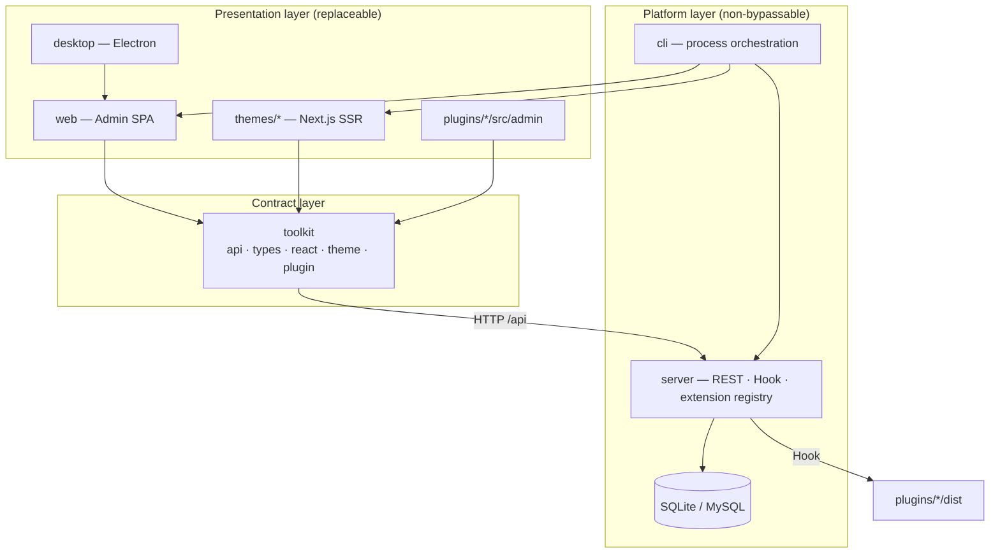

# Architecture Overview

ReactPress uses a **Monorepo + multi-process** model: content management, visitor presentation, and API are decoupled; **Toolkit** unifies types and API contracts.

Full details: repo [ARCHITECTURE.md](https://github.com/fecommunity/reactpress/blob/master/ARCHITECTURE.md).

## Architecture diagram

## Package responsibility matrix

| Package      | npm                               | Responsibility                    | Rendering      | SEO            |
| ------------ | --------------------------------- | --------------------------------- | -------------- | -------------- |
| **server**   | `@fecommunity/reactpress-server`¹ | Business logic, persistence, auth | —              | —              |
| **web**      | `@fecommunity/reactpress-web`     | Admin UI                          | Vite CSR       | No             |
| **themes/**  | per-theme packages                | Visitor site                      | Next SSR/ISR   | Yes            |
| **toolkit**  | `@fecommunity/reactpress-toolkit` | API client, types                 | —              | —              |
| **plugins/** | per-plugin packages               | Hook logic + Admin slots          | Mixed          | Plugin-related |
| **desktop**  | —                                 | Electron shell + local API        | loads web/dist | No             |
| **cli**      | `@fecommunity/reactpress`         | init / doctor / orchestration     | —              | —              |

¹ Standalone npm package deprecated; end users use CLI bundled API.

## Design principle priority

**Maintainability → Extensibility → Tech fit → Low cost**

| Decision     | Choice           | Reason                           |
| ------------ | ---------------- | -------------------------------- |
| API access   | Toolkit only     | Single client, OpenAPI codegen   |
| Admin        | Vite SPA         | Interaction-heavy, no SSR needed |
| Visitor site | Next.js          | SSR/ISR, SEO                     |
| Extensions   | Hook + manifest  | WordPress-style, no core edits   |
| List state   | URL searchParams | Shareable, refreshable           |

## Data flow rules

1. **Admin / Theme / Plugin UI** → Toolkit HTTP → Server
2. **Server** fires Hooks → Plugin server modules
3. **Server** must not depend on any frontend package
4. **Theme** must not connect to database directly

## Runtime ports

| Process       | Default port |
| ------------- | ------------ |
| Admin         | 3000         |
| Theme         | 3001         |
| API           | 3002         |
| Theme preview | 3003         |

## Extension points

| Extension | Registry                   | Docs                                          |
| --------- | -------------------------- | --------------------------------------------- |
| Theme     | `theme.json` / npm catalog | [Theme development](./theme-development.md)   |
| Plugin    | `plugin.json`              | [Plugin development](./plugin-development.md) |
| Headless  | REST + API Key             | [Headless API](./headless-api.md)             |

## Related docs

- [Core concepts](../getting-started/core-concepts.md)
- [Monorepo local development](./local-development.md)
- [CLI reference](./cli-reference.md)
