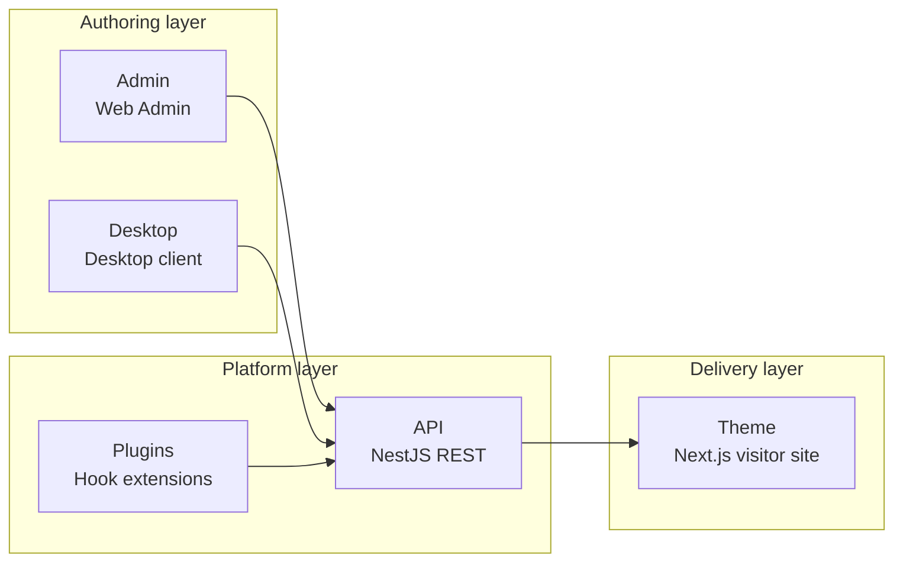

# Core Concepts

ReactPress is a **publishing platform**, not a Headless CMS alone. Understanding each component helps you choose the right approach and extend the system.

## One-line definition

> **Admin manages content · Theme manages presentation · Plugin manages logic · API manages data · Toolkit manages contracts**

## Five components



| Component | Technology | Port | Responsibility |
|------|------|------|------|
| **Admin** | React + Vite SPA | 3000 | Write posts, manage media, install themes/plugins, site settings |
| **API** | NestJS | 3002 | Persistence, auth, Hooks, Headless REST |
| **Theme** | Next.js SSR/ISR | 3001 | Visitor-facing site (fully replaceable) |
| **Plugin** | Node module + Hook | — | Server-side logic (SEO, summaries, image optimization, etc.) |
| **Desktop** | Electron | — | Offline writing, SQLite local mode, sync to remote |

## Mapping to WordPress

| WordPress | ReactPress | Notes |
|-----------|------------|------|
| wp-admin | Admin (:3000) | Content management UI |
| Theme | themes/* (:3001) | Visitor frontend, installable via npm |
| Plugin | plugins/* | Hook extensions without modifying themes |
| REST API | /api/* | Headless enabled by default |
| — | Desktop | Local-first writing (no WordPress equivalent) |

## Data flow

1. Authors create posts in **Admin** or **Desktop**
2. Requests reach **API** via the **Toolkit SDK**
3. **Plugins** transform summaries, SEO fields, etc. at Hook points
4. Data is written to SQLite / MySQL
5. **Theme** fetches content via API and SSR-renders for visitors

## Architecture rules

- **Admin does not serve visitor pages**; **themes do not include Admin routes**
- All frontends (Admin, theme, plugin UI) **access API only through Toolkit**
- **Server does not depend on any frontend package**

See [Architecture overview](../developer-guide/architecture-overview.md).

## Directories and runtime

```
my-site/
├── .reactpress/
│   ├── config.json          # config source (ports, database, URLs)
│   ├── runtime/{theme-id}/  # installed themes
│   ├── plugins/{plugin-id}/ # installed plugins
│   └── reactpress.db        # SQLite (default)
├── .env                       # auto-generated by CLI — do not edit by hand
└── uploads/                   # media upload directory
```

## Two user paths

| Path | For | Entry |
|------|------|------|
| **End user** | Build sites, blog | `npm i -g @fecommunity/reactpress` → `init` |
| **Contributor** | Core, themes, plugins | clone monorepo → `pnpm dev` |

## Related docs

- [Installation & requirements](./installation.md)
- [CLI command reference](../developer-guide/cli-reference.md)
- [Glossary](../reference/glossary.md)
