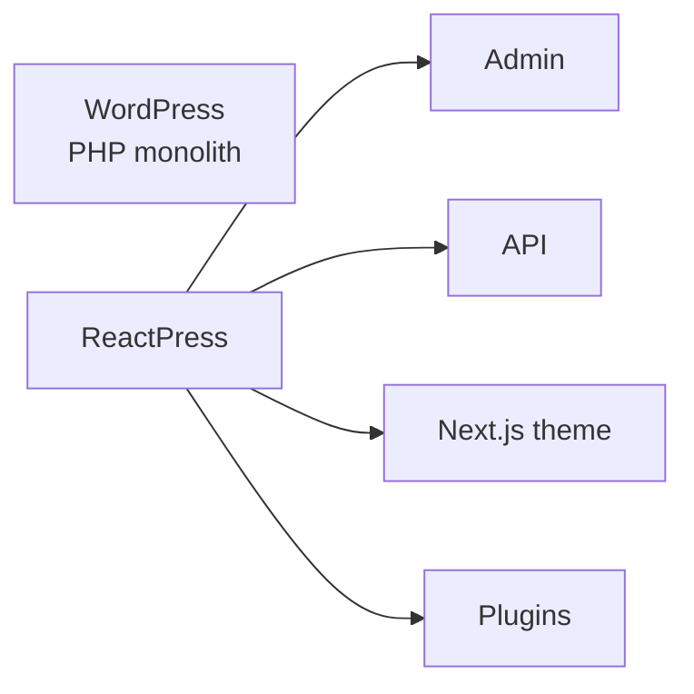

# ReactPress vs WordPress: Which Should You Choose? (2026)

If you are evaluating an **open-source blog, CMS, or publishing platform**, “ReactPress or WordPress?” is usually the first decision. This guide compares both for **developers**, **site owners**, and **SEO** — including when WordPress is still the better choice.

New to the product? Start with [What is ReactPress?](./what-is-reactpress.md).

## At a glance

|                      | ReactPress                                                                                         | WordPress                                                 |
| -------------------- | -------------------------------------------------------------------------------------------------- | --------------------------------------------------------- |
| **Positioning**      | Full **publishing system for React developers** (Admin + API + Next.js themes + plugins + desktop) | World’s most popular PHP CMS; huge plugin/theme market    |
| **Stack**            | React, Next.js, NestJS, SQLite / MySQL                                                             | PHP, MySQL, classic themes                                |
| **Time to live**     | `npm i -g @fecommunity/reactpress` → `reactpress init` — ~**60 seconds**                           | One-click host or LAMP — often minutes                    |
| **Editing**          | Markdown-first Admin; familiar post/page/media model                                               | Gutenberg blocks; enormous editor ecosystem               |
| **Visitor delivery** | Next.js SSR / ISR by default                                                                       | PHP themes; caching plugins common                        |
| **Headless**         | First-class REST + TypeScript toolkit                                                              | REST exists; Headless usually extra setup                 |
| **Best for**         | React teams, SSR SEO, self-hosted modern stack                                                     | Non-technical editors, plugin marketplace, mature hosting |

## Architecture

### WordPress: classic monolithic CMS

WordPress keeps **content management, theme rendering, and plugins** inside one PHP runtime. The upside is “install a plugin and go.” The trade-off is uneven theme/plugin quality and performance work that often depends on Redis, CDN, and page-cache plugins.

### ReactPress: separated publishing platform

ReactPress splits responsibilities the way React teams already think:

1. **NestJS API** — REST, webhooks, API keys
2. **Vite Admin** — content, media, comments, plugin settings
3. **Next.js theme** — SSR/SSG visitor site (sitemap, OG, JSON-LD)
4. **Plugin Hooks** — WordPress-like extensibility in JavaScript
5. **Electron desktop** — SQLite local writing with remote sync

Use a catalog theme to launch fast, or fork [reactpress-theme-starter](https://github.com/fecommunity/reactpress-theme-starter) and keep the same Admin workflow.



## Feature comparison matrix

| Capability                       | ReactPress                          | WordPress                |
| -------------------------------- | ----------------------------------- | ------------------------ |
| Posts / pages / media / comments | Yes                                 | Yes                      |
| Themes                           | npm Next.js themes                  | PHP themes + customizers |
| Plugins                          | Hook + `plugin.json` + Admin slots  | Huge directory (60,000+) |
| Default DB                       | SQLite                              | MySQL                    |
| CLI DX                           | `init` / `doctor` / `logs` / `stop` | WP-CLI + host panels     |
| Desktop offline writing          | Official Electron client            | Third-party tools        |
| TypeScript SDK                   | `@fecommunity/reactpress-toolkit`   | Community clients        |
| License                          | MIT                                 | GPLv2                    |

## SEO and performance

Both can rank. The **default path** differs:

| SEO factor           | ReactPress                     | WordPress                      |
| -------------------- | ------------------------------ | ------------------------------ |
| **Rendering**        | Next.js SSR/SSG out of the box | Theme-dependent                |
| **Core Web Vitals**  | Modern React build pipeline    | Often limited by plugin weight |
| **Structured data**  | Theme starter JSON-LD          | Yoast / Rank Math / etc.       |
| **Sitemap / robots** | Theme `/sitemap.xml`           | Plugins or SEO suite           |
| **Per-post meta**    | Built-in SEO plugin in Admin   | SEO plugins                    |

ReactPress SEO workflow: [Site settings & SEO](../user-guide/site-settings-seo.md).

## Content and editing experience

- **WordPress** wins when editors need Gutenberg blocks, page builders, and non-technical workflows yesterday.
- **ReactPress** fits docs, engineering blogs, and teams who prefer **Markdown**, clear content models, and a React Admin.

Migration cost from WordPress is mostly **rebuilding the theme in Next.js**. Content can move via export scripts or the Headless API — see [FAQ](../reference/faq.md) and [Headless API](../developer-guide/headless-api.md).

## Plugins and extensions

|                 | ReactPress                                                | WordPress                                                 |
| --------------- | --------------------------------------------------------- | --------------------------------------------------------- |
| Catalog size    | Early but growing; official SEO, summary, image optimizer | Massive marketplace                                       |
| Extension model | In-process Hooks (trusted code)                           | PHP plugins (trusted code)                                |
| Best when       | You can ship JS plugins for your product                  | You need off-the-shelf e-commerce, LMS, forms, membership |

Custom plugins: [Plugin development](../developer-guide/plugin-development.md).

## Headless and custom frontends

- **WordPress**: REST (and GraphQL via plugins) exists; “Headless WordPress” is a project of its own.
- **ReactPress**: Headless is **default** — `/api/article`, categories, pages, API keys, toolkit SDK.

If you only need an API and will build every UI yourself, Strapi/Payload may be enough. If you want **WordPress-style publishing + React delivery**, ReactPress is the closer fit. More context: [Self-hosted CMS for React](./self-hosted-cms-for-react.md).

## Deployment and operations

|                   | ReactPress                        | WordPress                                    |
| ----------------- | --------------------------------- | -------------------------------------------- |
| Local zero-config | SQLite + CLI                      | Local WP / Docker images                     |
| Production        | Node host, CLI `start`, or Docker | Shared hosting, WP Engine, self-managed LAMP |
| Diagnostics       | `reactpress doctor` / `logs`      | Host panel, debug plugins                    |
| Backups           | DB file or MySQL + `uploads/`     | DB + `wp-content`                            |

Deploy guides: [Production](../tutorial-basics/deploy-your-site.md) · [Docker](../tutorial-extras/docker-deployment.md).

## When WordPress wins

- Editors are **non-technical** and depend on ready-made plugins (WooCommerce, memberships, form builders)
- You already invested heavily in WP themes/plugins — migration cost exceeds benefit
- You want turnkey managed WordPress hosting

## When ReactPress wins

- The team standardizes on **React / Next.js** and refuses a PHP theme layer
- You need **SSR SEO + Admin + Headless** without assembling three products
- You want **self-hosted** data with MIT licensing and a single CLI
- You are explicitly shopping for a **WordPress alternative** for developer-led sites

Ship a proof in a minute: [Build a Next.js blog in 60 seconds](./build-nextjs-blog-in-60-seconds.md).

## vs other “React CMS” options

| Option                            | You get                                      | You still build                   |
| --------------------------------- | -------------------------------------------- | --------------------------------- |
| **Strapi / Payload / Contentful** | Content API (+ Admin)                        | Visitor site, often SEO plumbing  |
| **Next.js + MDX / Contentlayer**  | Git-based pages                              | CMS for non-dev editors           |
| **WordPress + headless front**    | Mature CMS                                   | Next.js app + sync complexity     |
| **ReactPress**                    | Admin + API + Next theme + plugins + desktop | Only the customization you choose |

## Try ReactPress

```bash
npm i -g @fecommunity/reactpress
mkdir my-blog && cd my-blog
reactpress init
```

- Admin: http://localhost:3001/admin/
- Visitor: http://localhost:3001
- Health: http://localhost:3002/api/health

Walkthrough: [Create your first site](./first-site.md).

:::tip Name disambiguation
This ReactPress is **fecommunity/reactpress** — a NestJS + Next.js publishing platform. It is **not** the WordPress plugin that embeds React apps inside existing WP sites.
:::

## FAQ

**Is ReactPress free?**  
Yes — MIT. Install from npm.

**Is 4.0 production-ready?**  
Yes — 4.0.0 is stable (`@latest`). Read [3.x → 4.0 migration](../tutorial-extras/migration-3-to-4.md) when upgrading from 3.x and validate on staging.

**Can I use my own frontend?**  
Yes — Headless REST + API keys.

**Can I migrate from WordPress?**  
Content yes (export/API); PHP themes no — rebuild on Next.js or start from the theme starter.

More: [FAQ](../reference/faq.md).

## Next steps

- [What is ReactPress?](./what-is-reactpress.md)
- [Self-hosted CMS for React](./self-hosted-cms-for-react.md)
- [Core concepts](./core-concepts.md)
- [Installation](./installation.md)
- [About ReactPress](/about)
- Blog: [WordPress alternatives for React (2026)](/blog/wordpress-alternatives-for-react-developers-2026) · [vs Strapi / Payload](/blog/reactpress-vs-strapi-payload-headless-cms)
