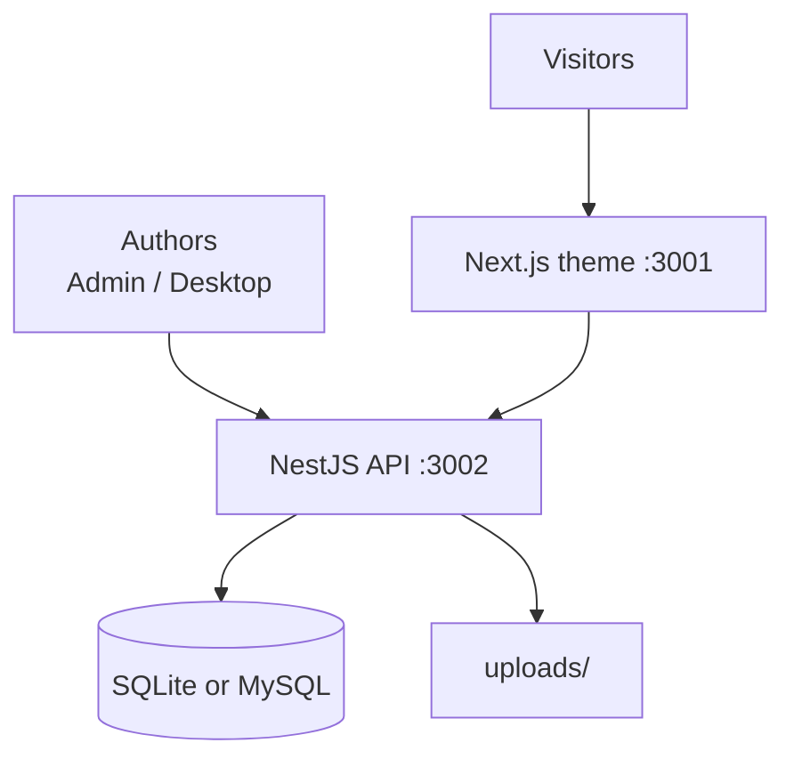

# Self-Hosted CMS for React

Looking for a **self-hosted CMS for React** — not a SaaS Headless plan, not a PHP stack, and not five repos glued together?

**ReactPress** is an open-source, **self-hosted publishing platform** for React developers: Admin + NestJS API + Next.js themes + plugins + optional desktop client, all started from one CLI. Your content and media stay on **your** machine or server.

```bash
npm i -g @fecommunity/reactpress@beta
mkdir my-cms && cd my-cms
reactpress init
```

Default path: **SQLite**, no Docker, no cloud account.

## What “self-hosted” means here

| You control              | How ReactPress supports it                                  |
| ------------------------ | ----------------------------------------------------------- |
| **Where data lives**     | Local `.reactpress/reactpress.db` (SQLite) or your MySQL    |
| **Where code runs**      | Your laptop, VPS, Docker host, or private cloud             |
| **Who can write**        | Your Admin users / desktop clients — not a vendor dashboard |
| **How the site renders** | Your Next.js theme process; swap or fork anytime            |
| **License**              | **MIT** — fork, commercial use, no seat tax                 |

Live example of a production ReactPress site: [blog.gaoredu.com](https://blog.gaoredu.com/).

## Why React teams self-host ReactPress

### 1. One product, not a mash-up

Typical DIY stack: Strapi/Payload + custom Admin + Next.js blog + upload service + SEO glue.

ReactPress ships the **publishing surface** already wired:

- Write in Admin (or [Desktop](../tutorial-extras/desktop-client.md))
- Serve visitors with a Next.js theme (SSR SEO)
- Expose Headless REST when you need a custom app

See [What is ReactPress?](./what-is-reactpress.md).

### 2. React-native delivery

Visitor themes are **Next.js**, Admin is **React**, API is **NestJS**, extensions are **JavaScript Hooks** — no PHP theme layer. Compare options in [ReactPress vs WordPress](./reactpress-vs-wordpress.md).

### 3. Sensible defaults, escape hatches when you scale

| Stage                      | Database / runtime                                           |
| -------------------------- | ------------------------------------------------------------ |
| Local / small sites        | Embedded **SQLite** (default)                                |
| Higher traffic / shared DB | External **MySQL**                                           |
| Containerized ops          | [Docker deployment](../tutorial-extras/docker-deployment.md) |
| Offline authors            | Electron desktop + sync to remote API                        |

Config overview: [Configuration](../tutorial-extras/config-intro.md).

## Architecture for operators



- **Admin** at `:3001/admin/` — content, media, themes, plugins, settings
- **Theme** at `:3001` — public SSR site
- **API** at `:3002` — persistence, auth, Hooks, Headless

Boundaries: [Core concepts](./core-concepts.md) · [Architecture](../developer-guide/architecture-overview.md)

## Security & ownership checklist

Before production:

1. Change default `admin` / `admin` credentials
2. Set public URLs and secrets in `.reactpress/config.json` / generated `.env`
3. Restrict Admin to trusted networks or reverse-proxy auth as needed
4. Back up `reactpress.db` (or MySQL) **and** `uploads/`
5. Enable the SEO plugin and verify sitemap / canonical on the theme

Guides: [Production deployment](../tutorial-basics/deploy-your-site.md) · [Site settings & SEO](../user-guide/site-settings-seo.md)

:::tip Plugins are trusted code
Enabled plugins load into the API process (WordPress-like model). Only install plugins you trust; manage them via Admin with proper roles.
:::

## Self-hosted vs SaaS Headless

|                     | ReactPress (self-hosted) | Typical SaaS Headless   |
| ------------------- | ------------------------ | ----------------------- |
| **Data location**   | Your disk / your DB      | Vendor cloud            |
| **Admin UI**        | Included                 | Included (vendor UX)    |
| **Visitor site**    | Included Next.js theme   | You build or buy        |
| **Pricing**         | MIT + your infra         | Seats / API / bandwidth |
| **Offline writing** | Desktop client           | Rare                    |

Choose SaaS when you want zero ops. Choose ReactPress when you want **React stack + full publishing + data residency**.

## Go live paths

| Path                                                           | Best for                           |
| -------------------------------------------------------------- | ---------------------------------- |
| [60-second Next.js blog](./build-nextjs-blog-in-60-seconds.md) | First local proof                  |
| [First site tutorial](./first-site.md)                         | Guided Admin walkthrough           |
| [Production deploy](../tutorial-basics/deploy-your-site.md)    | VPS / Node process                 |
| [Docker](../tutorial-extras/docker-deployment.md)              | Container hosts                    |
| [Headless API](../developer-guide/headless-api.md)             | Custom React frontends on your API |

## FAQ

**Is self-hosting free?**  
The software is MIT. You pay only for your own compute, storage, and domain.

**Do I need Kubernetes?**  
No. Many sites run as a single Node host with SQLite or MySQL.

**Can I move later?**  
Yes — export via API, migrate DB files, or point a new theme at the same API.

**Is 4.0 ready for self-hosted production?**  
Core `init` / `doctor` paths are stable in active beta; stage first and read [3.x → 4.0 migration](../tutorial-extras/migration-3-to-4.md). More: [FAQ](../reference/faq.md).

## From the blog

- [Self-hosted Next.js CMS blog guide (2026)](/blog/self-hosted-nextjs-cms-blog-guide)
- [Next.js blog SEO checklist](/blog/nextjs-blog-seo-checklist-reactpress)
