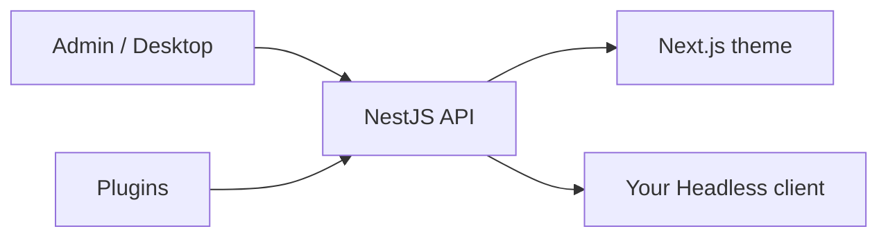

# What is ReactPress?

**ReactPress** is **the publishing system for React developers**. Build blogs, documentation sites, company websites, and content-driven applications with React — without assembling a Headless CMS, Admin UI, and frontend from scratch.

One global CLI ships:

| Layer         | What you get                                                             |
| ------------- | ------------------------------------------------------------------------ |
| **CMS Admin** | WordPress-style writing: posts, pages, media, categories, tags, comments |
| **API**       | NestJS Headless REST with API keys and webhooks                          |
| **Themes**    | Swappable Next.js visitor sites (SSR/ISR) with SEO built in              |
| **Plugins**   | Hook-based extensions (SEO meta, auto-summary, image optimization, …)    |
| **Desktop**   | Electron client for offline writing with SQLite, sync to remote API      |
| **CLI**       | `init` · `doctor` · `logs` · `stop` — live in about **60 seconds**       |

```bash
npm i -g @fecommunity/reactpress
mkdir my-site && cd my-site
reactpress init
```

- Visitor site: http://localhost:3001
- Admin: http://localhost:3001/admin/
- API health: http://localhost:3002/api/health

## Not another Headless CMS

Many tools in the React ecosystem deliver **only an API** (Strapi, Payload, Contentful, Sanity). You still build Admin screens, the marketing site, media workflows, and deploy scripts yourself.

ReactPress is a **complete publishing platform**:

> **Admin manages content · Theme manages presentation · Plugin manages logic · API manages data · Toolkit manages contracts**

You can still go fully Headless — the REST API is on by default — but you are not forced to invent the rest of the product on day one.

## Who it is for

| Audience                     | Why ReactPress fits                                                                                                       |
| ---------------------------- | ------------------------------------------------------------------------------------------------------------------------- |
| **React / Next.js teams**    | One stack from Admin to visitor SEO — no PHP theme layer                                                                  |
| **Bloggers & docs authors**  | Markdown-friendly Admin; ship a Next.js site without a starter mash-up                                                    |
| **Agencies & product sites** | Themes + plugins + Headless API for custom frontends                                                                      |
| **Teams leaving WordPress**  | Familiar Admin workflow; modern SSR delivery — see [ReactPress vs WordPress](./reactpress-vs-wordpress.md)                |
| **Self-hosters**             | MIT license, SQLite by default, optional MySQL / Docker — see [Self-hosted CMS for React](./self-hosted-cms-for-react.md) |

## What you can build

- Personal or company **blogs** with SSR SEO, sitemap, and OG tags
- **Documentation / changelog** sites backed by real CMS content
- **Marketing sites** with pages, media, and Headless custom sections
- **Content apps** that consume `/api/article` and other endpoints from any React client
- **Local-first writing** via the [desktop client](../tutorial-extras/desktop-client.md)

Live demo: [blog.gaoredu.com](https://blog.gaoredu.com/) · Theme demo: [reactpress-theme-starter](https://reactpress-theme-starter.vercel.app)

## How the pieces fit



1. Authors write in **Admin** or **Desktop**.
2. **Plugins** run on Hooks (summary, SEO fields, image pipeline).
3. Content is stored in **SQLite** (default) or **MySQL**.
4. The **theme** SSR-renders for visitors; or your app calls the **Headless API**.

Deeper model: [Core concepts](./core-concepts.md) · [Architecture overview](../developer-guide/architecture-overview.md)

## ReactPress 4.0 at a glance

**ReactPress 4.0** (codename **Extend**) is the current recommended line:

- Plugin system + Admin slots
- Electron desktop client
- npm theme catalog (`reactpress theme add`)
- Embedded SQLite by default (Docker optional)

License: **MIT**. Package: [@fecommunity/reactpress](https://www.npmjs.com/package/@fecommunity/reactpress) · Source: [fecommunity/reactpress](https://github.com/fecommunity/reactpress)

:::tip Name disambiguation
ReactPress here is the **fecommunity open-source publishing platform** (NestJS + Next.js CMS). It is **not** the WordPress plugin that embeds React apps into existing WP sites.
:::

## Quick answers

| Question                   | Answer                                                                                            |
| -------------------------- | ------------------------------------------------------------------------------------------------- |
| Is it free?                | Yes — MIT open source                                                                             |
| Do I need Docker?          | No by default (SQLite). Docker only for embedded-docker / external MySQL                          |
| Is it production-ready?    | 4.0.0 is stable (`@latest`); stage first when upgrading from 3.x — see [FAQ](../reference/faq.md) |
| Can I use my own frontend? | Yes — Headless REST + API keys                                                                    |
| vs WordPress?              | Same editing idea, React/Next delivery — [full comparison](./reactpress-vs-wordpress.md)          |

## Start here

| Goal                               | Guide                                                                                  |
| ---------------------------------- | -------------------------------------------------------------------------------------- |
| Ship a Next.js blog in ~60 seconds | [How to build a blog with Next.js in 60 seconds](./build-nextjs-blog-in-60-seconds.md) |
| Step-by-step first site            | [Create your first site in 5 minutes](./first-site.md)                                 |
| Choose vs WordPress                | [ReactPress vs WordPress (2026)](./reactpress-vs-wordpress.md)                         |
| Self-hosting & ops                 | [Self-hosted CMS for React](./self-hosted-cms-for-react.md)                            |
| Install details                    | [Installation](./installation.md)                                                      |

## From the blog

- [WordPress alternatives for React developers (2026)](/blog/wordpress-alternatives-for-react-developers-2026)
- [ReactPress vs Strapi vs Payload](/blog/reactpress-vs-strapi-payload-headless-cms)
- [Self-hosted Next.js CMS guide](/blog/self-hosted-nextjs-cms-blog-guide)
- [Next.js blog SEO checklist](/blog/nextjs-blog-seo-checklist-reactpress)
