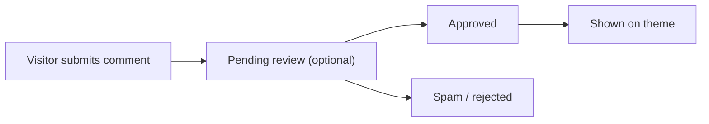

# Comment Moderation

ReactPress includes a built-in comment system. Visitors can leave comments on theme article pages; administrators moderate and reply in Admin.

## Comment workflow

## Admin actions

1. Open the **Comments** list
2. Filter by post, status, time
3. Per comment: **Approve**, **Reject**, **Mark spam**, **Reply**
4. Bulk delete or change status

## Moderation policy

Configure in **Settings → Comments** (version-dependent):

| Option | Description |
|------|------|
| Auto-approve | New comments publish immediately |
| Require review | Visible only after admin approval |
| Login required | Only registered users can comment (requires registration) |

## Anti-spam recommendations

- Enable review or third-party CAPTCHA in production (roadmap)
- Periodically clean spam comments
- Use Webhooks for new-comment notifications (Settings → Webhook)

## Theme display

The official **reactpress-theme-starter** theme includes comment UI via Toolkit comment API.

Custom themes must integrate comment components themselves. See [Theme development](../developer-guide/theme-development.md) and `/api/comment` in [Headless API](../developer-guide/headless-api.md).

## Related docs

- [Content management](./content-management.md)
- [Site settings & SEO](./site-settings-seo.md)
