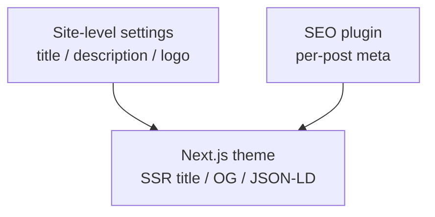

# Site Settings & SEO

For **site administrators**: Admin settings, SEO plugin, and production URL configuration.

## Basic site information


**Settings → General**:

| Field | Purpose |
|------|------|
| Site title | Browser title, OG site name |
| Site description | Default meta description |
| Logo / Favicon | Theme header and browser icon |
| Language | Default locale |

Stored in API; themes render via settings API.

## Layered SEO strategy

ReactPress SEO works in three layers:



### 1. Site level

Fill site description and brand assets in Admin **Settings**.

### 2. Post level

Enable the **seo** plugin per post:

- Meta title (can differ from post title)
- Meta description (~155 characters recommended)
- Keywords
- Canonical slug

### 3. Theme level

**reactpress-theme-starter** implements:

- Server-rendered `<title>` and meta tags
- Open Graph / Twitter Card
- Semantic HTML and sensible heading hierarchy

Custom themes: see SEO section in [Theme development](../developer-guide/theme-development.md).

## Production URLs

When deploying to a public domain, update URL config or OG links, media URLs, and OAuth callbacks will be wrong.

**Key `.env` variables** (synced from `config.json`):

```bash
CLIENT_SITE_URL=https://www.example.com
SERVER_SITE_URL=https://api.example.com
```

After editing `.reactpress/config.json`, run `reactpress config --apply` (Monorepo) and `reactpress doctor` to verify.

See [Configuration](../tutorial-extras/config-intro.md) and [FAQ](../reference/faq.md).

## API Key (Headless)

Create keys in **Settings → API** for:

- Third-party frontends fetching content
- CI publish scripts
- Mobile apps

```bash
curl -H "X-API-Key: YOUR_KEY" \
  "https://api.example.com/api/article/headless/list?status=publish&page=1&pageSize=10"
```

Full API: [Headless API guide](../developer-guide/headless-api.md).

## Webhook

**Settings → Webhook** subscribes to events such as `article.published`:

- Trigger CI to rebuild static pages
- Notify Slack / Discord
- Sync search engine index services

## SMTP (email)

With SMTP configured you can send:

- Password reset
- Comment notifications (version-dependent)
- System email

## Search engine submission

1. Ensure production `CLIENT_SITE_URL` uses HTTPS
2. Theme generates sitemap (starter supports `/sitemap.xml`)
3. Submit sitemap in Google Search Console / Bing Webmaster
4. Allow crawling via `robots.txt` (theme or Nginx layer)

## Lighthouse targets

Official theme demo can reach **Performance 95 / SEO 100**. Self-hosted results depend on:

- Image size (use image-optimizer)
- CDN and HTTP/2
- Server region and TTFB

## Related docs

- [Production deployment](../tutorial-basics/deploy-your-site.md)
- [SEO plugin](./plugins-in-admin.md)
- [Troubleshooting](../reference/troubleshooting.md)
