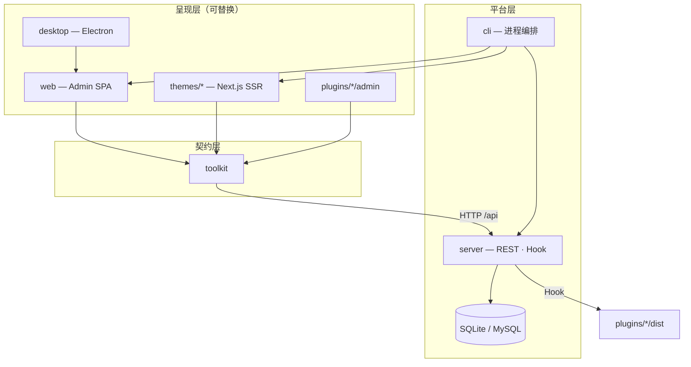

<!--truncate-->


如果你是一名前端工程师，大概率经历过这样的循环：

1. 团队决定用 **React / Next.js** 做官网或博客；
2. 你评估 Strapi、Payload、Contentful、Sanity……各自都不错，但**没有一个是「装完就能写、写完就能发」的完整发布平台**；
3. 你 fork Next.js 博客模板，接上 Headless 后端，再自己搭媒体库、评论、SEO、部署脚本；
4. 三个月后博客还没上线，你却维护了五个仓库。

与此同时，**WordPress** 依然占据全球 40%+ 的网站份额。PHP 被嘲笑「过时」，Gutenberg 被吐槽，可它仍是无数站长、内容团队、中小企业的默认选择。

**React 已经统治前端十年，为什么仍然没有自己的 WordPress？**

这不是技术能力问题，而是**产品形态**问题。过去三年我们反复听到同一个需求：「能不能像 WordPress 一样管内容，但前台用 Next.js？」现有方案要么只给 API，要么把 Admin 和主题焊死，要么需要 Docker + MySQL + 六个 npm 包才能写下第一段文字。

于是我们做了 **ReactPress 4.0**——面向 React 时代的**开源发布平台（Open Source CMS / React Publishing Platform）**，而不是又一个需要你自己拼装的 Headless 后端。

**SEO 关键词：** React CMS · Next.js CMS · WordPress alternative · React publishing platform · Open source CMS

---

## 目录

1. [一句话总结](#一句话总结)
2. [行业问题](#一行业问题)
3. [WordPress 为什么成功](#二wordpress-为什么成功)
4. [React 生态缺失](#三react-生态缺失)
5. [ReactPress 理念](#四reactpress-理念)
6. [系统架构](#五系统架构)
7. [眼见为实](#六眼见为实)
8. [Admin 写作界面](#七admin-写作界面)
9. [主题系统](#八主题系统)
10. [插件系统](#九插件系统)
11. [桌面客户端](#十桌面客户端)
12. [Headless API](#十一headless-api)
13. [SEO 与性能](#十二seo-与性能)
14. [安全模型](#十三安全模型)
15. [部署模式](#十四部署模式)
16. [迁移路径](#十五迁移路径)
17. [适用场景](#十六适用场景)
18. [路线图](#十七路线图)
19. [常见问题](#十八常见问题)
20. [快速开始](#十九快速开始)
21. [结语](#二十结语)

> **关于本文：** 中文完整版 · 与英文版结构对应 · 最后更新 2026-07-12 · [English version](pathname:///blog/why-react-still-doesnt-have-wordpress-reactpress-4)

---

## 一句话总结

| 问题                     | 简短回答                                                                                              |
| :----------------------- | :---------------------------------------------------------------------------------------------------- |
| **ReactPress 是什么？**  | 自托管 **React 发布平台**：NestJS API + Vite Admin + Next.js 主题 + Hook 插件 + CLI + Electron 桌面端 |
| **是 Headless CMS 吗？** | 包含 Headless REST，但交付更多——访客站、Admin、扩展开箱即用                                           |
| **WordPress 替代？**     | 是，适合要 WordPress 式工作流 + 现代 React/Next.js 栈的团队                                           |
| **多快能跑起来？**       | `npm i -g @fecommunity/reactpress` → `reactpress init` → 约 60 秒                                     |
| **许可证**               | MIT——可 fork、自托管、商用                                                                            |
| **当前版本**             | 4.0（代号 **Extend**）——插件、桌面、npm 主题 catalog                                                  |

```bash
npm i -g @fecommunity/reactpress@beta
mkdir my-site && cd my-site
reactpress init
```

| 服务   | 地址                             |
| :----- | :------------------------------- |
| 访客站 | http://localhost:3001            |
| Admin  | http://localhost:3001/admin/     |
| API    | http://localhost:3002/api/health |

---

## 一、行业问题

现代内容系统逼你在**编辑体验、前端自由度、开箱即用**之间做取舍。

### 1.1 不可能三角

| 路径                      | 编辑 | 前端自由 | 开箱即用 |  现代性能  |
| :------------------------ | :--: | :------: | :------: | :--------: |
| WordPress                 |  ✅  |    ❌    |    ✅    |     △      |
| SSG / 纯 Next.js          |  ❌  |    ✅    |    △     |     ✅     |
| Headless CMS              |  △   |    ✅    |    ❌    | 取决于前台 |
| **理想的 React 发布平台** |  ✅  |    ✅    |    ✅    |     ✅     |

#### WordPress 式 CMS：会写，但跑不快

内容、主题、插件焊在 PHP 运行时里。对非技术用户友好，但 React 团队难以复用组件库，Headless 是后补路径，性能常依赖缓存插件。

#### 静态站点生成器：快，但没有真 CMS

内容变更 = 开发者改 Markdown + CI 构建。运营无法独立发稿。

#### Headless CMS：灵活，但要自己组装整机

Strapi、Payload 等把 API 做得很好，但通常**不交付访客站和日常写作 UI**。典型路径：选型 → 配 Schema → 写 Next.js 前台 → 做 SEO → 配媒体 → 写部署脚本——对「这周就要上线的博客」过重。

### 1.2 前端负责人的真实一周

**周一** 产品要博客+SEO+运营发稿。**周二** 选定 Strapi，搭 Docker。**周三** 写 Next.js 前台。**周四** 做 sitemap/OG/评论。**周五** 部署四套 CI。 **下周一** 产品问：「什么时候能发文？」

问题不是某个工具差，而是**没有人交付完整的发布闭环**。ReactPress 要结束这个循环。

### 1.3 为什么「再做一个 Headless CMS」不够

行业不缺 Headless，缺的是：

1. 默认就有的**生产级访客站**
2. 运营愿意每天打开的 **Admin**
3. **装插件**而非 fork core 的扩展点
4. `doctor` 一条命令的诊断入口

---

## 二、WordPress 为什么成功

### 2.1 唯一入口，零决策疲劳

下载 → 数据库 → `/wp-admin/`。**一条路径**。ReactPress 学习这一点：`reactpress init` 约 60 秒得整机。

### 2.2 Core / Theme / Plugin 边界

| WordPress | ReactPress | 职责              |
| :-------- | :--------- | :---------------- |
| wp-admin  | Admin      | 内容管理          |
| Theme     | themes/\*  | 访客 Next.js 站   |
| Plugin    | plugins/\* | Hook 扩展         |
| REST API  | /api/\*    | Headless 默认开启 |
| —         | Desktop    | 离线写作          |

### 2.3 插件生态即生命力

WordPress 60,000+ 插件。ReactPress 4.0 用 `plugin.json` + Hook 让扩展成为平台一等公民。

### 2.4 我们学习的与拒绝的

**学习：** 唯一入口、清晰边界、作者优先、数据可迁移。  
**拒绝：** PHP 主题焊死 Admin、用插件数量掩盖架构债、默认绑定臃肿 Docker 栈。

**Same editing workflow, modern Next.js delivery.**

---

## 三、React 生态缺失

```
                    编辑者友好
                        ↑
          WordPress     |     ReactPress（目标位）
                        |
    Headless ───────────┼─────────── 全栈框架
                        ↓
                    开发者友好
```

**缺口在右上角：** 编辑者与开发者都满意，技术栈统一在 React/Next.js。

### 3.1 主流方案对比

| 方案               | 默认交付                               | 访客站      |
| :----------------- | :------------------------------------- | :---------- |
| Strapi / Payload   | API + Admin                            | 无          |
| Next.js 博客模板   | 示例代码                               | 有，无 CMS  |
| Headless WordPress | REST                                   | 自建        |
| **ReactPress**     | API + Admin + 主题 + 插件 + CLI + 桌面 | Next.js SSR |

搜索 **「Next.js CMS」** 多半是如何**接入** Headless 的教程，而非**一条命令装完整 CMS**——这就是产品缺口。

### 3.2 社区里反复出现的话

- 「我们已经在用 Next.js，不想为博客再上 PHP WordPress。」
- 「Strapi 能用，但前台花了两个周末。」
- 「有没有自托管开源方案，而不是又一个组装套件？」

ReactPress 4.0 的每一项能力——bundled CLI、SQLite 默认、npm 主题、Hook 插件、Electron 桌面——都对应真实用户故事。

### 3.3 ReactPress 迭代脉络

| 版本 | 代号     | 要点                         |
| :--- | :------- | :--------------------------- |
| 3.0  | Platform | 一条 CLI、约 60 秒起站       |
| 3.1+ | Toolkit  | 统一 API 契约、Next 14       |
| 4.0  | Extend   | 插件、桌面、npm 主题 catalog |

---

## 四、ReactPress 理念

> **Admin 管内容 · 主题管呈现 · 插件管逻辑 · API 管数据 · Toolkit 管契约**

### 4.1 与 Headless CMS 的差异

| 维度   | Headless CMS        | ReactPress                             |
| :----- | :------------------ | :------------------------------------- |
| 交付物 | 内容 API            | API + Admin + 主题 + 插件 + CLI + 桌面 |
| 访客站 | 你负责              | 官方 Next.js 主题，可替换              |
| 上手   | 部署后端 → 开发前台 | `reactpress init` ~60 秒               |

### 4.2 架构红线

1. Admin 不服务访客页；主题不服务 `/admin/`
2. 所有前端仅通过 **Toolkit** 访问 API
3. **Server 不依赖任何前端包**
4. **主题禁止直连数据库**

### 4.3 三十秒上手

```bash
npm i -g @fecommunity/reactpress@beta
mkdir my-site && cd my-site
reactpress init
```

默认 SQLite，无需 Docker。`reactpress doctor` 诊断环境问题。

### 4.4 两类用户

| 用户         | 入口                                        |
| :----------- | :------------------------------------------ |
| **终端用户** | `npm i -g @fecommunity/reactpress` → `init` |
| **贡献者**   | clone monorepo → `pnpm dev`                 |

### 4.5 与可视化建站器的边界

Webflow、Framer 适合营销落地页；ReactPress 服务**把代码当资产**的团队——主题在 Git、内容在 CMS。

---

## 五、系统架构



### 5.1 创作到交付

1. 作者在 Admin / Desktop 创建内容
2. 请求经 Toolkit 到 NestJS API
3. Plugin 在 Hook 点处理 SEO、摘要等
4. 写入 SQLite / MySQL
5. Next.js 主题 SSR/ISR 渲染给访客

### 5.2 包职责

| 包         | 职责                     |
| :--------- | :----------------------- |
| server     | 业务、持久化、鉴权、Hook |
| web        | Admin UI（Vite CSR）     |
| themes/\*  | 访客站（SSR/SEO）        |
| toolkit    | API 客户端、类型         |
| plugins/\* | Hook + Admin 插槽        |
| desktop    | Electron + 本地 API      |
| cli        | init / doctor / 编排     |

### 5.3 目录结构

```
my-site/
├── .reactpress/
│   ├── config.json
│   ├── runtime/{theme-id}/
│   ├── plugins/{plugin-id}/
│   └── reactpress.db
├── .env
└── uploads/
```

备份：`tar czf backup.tar.gz .reactpress uploads`

### 5.4 技术选型

| 决策    | 选择            | 原因              |
| :------ | :-------------- | :---------------- |
| API     | NestJS          | 模块化、Hook 友好 |
| Admin   | Vite SPA        | 交互密集          |
| 访客站  | Next.js         | SSR/ISR、SEO      |
| 扩展    | Hook + manifest | WordPress 式心智  |
| 默认 DB | SQLite          | 零配置            |

### 5.5 端口

| 进程         | 端口 |
| :----------- | :--- |
| 主题（访客） | 3001 |
| API          | 3002 |
| 主题预览     | 3003 |

---

## 六、眼见为实

### 6.1 CLI：约 60 秒从安装到上线


### 6.2 访客站：搜索、评论、知识库、深色模式


在线演示：[reactpress-theme-starter.vercel.app](https://reactpress-theme-starter.vercel.app)

### 6.3 Lighthouse


官方主题 Demo 可达 **Performance 95 / SEO 100**（生产环境因托管与内容而异）。

### 6.4 在线 Demo

| Demo      | URL                                                                                |
| :-------- | :--------------------------------------------------------------------------------- |
| 生产站点  | [blog.gaoredu.com](https://blog.gaoredu.com)                                       |
| 主题 Demo | [reactpress-theme-starter.vercel.app](https://reactpress-theme-starter.vercel.app) |
| 文档      | [docs.gaoredu.com](https://docs.gaoredu.com)                                       |

---

## 七、Admin 写作界面

### 7.1 文章编辑器


Markdown 编辑、草稿发布、分类标签、知识库与页面类型。

### 7.2 媒体库


### 7.3 插件管理


| 插件              | 能力                                 |
| :---------------- | :----------------------------------- |
| `seo`             | slug、关键词、meta 描述 + 编辑器插槽 |
| `hello-world`     | 自动摘要                             |
| `image-optimizer` | 批量 WebP 优化                       |

### 7.4 外观与设置


---

## 八、主题系统

> **主题 = 呈现。** 访客看到的是可替换的 Next.js 应用。

### 8.1 官方主题

| 主题                     | 来源       | 适用       |
| :----------------------- | :--------- | :--------- |
| hello-world              | 仓库 local | 学习、复制 |
| reactpress-theme-starter | npm        | 生产站点   |

```bash
reactpress theme add @fecommunity/reactpress-theme-starter@1.0.0-beta.0
```

### 8.2 主题内拉取数据

```typescript
import { createThemeApi } from '@fecommunity/reactpress-toolkit/theme';

const api = createThemeApi({ baseURL: process.env.NEXT_PUBLIC_API_URL });
const { data } = await api.article.list({ status: 'publish', page: 1 });
```

### 8.3 SEO 分工

Admin + SEO 插件**写**元数据；主题 SSR **渲染** title、OG、JSON-LD、sitemap。

详见 [主题开发](/docs/developer-guide/theme-development)。

---

## 九、插件系统

> **主题 = 呈现 · 插件 = 逻辑**

### 9.1 生命周期

发现 → 安装 → 启用 → 配置 → （可选）卸载

### 9.2 Hook 示例

```typescript
export function register(hooks: PluginContext['hooks']) {
  hooks.addFilter('article.beforePublish', async (article) => {
    if (!article.summary) {
      article.summary = article.content.slice(0, 160);
    }
    return article;
  });
}
```

### 9.3 与 WordPress 插件的诚实对比

WordPress 有海量即装插件；ReactPress 机制就绪、内置 SEO/摘要/图片优化，更适合**能写代码的团队**按需扩展。

详见 [插件开发](/docs/developer-guide/plugin-development)。

---

## 十、桌面客户端

WordPress 没有原生的离线本地写作对等物。ReactPress Desktop = **Electron 壳 + 同一套 Admin SPA**。


| 模式         | 场景                      |
| :----------- | :------------------------ |
| **本地模式** | 离线写作、SQLite 内嵌 API |
| **远程模式** | 对接生产/staging API      |

安装包：[GitHub Releases](https://github.com/fecommunity/reactpress/releases) · [桌面客户端文档](/docs/tutorial-extras/desktop-client)

---

## 十一、Headless API

```bash
curl -H "X-API-Key: YOUR_KEY" \
  "http://localhost:3002/api/article/headless/list?status=publish&page=1&pageSize=10"
```

Swagger：`http://localhost:3002/api`

| 方法 | 路径                         | 说明           |
| :--- | :--------------------------- | :------------- |
| GET  | `/api/health`                | 健康检查       |
| GET  | `/api/article/headless/list` | 已发布文章列表 |
| GET  | `/api/category/list`         | 分类           |

详见 [Headless API 指南](/docs/developer-guide/headless-api)。

---

## 十二、SEO 与性能

| 层级     | 策略                 |
| :------- | :------------------- |
| Admin    | CSR（不需 SEO）      |
| 主题     | SSR/ISR（爬虫友好）  |
| SEO 插件 | slug、关键词、meta   |
| 主题     | sitemap、OG、JSON-LD |

对比 [ReactPress vs WordPress](/docs/getting-started/reactpress-vs-wordpress)。

---

## 十三、安全模型

3.7+ 重点：

- SQL 注入：公开列表 API 列名白名单
- 存储型 XSS：评论 HTML 消毒、JWT、`Helmet` CSP
- 报告：[SECURITY.md](https://github.com/fecommunity/reactpress/blob/master/SECURITY.md)

生产清单：改默认密码、HTTPS、定期备份 `.reactpress/` 与 `uploads/`。

---

## 十四、部署模式

| 模式           | 适用                      |
| :------------- | :------------------------ |
| SQLite 单机    | 个人站、`reactpress init` |
| MySQL          | 并发编辑、更大流量        |
| Docker Compose | VPS 可复现部署            |
| 主题分离       | 主题上 Vercel，API 在 VPS |

详见 [生产部署](/docs/tutorial-basics/deploy-your-site)、[Docker 部署](/docs/tutorial-extras/docker-deployment)。

---

## 十五、迁移路径

| 来源                 | 要点                                                                |
| :------------------- | :------------------------------------------------------------------ |
| 新站                 | `reactpress init`                                                   |
| ReactPress 3.x → 4.0 | 无强制 Breaking，[迁移指南](/docs/tutorial-extras/migration-3-to-4) |
| WordPress            | 内容可脚本迁移；**主题需 Next.js 重写**                             |
| Markdown 仓库        | 导入 API 后改用 Admin 发稿                                          |

---

## 十六、适用场景

| 场景               | 为什么适合                   |
| :----------------- | :--------------------------- |
| 个人技术博客       | Admin + Lighthouse 级主题    |
| 开源文档站         | 知识库 + 文章同一主题        |
| 营销 + 工程并行    | Admin 给运营，主题仓库给前端 |
| 离线写作           | Desktop + SQLite + 同步      |
| WordPress 替代评估 | 熟悉工作流、现代栈           |

**自测：** 若 ≥3 条成立值得试用——主栈 React/Next、非开发者需发稿、要自托管开源、厌倦五仓库拼装、不想引入 PHP、关心 SSR SEO。

客观对比：[ReactPress vs WordPress](/docs/getting-started/reactpress-vs-wordpress)。

### 16.1 三个用户故事

**独立开发者 Alice** — `reactpress init`，周日下午发文，Lighthouse 跑绿，不需要 Strapi 或 PHP。

**开源维护者** — 文档走知识库 API，changelog 走文章 API，贡献者用 Admin 发稿。

**营销 + 前端并行** — 运营在 Admin 排期；前端 fork 主题做品牌动效；插件 Hook 通知 Slack。

### 16.2 何时仍选 WordPress

- 依赖海量现成插件（电商、会员、复杂表单）
- 已有大量 PHP 主题/插件投资
- 团队完全非技术、不愿碰 JavaScript

---

## 十七、路线图

### 近期（4.x）

- 插件 npm catalog、`reactpress plugin create`
- Desktop 自动更新、托盘、快捷键
- `reactpress theme create`
- 主题/插件市场

### 长期愿景

让「React 技术栈的默认发布方式」像 WordPress 一样被脱口而出：

```bash
npm i -g @fecommunity/reactpress
reactpress init
```

---

## 十八、常见问题

**免费吗？** MIT 开源，可商用。

**4.0 能上生产吗？** 核心路径已大量验证；staging 验证后升级，见 [迁移指南](/docs/tutorial-extras/migration-3-to-4)。

**必须 Docker 吗？** 默认 SQLite，不必须。

**能用自己的前台吗？** Headless REST + API Key + Toolkit。

**和 Strapi 怎么选？** 它们主要交付 API；ReactPress 交付**完整发布平台**。

**能从 WordPress 迁移吗？** 内容可以；主题需重写。

更多：[FAQ](/docs/reference/faq)

### 18.1 扩展问答

**Windows 能用吗？** CLI 与 Desktop 均支持 Windows 10+。

**能跑多个站点吗？** 可以，不同目录 + 不同 `config.json` 端口。

**必须用官方主题吗？** 否，Headless API + 自研 Next 即可。

**GraphQL？** 标准交付为 REST；GraphQL 需自建网关或插件。

**桌面端必须装吗？** 否，Web Admin 已完整；桌面端面向离线场景。

**Node 版本？** 当前推荐 Node.js 20+。

---

## 附录：对比速查

### A. ReactPress vs WordPress（2026）

| 维度     | ReactPress             | WordPress            |
| :------- | :--------------------- | :------------------- |
| 定位     | React 完整发布平台     | 通用 PHP CMS         |
| 技术栈   | React、Next.js、NestJS | PHP、MySQL           |
| 上手     | ~60 秒 `init`          | 托管一键安装         |
| 默认前台 | Next.js SSR            | PHP 主题             |
| Headless | 原生 REST              | 插件 + REST          |
| 离线写作 | Electron 桌面          | 第三方编辑器         |
| 最适合   | React 团队、SSR SEO    | 非技术用户、插件生态 |

### B. ReactPress vs Headless 拼装

| 任务     | Strapi + Next | ReactPress          |
| :------- | :------------ | :------------------ |
| 安装     | Docker / 云   | `reactpress init`   |
| 访客站   | 从零开发      | 官方主题自带        |
| SEO 基线 | 自己做        | 插件 + 主题默认     |
| 诊断     | 无统一入口    | `reactpress doctor` |

### C. 发布流水线（概念）

```
作者点击发布
  → Toolkit 请求 API
  → Hook: article.beforePublish（插件改 SEO、摘要）
  → 持久化
  → Hook: article.afterPublish
  → Webhook 通知外部系统
  → 主题 SSR/ISR 拉取新内容
```

### D. 运维极简清单

- **每日：** 扫一眼评论审核队列
- **每周：** 看 `reactpress logs`、检查磁盘
- **每月：** 测试备份恢复、轮换 API Key

---

## 十九、快速开始

```bash
npm i -g @fecommunity/reactpress@beta
mkdir my-blog && cd my-blog
reactpress init
```

1. 打开 http://localhost:3001/admin/（默认 `admin` / `admin`）
2. 写第一篇文章，启用 `seo` 插件
3. 在 http://localhost:3001 查看 SSR 结果

下一步：[5 分钟创建第一个站点](/docs/getting-started/first-site)、[ReactPress 4.0 指南](/docs/tutorial-extras/reactpress-4-0)、[系统架构](/docs/developer-guide/architecture-overview)。

---

## 二十、结语

React 改变了我们如何构建界面，却没有同等改变我们如何**发布**内容。WordPress 告诉我们：赢家靠**唯一入口、清晰边界、作者优先、可扩展生态、可迁移数据**。

ReactPress 4.0 把这些原则翻译到 React 时代：

| 能力   | 你得到什么                 |
| :----- | :------------------------- |
| CLI    | `reactpress init` 约 60 秒 |
| Admin  | WordPress 式内容运营       |
| API    | Headless REST + Swagger    |
| 主题   | 可替换 Next.js SSR         |
| 插件   | Hook + `plugin.json`       |
| 桌面端 | 离线 SQLite，就绪后同步    |
| 许可证 | MIT 开源                   |

若你在搜索 **React CMS**、**Next.js CMS**、**WordPress alternative**、**open source CMS**——从这里开始：

```bash
npm i -g @fecommunity/reactpress@beta
mkdir my-blog && cd my-blog
reactpress init
```

**Publish with React. Ship like WordPress.**

---

## 相关链接

- [GitHub 仓库](https://github.com/fecommunity/reactpress)
- [在线 Demo](https://blog.gaoredu.com)
- [英文版长文](pathname:///blog/why-react-still-doesnt-have-wordpress-reactpress-4)
- [ReactPress 4.0 指南](/docs/tutorial-extras/reactpress-4-0)
- [ReactPress vs WordPress](/docs/getting-started/reactpress-vs-wordpress)
- [更新日志](/blog/changelog)

_ReactPress 由 [fecommunity](https://github.com/fecommunity) 开发，MIT 许可证发布。_
