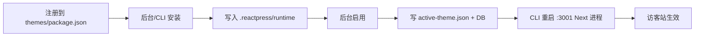

# ReactPress 主题系统梳理

> 目标：对标 WordPress 的「简单易用」——作者能 drop-in 主题，管理员能一键换肤，文档与实现一致。
>
> 梳理日期：2026-06-12

---

## 1. 结论摘要

ReactPress 主题系统在**概念模型**上已对齐 WordPress（manifest、Customizer、模板层级词汇），但**操作路径**明显更复杂：注册表 → 安装 → 激活 → 进程重启，且 local / npm 两套元数据规范并存。对「只想换个皮肤」的用户来说，步骤偏多；对「写主题的作者」来说，入门模板、官方文档、技术栈版本存在明显漂移。

**总体评价**

| 维度 | 现状 | WordPress 对标 |
| --- | --- | --- |
| 概念对齐 | ★★★★☆ | theme.json ≈ style.css + Customizer |
| 管理员换主题 | ★★☆☆☆ | 安装与启用分离，启用需等待进程重启（最长 ~120s） |
| 主题作者上手 | ★★☆☆☆ | 需理解三层目录 + Next.js 工程，无统一脚手架 |
| 文档一致性 | ★☆☆☆☆ | hello-world README 与真实代码严重不符 |
| 长期架构 | ★★★★☆ | 独立 Next 进程 + toolkit 契约，SSR 稳定 |

---

## 2. 当前架构

### 2.1 核心模型：两种来源、三层目录

```
┌─────────────────────────────────────────────────────────────┐
│  两种来源                                                    │
│    local  themes/{id}/  →  .reactpress/runtime/{id}/        │
│    npm    npm pack      →  .reactpress/runtime/{id}/        │
└─────────────────────────────────────────────────────────────┘

┌─────────────────────────────────────────────────────────────┐
│  三层目录                                                    │
│    themes/              注册表 — 有哪些主题「可安装」         │
│    .reactpress/runtime/ 物化层 — CLI 实际运行的副本             │
│    DB + *.json          激活态 — 当前启用 / 预览              │
└─────────────────────────────────────────────────────────────┘
```

| 端口 | 用途 |
| ---: | --- |
| 3000 | 管理后台 |
| 3001 | 当前激活主题的访客站 |
| 3002 | API |
| 3003 | 后台预览（非激活主题） |

### 2.2 生命周期



与 WordPress 对比：

| 步骤 | WordPress | ReactPress |
| --- | --- | --- |
| 放入主题 | 复制到 `wp-content/themes/` | 复制到 `themes/{id}/` **且** 写入 `local` 列表 |
| 可用 | 文件夹存在即出现在后台 | 需 **安装** 到 runtime |
| 启用 | 后台点「启用」，几乎即时 | 后台点「启用」，**等待 Next 重启**（UI 轮询最长 120s） |
| 元数据 | 单个 `style.css` 头 | local 用 `theme.json`；npm 用锚点 `package.json` |

### 2.3 关键模块

| 模块 | 职责 |
| --- | --- |
| `themes/` | 注册表、示例主题、Schema |
| `cli/lib/theme-*.js` | 安装、物化、dev watch、生产构建 |
| `server/…/theme.service.ts` | REST：安装 / 激活 / mods / 预览 |
| `toolkit/` | 主题 SDK：manifest 解析、SSR、UI 组件、`createThemeApp` |
| `web/…/appearance/` | 后台主题列表、Customizer、预览 iframe |

### 2.4 主题作者最小接入

**本地主题（in-repo）**

1. 复制 `themes/hello-world/` → `themes/my-theme/`
2. 改 `theme.json`（`id` 必须与目录名一致）
3. `themes/package.json` → `reactpress.local` 追加 `"my-theme"`
4. `pnpm dev` → 后台 **外观 → 主题** → **安装** → **启用**

**npm 主题**

1. 发布含 `theme.json` 或 `reactpress.themeId` 的 npm 包
2. 在 `themes/{anchor}/package.json` 写 catalog 锚点（**不能**有 `theme.json`）
3. 注册到 `reactpress.npm`，可选 `sync:catalog`
4. `reactpress theme add @scope/pkg@version`

**运行时入口（hello-world 实际用法）**

```tsx
// pages/_app.tsx
import { createThemeApp } from '@fecommunity/reactpress-toolkit/app';
import themeManifest from '../theme.json';
export default createThemeApp(themeManifest);
```

---

## 3. 已对齐 WordPress 的部分

这些设计是正确方向，应保留并对外强调：

| WordPress | ReactPress | 说明 |
| --- | --- | --- |
| `style.css` 主题头 | `theme.json` | id、name、version、requires、supports |
| Customizer | `appearance.sections` + theme_mods | 后台可视化改色、Logo 等 |
| `functions.php` | `createThemeApp` / `createReactPressApp` | 主题 bootstrap |
| `header.php` / `footer.php` | `SiteDocument`、`ThemeLayout` | 布局原语 |
| 模板层级 | `templates` 字段 + `ThemeTemplate` 常量 | 词汇对齐 WP |
| 主题选项 | `options`（JSON Schema） | 结构化站点配置 |

`themes/README.md` 与 `themes/theme-starter/README.md` 对双来源模型的说明清晰，可作为官方作者文档基准。

---

## 4. 问题清单

### 4.1 P0 — 阻碍「简单易用」

#### ① 安装与启用必须两步

后台安装成功提示：「主题已安装。请点击「启用」以应用到访客站。」（`installSuccessHint`）

WordPress 在主题列表里通常 **启用即生效**；ReactPress 多一层 runtime 物化，且启用触发进程重启。对新用户认知负担大。

**建议**

- 提供「安装并启用」合并操作（本地主题默认勾选）
- 或首次 `pnpm dev` 自动安装 + 激活默认主题 `hello-world`

#### ② 启用主题需等待 Next 进程重启

设计文档（`design.md` §4.5）明确 MVP 为「改配置 + 重启主题进程」。后台 `useThemeActivation` 最长轮询 120s。

体验上远弱于 WordPress 的秒级切换。虽为架构取舍，但应在 UI 上设为预期（进度条、预估时间），并探索 dev 环境 symlink 热重载 manifest 的优化空间。

#### ③ 文档与实现严重不一致

| 文档 | 声称 | 实际代码 |
| --- | --- | --- |
| `themes/hello-world/README.md` | Next.js **14**、**App Router**、`app/page.tsx` | Next **12**、**Pages Router**、`pages/index.tsx` |
| 同上 | `ThemeProvider` from `@fecommunity/reactpress-components` | 使用 `createThemeApp` + `ReactPressProvider` |
| 同上 | `npx @fecommunity/reactpress-template-hello-world` 独立建站 | 主题是 monorepo 内 `themes/hello-world/` |
| `design.md` §4.2 theme.json 示例 | 嵌套 `reactpress.templates` | 实际 flat 结构：`templates` 在根级 |

作者按 README 操作会直接失败，严重损害「简单易用」。

**建议**：重写 `hello-world/README.md`，以 `themes/README.md` 为单一事实来源；`design.md` 示例与 schema 对齐。

#### ④ 三个「入门」概念易混淆

| 名称 | 实际是什么 |
| --- | --- |
| `themes/hello-world/` | 仓库内 **Pages Router + Next 12** 最小本地主题 |
| `themes/theme-starter/` | **仅 catalog 锚点**，无源码 |
| `@fecommunity/reactpress-theme-starter` | npm 上 **Next 15 + App Router** 完整主题 |

新作者不知道抄哪个、装哪个，Stack 也不统一。

**建议**

- 统一对外只推一个「官方入门路径」
- 长期：hello-world 升级到与 theme-starter 同代 Next，或明确「极简版 / 完整版」命名

---

### 4.2 P1 — 作者与维护体验

#### ⑤ 缺少一键脚手架

无 `reactpress theme create my-theme` 一类命令。`hello-world/bin/create-hello-world.js` 面向独立 npm 模板，未接入 CLI 主流程。

WordPress：`wp scaffold theme` 或复制 twentytwenty* 即可。

**建议**：CLI 子命令 `theme create`，复制 hello-world + 替换 id/name + 自动写入 `themes/package.json`。

#### ⑥ local / npm 双套元数据规范

| 来源 | 元数据位置 | 注册方式 |
| --- | --- | --- |
| local | `theme.json` | `reactpress.local` |
| npm | `package.json` → `reactpress.theme` | `reactpress.npm` 锚点目录 |

规则（锚点目录不能有 `theme.json`）合理但需记忆。WordPress 无论 zip 还是文件夹，都是同一 `style.css` 头。

**建议**：npm 包内仍以 `theme.json` 为权威；锚点 `package.json` 只做 catalog 索引（id、npm spec、previewUrl），减少重复字段。

#### ⑦ `theme.json` 的 `templates` 仅为元数据

`resolveTemplateFiles()` 已导出，但 **Next 文件路由才是真实路由**；`templates` 不参与运行时解析。

作者可能误以为改 manifest 即可换模板路径，实际须改 `pages/` 文件结构。

**建议**：文档明确标注「声明性文档」；或在 CLI lint 中校验 `templates` 路径是否存在。

#### ⑧ 默认 themeId 不一致

- `DEFAULT_ACTIVE_THEME` / setting 回退：`'hello-world'`
- `resolveStaticVisitorContext()` 环境变量未设时回退：`'starter-theme'`

边缘场景（构建脚本、测试）可能指向错误主题。

#### ⑨ dev symlink vs prod copy

本地主题开发默认 symlink 到 runtime，生产 copy。编辑 `themes/` 源目录在 dev 即时可见，但 Customizer schema 合并有时读 `themes/{id}/` 有时读 runtime，可能出现 **外观面板与页面不同步**，需 reinstall。

---

### 4.3 P2 — 仓库卫生与长期债

#### ⑩ 僵尸目录

已清理历史上仅有 `public/` 静态资源、无 `theme.json` 的占位目录（如 `my-blog/`、`twentytwentyfive/`）。

#### ⑪ 遗留路径与键名

仍兼容 `bundled`/`catalog`、`themes/runtime/`、`templates/{id}/` 等。增加排查成本，新文档不应再提。

#### ⑫ 技术栈分裂

| 主题 | Next | Router |
| --- | --- | --- |
| hello-world | 12 | Pages |
| reactpress-theme-starter (npm) | 15 | App |

toolkit 同时提供 `createThemeApp` 与 `createReactPressApp`，作者需自行选型。

#### ⑬ 预览并发受限

预览池实质单端口 `:3003`，同时预览多个未安装主题能力有限（设计文档已标注为后期能力）。

#### ⑭ npm 主题安装脆弱

安装时 `npm pack` + `pnpm/npm install` 依赖网络与 peer deps，CI 或无网环境易失败。

---

## 5. WordPress 对标：理想用户体验

### 5.1 管理员（站点运营）

**WordPress 期望**

1. 外观 → 主题 → 看到已安装列表
2. 点「启用」→ 站点立即换肤
3. 外观 → 自定义 → 改 Logo / 颜色 → 实时预览

**ReactPress 理想态（在现有架构下可渐进达到）**

| 能力 | 目标行为 |
| --- | --- |
| 主题列表 | 本地主题 **自动出现在列表**，无需手动注册（或 dev 模式自动 scan `themes/*/`） |
| 一键启用 | 「安装并启用」单按钮；启用过程有明确进度（重启中 / 检测访客站） |
| 自定义 | 已有 Customizer + 预览 token，保持并强化 iframe 实时预览 |
| 切换成本 | 文档诚实说明「首次启用约需 10–30s」；生产环境 PM2 重启可接受 |

### 5.2 主题作者

**WordPress 期望**

1. 一个文件夹 + `style.css` 头信息
2. 复制 `header.php` / `footer.php` / `index.php` 改样式
3. 上传到 `themes/` 或 zip 安装

**ReactPress 理想态**

| 能力 | 目标行为 |
| --- | --- |
| 最小文件集 | `theme.json` + `pages/_app.tsx` + 若干 `pages/*.tsx` + `package.json` |
| 创建主题 | `reactpress theme create my-theme` 一条命令 |
| 单一文档 | `themes/README.md` + 一份与代码同步的 hello-world 说明 |
| 模板约定 | 默认 Pages 或 App Router **选一条官方路线**；toolkit 提供对应 starter |
| 发布 | `npm publish` 后 `reactpress theme add` 即可，无需仓库内锚点（可选 catalog 聚合） |

### 5.3 概念对照表（对外宣传用）

```
WordPress                    ReactPress
─────────────────────────────────────────────────
wp-content/themes/           themes/ + .reactpress/runtime/
style.css 头                 theme.json
functions.php                pages/_app.tsx → createThemeApp()
Customizer                   appearance.sections → theme_mods
get_header()/get_footer()    SiteDocument / ThemeLayout
模板层级（PHP 强制）          pages/ 或 app/ 路由（Next 强制）+ templates 文档
主题 zip 上传                npm pack / local copy
```

---

## 6. 改进路线图建议

按投入产出比排序：

### 阶段 A — 快速止血（1–2 周）

1. **重写 `themes/hello-world/README.md`**，删除 App Router / ThemeProvider 等过时内容
2. **修正 `design.md` theme.json 示例**，与 `theme.manifest.schema.json` 一致
3. **统一默认 themeId** 为 `hello-world`
4. 后台增加 **「安装并启用」** 按钮（至少对 local 主题）

### 阶段 B — 降低作者门槛（2–4 周）

1. **`reactpress theme create <id>`** 脚手架
2. **CLI `theme doctor`**：检查 theme.json、templates 路径、toolkit 版本
3. **dev 模式自动 scan**：`themes/*/theme.json` 存在即入 catalog，可选跳过 `package.json` 手动注册
4. 官方文档增加 **5 分钟第一个主题** 教程（与 hello-world 逐步对应）

### 阶段 C — 体验逼近 WordPress（中长期）

1. 评估 dev 下 **manifest 变更热更新**（减少全量 Next 重启）
2. npm 主题 **离线安装包** / 预构建 vendor 降低 install 失败率
3. hello-world **升级 Next 15** 或与 theme-starter 合并叙事
4. 主题市场 / catalog 远程源（超越 repo-local + 手动锚点）
5. `templates` **构建期校验** 或 codegen 脚手架页面

---

## 7. 当前可推荐的正确使用方式

在问题修复前，给团队/internal 的标准路径：

**站点管理员**

```text
pnpm dev
→ 后台 http://localhost:3000/appearance/themes
→ 对 hello-world：安装 → 启用 → 等待访客站 http://localhost:3001 就绪
→ 外观 → 自定义 调整 Logo / 颜色
```

**主题开发者（本地）**

```text
1. cp -r themes/hello-world themes/my-theme
2. 编辑 themes/my-theme/theme.json（id: my-theme）
3. themes/package.json → "local": [..., "my-theme"]
4. pnpm dev → 后台安装并启用
5. 只读 themes/README.md，勿信 hello-world/README.md
```

**主题开发者（npm / 完整能力）**

```text
reactpress theme add reactpress-theme-starter
→ 后台启用
→ 参考 github.com/fecommunity/reactpress-theme-starter
```

---

## 8. 附录：文件索引

| 文件 | 说明 |
| --- | --- |
| [themes/README.md](../themes/README.md) | 作者主文档（较准确） |
| [themes/theme.manifest.schema.json](../themes/theme.manifest.schema.json) | local 主题 Schema |
| [themes/npm-catalog.schema.json](../themes/npm-catalog.schema.json) | npm 锚点 Schema |
| [themes/hello-world/theme.json](../themes/hello-world/theme.json) | 最小 manifest 示例 |
| [toolkit/src/app/createThemeApp.js](../toolkit/src/app/createThemeApp.js) | 最小 _app 工厂 |
| [toolkit/src/theme/ssr/templates.ts](../toolkit/src/theme/ssr/templates.ts) | WP 风格模板 slug |
| [server/src/modules/extension/theme.service.ts](../server/src/modules/extension/theme.service.ts) | 安装 / 激活 / 预览 |
| [cli/lib/theme-dev.js](../cli/lib/theme-dev.js) | 监听 active-theme.json |
| [design.md](../design.md) §4.5 | 主题切换策略说明 |

---

## 9. 总结

ReactPress 主题系统**架构清晰、SSR 友好、Customizer 契约完整**，适合作为「React 版 WordPress 前台」的长期方案。当前主要短板不在核心设计，而在 **操作步骤过多、文档漂移、入门路径分裂**——这三点直接阻碍「简单易用」。

优先做 **文档修正 + 安装启用合并 + 官方脚手架**，可以在不推翻三层目录模型的前提下，显著缩小与 WordPress 的体验差距。
