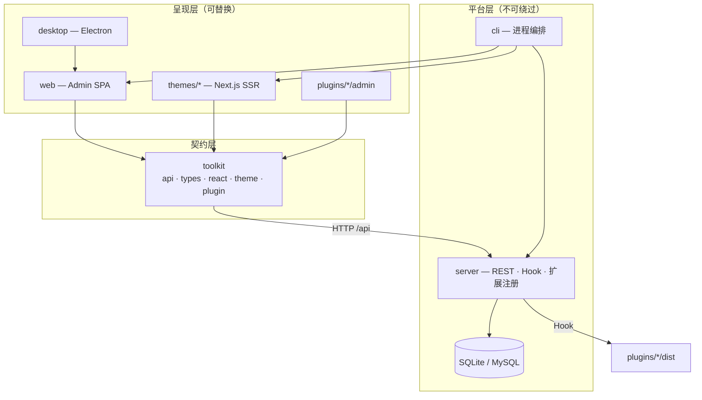

# 系统架构概览

ReactPress 采用 **Monorepo + 多进程** 模型：内容管理、访客呈现、API 服务解耦；**Toolkit** 统一类型与 API 契约。

完整细节见仓库 [ARCHITECTURE.md](https://github.com/fecommunity/reactpress/blob/master/ARCHITECTURE.md)。

## 架构图

## 包职责矩阵

| 包 | npm | 职责 | 渲染 | SEO |
|----|-----|------|------|-----|
| **server** | `@fecommunity/reactpress-server`¹ | 业务、持久化、鉴权 | — | — |
| **web** | `@fecommunity/reactpress-web` | Admin UI | Vite CSR | 否 |
| **themes/** | 各主题包 | 访客站 | Next SSR/ISR | 是 |
| **toolkit** | `@fecommunity/reactpress-toolkit` | API 客户端、类型 | — | — |
| **plugins/** | 各插件 | Hook 逻辑 + Admin 插槽 | 混合 | 插件相关 |
| **desktop** | — | Electron 壳 + 本地 API | 加载 web/dist | 否 |
| **cli** | `@fecommunity/reactpress` | init / doctor / 编排 | — | — |

¹ 独立 npm 已 deprecated；终端用户使用 CLI bundled API。

## 设计原则优先级

**可维护性 → 可扩展性 → 技术匹配 → 低成本**

| 决策 | 选择 | 原因 |
|------|------|------|
| API 访问 | 仅 Toolkit | 单一客户端、OpenAPI  codegen |
| Admin | Vite SPA | 交互密集、无需 SSR |
| 访客站 | Next.js | SSR/ISR、SEO |
| 扩展 | Hook + manifest | WordPress 式、不改 core |
| 列表状态 | URL searchParams | 可分享、可刷新 |

## 数据流规则

1. **Admin / Theme / Plugin UI** → Toolkit HTTP → Server
2. **Server** 触发 Hook → Plugin server 模块
3. **Server** 禁止依赖任何 frontend 包
4. **Theme** 禁止直连数据库

## 运行时端口

| 进程 | 默认端口 |
|------|----------|
| Admin | 3000 |
| Theme | 3001 |
| API | 3002 |
| Theme preview | 3003 |

## 扩展点

| 扩展类型 | 注册文件 | 文档 |
|----------|----------|------|
| 主题 | `theme.json` / npm catalog | [主题开发](./theme-development.md) |
| 插件 | `plugin.json` | [插件开发](./plugin-development.md) |
| Headless | REST + API Key | [Headless API](./headless-api.md) |

## 相关文档

- [核心概念](../getting-started/core-concepts.md)
- [Monorepo 本地开发](./local-development.md)
- [CLI 参考](./cli-reference.md)
