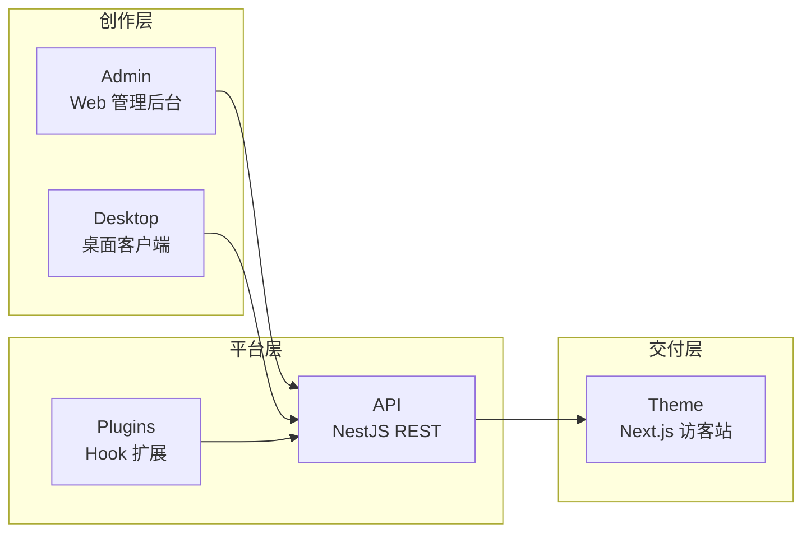

# 核心概念

ReactPress 是**发布平台**，不是单纯的 Headless CMS。理解各组件职责，有助于选型与扩展。

## 一句话定义

> **Admin 管内容 · 主题管呈现 · 插件管逻辑 · API 管数据 · Toolkit 管契约**

## 五大组件



| 组件 | 技术 | 端口 | 职责 |
|------|------|------|------|
| **Admin** | React + Vite SPA | 3001 `/admin/` | 写文章、管媒体、装主题/插件、站点设置（Monorepo 开发时可能为 :3000） |
| **API** | NestJS | 3002 | 持久化、鉴权、Hook、Headless REST |
| **Theme** | Next.js SSR/ISR | 3001 | 访客看到的网站（可完全替换） |
| **Plugin** | Node 模块 + Hook | — | 服务端逻辑扩展（SEO、摘要、图片优化等） |
| **Desktop** | Electron | — | 离线写作、SQLite 本地模式、同步到远程 |

## 与 WordPress 的对应关系

| WordPress | ReactPress | 说明 |
|-----------|------------|------|
| wp-admin | Admin (`:3001/admin/`) | 内容管理界面 |
| Theme | themes/* (:3001) | 访客前端，npm 可安装 |
| Plugin | plugins/* | Hook 扩展，不修改主题 |
| REST API | /api/* | Headless 默认开启 |
| — | Desktop | 本地优先写作（WordPress 无对等物） |

## 数据流

1. 作者在 **Admin** 或 **Desktop** 创建文章
2. 请求经 **Toolkit SDK** 到达 **API**
3. **Plugin** 在 Hook 点改写摘要、SEO 字段等
4. 数据写入 SQLite / MySQL
5. **Theme** 通过 API 拉取内容并 SSR 渲染给访客

## 架构红线

- **Admin 不包含访客页面**；**主题不包含 Admin 路由**
- 所有前端（Admin、主题、插件 UI）**仅通过 Toolkit 访问 API**
- **Server 不依赖任何前端包**

详见 [系统架构概览](../developer-guide/architecture-overview.md)。

## 目录与运行时

```
my-site/
├── .reactpress/
│   ├── config.json          # 配置源（端口、数据库、URL）
│   ├── runtime/{theme-id}/  # 已安装主题
│   ├── plugins/{plugin-id}/ # 已安装插件
│   └── reactpress.db        # SQLite（默认）
├── .env                       # CLI 自动生成，勿手改
└── uploads/                   # 媒体上传目录
```

## 两种用户路径

| 路径 | 适用 | 入口 |
|------|------|------|
| **终端用户** | 建站、写博客 | `npm i -g @fecommunity/reactpress` → `init` |
| **贡献者** | 改 core、写主题/插件 | clone monorepo → `pnpm dev` |

## 相关文档

- [安装与环境要求](./installation.md)
- [CLI 命令参考](../developer-guide/cli-reference.md)
- [术语表](../reference/glossary.md)
