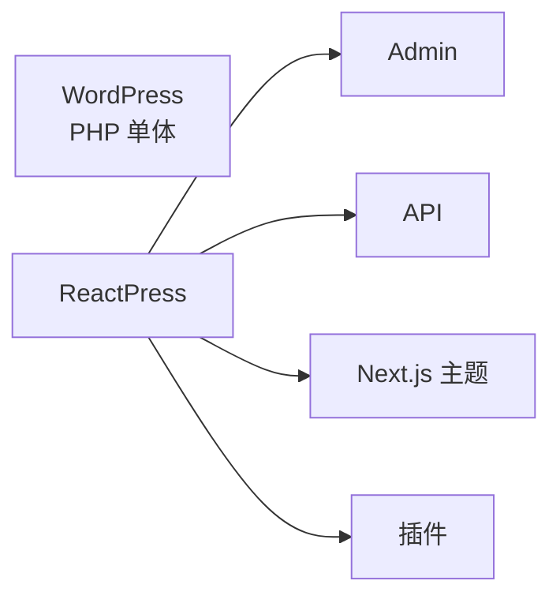

# ReactPress vs WordPress：如何选择 (2026)

如果你在评估**开源博客 / CMS / 发布平台**，「ReactPress 还是 WordPress？」通常是第一个问题。本文从**开发者**、**站长**与 **SEO** 三个角度对比，并说明何时仍应选择 WordPress。

尚不了解产品？先读 [ReactPress 是什么？](./what-is-reactpress.md)。

## 一句话总结

|              | ReactPress                                                                      | WordPress                                    |
| ------------ | ------------------------------------------------------------------------------- | -------------------------------------------- |
| **定位**     | **面向 React 开发者的完整发布系统**（Admin + API + Next.js 主题 + 插件 + 桌面） | 全球最流行的 PHP CMS，插件与主题生态极其成熟 |
| **技术栈**   | React、Next.js、NestJS、SQLite / MySQL                                          | PHP、MySQL、传统主题                         |
| **上手**     | `npm i -g @fecommunity/reactpress@beta` → `reactpress init` — 约 **60 秒**      | 托管一键安装或 LAMP，通常分钟级              |
| **编辑**     | Markdown 优先的 Admin；熟悉的文章/页面/媒体模型                                 | Gutenberg 块编辑；编辑器生态庞大             |
| **访客交付** | 默认 Next.js SSR / ISR                                                          | PHP 主题；常依赖缓存插件                     |
| **Headless** | 一等公民 REST + TypeScript toolkit                                              | 有 REST；Headless 常需额外配置               |
| **最适合**   | React 团队、SSR SEO、现代自托管栈                                               | 非技术编辑、插件市场、成熟托管               |

## 技术架构

### WordPress：经典单体 CMS

WordPress 将**内容管理、主题渲染、插件扩展**绑定在同一 PHP 运行时。优势是「装插件就能用」；代价是主题/插件质量参差，性能优化常依赖 Redis、CDN 与页面缓存插件。

### ReactPress：分层发布平台

ReactPress 按 React 团队习惯拆分职责：

1. **NestJS API** — REST、Webhook、API Key
2. **Vite Admin** — 内容、媒体、评论、插件配置
3. **Next.js 主题** — SSR/SSG 访客站（sitemap、OG、JSON-LD）
4. **插件 Hook** — 类似 WordPress，但基于 JavaScript
5. **Electron 桌面** — SQLite 本地写作，可同步远程

可用 catalog 主题快速上线，或 fork [reactpress-theme-starter](https://github.com/fecommunity/reactpress-theme-starter)，同时保留同一套 Admin 工作流。



## 功能对比表

| 能力                      | ReactPress                          | WordPress           |
| ------------------------- | ----------------------------------- | ------------------- |
| 文章 / 页面 / 媒体 / 评论 | 有                                  | 有                  |
| 主题                      | npm Next.js 主题                    | PHP 主题 + 定制器   |
| 插件                      | Hook + `plugin.json` + Admin 插槽   | 超大市场（60,000+） |
| 默认数据库                | SQLite                              | MySQL               |
| CLI 体验                  | `init` / `doctor` / `logs` / `stop` | WP-CLI + 托管面板   |
| 桌面离线写作              | 官方 Electron 客户端                | 第三方工具          |
| TypeScript SDK            | `@fecommunity/reactpress-toolkit`   | 社区客户端          |
| 许可                      | MIT                                 | GPLv2               |

## SEO 与性能

两者都能做好 SEO，**默认路径**不同：

| SEO 因素             | ReactPress             | WordPress            |
| -------------------- | ---------------------- | -------------------- |
| **渲染**             | 开箱 Next.js SSR/SSG   | 依赖主题             |
| **Core Web Vitals**  | 现代 React 构建链      | 常受插件体积拖累     |
| **结构化数据**       | 主题 starter JSON-LD   | Yoast / Rank Math 等 |
| **Sitemap / robots** | 主题 `/sitemap.xml`    | 插件或 SEO 套件      |
| **单篇 meta**        | 内置 SEO 插件（Admin） | SEO 插件             |

ReactPress SEO 工作流：[站点设置与 SEO](../user-guide/site-settings-seo.md)。

## 内容与编辑体验

- **WordPress** 适合需要 Gutenberg、页面构建器、非技术编辑立刻上手的团队。
- **ReactPress** 适合文档站、技术博客，以及偏好 **Markdown**、清晰内容模型与 React Admin 的团队。

从 WordPress 迁移的主要成本是 **用 Next.js 重建主题**。内容可通过导出脚本或 Headless API 迁移 — 见 [FAQ](../reference/faq.md) 与 [Headless API](../developer-guide/headless-api.md)。

## 插件与扩展

|          | ReactPress                             | WordPress                       |
| -------- | -------------------------------------- | ------------------------------- |
| 目录规模 | 早期但在增长；官方 SEO、摘要、图片优化 | 巨大市场                        |
| 扩展模型 | 进程内 Hook（受信任代码）              | PHP 插件（受信任代码）          |
| 最适合   | 能用 JS 为产品写插件的团队             | 需要现成电商、LMS、表单、会员等 |

自定义插件：[插件开发指南](../developer-guide/plugin-development.md)。

## Headless 与自定义前端

- **WordPress**：有 REST（及插件 GraphQL）；「Headless WordPress」本身是一套工程。
- **ReactPress**：Headless 为**默认** — `/api/article`、分类、页面、API Key、toolkit SDK。

若只需要 API、所有 UI 自建，Strapi/Payload 可能更轻。若要 **WordPress 式发布 + React 交付**，ReactPress 更对口。更多：[面向 React 的自托管 CMS](./self-hosted-cms-for-react.md)。

## 部署与运维

|            | ReactPress                       | WordPress                      |
| ---------- | -------------------------------- | ------------------------------ |
| 本地零配置 | SQLite + CLI                     | 本地 WP / Docker 镜像          |
| 生产       | Node 主机、CLI `start` 或 Docker | 共享主机、WP Engine、自建 LAMP |
| 诊断       | `reactpress doctor` / `logs`     | 托管面板、调试插件             |
| 备份       | 数据库文件或 MySQL + `uploads/`  | 数据库 + `wp-content`          |

部署指南：[生产环境](../tutorial-basics/deploy-your-site.md) · [Docker](../tutorial-extras/docker-deployment.md)。

## 何时选 WordPress

- 编辑者**完全非技术**，强依赖现成插件（WooCommerce、会员、表单构建器）
- 已在 WP 主题/插件上大量投入，迁移成本高于收益
- 需要成熟托管商一键管理

## 何时选 ReactPress

- 团队以 **React / Next.js** 为主栈，不想再维护 PHP 主题层
- 需要 **SSR SEO + Admin + Headless**，又不想拼三个产品
- 要 **自托管** 数据、MIT 许可、一条 CLI
- 正在明确寻找面向开发者站点的 **WordPress 替代**

一分钟验证：[用 Next.js 60 秒搭建博客](./build-nextjs-blog-in-60-seconds.md)。

## 与其他「React CMS」方案

| 方案                              | 你得到                                | 仍需自建                  |
| --------------------------------- | ------------------------------------- | ------------------------- |
| **Strapi / Payload / Contentful** | 内容 API（+ Admin）                   | 访客站，往往还有 SEO 拼装 |
| **Next.js + MDX / Contentlayer**  | Git 驱动页面                          | 非开发者可用的 CMS        |
| **WordPress + Headless 前端**     | 成熟 CMS                              | Next.js 应用 + 同步复杂度 |
| **ReactPress**                    | Admin + API + Next 主题 + 插件 + 桌面 | 仅你选择定制的部分        |

## 快速试用

```bash
npm i -g @fecommunity/reactpress@beta
mkdir my-blog && cd my-blog
reactpress init
```

- Admin：http://localhost:3001/admin/
- 访客站：http://localhost:3001
- 健康检查：http://localhost:3002/api/health

完整教程：[5 分钟创建第一个站点](./first-site.md)。

:::tip 名称消歧
此处的 ReactPress 是 **fecommunity/reactpress** — NestJS + Next.js 发布平台，**不是**把 React 应用嵌入现有 WP 站点的那个 WordPress 插件。
:::

## 常见问题

**ReactPress 免费吗？**  
是 — MIT，npm 安装即可。

**4.0 能上生产吗？**  
active beta，核心路径稳定。请阅读 [3.x → 4.0 迁移](../tutorial-extras/migration-3-to-4.md) 并在预发验证。

**能用自己的前端吗？**  
可以 — Headless REST + API Key。

**能从 WordPress 迁移吗？**  
内容可以（导出/API）；PHP 主题不行 — 需用 Next.js 重建，或从主题 starter 开始。

更多：[FAQ](../reference/faq.md)。

## 下一步

- [ReactPress 是什么？](./what-is-reactpress.md)
- [面向 React 的自托管 CMS](./self-hosted-cms-for-react.md)
- [核心概念](./core-concepts.md)
- [安装指南](./installation.md)
- [关于 ReactPress](/about)
- 博客：[2026 WordPress 替代](/zh/blog/wordpress-alternatives-for-react-developers-2026) · [vs Strapi / Payload](/zh/blog/reactpress-vs-strapi-payload-headless-cms)
