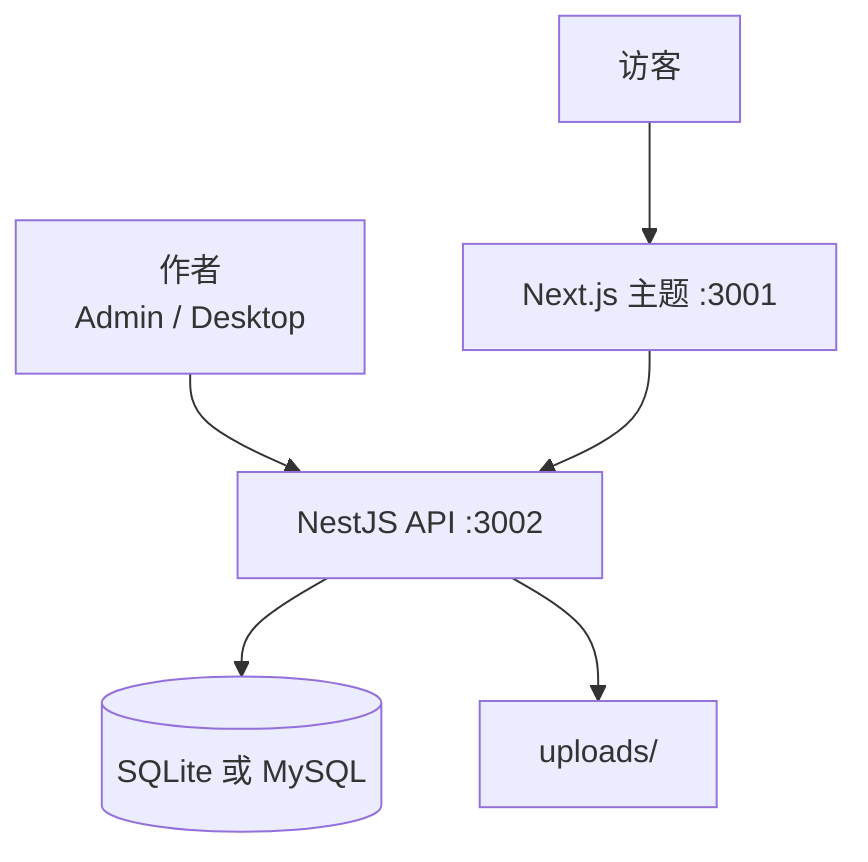

# 面向 React 的自托管 CMS

在找 **面向 React 的自托管 CMS** — 不是 SaaS Headless 套餐，不是 PHP 栈，也不是五个仓库硬拼？

**ReactPress** 是面向 React 开发者的开源 **自托管发布平台**：Admin + NestJS API + Next.js 主题 + 插件 + 可选桌面客户端，一条 CLI 启动。内容与媒体留在 **你自己的** 机器或服务器上。

```bash
npm i -g @fecommunity/reactpress@beta
mkdir my-cms && cd my-cms
reactpress init
```

默认路径：**SQLite**，无需 Docker，无需云账号。

## 这里的「自托管」指什么

| 你掌控           | ReactPress 如何支持                                    |
| ---------------- | ------------------------------------------------------ |
| **数据在哪**     | 本地 `.reactpress/reactpress.db`（SQLite）或自有 MySQL |
| **代码跑在哪**   | 笔记本、VPS、Docker 主机或私有云                       |
| **谁能写作**     | 你的 Admin 用户 / 桌面客户端 — 不是厂商后台            |
| **站点如何渲染** | 你的 Next.js 主题进程；可随时替换或 fork               |
| **许可**         | **MIT** — 可 fork、可商用，无按席位收费                |

生产站点示例：[blog.gaoredu.com](https://blog.gaoredu.com/)。

## 为什么 React 团队选择自托管 ReactPress

### 1. 一个产品，而不是拼装

常见 DIY：Strapi/Payload + 自研 Admin + Next.js 博客 + 上传服务 + SEO 胶水。

ReactPress 已把 **发布表面** 接好：

- 在 Admin（或 [桌面端](../tutorial-extras/desktop-client.md)）写作
- 用 Next.js 主题服务访客（SSR SEO）
- 需要时再暴露 Headless REST

详见 [ReactPress 是什么？](./what-is-reactpress.md)。

### 2. 原生 React 交付

访客主题是 **Next.js**，Admin 是 **React**，API 是 **NestJS**，扩展是 **JavaScript Hook** — 没有 PHP 主题层。方案对比见 [ReactPress vs WordPress](./reactpress-vs-wordpress.md)。

### 3. 合理默认，扩展时有退路

| 阶段              | 数据库 / 运行时                                        |
| ----------------- | ------------------------------------------------------ |
| 本地 / 小站       | 嵌入式 **SQLite**（默认）                              |
| 更高流量 / 共享库 | 外部 **MySQL**                                         |
| 容器化运维        | [Docker 部署](../tutorial-extras/docker-deployment.md) |
| 离线作者          | Electron 桌面端 + 同步远程 API                         |

配置概览：[配置说明](../tutorial-extras/config-intro.md)。

## 运维视角架构



- **Admin**：`:3001/admin/` — 内容、媒体、主题、插件、设置
- **主题**：`:3001` — 公开 SSR 站点
- **API**：`:3002` — 持久化、鉴权、Hook、Headless

边界：[核心概念](./core-concepts.md) · [系统架构](../developer-guide/architecture-overview.md)

## 安全与数据主权清单

上线前请确认：

1. 修改默认 `admin` / `admin`
2. 在 `.reactpress/config.json` / 生成的 `.env` 中设好公网 URL 与密钥
3. 按需用反代或网络策略限制 Admin
4. 备份 `reactpress.db`（或 MySQL）**以及** `uploads/`
5. 启用 SEO 插件，检查主题侧 sitemap / canonical

指南：[生产环境部署](../tutorial-basics/deploy-your-site.md) · [站点设置与 SEO](../user-guide/site-settings-seo.md)

:::tip 插件是受信任代码
已启用插件会加载进 API 进程（类似 WordPress）。只安装可信插件；通过具备权限的 Admin 角色管理。
:::

## 自托管 vs SaaS Headless

|              | ReactPress（自托管）  | 典型 SaaS Headless |
| ------------ | --------------------- | ------------------ |
| **数据位置** | 你的磁盘 / 你的数据库 | 厂商云             |
| **管理后台** | 内置                  | 内置（厂商 UX）    |
| **访客站**   | 内置 Next.js 主题     | 需自建或另购       |
| **费用**     | MIT + 自有基础设施    | 席位 / API / 流量  |
| **离线写作** | 桌面客户端            | 少见               |

要零运维选 SaaS；要 **React 栈 + 完整发布 + 数据驻留** 选 ReactPress。

## 上线路径

| 路径                                                       | 适合                        |
| ---------------------------------------------------------- | --------------------------- |
| [60 秒 Next.js 博客](./build-nextjs-blog-in-60-seconds.md) | 本地快速验证                |
| [第一个站点教程](./first-site.md)                          | 带引导的 Admin 走查         |
| [生产部署](../tutorial-basics/deploy-your-site.md)         | VPS / Node 进程             |
| [Docker](../tutorial-extras/docker-deployment.md)          | 容器主机                    |
| [Headless API](../developer-guide/headless-api.md)         | 自有 React 前端对接你的 API |

## 常见问题

**自托管免费吗？**  
软件 MIT。你只需支付自己的算力、存储与域名。

**需要 Kubernetes 吗？**  
不需要。很多站点用单机 Node + SQLite 或 MySQL 即可。

**以后能搬迁吗？**  
可以 — 经 API 导出、迁移数据库文件，或让新主题指向同一 API。

**4.0 适合自托管生产吗？**  
核心 `init` / `doctor` 在 active beta 中已较稳定；请先预发，并阅读 [3.x → 4.0 迁移](../tutorial-extras/migration-3-to-4.md)。更多见 [FAQ](../reference/faq.md)。

## 博客延伸阅读

- [自托管 Next.js 博客 CMS 指南（2026）](/zh/blog/self-hosted-nextjs-cms-blog-guide)
- [Next.js 博客 SEO 清单](/zh/blog/nextjs-blog-seo-checklist-reactpress)
