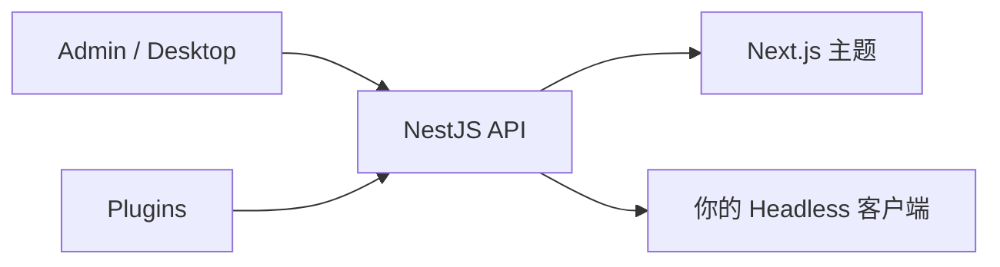

# ReactPress 是什么？

**ReactPress** 是 **面向 React 开发者的发布系统**。用 React 构建博客、文档站、企业官网与内容驱动型应用 — 无需从零拼装 Headless CMS、管理后台与前端。

一条全局 CLI 即可获得：

| 层级          | 你得到什么                                             |
| ------------- | ------------------------------------------------------ |
| **CMS Admin** | WordPress 式写作：文章、页面、媒体、分类、标签、评论   |
| **API**       | NestJS Headless REST，支持 API Key 与 Webhook          |
| **主题**      | 可替换的 Next.js 访客站（SSR/ISR），内置 SEO 能力      |
| **插件**      | 基于 Hook 的扩展（SEO meta、自动摘要、图片优化等）     |
| **桌面端**    | Electron 离线写作（SQLite），可同步到远程 API          |
| **CLI**       | `init` · `doctor` · `logs` · `stop` — 约 **60 秒**上线 |

```bash
npm i -g @fecommunity/reactpress
mkdir my-site && cd my-site
reactpress init
```

- 访客站：http://localhost:3001
- 管理后台：http://localhost:3001/admin/
- API 健康检查：http://localhost:3002/api/health

## 不是又一个 Headless CMS

React 生态里很多工具只交付 **API**（Strapi、Payload、Contentful、Sanity）。管理界面、营销站、媒体流程与部署脚本仍需自己拼。

ReactPress 是 **完整发布平台**：

> **Admin 管内容 · 主题管呈现 · 插件管逻辑 · API 管数据 · Toolkit 管契约**

你仍可走完全 Headless（REST 默认开启），但不必在第一天就自研整套产品。

## 适合谁

| 受众                          | 为什么适合 ReactPress                                                                                     |
| ----------------------------- | --------------------------------------------------------------------------------------------------------- |
| **React / Next.js 团队**      | 从后台到访客 SEO 同一技术栈，无 PHP 主题层                                                                |
| **博主与文档作者**            | Markdown 友好的 Admin；不必拼装博客 starter                                                               |
| **代理商与产品站**            | 主题 + 插件 + Headless API，可定制前端                                                                    |
| **准备离开 WordPress 的团队** | 熟悉的后台工作流 + 现代 SSR — 见 [ReactPress vs WordPress](./reactpress-vs-wordpress.md)                  |
| **自托管用户**                | MIT 许可，默认 SQLite，可选 MySQL / Docker — 见 [面向 React 的自托管 CMS](./self-hosted-cms-for-react.md) |

## 能做什么

- 个人或企业 **博客**（SSR SEO、sitemap、OG）
- 由真实 CMS 驱动的 **文档 / Changelog** 站
- 含页面、媒体与 Headless 定制区块的 **营销站**
- 任意 React 客户端消费 `/api/article` 等端点的 **内容应用**
- 通过 [桌面客户端](../tutorial-extras/desktop-client.md) **本地优先写作**

在线演示：[blog.gaoredu.com](https://blog.gaoredu.com/) · 主题演示：[reactpress-theme-starter](https://reactpress-theme-starter.vercel.app)

## 组件如何协作



1. 作者在 **Admin** 或 **Desktop** 写作
2. **插件**在 Hook 点处理摘要、SEO 字段、图片流水线
3. 内容写入 **SQLite**（默认）或 **MySQL**
4. **主题** SSR 给访客；或你的应用调用 **Headless API**

深入阅读：[核心概念](./core-concepts.md) · [系统架构概览](../developer-guide/architecture-overview.md)

## ReactPress 4.0 一览

当前推荐线为 **ReactPress 4.0**（代号 **Extend**）：

- 插件系统 + Admin 插槽
- Electron 桌面客户端
- npm 主题 catalog（Admin 安装；`init` 自动启用 featured 主题）
- 默认嵌入式 SQLite（Docker / MySQL 可选）

许可：**MIT**。包：[@fecommunity/reactpress](https://www.npmjs.com/package/@fecommunity/reactpress) · 源码：[fecommunity/reactpress](https://github.com/fecommunity/reactpress)

:::tip 名称消歧
此处的 ReactPress 指 **fecommunity 开源发布平台**（NestJS + Next.js CMS），**不是**把 React 应用嵌入现有 WordPress 站点的那个 WordPress 插件。
:::

## 快速问答

| 问题               | 答案                                                                             |
| ------------------ | -------------------------------------------------------------------------------- |
| 免费吗？           | 是 — MIT 开源                                                                    |
| 需要 Docker 吗？   | 默认不需要（SQLite）；仅 embedded-docker / 外部 MySQL 时需要                     |
| 能上生产吗？       | 4.0.0 为稳定版（`@latest`）；从 3.x 升级请先预发 — 见 [FAQ](../reference/faq.md) |
| 能用自己的前端吗？ | 可以 — Headless REST + API Key                                                   |
| 和 WordPress？     | 编辑理念相近，交付用 React/Next — [完整对比](./reactpress-vs-wordpress.md)       |

## 从这里开始

| 目标                      | 指南                                                             |
| ------------------------- | ---------------------------------------------------------------- |
| 约 60 秒搭好 Next.js 博客 | [用 Next.js 60 秒搭建博客](./build-nextjs-blog-in-60-seconds.md) |
| 分步创建第一个站点        | [5 分钟创建第一个站点](./first-site.md)                          |
| 对比 WordPress            | [ReactPress vs WordPress（2026）](./reactpress-vs-wordpress.md)  |
| 自托管与运维              | [面向 React 的自托管 CMS](./self-hosted-cms-for-react.md)        |
| 安装细节                  | [安装与环境要求](./installation.md)                              |

## 博客延伸阅读

- [2026 面向 React 的 WordPress 替代](/zh/blog/wordpress-alternatives-for-react-developers-2026)
- [ReactPress vs Strapi vs Payload](/zh/blog/reactpress-vs-strapi-payload-headless-cms)
- [自托管 Next.js CMS 指南](/zh/blog/self-hosted-nextjs-cms-blog-guide)
- [Next.js 博客 SEO 清单](/zh/blog/nextjs-blog-seo-checklist-reactpress)
