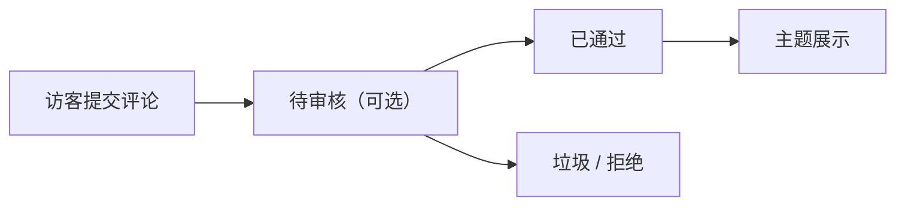

# 评论管理

ReactPress 内置评论系统，访客可在主题文章页留言，管理员在 Admin 审核与回复。

## 评论工作流

## Admin 操作

1. 打开 **评论** 列表
2. 按文章、状态、时间筛选
3. 单条操作：**通过**、**拒绝**、**标记垃圾**、**回复**
4. 批量删除或改状态

## 审核策略

在 **设置 → 评论** 中可配置（视版本而定）：

| 选项 | 说明 |
|------|------|
| 自动通过 | 新评论立即公开 |
| 需审核 | 管理员批准后才显示 |
| 登录后评论 | 仅注册用户可评（需开启注册） |

## 反垃圾建议

- 生产环境启用审核或第三方验证码（路线图）
- 定期清理垃圾评论
- 配合 Webhook 通知新评论（设置 → Webhook）

## 主题侧展示

官方 **reactpress-theme-starter** 主题内置评论 UI，通过 Toolkit 调用评论 API。

自定义主题需自行集成评论组件，参考 [主题开发](../developer-guide/theme-development.md) 与 [Headless API](../developer-guide/headless-api.md) 中的 `/api/comment` 端点。

## 相关文档

- [内容管理](./content-management.md)
- [站点设置与 SEO](./site-settings-seo.md)
