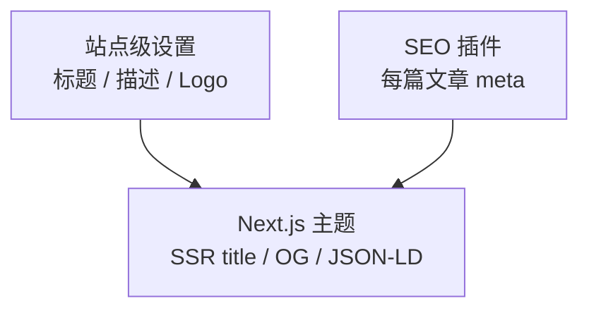

# 站点设置与 SEO

本文面向**站点管理员**，涵盖 Admin 设置项、SEO 插件与生产环境 URL 配置。

## 基础站点信息


**设置 → 常规**：

| 字段 | 作用 |
|------|------|
| 站点标题 | 浏览器标题、OG 站点名 |
| 站点描述 | 默认 meta description |
| Logo / Favicon | 主题 header 与浏览器图标 |
| 语言 | 默认 locale |

这些信息由 API 持久化，主题通过设置 API 渲染。

## SEO 分层策略

ReactPress SEO 分三层协作：



### 1. 站点级

在 Admin **设置** 填写站点描述与品牌资源。

### 2. 文章级

启用 **seo** 插件，为每篇文章设置：

- Meta 标题（可不同于文章标题）
- Meta 描述（155 字符内为佳）
- 关键词
- Canonical slug

### 3. 主题级

**reactpress-theme-starter** 已实现：

- 服务端渲染 `<title>` 与 meta
- Open Graph / Twitter Card
- 语义化 HTML 与合理 heading 层级

自定义主题请参考 [主题开发](../developer-guide/theme-development.md) 中的 SEO 章节。

## 生产环境 URL

部署到公网域名时，必须更新 URL 配置，否则 OG 链接、媒体 URL、OAuth 回调会错误。

**`.env` 关键变量**（由 `config.json` 同步）：

```bash
CLIENT_SITE_URL=https://www.example.com
SERVER_SITE_URL=https://api.example.com
```

修改 `.reactpress/config.json` 后执行 `reactpress config --apply`（Monorepo），并运行 `reactpress doctor` 验证。

详见 [项目配置项](../tutorial-extras/config-intro.md) 与 [FAQ](../reference/faq.md)。

## API Key（Headless）

**设置 → API** 创建 Key，用于：

- 第三方前端拉取内容
- CI 发布脚本
- 移动端 App

```bash
curl -H "X-API-Key: YOUR_KEY" \
  "https://api.example.com/api/article/headless/list?status=publish&page=1&pageSize=10"
```

完整 API 见 [Headless API 指南](../developer-guide/headless-api.md)。

## Webhook

**设置 → Webhook** 订阅事件，例如 `article.published`：

- 触发 CI 重新构建静态页
- 通知 Slack / Discord
- 同步搜索引擎索引服务

## SMTP（邮件）

配置 SMTP 后可发送：

- 密码重置
- 评论通知（视版本）
- 系统邮件

## 搜索引擎提交

1. 确保生产 `CLIENT_SITE_URL` 使用 HTTPS
2. 主题生成 sitemap（starter 主题支持 `/sitemap.xml`）
3. 在 Google Search Console / Bing Webmaster 提交 sitemap
4. 使用 `robots.txt` 允许抓取（主题或 Nginx 层配置）

## Lighthouse 目标

官方主题 demo 可达 **Performance 95 / SEO 100**。自托管结果取决于：

- 图片体积（配合 image-optimizer）
- CDN 与 HTTP/2
- 服务器区域与 TTFB

## 相关文档

- [生产环境部署](../tutorial-basics/deploy-your-site.md)
- [插件：SEO](./plugins-in-admin.md)
- [故障排查](../reference/troubleshooting.md)
