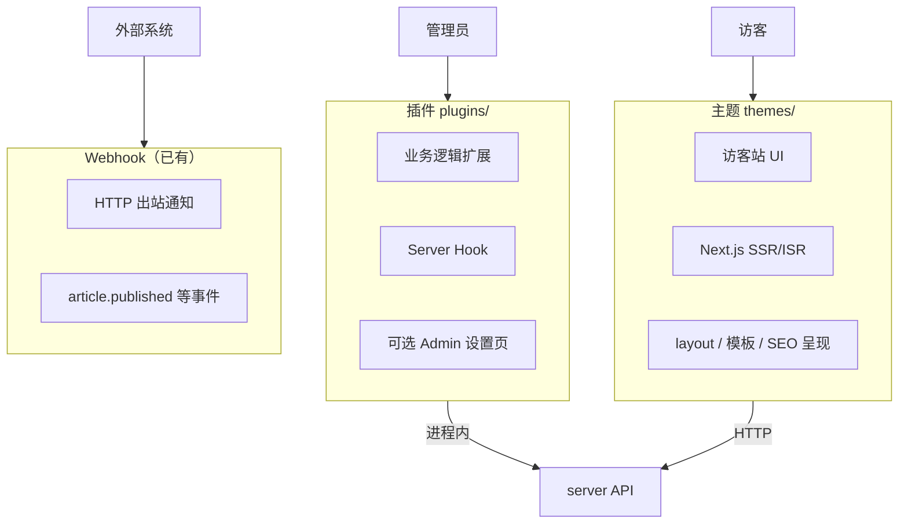
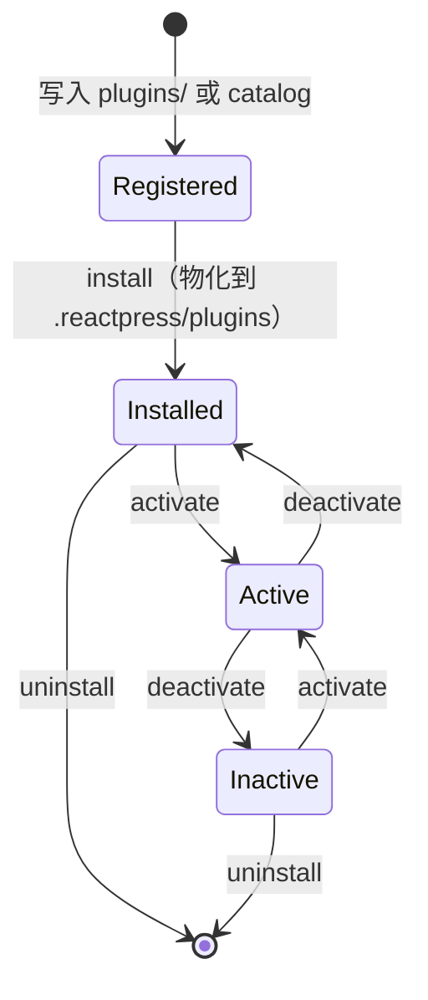

# ReactPress 插件系统技术方案

> 目标：对标 WordPress 插件生态——**不改核心代码即可扩展业务能力**；管理员可安装/启停/配置；插件作者有稳定 manifest 契约与 SDK。
>
> 文档日期：2026-06-13

---

## 1. 结论摘要

ReactPress 在**概念层**已预留插件位（`plugins/` 目录、`toolkit/plugin/admin` Registry、后台 `/plugins` 路由、`extension:manage` 权限），但**运行时几乎未落地**：无 `plugin.json` Schema、无 `HookService`、Server 侧无插件加载器、Admin 未 dynamic import 第三方模块。

**推荐策略**：复用主题系统已验证的「**两种来源、三层目录、manifest 契约、Extension 模块统一管理**」模式；插件与主题职责严格分离——**主题管呈现，插件管逻辑**。

| 维度 | WordPress | ReactPress 目标 |
| --- | --- | --- |
| 发现 | `wp-content/plugins/` 扫描 | `plugins/` 注册表 + npm catalog |
| 元数据 | 插件头注释 | `plugin.json`（JSON Schema 校验） |
| 启停 | 后台一键，即时生效（PHP include） | 后台启停，**Server 热加载**（无需重启 API） |
| 挂载点 | `add_action` / `add_filter` | `HookService.doAction` / `applyFilters` |
| 后台 UI | `add_menu_page` 等 | `AdminModule.register()`（与核心模块同 API） |
| 配置 | `get_option` / `update_option` | `globalSetting.plugins[id]` + JSON Schema |
| 权限 | `capability` | manifest 声明 + `Permission` 字符串 |

---

## 2. 插件 vs 主题 vs Webhook

三类扩展职责必须清晰，避免作者选错载体：



| 类型 | 扩展什么 | 运行进程 | 典型例子 |
| --- | --- | --- | --- |
| **主题** | 访客看到的页面与样式 | 独立 Next.js（:3001） | 换肤、首页布局、文章模板 |
| **插件** | 内容规则、集成、后台功能 | NestJS API（:3002）+ 可选 Admin chunk | SEO 字段、Spam 过滤、LDAP 登录 |
| **Webhook** | 跨系统异步通知 | Server 出站 HTTP | 同步到 Slack、CI 触发 |

**红线**

- 插件**不得**注入主题路由或修改 Next 构建配置（与主题进程解耦）。
- 主题**不得**直接写数据库或绕过 API（只通过 toolkit 读数据）。
- Webhook 是**出站、跨进程**；Hook 是**入站、同进程**——二者不混用。

---

## 3. 架构总览

```mermaid
flowchart TB
  subgraph Author["插件作者"]
    PJ[plugin.json + src/]
  end

  subgraph Registry["注册表层 plugins/"]
    Local[plugins/{id}/]
    Catalog[plugins/package.json]
  end

  subgraph Runtime["物化层 .reactpress/plugins/"]
    Installed[已安装副本 + node_modules]
  end

  subgraph Platform["平台层"]
    ExtSvc[PluginService<br/>server/extension/]
    Hook[HookService<br/>server/hook/]
    WebShell[web Shell bootstrap]
  end

  subgraph Active["激活态 DB + JSON"]
    State[installedPlugins / activePlugins / config]
  end

  Author --> Local
  Author -->|npm publish| Catalog
  Local --> ExtSvc
  Catalog --> ExtSvc
  ExtSvc --> Runtime
  ExtSvc --> State
  ExtSvc -->|on boot / activate| Hook
  Runtime -->|dynamic import| Hook
  Runtime -->|admin entry| WebShell
  Core[核心 Service] -->|埋点| Hook
```

### 3.1 依赖规则

```
plugins/{id}/server  →  只能依赖 @fecommunity/reactpress-toolkit/plugin/server（公开 Hook 类型 + DI 接口）
plugins/{id}/admin   →  只能依赖 toolkit/plugin/admin + toolkit/react
web / themes         →  不直接 import 插件源码；插件 Admin 由 Shell dynamic import
server 核心模块      →  只依赖 HookService，不 import 具体插件
```

与根目录 [`design.md`](../design.md) §2.1 一致：**web / themes / plugins 均经 toolkit 访问平台能力**。

---

## 4. 三层目录与两种来源

对齐主题系统（见 [`themes/README.md`](../themes/README.md)），降低作者与维护者认知成本：

```
┌─────────────────────────────────────────────────────────────┐
│  两种来源                                                    │
│    local  plugins/{id}/     →  .reactpress/plugins/{id}/    │
│    npm    npm pack spec     →  .reactpress/plugins/{id}/    │
└─────────────────────────────────────────────────────────────┘

┌─────────────────────────────────────────────────────────────┐
│  三层目录                                                    │
│    plugins/               注册表 — 有哪些插件「可安装」        │
│    .reactpress/plugins/   物化层 — 已安装、含构建产物          │
│    DB globalSetting       激活态 — 已启用列表 + 各插件配置     │
└─────────────────────────────────────────────────────────────┘
```

**总注册表** `plugins/package.json`（镜像 `themes/package.json`）：

```json
{
  "name": "@fecommunity/reactpress-plugins",
  "private": true,
  "reactpress": {
    "local": ["hello-seo"],
    "npm": ["plugin-starter"]
  }
}
```

| 来源 | 元数据 | 注册位置 |
| --- | --- | --- |
| **local** | `plugins/{id}/plugin.json` | `reactpress.local` 列表 |
| **npm** | 包内 `plugin.json` | `plugins/{anchor}/package.json` catalog 锚点 |

npm 锚点目录**不含** `plugin.json`（与主题 catalog 规则相同），避免双源冲突。

---

## 5. Manifest 契约：`plugin.json`

Schema 放在 `plugins/plugin.manifest.schema.json`，解析函数放在 `toolkit/src/plugin/extension/parse.ts`（与 `parseThemeManifest` 对称）。

### 5.1 完整示例

```json
{
  "$schema": "../plugin.manifest.schema.json",
  "id": "seo-booster",
  "name": "SEO 增强",
  "version": "1.0.0",
  "description": "为文章与页面添加 meta、Open Graph 与 sitemap 钩子。",
  "author": "ReactPress",
  "requires": ">=3.5.0",
  "requiresPlugins": [],
  "server": {
    "module": "./dist/server/index.js",
    "hooks": {
      "subscribe": [
        "article.beforePublish",
        "article.afterPublish",
        "page.beforeSave"
      ],
      "provide": []
    }
  },
  "admin": {
    "entry": "./dist/admin/index.js",
    "menu": {
      "parent": "settings",
      "title": "SEO",
      "path": "/plugins/seo-booster/settings",
      "permission": "setting:manage",
      "sort": 50
    }
  },
  "settings": {
    "schema": {
      "type": "object",
      "properties": {
        "defaultOgImage": { "type": "string", "format": "uri" },
        "enableSitemap": { "type": "boolean", "default": true }
      }
    }
  },
  "permissions": ["setting:manage"],
  "capabilities": {
    "headless": true,
    "network": false,
    "filesystem": false
  }
}
```

### 5.2 字段说明

| 字段 | 必填 | 说明 |
| --- | ---: | --- |
| `id` | ✓ | kebab-case，与目录名一致（WordPress Text Domain） |
| `name` / `version` | ✓ | 展示名与 semver |
| `requires` | | 最低 ReactPress 版本（semver range） |
| `requiresPlugins` | | 依赖的其他插件 id（激活前拓扑排序） |
| `server.module` | ✓* | Server 入口；纯 Admin 插件可省略 |
| `server.hooks.subscribe` | | 声明订阅的 Hook（安装时校验存在性） |
| `admin.entry` | | Admin 动态加载入口 |
| `admin.menu` | | 自动注册侧栏/设置入口（也可在 `register()` 内手动注册） |
| `settings.schema` | | JSON Schema，驱动后台配置表单 |
| `permissions` | | 插件需要的 Admin 能力；激活时合并到角色配置 UI |
| `capabilities` | | 安全能力声明（见 §10） |

\* 至少存在 `server.module` 或 `admin.entry` 之一。

### 5.3 WordPress 头信息映射

| WordPress 插件头 | ReactPress |
| --- | --- |
| Plugin Name | `name` |
| Version | `version` |
| Description | `description` |
| Author | `author` |
| Requires at least | `requires` |
| Requires Plugins | `requiresPlugins` |
| Text Domain | `id` |

---

## 6. 插件包结构

### 6.1 官方示例 `plugins/hello-seo/`

```
plugins/hello-seo/
├── plugin.json
├── package.json          # workspace 包名 @reactpress/plugin-hello-seo
├── tsconfig.json
├── src/
│   ├── server/
│   │   └── index.ts      # export default function register(hook, ctx)
│   └── admin/
│       └── index.ts      # export const register: AdminModule['register']
└── dist/                 # build 产出，物化时复制
```

### 6.2 Server 入口契约

```typescript
// toolkit/src/plugin/server/types.ts
import type { HookService } from './hook';
import type { PluginContext } from './context';

export interface PluginServerModule {
  /** WordPress 类比：插件主文件被 include 时执行 */
  register(hooks: HookService, ctx: PluginContext): void | Promise<void>;
  /** 可选：停用时清理（取消定时任务等） */
  deactivate?(): void | Promise<void>;
}
```

```typescript
// plugins/hello-seo/src/server/index.ts
import type { PluginServerModule } from '@fecommunity/reactpress-toolkit/plugin/server';

const plugin: PluginServerModule = {
  register(hooks, ctx) {
    hooks.addFilter('article.beforePublish', async (article, meta) => {
      if (!article.metaDescription) {
        article.metaDescription = article.summary?.slice(0, 160);
      }
      return article;
    }, { priority: 10, pluginId: ctx.id });

    hooks.addAction('article.afterPublish', async (article) => {
      ctx.logger.info(`SEO: indexed article ${article.id}`);
    });
  },
};

export default plugin;
```

### 6.3 Admin 入口契约

与核心 Feature Module **同一套 API**（已实现于 `toolkit/src/plugin/admin/registry.ts`）：

```typescript
// plugins/hello-seo/src/admin/index.ts
import type { AdminModule } from '@fecommunity/reactpress-toolkit/plugin/admin';

export const register: AdminModule['register'] = ({ menu, settings }) => {
  settings.registerTab({
    id: 'seo-booster',
    title: 'SEO',
    path: '/plugins/seo-booster/settings',
    permission: 'setting:manage',
    sort: 50,
  });
};

export default { id: 'seo-booster', register };
```

---

## 7. 生命周期



| 操作 | WordPress | ReactPress | 副作用 |
| --- | --- | --- | --- |
| **安装** | 上传 zip / 复制文件夹 | REST / CLI → 复制或 npm pack 到 runtime | 写 `installedPlugins[]` |
| **激活** | 点启用 | 后台启用 | 写 `activePlugins[]`；Server **加载 server.module**；Web **注册 admin chunk** |
| **停用** | 点停用 | 后台停用 | 从 `activePlugins` 移除；调用 `deactivate()`；卸载 Hook 回调 |
| **卸载** | 删除前需停用 | 需先停用 | 删 runtime 目录；清配置（可选保留数据） |

### 7.1 与主题生命周期的关键差异

| | 主题 | 插件 |
| --- | --- | --- |
| 激活后 | **重启 Next 进程**（:3001） | **不重启 Server**；Hook 注册表热更新 |
| 物化内容 | 完整 Next 工程 | 通常仅 `dist/` + package.json 依赖 |
| 预览 | 独立预览端口 :3003 | 无独立进程；Admin 内嵌设置页预览 |

插件启停应 **秒级生效**，这是相对主题切换的体验优势。

### 7.2 持久化结构

存入 `Setting.globalSetting`（与 `theme` 字段并列）：

```typescript
interface GlobalPluginState {
  installedPlugins: string[];           // 已物化 id 列表
  activePlugins: string[];              // 已启用 id 列表（有序 = 加载顺序）
  plugins: Record<string, {
    version: string;
    source: 'local' | 'npm';
    npm?: { spec: string; resolvedVersion?: string };
    config?: Record<string, unknown>;  // 经 settings.schema 校验
    activatedAt?: string;
  }>;
}
```

Hook 优先级：同 Hook 名按 `activePlugins` 顺序 + 回调 `priority`（WordPress 默认 10）排序。

---

## 8. Server Hook 系统

### 8.1 接口设计

```typescript
// server/src/modules/hook/hook.service.ts
type HookCallback<T = unknown> = (value: T, context?: HookContext) => T | Promise<T>;
type ActionCallback = (payload?: unknown, context?: HookContext) => void | Promise<void>;

interface HookContext {
  pluginId?: string;
  userId?: number;
  requestId?: string;
}

interface HookService {
  /** WordPress apply_filters */
  applyFilters<T>(name: string, value: T, ctx?: HookContext): Promise<T>;

  /** WordPress do_action */
  doAction(name: string, payload?: unknown, ctx?: HookContext): Promise<void>;

  addFilter<T>(
    name: string,
    callback: HookCallback<T>,
    options?: { priority?: number; pluginId?: string },
  ): () => void;

  addAction(
    name: string,
    callback: ActionCallback,
    options?: { priority?: number; pluginId?: string },
  ): () => void;

  /** 停用插件时移除其全部回调 */
  removePluginHooks(pluginId: string): void;
}
```

### 8.2 核心埋点（MVP 最小集）

| Hook 名 | 类型 | 时机 | 参数 |
| --- | --- | --- | --- |
| `article.beforeCreate` | filter | 创建前 | `Partial<Article>` |
| `article.beforePublish` | filter | 发布前 | `Article` |
| `article.afterPublish` | action | 发布后 | `{ article, isNew }` |
| `article.beforeDelete` | filter | 删除前 | `{ id, allow: boolean }` |
| `comment.beforeCreate` | filter | 评论创建前 | `Partial<Comment>` |
| `page.beforeSave` | filter | 页面保存前 | `Partial<Page>` |
| `setting.beforeSave` | filter | 全局设置保存前 | `{ key, value }` |
| `user.afterLogin` | action | 登录成功后 | `{ userId }` |
| `media.afterUpload` | action | 上传完成 | `{ file }` |

**实施原则**：先在 `article.service.ts`、`comment.service.ts` 等 **Service 层**埋点，Controller 保持薄层。

### 8.3 与 Webhook 的关系

```
article.service
  ├─ applyFilters('article.beforePublish')   ← 插件同步改写
  ├─ 持久化
  ├─ doAction('article.afterPublish')        ← 插件同步副作用
  └─ webhookService.dispatch('article.published')  ← 已有 HTTP 出站
```

插件适合**低延迟、需改写字段**；Webhook 适合**外部系统集成**。

---

## 9. Admin 扩展加载

### 9.1 现状

`web/src/shell/bootstrap.ts` 仅注册核心 `CORE_MODULES`；`pluginsModule` 侧栏默认隐藏（`SHOW_PLUGINS_IN_SIDEBAR = false`）；`PluginsPage` 为占位页。

### 9.2 目标流程

```typescript
// web/src/shell/bootstrap.ts（目标）
export async function bootstrapAdmin(): Promise<AdminContext> {
  const ctx = createAdminRegistry();
  for (const mod of CORE_MODULES) mod.register(ctx);

  const active = await fetchActivePlugins(); // GET /api/extension/plugins/active
  for (const plugin of active) {
    if (!plugin.adminEntry) continue;
    const mod = await import(/* @vite-ignore */ plugin.adminEntryUrl);
    mod.register?.(ctx);
    mod.default?.register?.(ctx);
  }
  return ctx;
}
```

**Admin chunk 加载策略**

| 环境 | 方式 |
| --- | --- |
| 开发（monorepo） | Vite alias → `plugins/{id}/src/admin` |
| 生产 | 插件 build 为 ESM；Shell 从 `/extensions/plugins/{id}/admin.js` 静态托管或 importmap |
| 官方内置插件 | 可预打包进 web，与第三方 dynamic import 并存 |

### 9.3 后台管理页

| 路由 | 功能 |
| --- | --- |
| `/plugins` | 已安装 / 可安装列表；启用 / 停用 / 卸载 |
| `/plugins/:id/settings` | 读取 `settings.schema` 渲染表单；PUT 写 `globalSetting.plugins[id].config` |

REST 由 `server/src/modules/extension/plugin.service.ts` 提供（与 `ThemeService` 并列）。

---

## 10. 权限与安全

### 10.1 权限

- manifest `permissions` 声明插件需要的 Admin 能力（如 `setting:manage`）。
- Server Guard 校验 JWT + Permission；插件新增的自定义 Permission 使用命名空间：`plugin:{id}:{action}`。
- 仅 `extension:manage` 可安装/启停插件。

### 10.2 能力声明（capabilities）

首期不做 VM 沙箱，用**静态声明 + 代码审查 + 可选签名**控风险：

| capability | 含义 | 默认 |
| --- | --- | --- |
| `headless` | 仅 Server，无 Admin UI | — |
| `network` | Server 侧可发起出站 HTTP | `false` |
| `filesystem` | 可读写项目目录外路径 | `false` |
| `database` | 可注册 TypeORM entity（二期） | `false` |

超出声明的能力在 `PluginContext` 中不可用；marketplace 审核可强制检查。

### 10.3 依赖与版本

- 激活前校验 `requires`、`requiresPlugins`（拓扑排序）。
- npm 插件锁定版本写入 `globalSetting.plugins[id].npm`（镜像 `ThemeNpmLockMeta`）。

---

## 11. PluginService 与 REST API

模块位置：`server/src/modules/extension/`（扩展现有 `ExtensionModule`）。

| 方法 | HTTP | 说明 |
| --- | --- | --- |
| `listPlugins()` | `GET /extension/plugins` | 注册表 + 安装态 + 激活态 |
| `getPlugin(id)` | `GET /extension/plugins/:id` | 含 manifest + config |
| `installPlugin(id)` | `POST /extension/plugins/:id/install` | local 物化 |
| `installPluginFromNpm(spec)` | `POST /extension/plugins/npm` | npm 安装 |
| `activatePlugin(id)` | `POST /extension/plugins/:id/activate` | 加载 server.module |
| `deactivatePlugin(id)` | `POST /extension/plugins/:id/deactivate` | 卸载 Hook |
| `uninstallPlugin(id)` | `DELETE /extension/plugins/:id` | 需已停用 |
| `updatePluginConfig(id, body)` | `PUT /extension/plugins/:id/config` | schema 校验 |

`PluginLoader` 在 Nest `OnModuleInit` 与每次 activate 后：

1. 读取 `activePlugins` 有序列表；
2. 对每个 id dynamic `import()` `.reactpress/plugins/{id}/{server.module}`；
3. 调用 `register(hookService, ctx)`；
4. 失败则**仅禁用该插件**并写 admin 告警，不影响核心与其他插件。

---

## 12. CLI 命令

镜像 `reactpress theme` 子命令：

```bash
reactpress plugin list                    # 注册表 + 安装态
reactpress plugin install hello-seo       # 物化 local 插件
reactpress plugin add @scope/pkg@1.0.0    # npm 安装
reactpress plugin activate hello-seo
reactpress plugin deactivate hello-seo
reactpress plugin create my-plugin        # 脚手架（二期）
```

实现文件：`cli/lib/plugin-*.js`（参考 `cli/lib/theme-install.js` 的 copy / npm pack 逻辑）。

---

## 13. 典型插件场景

| 场景 | 挂载方式 | 示例 |
| --- | --- | --- |
| 发布前改写字段 | `article.beforePublish` filter | SEO description、敏感词 |
| Spam 过滤 | `comment.beforeCreate` filter | Akismet 式 |
| 第三方登录 | `user.afterLogin` action + Admin 配置 | OAuth |
| 定时任务 | Server `register` 内 `ctx.scheduler` | 清理草稿（二期 API） |
| 后台设置 Tab | `AdminModule.register` | SMTP 增强、统计 |
| 纯自动化 | 仅 `server.module`，无 Admin | 自动打标签 |

**不适合做插件的**：访客页组件（应做主题 block / pattern）、数据库大改（应做 server 迁移 + 核心 PR）。

---

## 14. 分阶段实施

### Phase 0 — 契约与骨架（1～2 周）

- [ ] `plugin.manifest.schema.json` + `parsePluginManifest()`
- [ ] `GlobalPluginState` 类型与 `globalSetting` 合并工具
- [ ] `HookService` 实现 + 单元测试
- [ ] `article.beforePublish` / `afterPublish` 两处埋点验证链路

### Phase 1 — 生命周期 MVP（2～3 周）

- [ ] `PluginService` + REST + toolkit API client
- [ ] `plugins/package.json` 注册表 + `hello-seo` 示例
- [ ] CLI `plugin install|activate|list`
- [ ] 后台 `PluginsPage` 列表与启停（打开 `SHOW_PLUGINS_IN_SIDEBAR`）

### Phase 2 — Admin 动态加载（1～2 周）

- [ ] 插件 Admin entry build 约定（tsdown / vite library mode）
- [ ] `bootstrapAdmin` 异步加载 active 插件
- [ ] `/plugins/:id/settings` 通用配置表单（JSON Schema → Ant Design Form）

### Phase 3 — 生态（按需）

- [ ] npm catalog 与 `plugin add`
- [ ] `reactpress plugin create` 脚手架
- [ ] 插件市场 / 签名校验
- [ ] `ctx.scheduler`、`network` 能力网关
- [ ] 插件单元测试工具包 `@reactpress/plugin-test-utils`

---

## 15. 验收标准

| 维度 | 标准 |
| --- | --- |
| **扩展性** | 官方 `hello-seo` 插件零修改 `article.service` 业务逻辑即可注入 meta 字段 |
| **启停** | 激活/停用插件 < 3s，无需重启 Server 进程 |
| **隔离** | 单个插件 load 失败不影响 API 与其他插件 |
| **一致性** | manifest 非法时在 install 阶段失败，非运行时 |
| **对标** | 作者阅读 `plugin.json` + `register()` 即可上手，无需 fork 核心 |
| **安全** | 未声明 `network` 的插件无法使用 `PluginContext.http` |

---

## 16. 与现有代码的衔接

| 已有 | 插件方案中的角色 |
| --- | --- |
| `toolkit/src/plugin/admin/registry.ts` | Admin Registry 类型与实现 — **直接复用** |
| `toolkit/src/plugin/admin/permissions.ts` | Permission 字符串 — **扩展 `plugin:*` 命名空间** |
| `web/src/modules/*/index.ts` | 核心模块 `AdminModule` 模式 — **插件同构** |
| `server/.../extension/theme.service.ts` | 安装/物化/npm — **提取共享 `ExtensionMaterializer`** |
| `server/.../webhook/webhook.service.ts` | 出站事件 — **与 Hook 并列，不替代** |
| `web/src/modules/plugins/pages/PluginsPage.tsx` | 占位 — **替换为真实列表 UI** |
| 根目录 `design.md` §4 | Hook + manifest 概念 — **本文档为 plugins/ 子域细化** |

---

## 17. 参考

- [WordPress Plugin Handbook](https://developer.wordpress.org/plugins/)
- 仓库内 [`design.md`](../design.md) — 扩展性总纲
- [`docs/theme-system-review.md`](../docs/theme-system-review.md) — 主题系统对标与踩坑
- [`themes/README.md`](../themes/README.md) — 三层目录模型（插件镜像）
