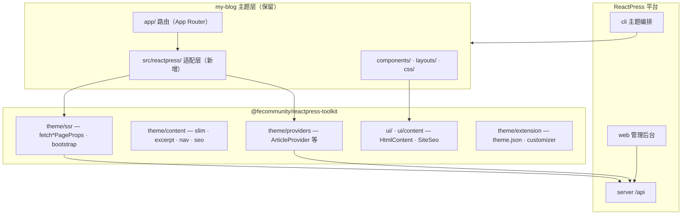
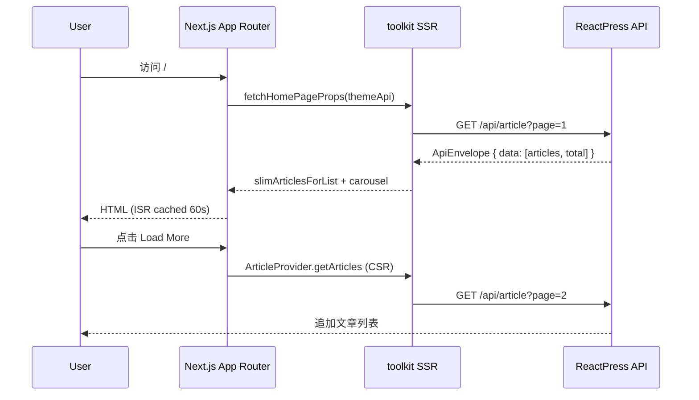

# my-blog 主题重构技术方案

> 目标：在保留 Tailwind Next.js Starter Blog 现有视觉与交互框架的前提下，与 `@fecommunity/reactpress-toolkit` 深度集成，支持 ReactPress CMS 动态内容发布。

---

## 1. 背景与现状

### 1.1 主题定位

`themes/my-blog` 基于 [tailwind-nextjs-starter-blog](https://github.com/timlrx/tailwind-nextjs-starter-blog) v2.4.0，是一套功能完整的静态 MDX 博客，具备：

- **Next.js 15 App Router** + React 19
- **Contentlayer2** 构建时解析本地 MDX
- **Tailwind CSS 4** + `@tailwindcss/typography`
- **Pliny** 生态（搜索 kbar、Giscus 评论、Newsletter、分析）
- 暗色模式（`next-themes`）、RSS、Sitemap、标签归档

### 1.2 与 ReactPress 的差距

| 维度 | my-blog 现状 | ReactPress 官方主题（hello-world / twentytwentyfive） |
|------|-------------|------------------------------------------------------|
| 内容来源 | 本地 `data/blog/*.mdx` | Server API（`/api/article` 等） |
| 配置 | `data/siteMetadata.js` | `theme.json` + Customizer |
| 数据获取 | Contentlayer 构建时 | `fetch*PageProps` + ISR |
| 全局状态 | 无 | `createReactPressApp` → `SiteCatalogProvider` |
| toolkit 依赖 | 无 | `@fecommunity/reactpress-toolkit: workspace:*` |
| 路由 | App Router | Pages Router |
| monorepo | 独立 yarn 项目 | pnpm workspace 成员 |

当前 my-blog **零集成** ReactPress，无法作为活跃主题接收后台发布的动态内容。

### 1.3 重构目标

1. **保留**：Tailwind 视觉风格、布局组件（Header/Footer/PostLayout/ListLayout）、暗色模式、SEO 结构
2. **替换**：Contentlayer 静态内容层 → ReactPress API 动态内容层
3. **接入**：toolkit 数据契约、Provider、Customizer、预览机制
4. **支持**：ISR 首屏 + CSR 分页/搜索等动态交互
5. **纳入**：monorepo pnpm workspace，可被 CLI 识别、安装与预览

### 1.4 非目标（本期不做）

- 完全重写 UI 视觉（不迁移到 Ant Design / shadcn）
- 知识库、网址导航等 twentytwentyfive 高级功能（可二期扩展）
- 移除 Pliny 评论/Newsletter（改为与 ReactPress 评论系统并存或逐步替换）

---

## 2. 架构决策

### 2.1 路由模式：保留 App Router

**决策：保留 Next.js App Router，不降级到 Pages Router。**

| 方案 | 优点 | 缺点 |
|------|------|------|
| A. 迁移到 Pages Router | 与 toolkit `createReactPressApp` / `getStaticProps` 完全对齐，改造路径清晰 | 丢弃 App Router 优势；大量路由文件需重写 |
| **B. 保留 App Router（推荐）** | 保留 RSC、现有 `app/` 目录结构；与 starter blog 上游同步成本低 | toolkit 现有 `_app` 工厂需适配；需新建 App Router 集成层 |
| C. 双路由并存 | 渐进迁移 | 维护成本高，路由冲突风险 |

**理由：**

- my-blog 的核心价值即 App Router + RSC 的现代架构，降级得不偿失
- toolkit 的 `fetch*PageProps`、`themeApi`、`createThemeHttpStack` 等**与路由模式无关**，可在 Server Component 中直接调用
- `createReactPressApp` 的 Pages Router 专属逻辑（`getInitialProps`、`_document`）可用 App Router 等价物替代（见 §3.2）

### 2.2 集成深度：完整主题模式

采用 **`createReactPressApp` 能力等价物**（App Router 版），而非极简 `createThemeApp`：

- 需要 `SiteCatalogProvider`（setting / tags / categories / pages / i18n）
- 需要 Customizer 预览与 `themeMods` 注入
- 需要 PV 统计、路由进度条
- 需要 CSR 分页加载（首页 Load More、标签页等）

参考实现：`themes/twentytwentyfive`（Pages Router 完整集成样板）。

### 2.3 内容渲染策略

| 场景 | 策略 | toolkit API |
|------|------|-------------|
| 文章列表 | ISR 60s + CSR 分页 | `fetchHomePageProps` / `ArticleProvider.getArticles` |
| 文章详情 | ISR + `HtmlContent` | `fetchArticleDetailProps` |
| 标签/分类归档 | ISR + 分页 | `fetchTagArchivePageProps` / `fetchCategoryArchivePageProps` |
| 归档时间线 | ISR | `fetchArchivesPageProps` |
| 搜索 | SSR 或 CSR | `fetchSearchPageProps` / `SearchProvider` |
| 自定义页面 | ISR | `fetchCmsPageProps` |
| 站点元数据 | Root Layout bootstrap | `fetchAppBootstrap` |

MDX 本地编译 **移除**；文章正文使用后台存储的 Markdown/HTML，经 toolkit `HtmlContent` / `rewriteArticleHtmlAssets` 渲染。

---

## 3. 目标架构

### 3.1 分层架构



### 3.2 App Router 集成层设计

toolkit 当前以 Pages Router 为中心（`createReactPressApp.js`、`_app.getInitialProps`）。my-blog 需新增 **App Router 适配层**，职责如下：

```
themes/my-blog/src/reactpress/
├── providers.tsx          # Client: ReactPressProvider + SiteCatalogProvider 包装
├── bootstrap.ts           # Server: fetchAppBootstrap + slimBootstrap
├── layout-shell.tsx       # Client: 替代 _app 的 Layout 壳（进度条、分析、PV）
├── appearance.ts          # buildBrandingAppearanceCss（CSS 变量映射 Tailwind）
├── revalidate.ts          # 统一 revalidate 常量（默认 60s，对齐 themeStaticProps）
└── hooks.ts               # useSiteCatalog / useSiteSetting 再导出
```

#### Root Layout 集成模式

```tsx
// app/layout.tsx（目标形态示意）
import { fetchAppBootstrap, slimAppBootstrapForRoute } from '@/src/reactpress/bootstrap';
import { ReactPressProviders } from '@/src/reactpress/providers';
import { LayoutShell } from '@/src/reactpress/layout-shell';
import { buildBrandingAppearanceCss } from '@/src/reactpress/appearance';

export default async function RootLayout({ children }) {
  const bootstrap = await fetchAppBootstrap({ manifest: themeManifest });
  const slimmed = slimAppBootstrapForRoute(bootstrap, '/'); // 按路由瘦身
  const appearanceCss = buildBrandingAppearanceCss(slimmed.themeMods);

  return (
    <html>
      <head><style dangerouslySetInnerHTML={{ __html: appearanceCss }} /></head>
      <body>
        <ReactPressProviders bootstrap={slimmed}>
          <LayoutShell>
            <Header />
            <main>{children}</main>
            <Footer />
          </LayoutShell>
        </ReactPressProviders>
      </body>
    </html>
  );
}
```

#### 页面数据获取模式

```tsx
// app/page.tsx（目标形态示意）
import { fetchHomePageProps, themeApi } from '@fecommunity/reactpress-toolkit/theme';
import { HomeClient } from './HomeClient';

export const revalidate = 60;

export default async function HomePage() {
  const { articles, total, recommendedArticles } = await fetchHomePageProps(themeApi);
  return (
    <HomeClient
      initialArticles={articles}
      total={total}
      recommendedArticles={recommendedArticles}
    />
  );
}
```

```tsx
// app/HomeClient.tsx — 保留交互的 Client Component
'use client';
import { ArticleProvider } from '@/src/providers';
import { slimArticlesForList } from '@fecommunity/reactpress-toolkit/theme';

export function HomeClient({ initialArticles, total, ... }) {
  // CSR 分页：ArticleProvider.getArticles()
}
```

此模式与 twentytwentyfive 首页 **SSR 首屏 + CSR Load More** 一致，只是把 `getStaticProps` 换成 App Router 的 async Server Component + `revalidate`。

### 3.3 路由映射

| my-blog 现有路由 | 重构后路由 | toolkit 模板键 | 数据 API |
|-----------------|-----------|---------------|----------|
| `/` | `/` | `home` | `fetchHomePageProps` |
| `/blog` | `/blog` | —（主题扩展） | `fetchHomePageProps`（分页） |
| `/blog/[...slug]` | `/article/[id]` | `single` | `fetchArticleDetailProps` |
| `/tags` | `/tags` | — | bootstrap tags |
| `/tags/[tag]` | `/tag/[tag]` | `archive-tag` | `fetchTagArchivePageProps` |
| — | `/category/[category]` | `archive-category` | `fetchCategoryArchivePageProps` |
| — | `/archives` | `archives` | `fetchArchivesPageProps` |
| `/about` | `/page/[id]` 或保留 `/about` | `page` | `fetchCmsPageProps` |
| `/projects` | `/page/[id]`（CMS 页面） | `page` | `fetchCmsPageProps` |
| kbar 搜索 | `/search` | `search` | `fetchSearchPageProps` |
| — | `/404` | `404` | — |

**说明：**

- 文章 URL 从 MDX slug（`/blog/my-post`）改为 ReactPress 标准（`/article/{id}`），可通过 `theme.json` `options` 配置是否保留 slug 别名（需 toolkit `articlePath` 扩展）
- `/blog` 可保留为「全部文章」列表页，复用 ListLayout 视觉
- `/about`、`/projects` 建议迁移为后台 CMS 固定页面，静态 `projectsData.ts` 废弃

---

## 4. theme.json 与配置迁移

### 4.1 新增 theme.json

参照 `themes/hello-world/theme.json`，声明 my-blog 的 manifest：

```json
{
  "$schema": "../theme.manifest.schema.json",
  "id": "my-blog",
  "name": "My Blog",
  "version": "1.0.0",
  "description": "Tailwind 风格博客主题，支持 App Router 与动态内容。",
  "requires": ">=3.0.0",
  "supports": { "darkMode": true, "menus": ["primary"] },
  "templates": {
    "home": "app/page.tsx",
    "single": "app/article/[id]/page.tsx",
    "page": "app/page/[id]/page.tsx",
    "archive-category": "app/category/[category]/page.tsx",
    "archive-tag": "app/tag/[tag]/page.tsx",
    "archives": "app/archives/page.tsx",
    "search": "app/search/page.tsx",
    "404": "app/not-found.tsx"
  },
  "appearance": {
    "panels": [
      { "id": "basic", "title": "基础配置" },
      { "id": "style", "title": "样式配置" }
    ],
    "sections": [
      {
        "id": "identity",
        "panel": "basic",
        "title": "站点身份",
        "settings": [
          { "id": "displayTitle", "type": "text", "label": "站点标题" },
          { "id": "displayTagline", "type": "text", "label": "站点副标题" },
          { "id": "siteLogo", "type": "image", "label": "站点 Logo" }
        ]
      },
      {
        "id": "colors",
        "panel": "style",
        "title": "颜色",
        "groups": [
          { "id": "light", "title": "浅色模式" },
          { "id": "dark", "title": "深色模式" }
        ],
        "settings": [
          { "id": "primaryColor", "group": "light", "type": "color", "label": "主色", "default": "#3b82f6" },
          { "id": "backgroundColor", "group": "light", "type": "color", "label": "背景色", "default": "#ffffff" },
          { "id": "darkBackgroundColor", "group": "dark", "type": "color", "label": "背景色", "default": "#030712" }
        ]
      },
      {
        "id": "layout",
        "panel": "basic",
        "title": "布局",
        "settings": [
          { "id": "stickyNav", "type": "checkbox", "label": "固定顶栏", "default": "0" }
        ]
      }
    ]
  }
}
```

### 4.2 siteMetadata.js → themeMods + bootstrap

| siteMetadata 字段 | 迁移目标 |
|-------------------|----------|
| `title` / `description` | `useSiteSetting()` / bootstrap `setting` |
| `siteUrl` | 环境变量 `CLIENT_SITE_URL` |
| `theme: 'system'` | `useColorMode()` + `ThemeProviders`（保留 next-themes，与 toolkit 打通） |
| `stickyNav` | `useThemeMod('stickyNav')` |
| `analytics` | toolkit `SiteAnalytics` + 保留 Pliny 可选 |
| `comments.giscus` | 逐步替换为 ReactPress `CommentProvider`；过渡期双轨 |
| `search.kbar` | 替换为 toolkit `SearchProvider` + `/search` 页；或保留 kbar 索引 API 数据 |
| `newsletter` | 保留 Pliny 或对接 ReactPress 邮件模块 |
| 社交链接 | `appearance.sections` 或 bootstrap `setting` |

### 4.3 next.config.js 迁移

```javascript
const { createReactPressNextConfig } = require('@fecommunity/reactpress-toolkit/theme/next-config');

module.exports = createReactPressNextConfig({
  // 保留 my-blog 特有配置：CSP headers、BASE_PATH、图片域名等
});
```

移除 `withContentlayer` 包装。

---

## 5. 组件与布局改造

### 5.1 保留清单（最小改动）

以下文件 **保留结构与样式**，仅替换数据来源：

| 文件 | 改造点 |
|------|--------|
| `components/Header.tsx` | 导航链接改读 `useSiteCatalog().pages` + `theme.json options.navLinks` |
| `components/Footer.tsx` | 站点信息改读 `useSiteSetting()` |
| `components/Card.tsx` | props 从 `CoreContent<Blog>` 改为 `ListArticle` |
| `components/Tag.tsx` | 链接改 `tagPath(tag)` |
| `components/ThemeSwitch.tsx` | 接入 `useColorMode()` |
| `layouts/ListLayout.tsx` | 文章列表数据源改为 `ListArticle[]` |
| `layouts/ListLayoutWithTags.tsx` | 标签侧栏改读 bootstrap tags |
| `layouts/PostLayout.tsx` | 上下篇、作者、日期改读 `IArticle` 字段 |
| `css/tailwind.css` | 保留；新增 CSS 变量映射 Customizer 颜色 |

### 5.2 替换清单

| 现有 | 替换为 |
|------|--------|
| `contentlayer.config.ts` | 删除 |
| `contentlayer/generated` 导入 | `@fecommunity/reactpress-toolkit/theme` 类型 |
| `components/MDXComponents.tsx` | `HtmlContent`（toolkit/ui/content） |
| `components/Comments.tsx`（Giscus） | ReactPress 评论组件或保留双轨 |
| `components/SearchButton.tsx`（kbar） | 跳转 `/search` 或 toolkit 搜索 UI |
| `data/blog/*.mdx` | 删除（内容迁移至后台） |
| `data/authors/*.mdx` | 作者信息改读文章 `author` 字段或 setting |
| `scripts/postbuild.mjs`（RSS） | 改用 `themeApi` 构建时生成或 `/rss` 动态路由 |
| `app/tag-data.json` | bootstrap tags |
| `public/search.json` | 删除或改为 API 搜索 |

### 5.3 文章详情页改造要点

```
app/article/[id]/page.tsx
├── Server Component
│   ├── fetchArticleDetailProps(themeApi, id)
│   ├── generateStaticParams() — 可选：预渲染最近 N 篇
│   └── revalidate = 60
└── PostLayout（改造版）
    ├── 标题 / 日期 / 标签 — IArticle 字段
    ├── HtmlContent — 正文 HTML
    ├── 上下篇 — ArticleProvider 或 SSR 附带
    └── Comments — CommentProvider
```

MDX 特有能力（KaTeX、代码高亮、GitHub Alert）需在 `HtmlContent` 渲染管道或后台编辑器侧保证；主题侧用 `rehype` 预处理 HTML 可选。

---

## 6. 动态内容支持

### 6.1 渲染与缓存策略



| 机制 | 配置 | 用途 |
|------|------|------|
| ISR | `export const revalidate = 60` | 列表页、详情页、归档页 |
| CSR 分页 | `ArticleProvider.getArticles` | 首页 Load More、标签页 |
| Bootstrap 瘦身 | `slimAppBootstrapForRoute` | 减小 `__NEXT_DATA__` / RSC payload |
| 预览 | `resolveThemePreviewContext` | 后台 Customizer 实时预览 |
| On-demand Revalidation | Webhook → `/api/revalidate` | 文章发布后即时更新（可选） |

### 6.2 Provider 实例化

```typescript
// src/providers.ts
import { createThemeHttpStack } from '@fecommunity/reactpress-toolkit/theme';

export const {
  ArticleProvider,
  SearchProvider,
  CommentProvider,
  TagProvider,
  CategoryProvider,
} = createThemeHttpStack({
  onError: (msg) => console.error(msg),
});
```

用于客户端：分页、搜索、评论提交、登录等交互场景。

### 6.3 搜索方案

**推荐：** 使用 ReactPress 内置搜索（`SearchProvider.searchArticles`），新增 `app/search/page.tsx`，保留 cmd+k 快捷键跳转搜索页。

**备选：** 保留 kbar，构建时从 API 拉取文章生成 `search.json`（增加 build 复杂度，不推荐）。

---

## 7. monorepo 与工程化

### 7.1 纳入 pnpm workspace

```json
// themes/my-blog/package.json（关键变更）
{
  "name": "@fecommunity/reactpress-template-my-blog",
  "dependencies": {
    "@fecommunity/reactpress-toolkit": "workspace:*",
    "next": "15.5.12",
    "react": "18.3.1",
    "react-dom": "18.3.1"
  }
}
```

- React 版本对齐 monorepo（18.3.1），避免与 toolkit 冲突
- 移除 `contentlayer2`、`next-contentlayer2`
- 包管理从 yarn 迁移至 pnpm

### 7.2 环境变量

| 变量 | 用途 |
|------|------|
| `REACTPRESS_API_URL` | SSR 请求 API（默认 `http://localhost:3002/api`） |
| `NEXT_PUBLIC_REACTPRESS_API_URL` | 浏览器 CSR 请求 |
| `CLIENT_SITE_URL` | 站点 URL（SEO、sitemap） |
| `BASE_PATH` | 子路径部署（保留现有能力） |

### 7.3 开发流程

```bash
# 根目录
pnpm dev                    # CLI 编排 server + web + 活跃主题 (:3001)

# 或单独预览 my-blog
cd themes/my-blog && pnpm dev
```

---

## 8. 分阶段实施计划

### Phase 0 — 基础设施（1–2 天）

- [ ] 纳入 pnpm workspace，添加 toolkit 依赖
- [ ] 创建 `theme.json`
- [ ] 替换 `next.config.js` 为 `createReactPressNextConfig`
- [ ] 新建 `src/reactpress/` 适配层骨架
- [ ] 新建 `src/providers.ts`
- [ ] 配置 `.env.example`

### Phase 1 — 核心页面（3–5 天）

- [ ] Root Layout 接入 bootstrap + ReactPressProviders
- [ ] 首页：`fetchHomePageProps` + ListLayout 改造
- [ ] 文章详情：`/article/[id]` + PostLayout + HtmlContent
- [ ] 标签归档：`/tag/[tag]`
- [ ] 404 / not-found

### Phase 2 — 扩展页面（2–3 天）

- [ ] 分类归档 `/category/[category]`
- [ ] 时间归档 `/archives`
- [ ] 搜索 `/search`
- [ ] CMS 页面 `/page/[id]`（about/projects 迁移）
- [ ] Sitemap / robots 改读 API

### Phase 3 — 交互与 Customizer（2–3 天）

- [ ] Header/Footer 接入 `useSiteCatalog` / `useThemeMod`
- [ ] 暗色模式与 Customizer 颜色 CSS 变量打通
- [ ] Customizer 预览支持
- [ ] PV 统计、路由进度条
- [ ] 评论系统（ReactPress CommentProvider）

### Phase 4 — 清理与发布（1–2 天）

- [ ] 移除 Contentlayer、MDX 示例数据、postbuild RSS 脚本
- [ ] RSS 改为动态路由或 build 脚本
- [ ] 更新 README
- [ ] 注册到 `themes/README.md` 与 CLI 发布列表
- [ ] Lighthouse / 无障碍回归测试

**预估总工期：9–15 人天**

---

## 9. toolkit 侧可选增强

为降低 App Router 主题接入成本，可向 toolkit 提交以下增强（my-blog 重构时可先在主题内实现，后续 upstream）：

| 增强项 | 说明 | 优先级 |
|--------|------|--------|
| `createReactPressLayout` | App Router 版 `_app` 工厂，导出 Providers + bootstrap 逻辑 | 高 |
| `themeRevalidate` | 统一 `revalidate` 常量与 `revalidatePath` helper | 中 |
| `generateArticleStaticParams` | 从 API 拉取文章 ID 列表供 `generateStaticParams` | 中 |
| App Router 文档 | 在 `themes/README.md` 补充 App Router 集成指南 | 中 |
| `articlePath` slug 模式 | 支持 `/blog/[slug]` 别名路由 | 低 |

---

## 10. 风险与应对

| 风险 | 影响 | 应对 |
|------|------|------|
| toolkit 与 App Router 无官方 `_app` 工厂 | 集成复杂度上升 | 主题内自建适配层；推动 toolkit upstream |
| React 19 → 18 降级 | 少量 API 差异 | 对齐 monorepo React 18；移除 19 专属用法 |
| MDX → HTML 功能损失 | 公式、alert 等渲染差异 | 后台编辑器保证 HTML 输出；或主题侧 HTML 后处理 |
| 文章 URL 变更 | SEO 404 | 提供 redirect 映射；或扩展 slug 路由 |
| Pliny 生态剥离 | 搜索/评论/Newsletter 需重写 | 分阶段替换，过渡期双轨运行 |
| bootstrap payload 过大 | 首屏 HTML 膨胀 | 启用 `slimAppBootstrapForRoute` |
| API 不可用导致 build 失败 | CI/CD 阻塞 | `withApiRetry` + fallback 空数据（与 toolkit 一致） |

---

## 11. 验收标准

1. **动态内容**：后台发布文章后，60s 内（或 revalidate 后）前台可见
2. **Customizer**：后台修改站点标题、主色、Logo 后预览站实时生效
3. **视觉一致**：Header/Footer/文章页/列表页与重构前 Tailwind 风格无明显差异
4. **CLI 集成**：`pnpm dev` 可将 my-blog 作为活跃主题运行在 `:3001`
5. **核心路由**：`/`, `/article/[id]`, `/tag/[tag]`, `/archives`, `/search` 可访问
6. **CSR 交互**：首页 Load More、搜索、暗色切换正常工作
7. **SEO**：sitemap.xml、robots.txt、meta/OG 标签正确生成
8. **无 Contentlayer 依赖**：构建流程不依赖本地 MDX 文件

---

## 12. 参考文件

| 文件 | 用途 |
|------|------|
| `themes/my-blog/app/` | 现有 App Router 结构（保留基础） |
| `themes/twentytwentyfive/pages/` | toolkit 完整集成参考（数据层） |
| `themes/hello-world/theme.json` | 最小 manifest 模板 |
| `toolkit/src/theme/ssr/pageProps.ts` | SSR 数据工厂 |
| `toolkit/src/app/createReactPressApp.js` | Pages Router 集成逻辑（适配参考） |
| `toolkit/src/theme/providers/index.ts` | CSR Provider 工厂 |
| `themes/README.md` | 主题开发规范 |
| `ARCHITECTURE.md` | 系统架构与红线 |

---

## 附录 A：目录结构（目标态）

```
themes/my-blog/
├── app/
│   ├── layout.tsx                 # bootstrap + providers
│   ├── page.tsx                   # 首页
│   ├── article/[id]/page.tsx      # 文章详情
│   ├── tag/[tag]/page.tsx         # 标签归档
│   ├── category/[category]/page.tsx
│   ├── archives/page.tsx
│   ├── search/page.tsx
│   ├── page/[id]/page.tsx         # CMS 固定页
│   ├── blog/page.tsx              # 全部文章（可选）
│   ├── not-found.tsx
│   ├── sitemap.ts
│   └── robots.ts
├── components/                    # 保留，改数据源
├── layouts/                       # 保留，改 props 类型
├── css/
├── src/
│   ├── reactpress/                # App Router 适配层（新增）
│   └── providers.ts               # CSR Provider（新增）
├── public/
├── theme.json                     # 新增
├── next.config.js                 # createReactPressNextConfig
├── package.json                   # workspace 成员
└── README.md
```

## 附录 B：数据类型映射

| Contentlayer `Blog` | toolkit `ListArticle` / `IArticle` |
|---------------------|-------------------------------------|
| `title` | `title` |
| `date` | `createAt` / `updateAt` |
| `tags[]` | `tags[]`（`ITag`） |
| `slug` | `id`（URL 改用 id） |
| `summary` | `summary` / `resolveArchiveExcerpt()` |
| MDX body | `html` → `HtmlContent` |
| `authors[]` | `author` / user 关联 |
| `draft` | `status !== 'publish'`（API 过滤） |
| `readingTime` | 主题侧 `reading-time` 库计算或 API 字段 |

---

*文档版本：1.0 · 2026-06-05*
